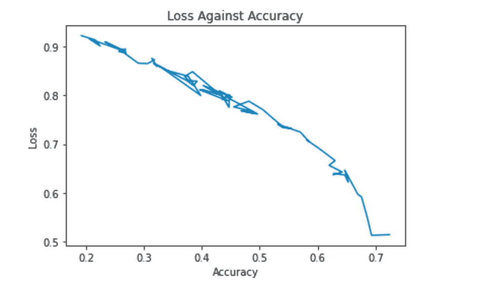

# 给猫和狗分类:深度学习 Hello World

> 原文：<https://medium.com/nerd-for-tech/classifying-cats-and-dogs-deep-learning-hello-world-b8d7b8c027e5?source=collection_archive---------24----------------------->


在这个简短的教程中，我们将研究如何实现一个简单的深度学习分类算法来对猫和狗进行分类，然后导出模型，该模型可以部署在服务器上，以便在移动应用程序或 web 应用程序中使用。将使用的数据集是一个开源数据集，包含猫和狗的训练和验证图片。

# 概述

*   检查猫/狗数据集
*   导入模块
*   定义培训/验证路径
*   定义训练和验证图像生成器
*   创建模型
*   编译模型
*   将数据拟合到模型
*   将损失与准确性相对比
*   导出模型

## 检查数据集

如前所述，本项目中使用的数据集是 Kaggle 提供的开源数据集。目录的结构将帮助我们理解如何加载数据:

```
— cats_and_dogs_filtered -> train/validation
— train -> cats/dogs (1000 images for each class)
— validation -> cats/dogs (500 images for each class)
```

因此，从目录结构来看，总共有 3000 张图像，模型将在这些图像上进行训练。

## 导入模块

接下来，我们导入将在本项目中使用的所有模块:

```
import tensorflow as tf
import numpy as np
from tensorflow.keras.layers import Dense, Conv2D, MaxPooling2D, Flatten
from tensorflow.keras.preprocessing.image import ImageDataGenerator
from tensorflow.keras.preprocessing import image
from tensorflow import keras
import osimport time
import matplotlib.pyplot as plt
import pickle
import requests
import cv2
```

## 定义培训/验证路径

下一步是创建指向要使用的图像位置的目录路径:

```
# specify dogs and cats train directory
train_dogs_dir = 'cats_and_dogs_filtered/train/dogs'
train_cats_dir = 'cats_and_dogs_filtered/train/cats'# specify validation directory
val_dogs_dir = 'cats_and_dogs_filtered/validation/dogs'
val_cats_dir = 'cats_and_dogs_filtered/validation/cats'
```

## 定义训练和验证图像生成器

接下来，我们为训练数据集和验证数据集创建图像数据生成器，这将加快图像的导入速度，并执行一些预处理，如在导入图像之前，将图像像素值重新缩放到 0 和 1 之间，并将图像大小调整为 300x300:

```
# define validator generator and training generator
validator_datagen = ImageDataGenerator(rescale=1./255, shear_range=0.2, zoom_range=0.2, horizontal_flip=True)training_datagen = ImageDataGenerator(rescale=1./255, shear_range=0.2, zoom_range=0.2, horizontal_flip=True)# training generator
training_datagen = training_datagen2.flow_from_directory(
    'cats_and_dogs_filtered/train',
    batch_size=128,
    target_size=(300, 300),
    class_mode='binary'
)# validation generator
validator_datagen = validator_datagen.flow_from_directory(
    'cats_and_dogs_filtered/validation',
    batch_size=32,
    target_size=(300, 300),
    class_mode='binary'
)
```

## 创建模型

我们现在继续创建我们的顺序模型，它将基本上包含隐藏层和输出层。这个神经网络将包含 13 层，12 个隐藏层。卷积和最大池将添加到模型中，以改进特征提取并提高模型性能:

```
# first convolution with max pooling
model3.add(Conv2D(16, (3, 3), activation='relu', input_shape=(300, 300, 3)))
model3.add(MaxPooling2D(2, 2))# second convolution with max pooling
model3.add(Conv2D(32, (3, 3), activation='relu'))
model3.add(MaxPooling2D(2, 2))# third convolution with max pooling
model3.add(Conv2D(64, (3, 3), activation='relu'))
model3.add(MaxPooling2D(2, 2))# fourth convolution with max pooling
model3.add(Conv2D(64, (3, 3), activation='relu'))
model3.add(MaxPooling2D(2, 2))# fifth convolution with max pooling
model3.add(Conv2D(64, (3, 3), activation='relu'))
model3.add(MaxPooling2D(2, 2))# flatten layer
model3.add(Flatten())# dense layers
model3.add(Dense(512, activation='relu'))
model3.add(Dense(1, activation='sigmoid'))
```

## 编译模型

创建模型后，下一步是编译它，添加一些参数来提高它的性能。将使用 Adam 优化器，因为它已被证明在分类问题上具有更好的性能:

```
# compile second model with adam optimizer
model3.compile(
    optimizer=tf.keras.optimizers.Adam(learning_rate=learning_rate),
    loss='binary_crossentropy',
    metrics=['accuracy']
)
```

## 将数据拟合到模型

作为构建模型的最后一步，我们将使训练和验证生成器适合模型，指定时期、每个时期的步骤和验证步骤:

```
history = model3.fit(
    train_gen,
    steps_per_epoch=8,
    epochs=70,
    validation_data=validation_gen,
    validation_steps=8
)
```

运行这行代码后，模型将开始训练过程。训练时间约为 5 小时，模型准确率为 92.19%，验证准确率为 77.90%

## 将损失与准确性相对比

训练模型后，我们将从其历史中提取损失和相应的准确性，然后通过绘制损失与准确性的关系图，直观显示模型的表现:

```
# plot loss againts accuracy
loss = history.history.get('loss')
acc = history.history.get('accuracy')plt.plot(loss, acc)
plt.xlabel('Accuracy')
plt.ylabel('Loss')
plt.title('Loss Against Accuracy')
plt.show()
```

得到的图形是:



## 导出模型

成功训练模型并获得良好的精度性能后，接下来是提取模型，然后可以将模型部署在服务器上，以便在 web 应用程序或移动应用程序中使用:

```
# save model using h5 format
model3.save('cat_dog_model.h5')# load model from disk when needed
model_loaded = keras.models.load_model("cat_dog_model.h5")
```

## 结论

深度学习为我们呈现了无数的可能性，应用的领域也是无限的。从本教程中，您可以对代码进行微调，以满足他或她的需求，适应任何用例。万事如意！