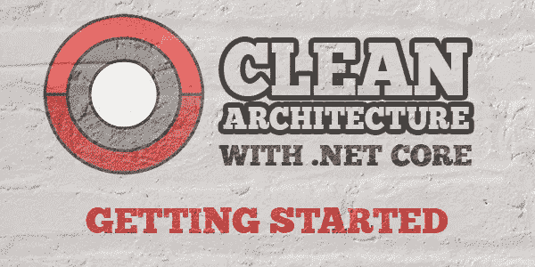

# 💠端到端的清洁架构。网络 5

> 原文：<https://medium.com/nerd-for-tech/clean-architecture-end-to-end-in-net-5-c9eb2c39ca7b?source=collection_archive---------0----------------------->

# 介绍

大家好，在这篇文章中，我们将讨论 ASP.NET 5.0 中端到端支持的干净架构。众所周知，其新推出的框架在 11 月份正式发布。在这里我分享的是为[安装 SDK 的链接。网 5](https://dotnet.microsoft.com/download/dotnet/5.0)

*支持我*