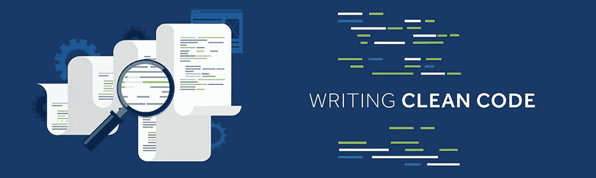
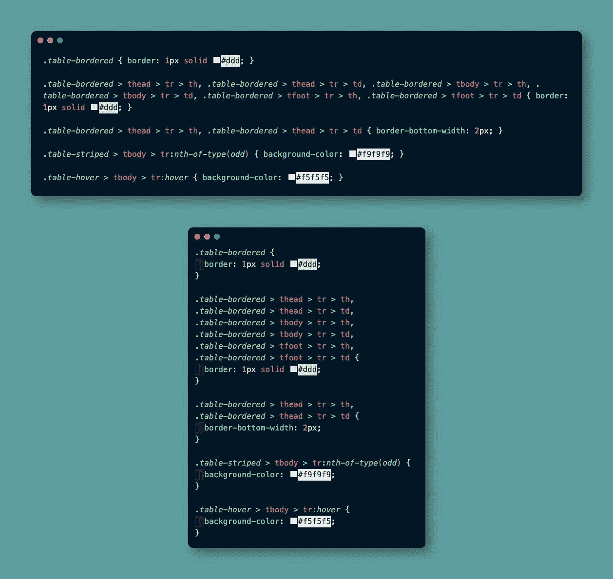
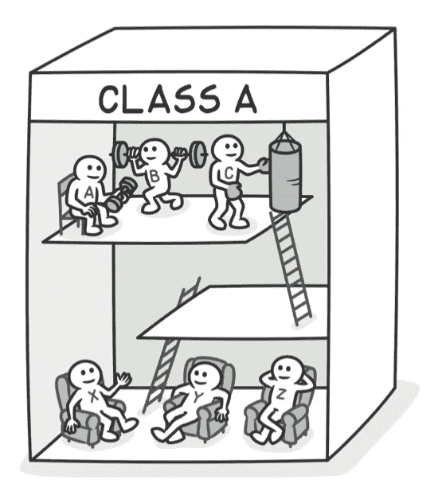
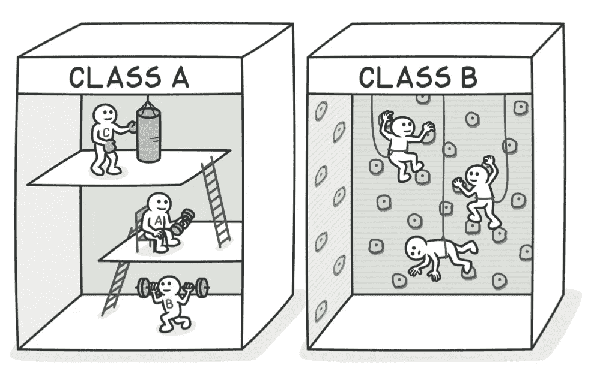
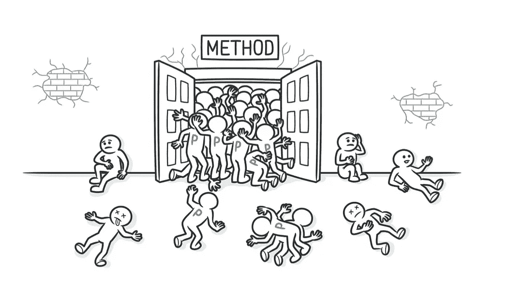
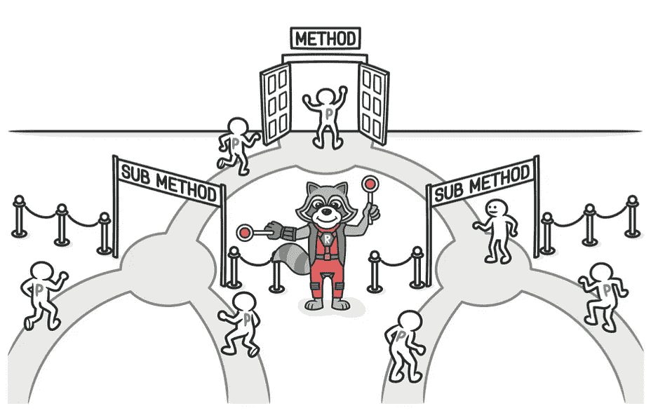
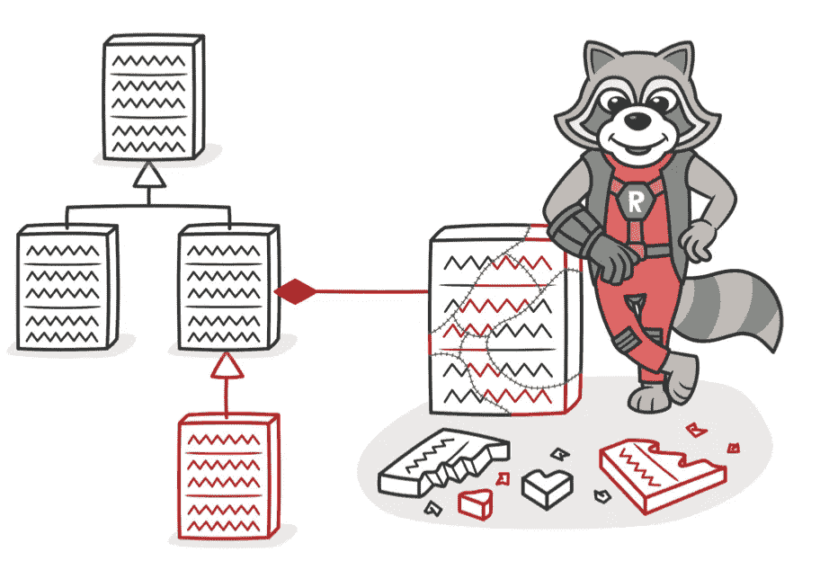
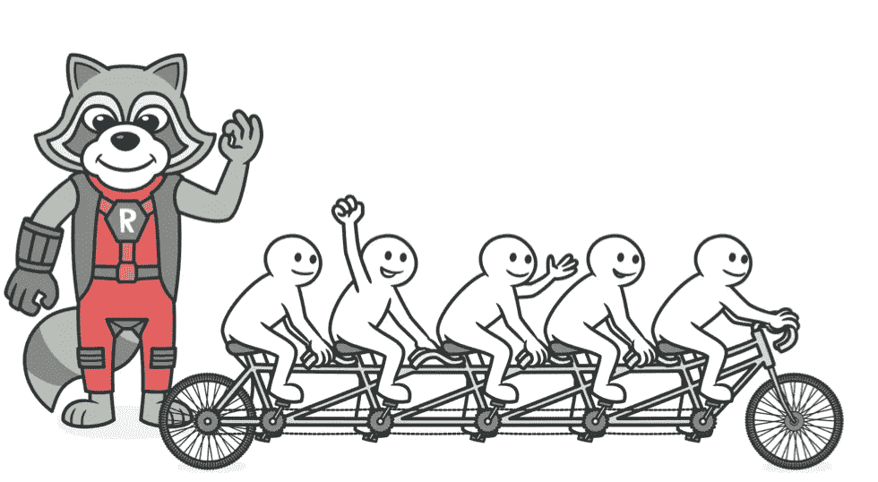
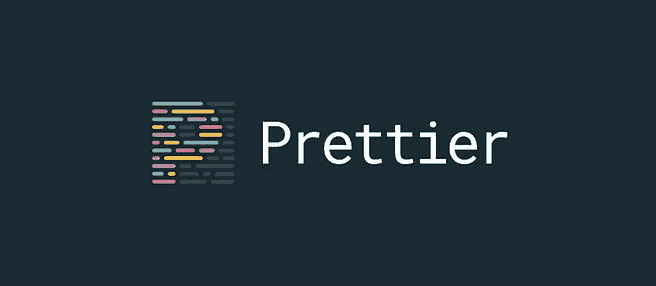
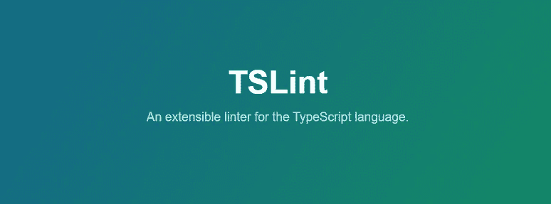

# 干净代码:格式化(源代码结构)

> 原文：<https://medium.com/nerd-for-tech/clean-code-formatting-source-code-structure-f3021575d79?source=collection_archive---------3----------------------->



## “我也喜欢敲打代码、保存，还有让编辑帮我清理格式。”—T . L .罗宾逊

本文是干净代码系列的第四篇。让我们跳进去，学习如何编写格式！

> **为什么代码格式很重要？**
> 代码格式化是关于沟通，而沟通对于称职的开发者来说是业务的第一顺序。
> 编码的类型和可读性树立了先例，即使在原始代码被修改之后，这些先例也将继续影响维护和可扩展性。

B 如果线条宽度不均匀，字体大小不一，并且到处都是换行符，则很难阅读这些书。代码也是如此。
保持缩进、换行符和格式兼容，使代码透明且易于阅读。



混乱代码与格式化代码

进入这一章时，我很好奇这一章是否真的教会了我什么。大多数格式化都是用当前的 IDEs 为我们自动完成的。您还可以安装支持格式化的软件，例如，如果任何内容的格式不正确，则会出现警报或错误。(将详细讨论。)

当我们谈论格式时，最重要的不是尊重单一的风格，而是在任何地方都要尊重相同的标准。如果你已经建立了自己的格式化过程，只要它是好的。为了阅读和理解代码，指导代码的格式非常重要。

您可以选取各种控制代码格式的基本规则，然后一致地应用这些规则。如果你为团队或委员会工作，那么一套单一的格式化规则应该由团队决定，所有的参与者都应该遵守。它让您拥有一个集成的方法，您可以在其中使用这些准则进行格式化。

基本上，对于一个文件可以有多少行代码以及在这方面每行有多少个字符是最佳的，有各种指导原则。你找不到神奇的计数，但你可以感觉到，因为有这么多行的代码和滚动是刺激性的。

在格式化代码时，必须考虑以下场景。

1.  **纵向分离概念。**
2.  **相关码应垂直密集出现。**
3.  **声明与用途相近的变量。**
4.  **从属功能应关闭。**
5.  **关闭类似功能。**
6.  **向下放置功能。**
7.  **保持短路线。**
8.  **不要使用水平对齐。**
9.  **使用空白区关联相关事物，取消弱相关事物的关联。**
10.  **不要打破缺口。**

让我们详细看看这些标准；

## **#01。垂直分离概念。**

应该垂直维护彼此相似的概念。这条定律显然不适用于不同的文件定义。但是如果没有正当理由，松散关联的定义就不能被拆分到单独的目录中。
垂直区分应该反映这两个定义在理解对方方面的价值，它们之间的关系如此密切，以至于它们属于同一个源文件。



**不好的例子:**

```
import java.util.regex.*;
public class BoldWidget extends ParentWidget {
public static final String REGEXP = “‘’’.+?’’’”;
private static final Pattern pattern = Pattern.compile(“‘’’(.+?)’’’”,
Pattern.MULTILINE + Pattern.DOTALL);
public BoldWidget(ParentWidget parent, String text) throws Exception {
super(parent);
Matcher match = pattern.matcher(text); match.find(); addChildWidgets(match.group(1));}
public String render() throws Exception { StringBuffer html = new StringBuffer(“<b>”); html.append(childHtml()).append(“</b>”); return html.toString();
} }
```

**好例子:**

```
package fitnesse.wikitext.widgets;import java.util.regex.*;public class BoldWidget extends ParentWidget {
   public static final String REGEXP = "'''.+?'''";
   private static final Pattern pattern = 
   Pattern.compile("'''(.+?)'''",
   Pattern.MULTILINE + Pattern.DOTALL 
);public BoldWidget(ParentWidget parent, String text) throws Exception { 
   super(parent);
   Matcher match = pattern.matcher(text);
   match.find();
   addChildWidgets(match.group(1)); 
} public String render() throws Exception { 
  StringBuffer html = new StringBuffer("<b>");
  html.append(childHtml()).append("</b>"); 
  return html.toString(); } 
}
```

## #02.**相关代码应该垂直密集出现。**

如果清晰划分定义，垂直密度意味着紧密互动。因此，紧密相连的代码行在垂直方向上看起来应该很粗。

**不好的例子:**

```
public class PropertyConfig { /**
  * The class name of the reporter listener */private String m_className; /**
  * The properties of the reporter listener */private List<Property> m_properties = new ArrayList<Property>(); public void addProperty(Property property) {
    m_properties.add(property);}
```

看看这个例子中的无意义注释是如何打破 instance 的两个变量之间的紧密联系的。

**好例子:**

```
public class PropertyConfig { 
  private String m_className;
  private List<Property> m_properties = new ArrayList<Property>();public void addProperty(Property property) {
  m_properties.add(property);
}
```

它在这里“满眼都是”。你可以看到，在这个课程中有两个变量和一个过程，你的思维和眼睛不会移动太远。你必须使用更多的头部和眼睛运动来达到与上一个例子相同的解释程度。

## #03.**声明与其用法相近的变量。**



变量的声明应该尽可能与它们的使用位置相似。在第一行你不需要声明一个变量，只需要在第 15 行使用它。

## #04.**相关功能应关闭。**

相关函数应该分组在一起。函数名首选子函数。这有助于您非常快速地阅读代码，而无需在代码中的各个地方走得太远。

如果一个功能调用另一个功能，它应该是垂直相似的，如果必要，调用方应该在街道上方。这为软件创建了一个正常的流程。

## #05.**类似功能应该关闭。**

一些编码比特倾向于接近其他比特。它们在概念上是相关的。亲和力越大，它们之间的垂直空间就越小。

正如我们所看到的，这种相似性可以基于直接的依赖，比如一个函数调用另一个函数，或者一个向量函数。但是对亲和力的其他潜在解释仍然存在。亲和力可以由作为一组功能的相关活动来诱导。

**好例子:**

```
public class **Assert** { static public void **assertTrue**(String message, boolean condition) {
   if (!condition) fail(message);
}static public void **assertTrue**(boolean condition) { 
  assertTrue(null, condition);
}static public void **assertFalse**(String message, boolean condition) {
  assertTrue(message, !condition);
}static public void **assertFalse**(boolean condition) {
  assertFalse(null, condition);
} 
…
```

上述功能彼此紧密相关，因为它们共享相似的命名方案并修改基本任务。他们互相命名是次要的。他们都想靠近在一起，即使他们不愿意。

## #06.**把职能放在向下的方向。**



我们通常希望调用函数中的依赖关系指向下方。像在报纸上一样，我们首先期待最相关的想法，我们期待它们以最少污染的数据呈现。低细节应该最后完成。这有助于浏览源文件，而不必深究信息，从最初的几个函数中获得空间。

## #07.**保持行短。**



我们将有比以前更宽的水平线，因为窗口比以前更大。
以前的标准是 80 个字符，但现在 100-120 个字符也可以。
理由是大多数人不会水平滚动阅读我们的代码。
因此，最好保持短行。

## #08.**不要使用水平对齐。**

我们可能不需要水平对齐变量的声明。
例如，我们可能不必做以下事情:

**不好的例子:**

```
let num    = 1;
let value  = 2;
```

我们可以把它保持为:

**好例子:**

```
let num = 1;
let value = 2;
```

我们可以自动允许代码格式器调整这种间距。

**不好的例子:**

```
private   Long            requestParsingTimeLimit;
protected Request         request;
private   FitNesseContent context;
this.context =            context;
input =                   s.getInputStream()
requestParsingTimeLimit = 900;
```

然而，我认为这种排列是多余的。排列似乎显示了错误的内容，把我的视线拉走了。

## #09.**用空格联想相关事物，解除弱相关。**

某些空格应该在这些实体之间的水平代码行中。变量和操作符之间的空格是引入的好地方。运算符和文字之间也有很大的区别。

我们不要求进程名和最初的括号之间有空格。运算符和变量或文字之间的区别不是很大。
我们需要在闭合手镯、粗箭头和箭头功能的开口支架之间留出空间。

例如，一个干净的水平格式类可能如下所示:

**好例子:**

```
class Calculator {
  constructor(a, b) {
    this.a = a;
    this.b = b;
  }

  add() {
    return this.a + this.b;
  }

  subtract() {
    return this.a - this.b;
  } 

  multiply() {
    return this.a * this.b;
  }

  divide() {
    return this.a / this.b;
  }
}
```

算术用户之间有一个空格，进程名和它的左括号之间没有空格。

每行也少于 120 个字符。

## #10.**不破缩进。**

尊重所有代码中的常规缩进非常重要，即使你偶尔想打破这个标准。你会很快发现 FOR 或 IF 子句等所做的动作。遵照这条规则。

使用新的 IDE 和软件，在任何地方都可以很快地使用相同的缩进。

例如:

**不好的例子:**

```
const loop = ()=>{if(true){for(let x of [1,2,3]){console.log(x)}}};
```

这比阅读起来要困难得多:

**好例子:**

```
const loop = () => {
  if (true) {
    for (let x of [1, 2, 3]) {
      console.log(x)
    }
  }
};
```

# 代码格式化工具

回忆所有关于正确格式的规则可能很费力。基本原理得到了简单的保护，一份完整的报告已经写好了。因此，您可以使用一系列工具来提高自动化和轻松的格式化，以减少您的工作量。

# 在线工具

有一组工具，您可以向其中添加代码并发布更可爱的版本:

*   [**HTML 格式器**](https://www.freeformatter.com/html-formatter.html)
*   [PHP 格式化程序 ](http://www.phpformatter.com/)
*   [**CSS 格式器和美化器**](https://www.codebeautifier.com/)
*   [**JavaScript 美化器**](https://beautifier.io/)

# 代码编辑器插件

ide 中还有许多插件/扩展，例如:



*   [**更漂亮. io**](https://prettier.io/) (适用于 Atom、Espresso、Sublime Text、WebStorm、VSCode 等)

> Prettier 是固执己见的代码的格式化程序。通过解析您的代码，并根据自己的准则重新打印(考虑了最大行长度和换行代码),它实施了一个标准化的模板。

*   [**棉绒**](https://stylelint.io/)

> 一个强大和现代的棉绒，以防止错误和实施您的公约类型。

*   [**ES/TSLint**](https://palantir.github.io/tslint/)

> TSLint 是一个可扩展的静态分析工具，它监视 TypeScript 代码的可读性、维护和功能。它在当前的编辑器和构建环境中受到普遍支持，并且可以适应您自己的 lint 规则、设置和格式化程序。

*   [**代码度量**](https://marketplace.visualstudio.com/items?itemName=kisstkondoros.vscode-codemetrics)

> 现代软件系统日益增长的复杂性也使得代码变得稳定和可维护。代码度量为开发人员提供了他们所生产的代码的更深入的视图。使用代码度量，开发人员可以理解哪些风格和/或方法可以被更仔细地返工或检查。项目团队应该识别可能的威胁，考虑整个项目状态，并监控软件开发的成功。


*   [**原子美化**](https://atom.io/packages/atom-beautify)
*   [**HTML-CSS-JS 美化崇高文字**](https://packagecontrol.io/packages/HTML-CSS-JS%20Prettify)

## 结论

代码格式可以提高代码的可读性和解释能力。在项目开始时，旨在确定并准备在必要和适当的情况下修改这些法规。

注意，最短的规则是最好的！

> 不要浪费时间手工格式化你的代码。花在编写更多代码上的时间会更好。利用外面令人惊奇的现代工具。