# 干净的代码=快乐的团队

> 原文：<https://medium.com/nerd-for-tech/clean-code-happy-team-b8d823fbc1da?source=collection_archive---------23----------------------->

当编写代码时，尤其是在团队项目中，功能不是唯一重要的事情，我们还必须确保我们的团队和未来的我们能够理解我们正在编写的代码。

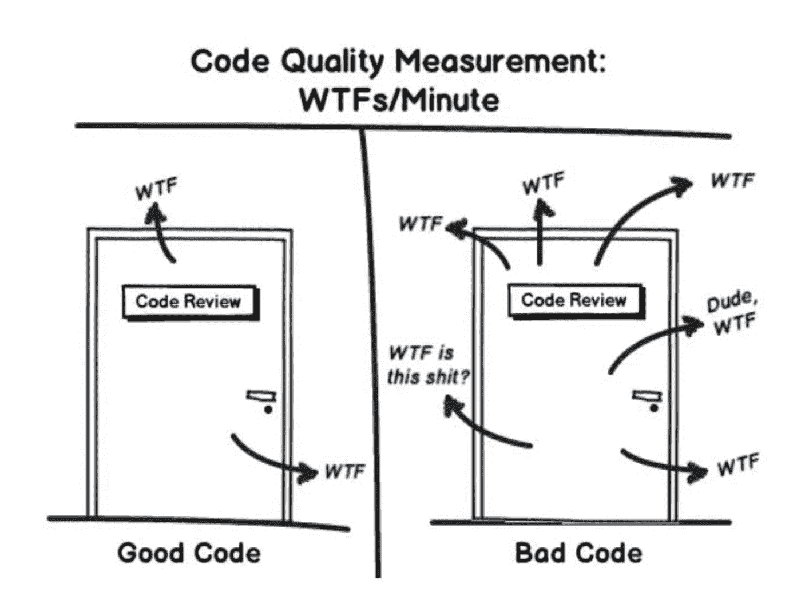

干净的代码=更少的“wtf”

**首先，什么是干净代码？**

干净的代码实际上是一个非常主观的术语，它取决于很多东西；我们使用什么语言和框架，我们内部团队的契约等等。然而，干净代码的主要目标是使我们的代码

## ✨easy 读书，了解和 change✨

“易读”代码是什么意思？这意味着我们的代码必须在代码的每一层都是可理解的:

*   整个应用程序的执行流程
*   不同的对象如何相互协作
*   每个班级的角色和责任
*   每种方法的作用
*   每个表达式和变量的用途

易变怎么样？表现形式可以包括但不限于:

*   类和方法很小，只有一个单一的职责
*   类有清晰简洁的公共 API
*   类和方法是可预测的，并按预期工作
*   代码很容易测试，并且有单元测试(或者很容易编写测试)
*   测试很容易理解，也很容易改变

了解了干净代码中的期望之后，让我们看一下例子。我将向你们展示在我的小组项目中干净代码的实现。由于干净代码的实现是主观的，在这里，我将向您展示我的团队如何尽最大努力使我们的代码✨easy 阅读，理解和 change✨.

**团队内部守则**

在第一次冲刺之后，我们的团队意识到我们的代码结构非常混乱。因此，我们制定了一个代码约定。这个代码约定基本上规定了我们应该如何构建代码，以及应该将代码放在哪个文件夹中。这是我们约定的一部分，它规定了静态文件应该如何组织:

在我们的约定中，也提到了关于命名约定。一致的命名是非常重要的，因为这将使代码更具可读性，并减少您思考名称的脑力

**不要重复自己**

基本上，我们尽最大努力使我们的代码更少重复，因为除了阅读起来令人困惑之外，这也使我们的 sonarqube 分级失败。

> Sonarqube 是一个工具，我们用它来度量我们的代码

在前端，实现的形式是制作 base.html，我们把:

*   导入我们在每个模板中使用的脚本和样式。
*   我们模板的“骨架”。

如果我们不使用 base.html，每个模板将看起来像这样，其中所有的导入都在每个模板中完成，甚至对于在每个模板中导入的脚本也是如此。

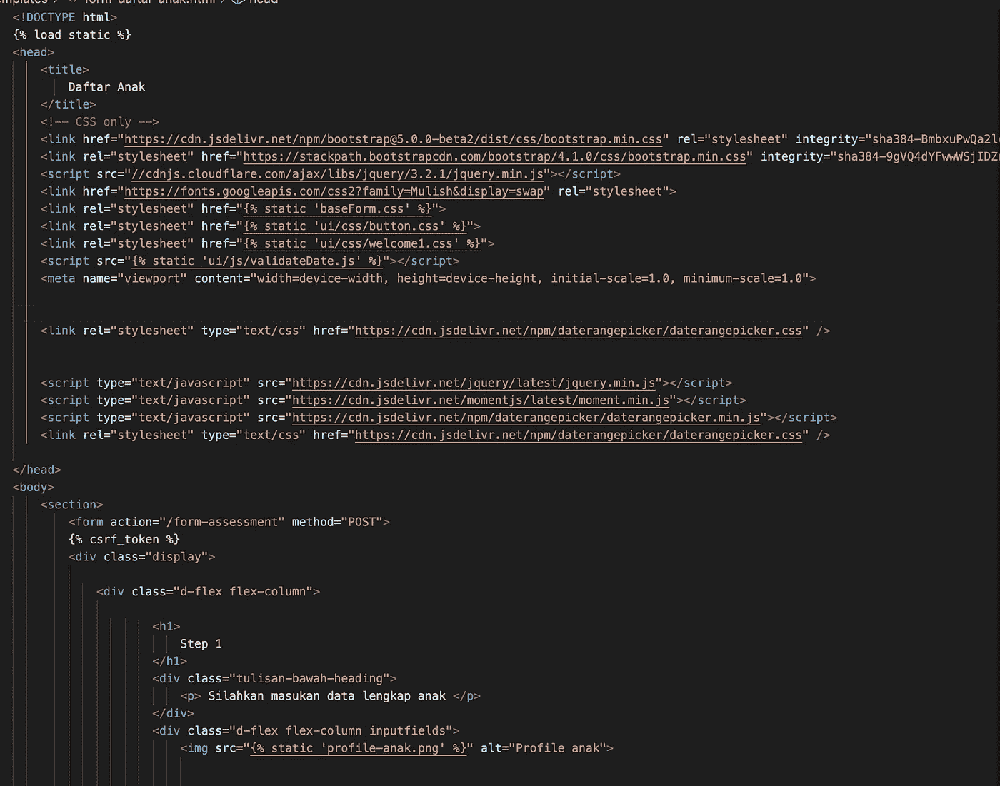

没有 base.html

在我们将复制的代码放到 base.html 上之后，模板看起来就像这样简单:

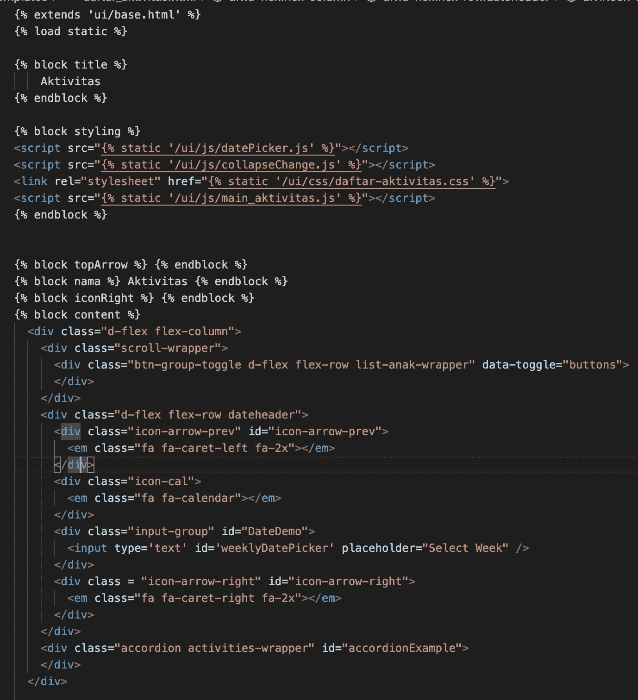

延伸到 base.html 之后

看起来更简单吧？

**缩进**

没有适当缩进的 HTML 将很难阅读。幸运的是，有一个名为 Prettier 的工具可以自动修复你的缩进。你可以很容易地把它安装在你的代码编辑器上(我用的是 vscode)。

之前更漂亮:

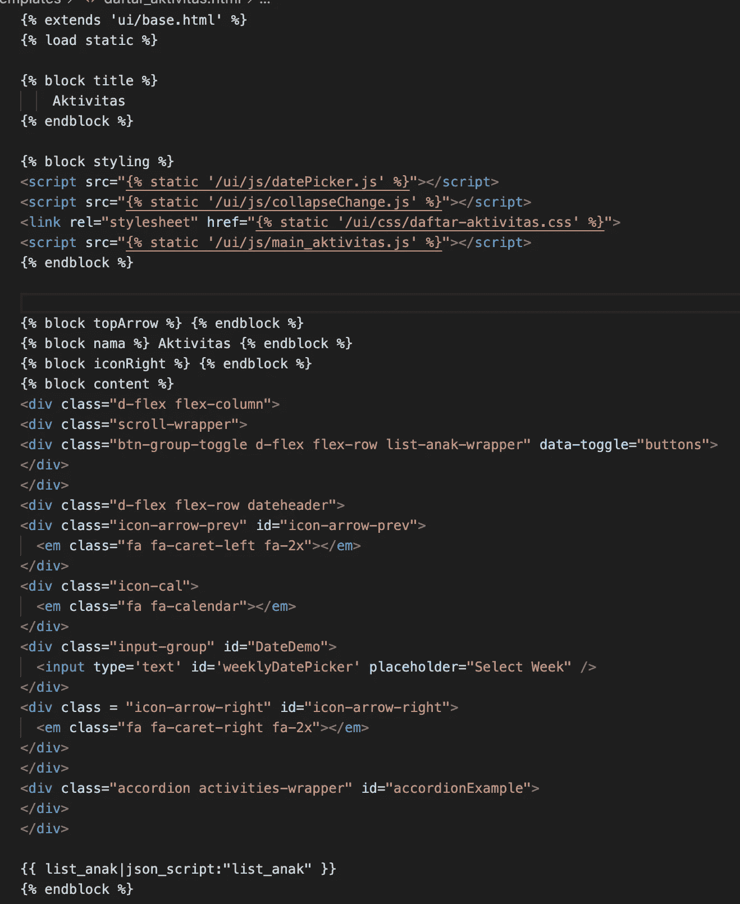

点击 command+shift+p，点击“格式化文档”，选择更漂亮的，然后瞧:

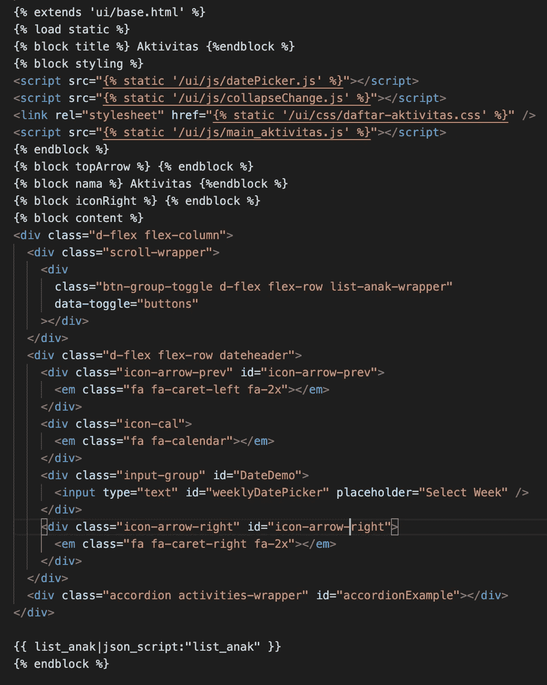

追求更漂亮

缩进会自动更正。

**明确命名**

清晰的命名对于确保我们的代码可读性至关重要。在前端，类命名，id 命名包括在这一部分。

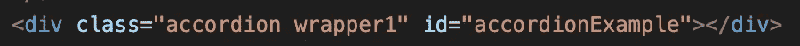

坏榜样

想象一下，你正在编写你朋友的代码，偶然发现了这个“wrapper1”类命名，你必须先弄清楚这个 div *包装的是什么。*然而，如果类名是这样的:

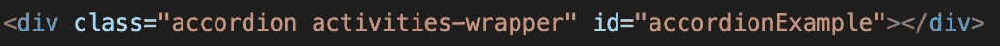

您将直接看到这个类包装了模板中显示的活动。

再比如，你能猜到这段代码是干什么用的吗？

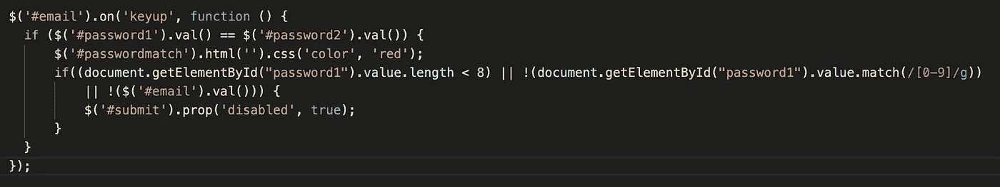

坏榜样

什么是/[0–9]/g？#password1 包含什么字段？

此代码用于验证用户是否已经填写了创建新用户的所有字段，并验证密码和密码重复字段是否相同。

与这件作品相比:

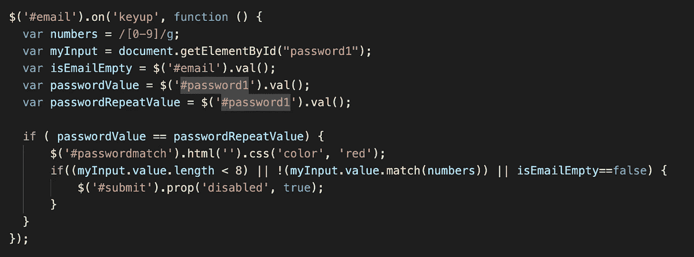

更容易阅读，对不对？

**输入验证**

为了防止用户输入导致的错误，前端开发人员需要确保用户不能填写不适合应用程序的输入。

例如，在应用程序的这一部分，后端不能填充未来日期的“Aktivitas”数据。

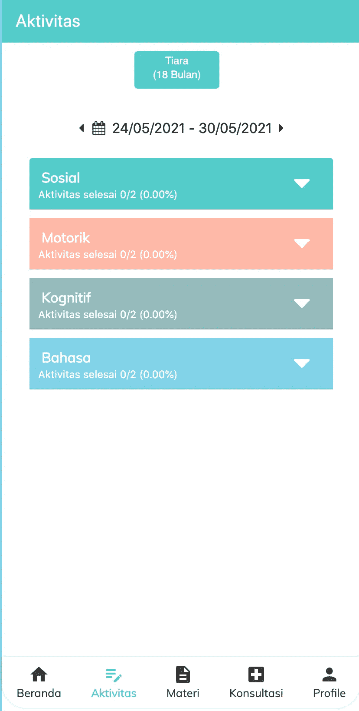

这就是为什么在日历实现中，我为用户输入设置了界限

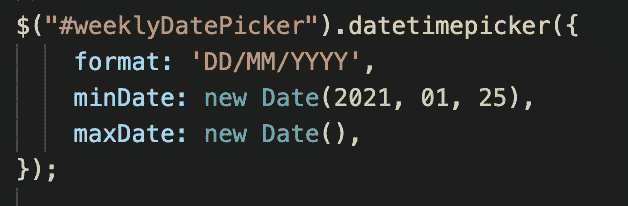

使用 Django 的 datetimepicker 中的样式，日历将如下所示:

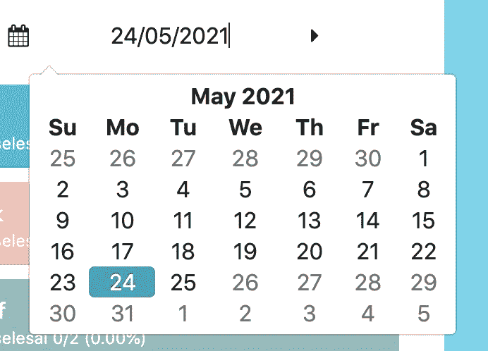

可以看到今天(5 月 25 日)以后的日期被禁用，无法点击。

有了干净代码，和你的朋友一起做项目将变得更加容易和容易。😉

**参考文献**

 [## 编写干净的 HTML 代码的 8 个最佳实践

medium.com](/@sergimarquez/8-best-practices-to-write-clean-html-code-1cd407e2a7ec)  [## 干净的代码解释-初学者干净编码的实用介绍

### “任何傻瓜都能写出计算机能理解的代码。优秀的程序员会写出人类能理解的代码。”…

www.freecodecamp.org](https://www.freecodecamp.org/news/clean-coding-for-beginners/)  [## 什么是干净的代码，为什么要关注它？

### 干净的代码是我已经感兴趣了一段时间的东西，并计划写一系列关于…

cvuorinen.net](https://cvuorinen.net/2014/04/what-is-clean-code-and-why-should-you-care/)