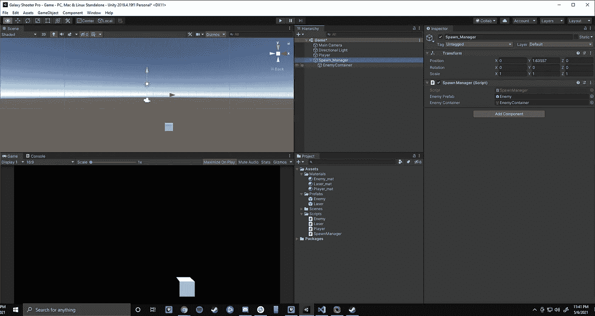
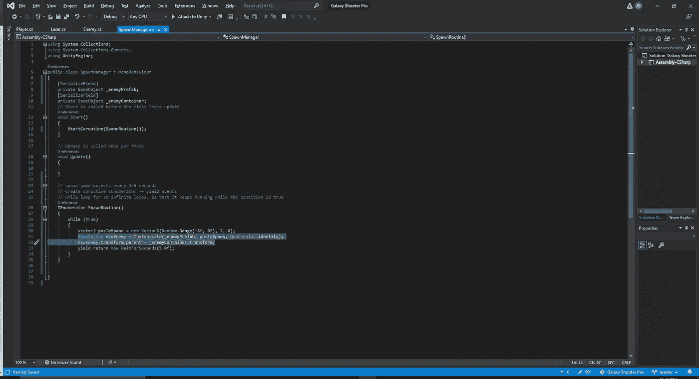
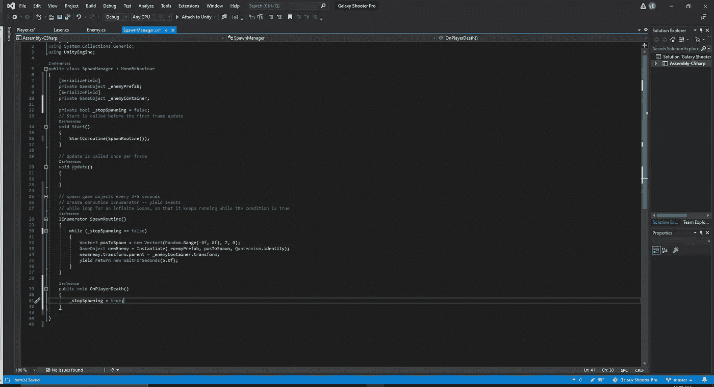
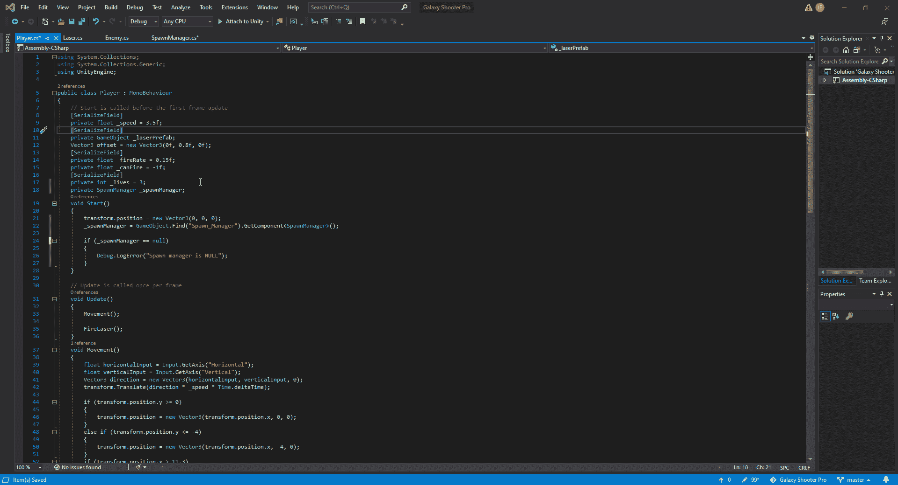

# 清理我们的卵

> 原文：<https://medium.com/nerd-for-tech/cleaning-up-our-spawns-2a0dcdbeed0d?source=collection_archive---------27----------------------->

既然我们有无限繁殖的敌人，现在是我们拥有它的时候了，这样我们就可以清理我们的等级制度，这样我们的繁殖敌人就不会超载。为此，我们将在 spawn manager 中创建另一个空对象，并将其命名为敌方容器。

敌方集装箱

这个物体将是我们所有敌人单位产卵的地方。然而，如果我们现在运行代码，它还不会在那个部分产生。为了解决这个问题，我们必须回到我们的 spawn manager 脚本，并添加一些代码来告诉 Unity 将敌人单位放置到新创建的容器中。

容器的脚本

首先，我们创建一个私有的 GameObject _enemyContainer，这样我们就可以在 Unity 编辑器中添加新的对象了。从这里开始，我们要做是对我们的实例化代码做一点小小的改变，并添加一个新的游戏对象，这样我们就可以在我们想把敌人送到的地方写代码了。正如我们在下面看到的，我们想把我们的敌人单位发送到一个父对象，我们告诉 Unity 它是 _enemyContainer。然而，因为 _enemyContainer 和敌人种子是两个独立的变量，我们需要稍微调整一下代码，这样它就能理解我们想要做的事情。因此我们把。在容器后变换。接下来，当我们的玩家死亡时，我们会想要停止种子管理员。首先，我们需要弄清楚如何与我们的种子管理者和玩家沟通。首先，我们可以进入我们的 spawn manager 脚本并做一些调整

我们所做的是在脚本中添加了一个 _ stopSpawning 指令，并更改了 while 语句，这样它就有了一个停止循环的方法。接下来，我们为 OnPlayerDeath 创建了一个新的公共 void。现在我们必须得到它，以便当我们的玩家死亡时，stopSpawning 代码激活并告诉 Unity 结束循环。

如我们所见，我们需要添加几行额外的代码。首先，我们需要创建一个私有的 SpawnManager 变量来使用。一旦我们创建了这个变量，我们现在必须写一些代码来找到我们的种子管理器，并告诉我们的玩家与它进行交互。
我们最终在创建 GetComponent 时做了什么。找到线，并搜索产卵经理。这种方法的关键是你必须完全按照你在 Unity 编辑器中的等级来拼写。如果你拼写错误，那么它将会搜索不存在的东西。
在我们得到我们的组件后，我们现在将进入玩家脚本的无效伤害部分，并添加 OnPlayerDeath，它将在玩家死亡时运行。一旦这一切都完成了，我们就可以运行我们的游戏，看看我们的敌人是否会在我们的玩家死亡的那一刻停止产卵。

现在我们的种子管理员已经被清理了一点，我们现在可以展望我们游戏的下一步了。下一步是给我们的游戏添加一些精灵和背景视图，这样我们就不用再处理原始物体了。