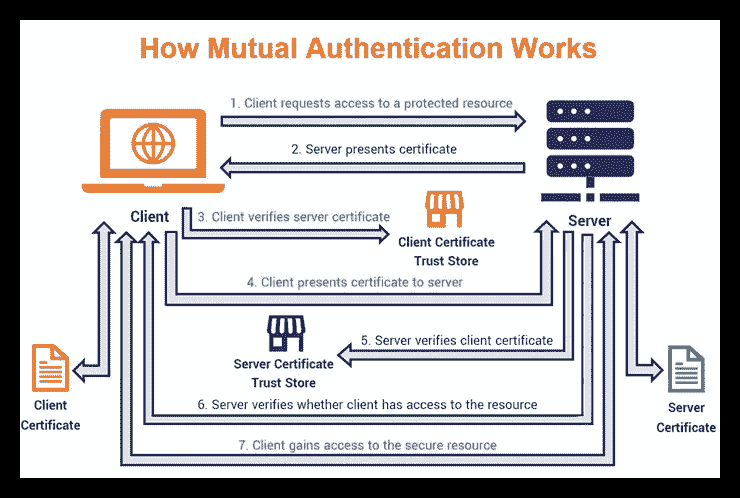

# iOS 上的客户端证书处理

> 原文：<https://medium.com/nerd-for-tech/client-certificate-handling-on-ios-f704d896cccd?source=collection_archive---------2----------------------->

**客户端证书认证**，又称基于证书的相互认证，是指客户端向服务器提供其客户端证书来证明其身份。这作为 SSL 握手的一部分发生(*可选*)。

用户可以通过从 Safari 中下载、作为电子邮件附件打开以及使用配置描述文件(MDM！).

完成后，`SafariViewController`或 Safari 应用程序可以成功打开页面，因为证书在 Apple keychain access 群组中。

*但是*你使用`URLSession`或者`WKWebView`的应用会因为缺少客户端证书而收到 HTTP 400 响应？！？！

那是因为…

> *应用程序只能访问它们自己的钥匙串访问群组中的钥匙串项目。这意味着 Apple access 群组中的项目仅适用于 Apple 提供的应用程序，如 Safari 或 Mail。*

解决方法是

> *…你需要编写代码来导入它们。这通常意味着读入 PKCS#12 格式的 blob，然后使用* [*证书、密钥和信任服务参考*](https://developer.apple.com/documentation/security/1396915-secpkcs12import) *中记录的函数* `*SecPKCS12Import*` *将 blob 的内容导入应用程序的钥匙串。*
> 
> *这样，您的新钥匙串项目会与应用程序的钥匙串访问群组一起创建。*

这个[说法](https://developer.apple.com/library/archive/qa/qa1745/_index.html)来自苹果。

需要进行额外的工作。

*   URLSession: `URLSessionDelegate`是必需的，它实现`[URLSession:didReceiveChallenge:completionHandler:](https://developer.apple.com/documentation/foundation/nsurlsessiondelegate/1409308-urlsession)`并返回`[URLCredential](https://developer.apple.com/documentation/foundation/urlcredential/1418121-init)`实例来解决客户端证书认证挑战。
*   WKWebView: `WKNavigationDelegate`是必需的，它实现`[webView(_:didReceive:completionHandler:)](https://developer.apple.com/documentation/webkit/wknavigationdelegate/1455638-webview)`并返回`[URLCredential](https://developer.apple.com/documentation/foundation/urlcredential/1418121-init)`实例以解决客户端证书认证挑战。

我创建了一个 iOS 应用程序来更好地演示这一切。使用这个应用程序以各种方式访问 client.badssl.com

*   URLSession.dataTask
*   WKWebView
*   SFSafariViewController
*   在 Safari 中打开链接

该网站需要有效的用户证书。否则服务器返回 HTTP 400。

为了方便起见，我添加了`badssl.com-client.p12`(从[badssl.com/download](http://badssl.com/download)下载)作为捆绑资源。这允许您使用`URLSession`和`WKWebView`用用户证书测试成功认证。

注意:如果证书不再有效(2023 年 12 月 4 日到期)，请尝试从 badssl.com/download[下载最新版本。](http://badssl.com/download)

该应用的源代码在 GitHub 上公开。

 [## GitHub-MarcoEidinger/ClientCertificateSwiftDemo:iOS 应用程序演示了一个…

### iOS 上客户端证书认证的解释和演示…

github.com](https://github.com/MarcoEidinger/ClientCertificateSwiftDemo) 

*最初发布于*[*https://blog . ei dinger . info*](https://blog.eidinger.info/client-certificate-handling-on-ios)*。*