# 爬下梯子

> 原文：<https://medium.com/nerd-for-tech/climb-down-the-ladder-fffaf4e4c69a?source=collection_archive---------4----------------------->

2.5D 游戏开发

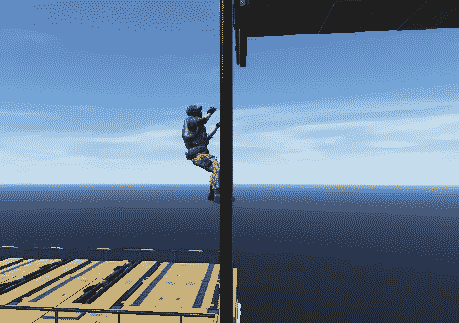

**目标:**允许玩家沿梯子向下移动。

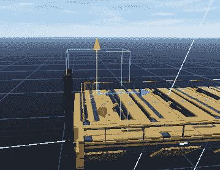

首先添加一个立方体，并将碰撞器组件内部的触发器设置为 true。

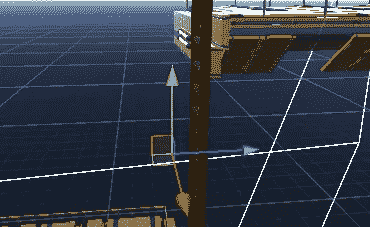

然后添加一个输入位置，它将用于转换玩家的位置，以显示玩家移动到攀爬位置开始向下移动的效果。

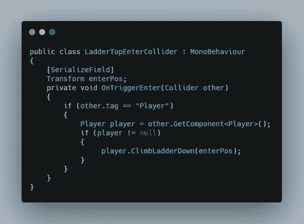

然后在碰撞器中添加一个脚本，在这个脚本中，创建一个触发函数，在提供输入位置的同时调用一个爬梯函数。

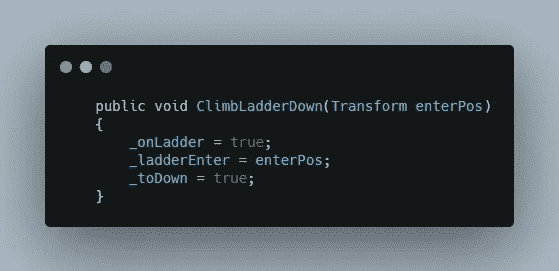

然后，玩家脚本中被调用的函数会将 on ladder 设置为 true 以启用爬升条件，将 enter position 添加到稍后要使用的全局变量，并通过将 down bool 变量设置为 true 来将爬升方向设置为 down。

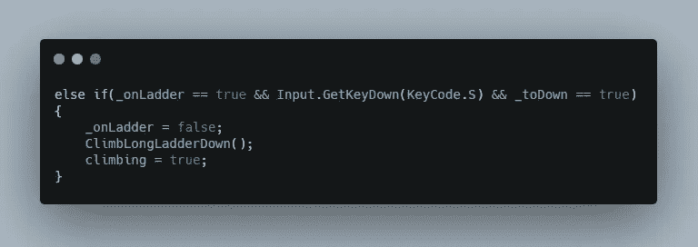

现在，当玩家按下 S 键，然后禁用登梯条件，并将攀爬设置为真，以禁用玩家移动，同时调用攀爬长梯下降功能。

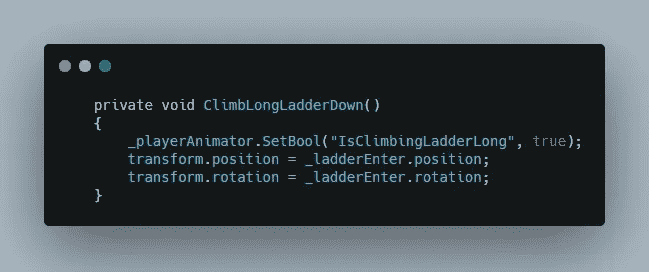

在被调用的函数中，将攀爬动画设置为 true，并将玩家移动到向下攀爬的位置，同时设置玩家旋转，以便玩家在向下移动时始终面向梯子。

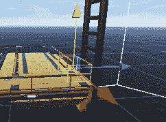

然后在底部添加另一个碰撞器，这将禁用动画并启用移动。

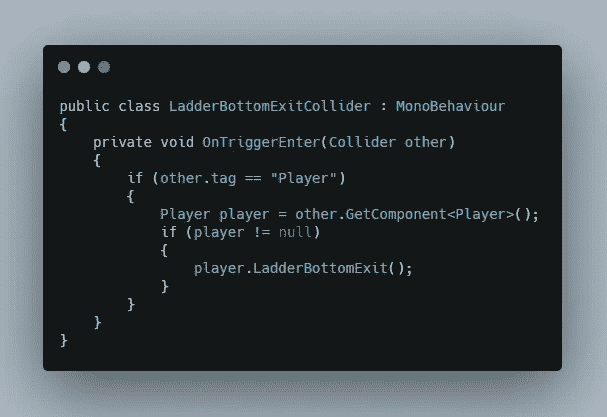

添加一个新的脚本到底部碰撞器，在脚本中，当玩家进入碰撞器，也就是到达梯子底部时，调用梯子底部退出函数。

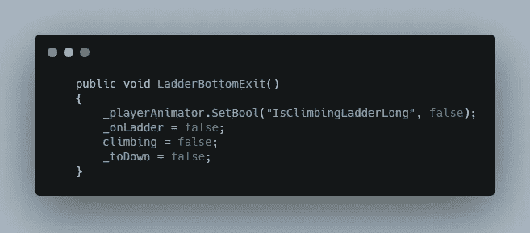

然后在玩家脚本和梯子底部出口函数中，禁用动画，将梯子上设置为 false，爬高设置为 false 以允许移动，向下设置为 false，以便玩家下次向上移动。

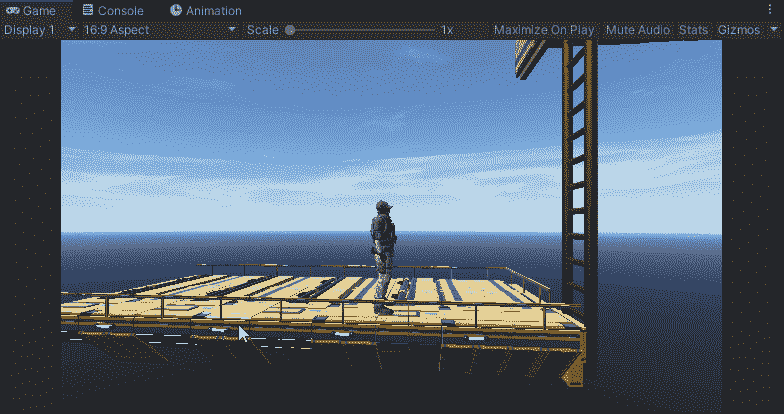

这是最终的结果。