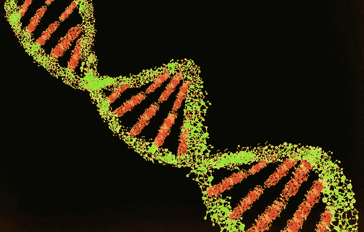
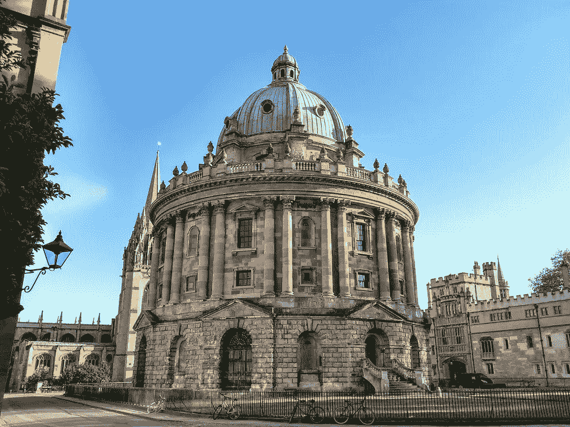

# DNA 数据存储时代即将到来

> 原文：<https://medium.com/nerd-for-tech/closing-in-on-an-era-of-dna-data-storage-67cf016815b1?source=collection_archive---------25----------------------->

## 技术

> DNA 作为数据存储来源的想法，凭借其在准确保存大量信息方面的惊人能力，长期以来一直受到科学家和研究人员的青睐，他们正在寻找当前相对薄弱的硬盘技术的替代品。但是，有 38 亿年历史的东西真的能提供解决现代问题的途径吗？

**图 1 DNA 数据存储**

随着时间的流逝，人类一直在寻找并采用不同的信息存储系统:从兽皮、木板、书籍到最后的硬盘。直到最近，这些硬盘还被认为是现代技术的奇迹——只需 50 美元，任何人都可以轻松地将整个牛津大学图书馆的内容存储到一个只有 3.5 英寸大小的包中。但是，正如经常发生的那样，自然选择将人类最大的努力击得一败涂地，正如最近人们发现的那样，先于所有其他信息存储系统的生命信息存储工具 DNA 才是真正的未经雕琢的钻石。

**图二牛津大学图书馆**

像所有其他伟大的想法一样，使用 DNA 作为数据存储来源的想法也扎根于一家酒吧。是的，你没看错。剑桥附近的欧洲生物信息研究所(EBI)的 Nick Goldman 和 Ewan Birney 正在放松自己，他们开始考虑采取什么方法来归档他们的研究产生的大量数据。喝了几杯啤酒后，两人思考人工构建的 DNA 是否是一种方法。接下来，他们只需要再喝几杯，在啤酒垫上乱涂乱画，就能最终将这一革命性的想法塑造成一个可行方案的框架。

不久之后，这个想法迅速流行起来。自然地，DNA 使用四种化学碱基来编码信息:腺苷(A)、胸腺嘧啶(T)、胞嘧啶(C)和鸟嘌呤(G)。通过将计算机使用的二进制 1 和 0 映射到这些碱基上，可以将数字信息嵌入 DNA。例如，A 和 C 可以表示二进制 1，而 G 和 T 可以表示二进制 0。类似地，这四个碱基也可以被赋予其他功能来传递不同类型的信息。最近，哈佛医学院的遗传学家 Seth Shipman 率先在 DNA 中存储了一段视频。他和他的同事们一起，开始制造合成的 DNA 链，并在其碱基中编码——A、T、C 和 G——这是在 19 世纪 80 年代拍摄的一段飞奔的马的视频中发现的位置和像素。他们将这些 DNA 带喂给大肠杆菌细菌，这些细菌吞噬这些 DNA 带，并将其添加到自己的基因组中，将它们视为一种掠夺性病毒。然后，这些细菌被放置在培养皿中长达一周的时间，让它们经历生长和细胞分裂，分裂成新的细菌细胞。最终，这些虫子被收集起来，从它们的遗传密码中检索视频信息，人们发现，即使在分裂后，它们的 DNA 仍以 90%的准确率保留了下来！令人震惊，对吧？

但老实说，这项壮举不仅仅是炫耀。吸引人的是 DNA 的储存能力。与目前便宜但占用大量物理空间的磁带(硬盘)相比，DNA 可以吞下海量数据，因为它的密度非常高。到底有多密集？嗯，一个边长为 1 米的 DNA 立方体就可以很好地满足全球当前一年的数据存储需求！

> 半导体研究公司的首席科学家维克托·日尔诺夫说:“今天的技术已经接近物理极限。" DNA 的信息存储密度比任何其他已知的存储技术高几个数量级。"[【1】](#_ftn1)

DNA 被珍视的另一个特征是它惊人的稳定性。尽管磁带往往会随着时间的流逝而衰减，每隔几年就必须更换，但 DNA 中的数据即使在数千年后仍然可读，这一点已被从一匹生活在 50 多万年前的马化石中发现的 DNA 所证明。这一特性使得它特别吸引那些越来越关心长期保护其庞大研究数据的科学家和研究人员。

然而，这些助手被一个隐蔽的价格标签吸引住了。原因与其说是技术难度，不如说是成本。DNA 合成公司，如 Twist Bioscience，每碱基收费 7-9 美分，这基本上意味着在 DNA 中编码一个千兆字节的数字信息将花费数百万美元。或者用更通俗的话来说，一分钟的高质量立体声音响只需要不到 10 万美元。另一方面，硬盘驱动器以不到 1 美分的价格完成同样的工作。此外，从 DNA 中读取和写入数据的速度相对较慢，这也是不利的一面。仅仅重建几个文件就需要几周的时间，这使得整个过程进展缓慢。然而，这并不是什么大问题，因为更好的设备确实能保证更快的速度。

总之，很明显，为了将承诺转化为现实，DNA 数据存储技术需要一些改进。为此，Catalog 等几家公司正在寻求不同的方法来最大限度地提高这项技术的生产率，使其无处不在。因此，可以宣布我们肯定**正在接近一个 DNA 数据存储的时代。**

*【1】**【DNA 数据存储的兴起|连线】，2021 年 5 月 30 日访问，*[*【https://www.wired.com/story/the-rise-of-dna-data-storage/.】*](https://www.wired.com/story/the-rise-of-dna-data-storage/.)

**演职员表:**

1.  图 1 由 Flickr 提供，[https://creativecommons.org/licenses/by/4.0/legalcode](https://creativecommons.org/licenses/by/4.0/legalcode)