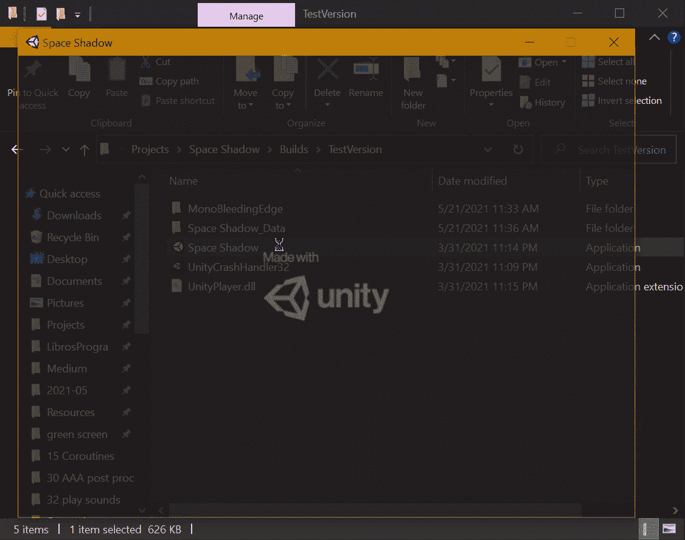
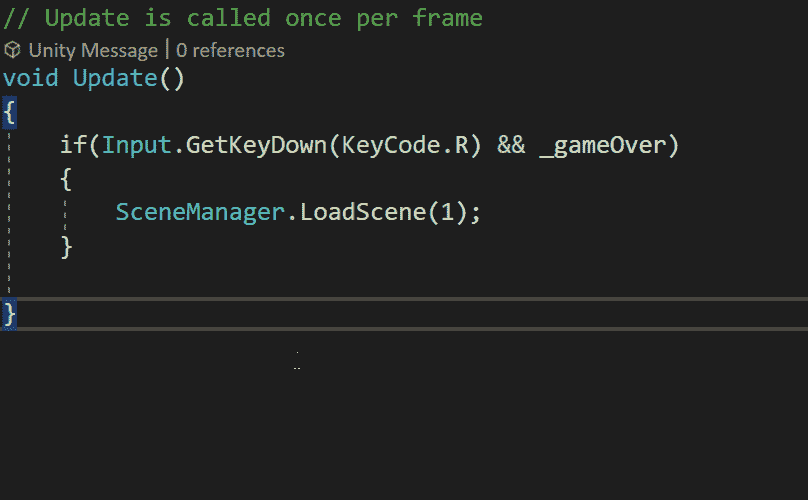
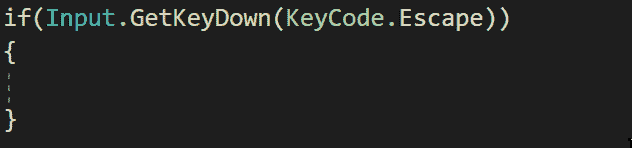
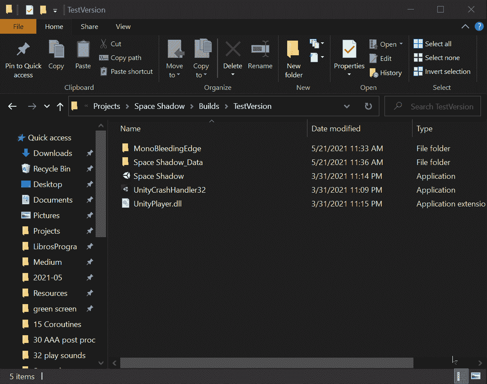

# 以团结结束游戏

> 原文：<https://medium.com/nerd-for-tech/closing-the-game-with-unity-5c02b9994886?source=collection_archive---------10----------------------->

## 统一指南

## 关于如何关闭 Unity 游戏的快速指南

**目标**:实现一个关闭 Unity 制作的太空射击游戏的功能。

在我的上一篇文章中，我提到了[如何用 Unity](/nerd-for-tech/build-your-game-with-unity-8d42ab6c66ba) 构建你的游戏。现在是时候实现一种当玩家想关闭游戏时关闭游戏的方法了。

# 结束游戏

为了做到这一点，我们需要打开**游戏管理器**脚本，它的任务是控制基本的游戏机制。然后，在 Update 方法中，我们需要添加一个新的条件，允许玩家关闭游戏。例如，我们可以选择在玩家每次按下键盘上的 Escape 键时进行:

在以前的一篇文章中，我介绍了如何通过在 Unity 中加载一个场景来重启游戏，这也是一个基本的游戏机制。

一旦条件被添加，我们可以使用 ***应用*** 类中的 ***退出*** 方法来关闭游戏执行:

> 注意:如果游戏正在 Unity 编辑器中执行，来自**应用程序**类的**退出**方法将不会生效。

如果你想了解更多关于这个的方法，你可以访问 Unity docs:

 [## 申请。放弃

### 建议更改感谢您帮助我们提高 Unity 文档的质量。虽然我们不能接受所有的…

docs.unity3d.com](https://docs.unity3d.com/ScriptReference/Application.Quit.html) 

现在，如果我们[构建并运行应用程序](/nerd-for-tech/build-your-game-with-unity-8d42ab6c66ba)，我们将能够在按下退出键时关闭它:

就是这样，你可以用 Unity 为你的游戏实现一个关闭功能！:d .我会在下一篇文章中看到你，在那里我会用 Unity 展示一个新的 3D 项目的一些方面。

> *如果你想了解我更多，欢迎登陆*[***LinkedIn***](https://www.linkedin.com/in/fas444/)**或访问我的* [***网站***](http://fernandoalcasan.com/) *:D**