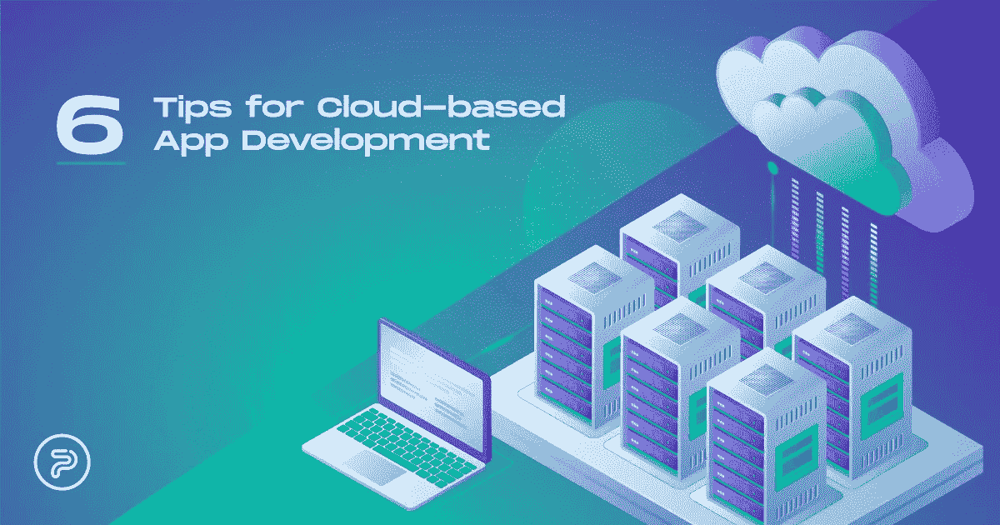

# 基于云的应用程序开发:避免常见陷阱的 6 个技巧

> 原文：<https://medium.com/nerd-for-tech/cloud-based-app-development-6-tips-to-avoid-common-pitfalls-6b64f211948a?source=collection_archive---------36----------------------->

基于云的开发技巧—PopWebDesign.net

随着迁移到云的应用数量不断增长，开发人员顺应潮流并深入了解趋势是很正常的，更不用说，对于希望获得云软件好处的网站所有者来说。对于企业主来说，拥有一个基于云的应用程序可以显著降低设备和整体网站性能的成本。基于云的解决方案也更容易扩展，这意味着使用这种基础进行在线展示的企业有更多的机会成长和超越。

“云”作为一种现象在数字领域变得越来越普遍，一些最新的统计数据比以往任何时候都更清楚地表明了这一点。例如，近 80%的企业使用亚马逊的专用 web 服务作为他们的首选云平台，77%的企业在云中至少有一个应用程序(或至少是其中的一部分)。最后，全球超过一半(60%)的组织使用云技术来存储机密数据。

也就是说，无论是开发者还是网站所有者，都不应该对基于云的应用开发三心二意。然而，如果双方选择这种类型的开发，他们可能会面临一些挑战和陷阱，这篇博客文章致力于解决云应用程序开发过程中最常见的问题和挑战。

# 入门:什么是基于云的应用？

这种应用程序类型是一种软件解决方案，它在两个独立的系统(服务器端和客户端)之间运行数据存储和处理逻辑。简单来说，每个应用程序都有一个专用的客户端，这是用户与显示器交互并在显示器上看到的部分。另一方面，服务器端负责确保客户端功能正常工作。这边也做数据处理。例如，在传统移动应用程序的情况下，业务逻辑和数据将由手机的处理器处理。然而，在基于云的解决方案中，这些任务是远程服务器的责任。这意味着基于云的大多数数据都存储在远程服务器上，并且对运行应用程序的专用设备有最低要求。此外，在移动应用程序的情况下，他们也可以离线工作，因为数据也可以存储在设备上，直到它再次建立连接。然后应用会自动更新，设备存储的数据也会上传到云端。

从商业角度来看，您的客户可以从任何连接互联网的设备上使用该应用程序，无论是笔记本电脑、智能手机还是平板电脑。每条信息都存储在云中，因此您的用户(客户)可以在一天中通过多种设备无缝工作。

有三种不同的基于云的应用类型 SaaS、laaS 和 PaaS。为了了解开发挑战，首先，让我们对它们有一点了解。

*   **SaaS，即软件即服务:**这些是基于云的解决方案，可以通过网络浏览器和移动应用程序使用。他们让消费者无需在本地设备上安装应用程序就可以使用。互联网是这些解决方案的支柱，因此可以从全球任何地方的任何设备访问它们(也就是说，通过连接)。SaaS 解决方案在普通用户和组织中都相当受欢迎，因为它们可以简化和加速与工作相关的和个人的任务(例如 Slack 或 Google Drive)。
*   **PaaS 或平台即服务:**这些在线平台提供了租赁开发应用所需一切的可能性，从基础设施到开发工具和操作系统。使用这种模型的供应商提供硬件和软件工具来简化整个开发过程。这些解决方案可能包括开发工具、数据库管理、中间件、操作系统、基础设施。Heroku、OpenShift、Windows Azure 就是这种 app 类型的很好的例子。
*   **laaS 或基础设施即服务:**在这种模式下，服务提供商负责管理您企业的基础设施，如存储、服务器、通过私有云或公共云的网络。您可以访问基础架构并管理基础架构内的应用程序和操作系统，而提供商(亚马逊网络服务、DigitalOcean 和微软 Azure)则提供硬件、存储、服务器等。

卡斯帕·卡米尔·鲁宾在 Unsplash 上的图片

# 基于云的应用程序开发的陷阱和挑战以及如何避免它们

正如你所看到的，这些都是非常复杂和错综复杂的系统，无论你是希望构建一个应用程序，还是成为一个提供商，它们都有自己的一系列挑战。

# 优先考虑加密

由于基于云的应用程序通常会处理和存储大量的机密数据，安全性成为一个敏感的问题，也是每个值得上市的应用程序的重要功能。作为提供商、应用程序所有者或开发者，你需要保证访问者的数据是保密的。为此，使用 SSL 和强大的数据加密来确保 API 集成不会对您的安全性和客户的数据造成任何损害。

# 没有选择正确的框架

开发人员经常犯错误的另一个部分是为应用程序选择正确的框架。客户正在寻找一种可靠的服务，能够无误地工作并立即交付结果。您需要一个平台，在安全备份数据的同时，允许您使用多种技术功能。

# 没有做必要的作业

家庭作业，如市场调查。这对于任何应用的成功都是至关重要的。为了在数字领域成为一名杰出的玩家，你需要一个能够真正解决潜在观众问题的解决方案。你想创造价值，你的用户需要立即理解为什么你应该是他们的第一和唯一的选择。看看你的竞争对手，研究你所在行业的趋势、商业模式和最新的数字技术特征，然后从那里开始。

# 没有选择正确的供应商

您的提供商提供的数据中心越少，您的应用性能受到的影响就越大。因此，寻找一个在全球范围内工作的提供商，以确保加载速度保持稳定。在选择合适的提供商时，使用 cdn(内容交付网络)等其他功能也是必须的。

# 没有可扩展性

您的产品可能会出现的另一个问题是，很难使用您选择的服务器进行扩展。要创建一个令人敬畏的应用程序，你需要很大的可扩展性，因为它可能会带来更高的利润，然而，只有当用户体验很好，突然的流量激增不会降低应用程序的速度。

# 准备不足

这个常见的陷阱不仅包括没有进行适当的市场调查，还包括雇佣了错误的(或不合格的)开发团队，选择了错误的技术组合来敲定项目，最后，在没有进行适当测试的情况下发布应用程序。所有这些都需要大量的时间、耐心和研究。与合适的人合作，这些人可以帮助你用合适的工具为你的受众创建合适的应用程序，这对你的在线成功至关重要。因此，在选择理想的团队和应用理念时，你需要小心谨慎。

# 整理想法

如你所见，基于云的[应用程序开发](https://www.popwebdesign.net/apps.html)和“常规”开发有很多共同点，但在某些方面也有所不同。然而，最后，同样的规则也适用:你需要一个与你的目标受众相关的、可靠的、性能良好的、具有可靠的 UX 和用户界面特性的应用程序。要创建这样一个应用程序，你需要一个好的想法和一个好的团队来将这个想法变成现实。句号。

*原载于 2021 年 3 月 2 日*[*【https://www.popwebdesign.net】*](https://www.popwebdesign.net/popart_blog/en/2021/03/cloud-based-app-development-6-tips-to-avoid-common-pitfalls/)*。*