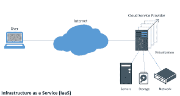
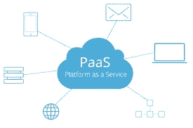
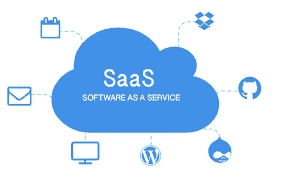

# 云计算☁️

> 原文：<https://medium.com/nerd-for-tech/cloud-computing-%EF%B8%8F-c28794ac22e2?source=collection_archive---------3----------------------->

## 什么是云计算？

*   云计算是计算机系统资源的按需交付(可用性)。尤其是数据存储、计算能力等。通过互联网和现收现付的方式。
*   您无需购买和维护物理资源，而是可以根据需要访问云提供商的技术服务，如亚马逊网络服务(AWS)、谷歌云平台(GCP)、IBM 云、Kamatera、微软 Azure 等

## 谁在用云计算？

*   各种类型、规模和行业的组织都在使用云。
*   不同的公司有不同的 IT 需求。大型公司或 1000 多名员工不会有相同的 IT 要求。使用云是一个很好的解决方案，因为它使公司能够高效快速地。
*   全球云计算软件市场份额…，

1.  亚马逊网络服务——32%
2.  微软 Azure——18%
3.  谷歌云平台——06%
4.  阿里云——05%
5.  其他人..— 38.6 %

## 云计算的优势:

*   **敏捷性:**云让您可以轻松使用各种技术。这样你就可以更快地创新，建造几乎任何你能想象的东西。使用云计算，您可以在几分钟内部署技术服务。
*   **弹性:**在云计算中，它被定义为系统能够通过自动配置和取消配置资源来适应工作负载变化的程度，以便在每个时间点可用资源尽可能匹配当前需求。随着业务需求的变化，您可以随时扩展或缩减资源以增加或减少容量。
*   **节省成本:**通过减少设备、基础设施和软件的支出，您可以节省大量资本成本。你只需要在消费的时候付钱。
*   **在几分钟内完成全球部署:**借助云，您可以扩展到新的地理区域，并在几分钟内完成全球部署。例如，AWS 在世界各地都有基础设施，所以您只需点击几下鼠标，就可以在多个物理位置部署您的应用程序。

## 云计算的类型:

1.  基础设施即服务(IaaS):

**IaaS**

*   它是一种云计算服务，企业租用或租赁云中的计算和存储服务。用户可以在租用的服务器上运行任何操作系统或应用程序，而无需支付这些服务器的维护和运营成本。IaaS 为您的 IT 资源提供了最高级别的灵活性和管理控制。

2.平台即服务(PaaS):

**平台即服务**

*   这是云计算服务的一个类别，它提供了一个平台，允许客户开发、运行和管理应用程序，而不需要复杂地维护通常与开发和启动应用程序相关的基础架构。

3.软件即服务(SaaS):

**SaaS**

*   它为您提供由服务提供商运行和管理的完整产品。有了 SaaS 产品，您不必考虑如何维护服务或如何管理底层基础架构。你只需要考虑如何使用这个软件。比如 Gmail，Google Drive。

## 云计算的特点:

*   资源池
*   按需自助服务
*   易于维护
*   大型网络接入
*   有效性
*   自动装置
*   经济的
*   安全性
*   现收现付
*   计次制通话业务

**-哈希尔·图马尔**