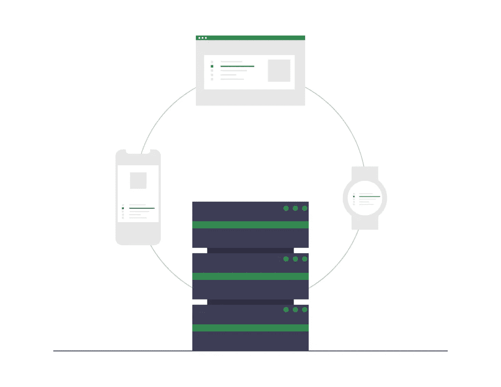

# 云计算和所有基础知识

> 原文：<https://medium.com/nerd-for-tech/cloud-computing-and-all-the-basics-8248b623b4c7?source=collection_archive---------19----------------------->

最近，我参加了谷歌开发人员奖学金培训，我觉得有趣的部分教程是云计算，我想我应该分享一下。

根据维基百科 ***云计算*** *被定义为按需可用的* [*计算机*](https://en.wikipedia.org/wiki/Computer) [*系统资源*](https://en.wikipedia.org/wiki/System_resource) *，尤其是数据存储(* [*云存储*](https://en.wikipedia.org/wiki/Cloud_storage) *)和* [*计算能力*](https://en.wikipedia.org/wiki/Computing_power) *，无需用户直接主动管理*我知道这个定义可能有点难以理解，但是请记住。首先，让我们从云计算的已知优势或好处开始；**成本、方便、速度**和**特点。**所有这些优势对用户来说都有不同的优先级；拥有智能手机的普通用户可以谈论它在备份照片、文件和文档以及在多种设备之间同步方面的便利，对于开发人员来说，速度很重要，对于首席财务官来说，速度是真正的交易，但**功能**怎么样？现在，这才是云计算的真正定义。

云提供公司针对不同的目标，从个人、团队、小型企业到大型合作。当然，向这些目标提供的服务是不同的，但它们都有一些共同的特点。这些品质是:

*   **互联网连接:**我认为获得云服务需要互联网连接已经是一种流行的理论。虽然，这不一定要求在任何时候都 100%连接，但互联网连接是访问云计算的基本因素。
*   第三方硬件:即使在 21 世纪，很多人仍然认为云计算或服务是其他人电脑上的活动。这一定是真的吗？不。至少这不是第三方硬件的真正定义。那是什么？你会看到大公司比如谷歌建立数据中心和专用空间的唯一目的是在自动化和软件管理的顶层帮助下，让用户免费(google drive)或付费(google ads)使用资源。
*   **自助服务&按需服务**:这是云计算最大的好处之一，因为用户无需人工干预就可以访问云上的所有服务。还有什么？一切都在你的点击中。
*   **资源池**:在我们进一步解释之前，你认为当用户在 Dropbox 上注册时会发生什么？你认为一个 IT 人员会把刻有他名字的硬盘插入系统吗？肯定不是。相反，用户可以访问一组互连的硬盘，这些硬盘也托管着数据中心(计算基础设施)中的其他用户，这一过程被称为**资源池。**资源池的优势在于其效率，系统能够检测出故障硬盘，并将任务分配给另一个正常工作的硬盘，甚至无需人工干预。

## 云服务

云计算的全部目标是为用户提供服务。这些服务解释如下:

*   SaaS(软件即服务):这是最简单的服务形式，因为很多人甚至不知道他们正在使用云计算。这些服务大多通过网络浏览器访问，从 Gmail 等电子邮件提供商到 Trello 等协作应用程序。这些服务已经是内置软件，用户需要做的就是使用它。
*   **IaaS(基础设施即服务):**这是对数据中心资源的更深层次的访问。这项服务允许用户对他们的请求有更多个性化的选择，例如，用户想在 Amazon Light Sail 上选择首选的速度、内存存储和位置。这还有什么不同？用户可以访问虚拟机，虚拟机是在物理计算机上运行的程序，但完全模拟另一台计算机。
*   **PaaS(平台即服务):**该服务无需像在 **IaaS 上那样管理虚拟机。**云服务提供商给你一个完整的开发环境，他们在云中管理、更新和维护。尽管你仍然需要构建一些东西来使它工作，而且大多数时候这项服务是针对软件开发人员的。

有几个已知的云部署选项，如公共云、私有云、混合云和多云。

*   **公共云**是可供公众使用的默认选项，这里计算资源归第三方所有，这些资源可供多人使用。
*   **私有云**是一个专用空间，可以由公共云服务提供商提供，但计算资源只能(保留)给一个组织使用。然后，通过额外的身份验证层来保护该资源
*   **混合云**将内部应用和设备整合到公共和/或私有云中。这些应用程序不是相互隔离的，而是通过 API 相互通信。
*   **多云**是来自多家云提供商的解决方案或功能的组合。这意味着组织不必只使用一种云提供商服务。

## 弹性和无服务器计算

**弹性**顾名思义，是指将一件物品拉伸和收缩到原来大小的能力。**弹性计算**是指服务器、存储和网络根据需求自动调整的能力，也可以称为自动扩展和缩减的能力。弹性计算可以为组织带来好处，因为当他们不使用资源时，他们不必为资源付费。

无服务器计算的目标是软件开发人员，因为它允许运行代码而不必考虑服务器。它比 PaaS(平台即服务)更进了一步。

# 结论

本文旨在解释云计算的基础知识。你可以通过申请谷歌开发者奖学金 [**这里**](https://www.pluralsight.com/partners/google/africa/gads-2021?aid=7014Q0000023RnOQAU&oid=&promo=&utm_campaign=&utm_content=&utm_medium=partner_partner_web_referral&utm_source=&utm_term=) 了解更多。要了解谷歌开发者奖学金以及如何通过，请点击 [**这里**](https://www.opportunitiesforafricans.com/google-africa-developer-scholarship-gads-program-2021/) 。