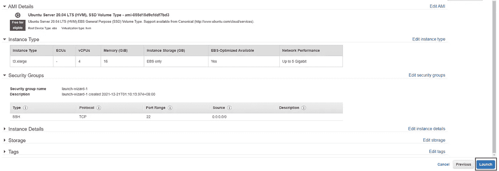
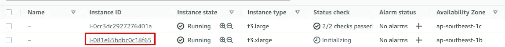
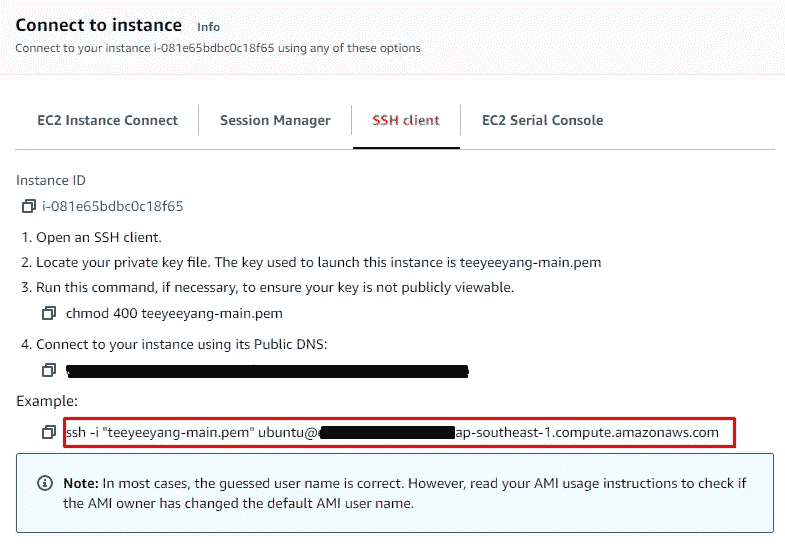
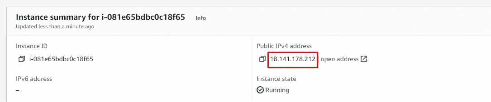
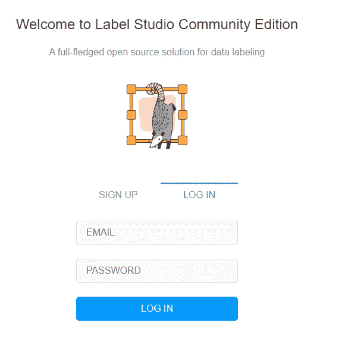

# 云从零开始托管 AWS 上的任何工具

> 原文：<https://medium.com/nerd-for-tech/cloud-host-any-tool-on-aws-from-scratch-c62f07e3d481?source=collection_archive---------1----------------------->

## 我如何通过只使用最基本的产品在 AWS 上托管深度学习标签工具。

当涉及到与深度学习相关的任何事情时，数据标签是最大的麻烦。结果，仅仅在今年，[多家开发工具来帮助数据标注过程的初创公司](https://labelstud.io/)就获得了令人惊叹的融资！像特斯拉这样有着独特标签要求的成熟科技公司甚至从头开始构建他们的整个标签软件——这在深度学习管道中看似无害的一步正是*的*重要之处。


照片由[斯科特·格雷厄姆](https://unsplash.com/@homajob?utm_source=medium&utm_medium=referral)在 [Unsplash](https://unsplash.com?utm_source=medium&utm_medium=referral) 上拍摄

作为一名 ML 从业者，数据标签对我来说并不陌生。由于能够在后端定制和调整软件，我一直使用开源标签工具，如 [Label Studio](https://labelstud.io/) 和 [Diffgram](https://diffgram.com/) 。在本地机器上简单地安装这个工具总是简单明了的，它包含了要标记的数据！本地实例很棒:访问和安全配置简单，延迟低，数据管理容易。然而，当在标签过程中处理一个需要多个合作者的大型项目时，我面临着最大的挑战:*我们需要扩展我们的解决方案*。

谢天谢地，我位于新加坡，这里是所有大公司的数据中心所在地。云托管似乎是允许多个合作者在数据标签平台上合作的最明显和快捷的解决方案。这是我作为一个完全的云初学者在 AWS 上从零开始托管标签平台的旅程！

## 用户帐户

创建一个 AWS 帐户非常简单。几年前我已经有了一个，所以我不会在这里分享太多。AWS 为这里几乎所有的基本产品提供[免费等级](https://aws.amazon.com/free/?all-free-tier.sort-by=item.additionalFields.SortRank&all-free-tier.sort-order=asc&awsf.Free%20Tier%20Types=*all&awsf.Free%20Tier%20Categories=*all)定价，所以请放心尝试一下吧！有非常详细的方法可以管理你的用户账户、权限和安全访问，但这可能需要几年的时间。(如果你对 a̶ ̶b̶o̶r̶i̶n̶g̶ ̶p̶e̶r̶s̶o̶n̶感到厌烦，可以在这里阅读。)

## 启动 EC2 实例

EC2 代表弹性计算云，不知道这是什么意思。我所知道的是，你可以想象 EC2 让你访问计算机的一部分(它被称为*实例*),在这些东西的某个地方:


您的 EC2 实例很可能正在右上角的托盘上运行。

为此，我执行了以下**主要步骤**:

*   导航到 EC2 选项卡，只需单击“启动实例”，非常简单！
*   选择 Ubuntu 20.04 作为 AMI(这类似于您的实例的操作系统)。因为这是我唯一认识的。
*   选了一个 t3.xlarge 实例，4 个 vCPU 核，16gb RAM，因为我有钱。对于贫困的(博士)学生，请随意使用 t2.micro，这是免费的，但结果可能会有所不同。
*   **重要提示**:在“安全组”标签中，如果你想更安全的话，确保你打开了 SSH 访问的端口 22，可以是互联网，也可以是你自己的 IP 地址。此外，打开端口 8080 以允许稍后访问 webtool。
*   因为我懒，所以没有关心配置就点击了“查看并启动”。
*   您必须命名并创建一个名为 key-pair 的东西，这是安全性所必需的。只需下载。pem 文件并将其保存在计算机上的安全位置，这是连接到您的实例进行身份验证所必需的。我知道它只是进入你的桌面，但请记住，它实际上是最容易受到黑客攻击的位置。



按下那个漂亮的发射按钮，我们就可以出发了！

之后，您的实例正式启动并运行在神奇的云上，干得好！接下来，我们必须连接到正在运行的实例。为此，单击“查看实例”,然后单击您刚刚启动的实例 ID，如下所示:



如果这是您第一次使用 EC2，您应该只能在这里看到一行。

接下来，点击右上角附近的“连接”。然后，您应该会看到一些关于如何连接到您个人的、独特的、令人惊奇的 EC2 实例的说明！如果您正在阅读本文，我必须假设您知道如何使用命令行，因此运行下图中突出显示的命令。确保您与先前下载的密钥对文件在同一个目录中(或者以某种方式指向它),这样才能工作！



复制红色内容，粘贴到您的终端/命令行界面

## 设置 Label Studio

如果一切顺利，您应该在终端中看到一个漂亮的 ubuntu@ip-xx-xx-xx:~$显示您现在可以访问实例了！接下来，我简单地运行了一个包含 labelstud.io 安装说明的快速脚本[,它取自他们的](https://github.com/yeeyangtee/setup-label-studio/blob/main/setup.sh)[官方文档](https://labelstud.io/guide/install.html)。**下面的代码块**应该足以安装 label studio。

```
git clone [https://github.com/yeeyangtee/setup-label-studio.git](https://github.com/yeeyangtee/setup-label-studio.git)
chmod +x setup-label-studio/setup.sh
sudo ./setup-label-studio/setup.sh
source env/bin/activate
```

要检查版本，然后在 web 服务器中运行标签工具:

```
label-studio version
label-studio
```

要查看 web 工具，只需从实例详细信息页面提取公共 IP 地址。接下来，您可以通过键入 IP 地址后跟 8080 来连接它。对于我们的例子，完整的地址应该是:[http://18.141.178.212:8080/](http://18.141.178.212:8080/user/login/)。



用自己的 IP 地址！这篇文章发表时，这个实例可能已经被终止了。

一旦进入浏览器，您应该会看到下面的登录页面。在这一点上你是最棒的！请随意创建一个帐户并登录，该帐户将是您的实例所独有的。您将能够使用标签工具中的所有功能，如上传数据和标注数据，完全在云上运行！



如果你看到这个，恭喜你！

## 总结想法

如果您遵循了本文中的所有默认步骤，那么在 AWS 上启动一个全功能的标签工具(或任何其他开源工具)应该是相当简单的。当然，由于这只是一篇炒作文章，很多东西都被忽略了。

我*承诺*在后续部分中涉及的一些事情是:

*   用于备份的数据库系统。Label Studio 实际上默认使用 SQLite3，所以我们可以通过简单地将一个文件转储到单独的云存储来备份它。Label Studio 还支持 PostgreSQL 数据库，这对于更严肃的工作来说是非常棒的！
*   安全。这里不多说了，真的很明显，本文解释的一切根本不安全**。**
*   与亚马逊 S3 或其他云存储工具的集成。我们需要一个更好的地方来存储我们所有的大型数据集，EC2 实例上少得可怜的 SSD 存储无法满足我们的需求！