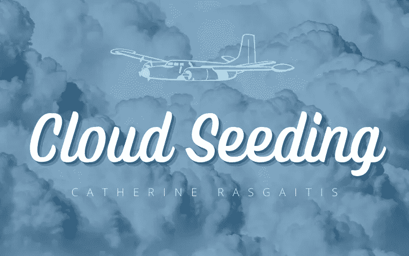

# 云的催化

> 原文：<https://medium.com/nerd-for-tech/cloud-seeding-ecd6252d287e?source=collection_archive---------5----------------------->

## 让它下雨，真的。

照片由[约书亚·雷德科普](https://unsplash.com/@joshuaryanphoto)拍摄，由 [Unsplash](https://unsplash.com/photos/7Oq9r2CiTLg) 提供

播云是一种创新的人工降雨技术，通过向云中喷洒“种子”或晶体来人工降雨。

由于自学成才的化学家文森特·谢弗(Vincent Schaefer)的工作，现代人工降雨方法于 20 世纪中期发明。谢弗最初的实验依赖于一个传统的家用冰箱，他可以把头伸进去，在里面呼吸…