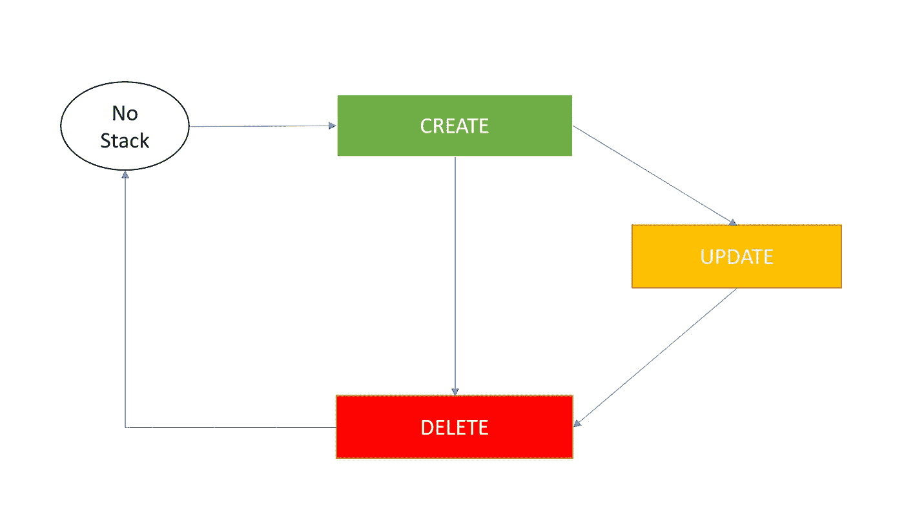
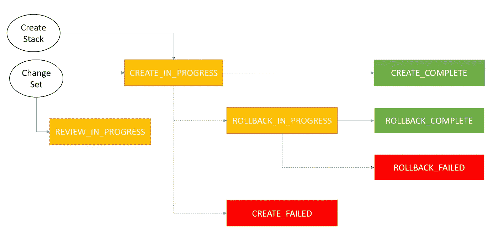
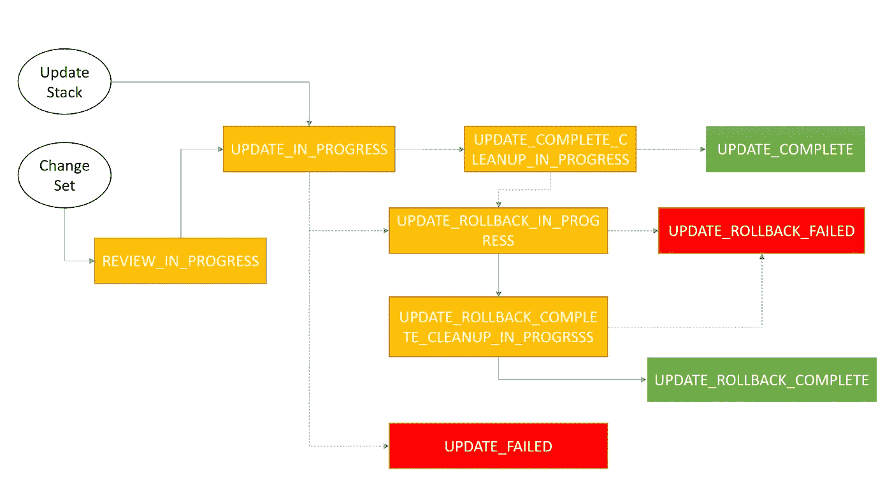
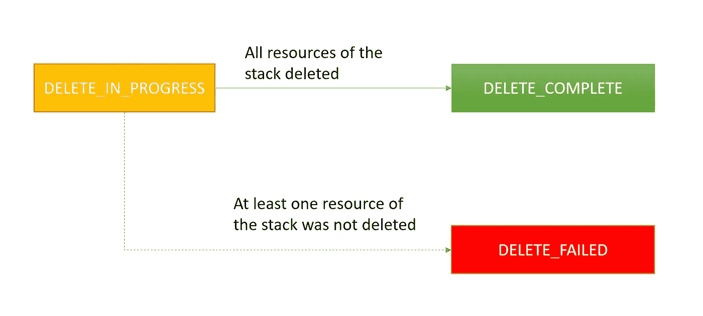

# 云形成状态转变

> 原文：<https://medium.com/nerd-for-tech/cloudformation-status-transition-ea402050c7aa?source=collection_archive---------0----------------------->

Stack 是 AWS 资源的集合，我们可以将其作为一个单元来管理。我们可以在这个单元上执行创建、删除和更新等操作。当我们执行这些操作时，堆栈从一种状态转换到另一种状态。比如从 CREATE_IN_PROGRESS 到 CREATE_COMPLETE。了解转换状态有助于调试任何问题。这个博客试图直观地描述状态转换。

在高层次上，我们对栈执行创建|更新|删除操作。首先，我们使用一些模板创建一个堆栈。创建后，我们可以删除或更新堆栈。我们也可以在更新后删除堆栈。在内部，在上述每个操作期间，堆栈通过多个状态进行转换。我们将一个一个来看。

# 创造

因此，让我们从创建操作开始。让我们看看堆栈经历了哪些不同的状态。

一旦我们将语法上有效的模板传递给创建堆栈 API，堆栈就进入 CREATE_IN_PROGRESS。在变更集 API 的情况下，我们有额外的状态，在那里 cloudformation 审查并决定什么将被变更。一旦它决定了所有的改变，它将进入 CREATE_IN_PROGRESS。它将继续按照提到的依赖顺序创建资源。如果没有创建任何东西，那么堆栈会在 ROLLBACK_IN_PROGRESS 中转换。在这种状态下，它会尝试删除到目前为止创建的资源。如果它能够删除所有这些，它将进入 ROLLBACK_COMPLETE 状态，然后堆栈将被删除。但是如果它未能删除中间的任何资源，它将进入 ROLLBACK_FAILED 状态。

# 更新

为了能够更新堆栈，堆栈状态不应处于以下状态。

> *CREATE _ IN _ PROGRESS
> UPDATE _ IN _ PROGRESS
> UPDATE _ COMPLETE _ clean up _ IN _ PROGRESS
> UPDATE _ roll back _ IN _ PROGRESS
> UPDATE _ roll back _ COMPLETE _ IN _ PROGRESS
> UPDATE _ roll back _ FAILED
> DELETE _ IN _ PROGRESS
> DELETE _ FAILED*

在除 UPDATE _ roll back _ FAILED & DELETE _ FAILED 之外的所有情况下，您都需要等待状态更改。在其他两种情况下，您需要修复导致失败的错误，然后尝试更新。

在更新过程中，CFN 首先创建新资源，然后删除受支持资源类型的旧资源。因此，我们有额外的状态，如 UPDATE_COMPLETE_CLEANUP_*和 UPDATE _ roll back _ COMPLETE _ CLAENUP _ *。静止流与上面讨论的相似。如果堆栈无法更新资源或无法完成回滚，则相应地输入 UPDATE_FAILED 或 UPDATE_ROLLBACK_FAILED。

# 删除

当我们由于某种原因试图删除堆栈时，堆栈中的任何资源都没有被删除，那么堆栈进入 DELETE_FAILED 状态。我们需要修复未能删除的资源(比如在删除之前清空存储桶，删除在 CFN 之外创建的任何其他引用)。

在最后三张图中，**红色的状态需要人工干预**，然后才能变为绿色或橙色状态。在红色状态下，对堆栈的进一步操作将不起作用。

堆栈始终卡在*** _ 进行中**状态。请注意自定义资源、ECS、证书、自动缩放资源。他们很可能是罪魁祸首，**等待成功信号(健康信号)或手动干预(证书验证)**。

感谢阅读！！感谢反馈。