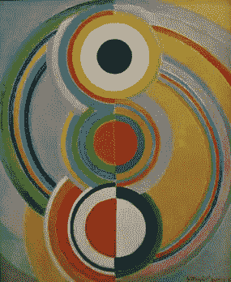

# 云主义和未来主义:未来的操作系统

> 原文：<https://medium.com/nerd-for-tech/cloudism-and-futurism-an-operating-system-for-the-future-d4cea60b7c3c?source=collection_archive---------15----------------------->

## 因为未来在云端

向云端吹响号角(从德意志博物馆的屋顶)

答几年前，我参加了微软邀请的 MS Build(在这里写了相当多的)。我想，在某种程度上，我看到了光明。但我看到的是一个以云为中心的未来，同时伴随着人工智能。

> 这些是我在同年的一次微软活动中做的一次[演讲](https://jj.github.io/FuturOS)的一组幻灯片中的笔记。因为它们刚刚被埋葬在那里，我想我也可以以文章的形式重新发表它们。它们可能有点过时，但从概念上讲，它们仍然很热门。

西雅图的亚马逊大楼，新泡泡仍在建设中

如上所述，以云为中心的未来将是一个多元化的未来。这是一张多方面的图片，因为这张图片代表了亚马逊的大胆声明，还因为未来将由许多不同的供应商和玩家组成，以及许多不同的程序运行方式，许多不同的技术来运输和部署松散连接的代码片段。准确地说，这些方面可能是我所考虑的问题的一部分。

西雅图针，有云

云层中有蓝天，我们学者以我们蓝天般的思维方式而闻名，主要是关于未来的。所以这就是我接下来要写的，从我认为的问题开始。让我们向艺术学习，因为艺术总是先于(计算机)科学。

## 现在≈过去

来自 futurismo.org[https://www.futurismo.org/artistas/varvara-stepanova/](https://www.futurismo.org/artistas/varvara-stepanova/')的瓦瓦拉·斯捷潘诺娃设计的礼服套装

未来主义是一种艺术运动，试图反映现代生活的主题、速度和活力，以及时间的流逝。我觉得这个主题很合适，因为这是一种方式，表明绘画迄今为止在现代世界中没有意义，也是一种方式，研究结合不同表达方式的新交流方式:设计、绘画和印刷。

就像云结合了不同层次的虚拟化，数据源，数据处理器，数据汇。

上面的作品代表了未来主义者对一些服装的设计。不是难以置信的突破，但至少这是一种将未来引入过去服装模式和设计的方式。你可以在这里的蒂森·伯恩米萨收藏馆里找到比未来主义者更立体的柳波夫·波波娃的作品，还有其他俄罗斯未来主义者，包括罗扎诺娃，以及主流[意大利未来主义者](https://en.wikipedia.org/wiki/Futurism)分支的男性画家。目前，在云中，我们拥有的是看起来*现代*的东西，但这在很大程度上是对旧的、基于数据中心和金属的方法的
小改变。

问题是，就目前而言，许多人只是在新的地方继续做他们的老事情。如果您在共享主机或 VPS 中有一个 MEAN 或 XAMP 堆栈，现在您可以在云上使用它。也许还可以增加监控和其他功能。你找到容器，然后你要做的就是把一整堆放在一个容器里。威廉·吉布森的这句话永远是真理:

> 未来就在这里，只是它不是均匀分布的。

几个月前，我和一些 IT 中心的人谈过，告诉他们关于云的事情。他们说了一些“是的，我们研究了它，它不适合我们”之类的话。在我的国家的某个城市有一个叫“云中心”的东西。你觉得他们会用 OpenStack 之类的云软件吗？你知道他们是怎么做的吗？他们接到一个电话来做这件事。

## 现在和未来，既支离破碎又四分五裂

亚历山德拉·埃克斯特， [Naturaleza Muerta，Thyssen-Bornemisza](https://www.museothyssen.org/coleccion/artistas/exter-alexandra/naturaleza-muerta)

> 虽然空间分割和拼贴的使用是其实验努力的一个样本，但灿烂的色彩来自她祖国的传统。另一方面，物体是立体派静物画中常见的物体，如瓶子和杯子，它们位于构图的中心，与不同的广告拼贴画以及一个箭头交叉的大 A 混合在一起，放置在左上角。(博物馆目录中对该画的描述，翻译矿)

未来主义始于一种叫做[分裂主义](https://en.wikipedia.org/wiki/Divisionism)的技术，这种技术将颜色分成小块，相互作用产生一种印象；拼贴被用作构图的一种方式。

当你想使用人工智能(或者，就此而言，几乎任何东西)为云开发时，你会发现这种分裂主义。有无数的 API 允许您在不同的虚拟化级别使用不同的计算单元。大多数 SDK 和 API 都被分割开来，以这种方式，大多数人只使用了每个平台必须提供的计算服务的一小部分，更不用说更高级别的服务了。

> 有如此多的服务，事实上现在有一个关于完全虚假，但似乎可信的 Infinidash AWS 产品的笑话在社交网络上流传。

它也是按照供应商划分的。你可以为 Amazon lambda 或 Azure 函数或 OpenWhisk 开发。GPU 领域的情况类似，它们甚至没有相同事物的相同名称，甚至没有 FPGAs。

不幸的是，这也反映在用户组或 Stackoverflow 标签本身中:这里是容器，那里是云 SDK，但他们基本上使用相同的东西，开发相同的资源。

这种分裂主义的后果之一是大多数工具的宗教性质；我们所说的宗教或虔诚是指非不可知论者。您可以与单一供应商合作，这发生在云堆栈的任何级别。人们承诺任何事情都取决于投资回报率，但不可知论从这个角度来看总是更好。如果你知道你将不得不在 4 或 5 年内撤资，那就不值得去信教。

但这一切又似曾相识:桌面计算在有单一平台的时候起飞了，PC+MSDos，以及后来的 Windows 和 Linux，你可以将应用程序定位于这些平台。以前，你可以把自己托付给一个奥利韦蒂，或巴勒斯，或任何平台，但这有什么意义呢？几年后，它可能会消失，或者不被支持。当 80 年代早期的宗教分歧让位于对个人电脑的不可知论时，这是 IBM 和 EDS 的终结，是微软和 Lotus 的出现，是那些*不可知论者*可以向一整套计算机写东西的公司，所有这些计算机都有一个公共的抽象层。他们的投资(厂商的投资和消费者的投资)得到了回报。

现在的问题是，在云环境中，大多数*不可知的*工具都不能覆盖所有的功能，甚至连 IAM 认证或容器规范这样的基本东西都做不到。在这个特定的方向上有一些步骤，如[开放集装箱倡议](https://www.opencontainers.org/)，但仅此而已。Terraform 也是不可知的，但它仍然缺乏与所有可能的功能一起工作的功能。因此，要么你有一个非常专业的、供应商提供的工具，你可以用它来做几乎所有的事情(或像 Terraform 一样在它上面的薄层)，要么你有一些通用的工具，需要插件、定制开发或两者都需要，像 Ansible 或 vagger(它最终只在非常有限的开发环境中使用)。

## 更糟糕的是，学术界和工业界之间的差距越来越大

[罗莎罗萨，](https://www.futurismo.org/artistas/rosa-rosa/)一千零一夜，

> 在本文中，大量引用了意大利 *futuriste* 或女性艺术家。在本文中了解更多关于罗莎·罗萨的信息，她也是一位科幻作家，是最早在小说中引入性别身份问题的作家之一。

WRT 对 gap 来说，不仅学术界不关心这个新环境，而且即使它关心，我也不确定我们是否准备好迎接新概念、API 和方法论的冲击。每年都有新的东西产生，你需要 10 年来改变路线，至少在西班牙是这样。专业协会(如 ACM 和 IEEE)提出了更长时间的新建议。目前的方法学(通常和不幸的是)集中在一个工具中(例如，它们使所有的任务和例子在 AWS 或 Azure 中工作)，还没有为此做好准备。

但是，此外，学术界和桌面或服务器操作系统中使用的通用语言还没有为这个异步、并发、人工智能辅助的云世界做好准备。这就是公司投资于人力资源以帮助他们调整系统以适应新时代的原因。没有，甚至不能在学术界获得这种经验的人。

## 封闭源代码的问题是

索尼娅·德劳内，*瑞瑟米*，[维基百科](https://en.wikipedia.org/wiki/File:Sonia_Delaunay,_Rythme,_1938.jpg)

一般来说，封闭源代码的专有软件在云中或任何环境中都是不好的。对于最终用户来说，这很难管理。

但它也保持了公司内部的创新，不允许一个将推动整个技术向前发展的合作竞争的环境。非标准 API 也是一个问题，甚至比封闭 API 更严重。它发生在桌子对面，任何地方。数据存储、消息队列、安全参数，它们都是私有的，因此没有办法在内部测试或安装、调试以及封闭源代码带来的所有问题。

OpenStack 或其他开源玩家提供的东西和你从大玩家那里得到的东西之间也有很大差距。这是学术界的一个问题，并加大了上述差距。

## 一点一点地，我们正在到达那里

Benedetta Cappa， *Velocità di motoscafo* ， [Blog Dexedrina](http://dexedrina.blogspot.com.es/2016/10/benedetta-cappa-motoscafi.html)

有许多倡议试图给出一个整体的、统一的云视图，毕竟，云是我们现在运行计算机的地方。我们在 MS Build 中看到了一点，在它之后看到了更多，但它仍处于起步阶段，就像你在 80 年代和 90 年代编程时，当你想发出声音时，需要处理中断和端口地址，或者就此而言，需要处理打印机或计算机没有的任何东西。

第一个操作系统和编译器就是用它制作的:他们使用试探法和工程学来创建最适合各种硬件组合的代码，使用可用的 FPU，等等。您可以为稍微不同的配置重新编译，但仅此而已。如今，您不需要使用 ARM Cortex 或 Intel i7 运行不同的程序:底层硬件的碎片化现实作为知识嵌入在操作系统和工具链中。

例如，在云或其边缘，我们有[同构的 javascript](http://isomorphic.net/) 。我们还有可以在任何框架下工作的无服务器库。Terraform 能够与许多不同的提供商合作，Kubernetes 则可以与各种组织合作。

但即使我们有一些低级或中级的模式，我们仍然缺乏一种从零开始创建整个建筑的通用方法。微软昨天发布的草案

> 还记得我四年前，也就是 2017 年写的这篇文章吗

，是一件了不起的作品。它允许人们轻松地使用 Kubernetes，只需定义类似“buildpack”的东西，这是一种在容器内插入不同工具和语言并连接它们的方法。从抽象的角度来看，这很有趣。

当我们飞向未来时，我们会找到向我们的工具添加抽象层的方法，以弥合我们所学到的东西或我们所经历的任何东西与我们必须使用的工具之间存在的鸿沟。

## 我们需要一个*云操作系统*: FuturOS

来自[维基百科](https://en.wikipedia.org/wiki/Natalia_Goncharova#/media/File:Cyclist_(Goncharova,_1913).jpg)的自行车手娜塔莉·冈查洛娃

这是在[中对“骑自行车的人”的描述](http://www.theartstory.org/movement-russian-futurism-artworks.htm#pnt_4):

> 尽管它在俄罗斯艺术史上有着著名的重要性，但冈察洛娃的这幅画在俄罗斯未来主义绘画中却是一个异数，因为它描绘了运动的动作——这种方法通常只有在意大利未来主义作品中才能找到。这部作品将西方对动作的关注与俄罗斯对语言的关注区分开来。单词的片段被捕捉到画布上，指示骑车人经过的商店的橱窗广告——丝绸、线、帽子等等。然而，骑自行车的人似乎无视这些昂贵的商品，他固执地踩着踏板；一只大手指着他的背后，甚至把他引回到他来的地方。他在鹅卵石街道上的艰难旅程在他的身体中回荡，这幅画成为对工作条件状态的评论，而不是对现代运动的庆祝。虽然这幅画的政治方面与冈察洛娃的一些早期作品相似，但它对运动的逐帧描绘使它与众不同。它存在于两者之间；既不是意大利未来主义，也不是严格意义上的俄罗斯风格，它似乎抓住了两种运动之间的冲突。

这张照片，对我来说是未来主义运动中最好的，因为它连接了意大利和俄罗斯的品牌，它展示了一种新的图像语言的发现，这种语言能够捕捉城市的运动，速度，信息过载，以及它的社会方面。

在计算机领域，需要语言和操作系统来抽象底层功能，使我们能够轻松地创建应用程序，而且还可以将系统作为一个整体来理解，而不是作为各个部分的总和。该操作系统，或与之一起工作的编译器，将不得不包括机器学习和人工智能，以自我配置为最佳和最便宜的云服务组合，无论是混合的、公共的还是私有的。现在你不关心纹理化的、多面的多边形在哪里渲染，因为是编译器负责生成正确的代码。为什么您应该关心您的功能在容器、PaaS 中运行，或者使用现成的软件作为服务？

俄罗斯未来主义为现代体验提出了新的视觉和语言词汇。 这个 **FuturOS** 连同一个云工具链和一种反映底层系统的语言当然将是自由软件，但将允许我们，像这幅画(对我来说，这是未来主义的顶峰)一样，充分利用它。也弥合了与学术界的差距。至少有一点。

> 在某种程度上，桥接是可能的。现在我还不确定。