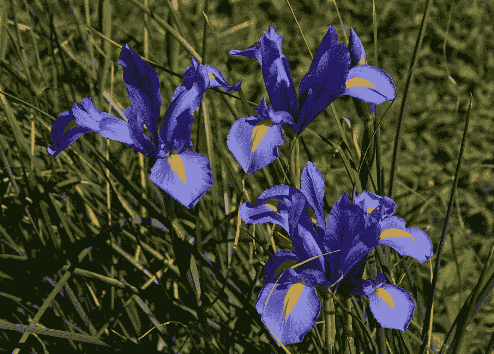
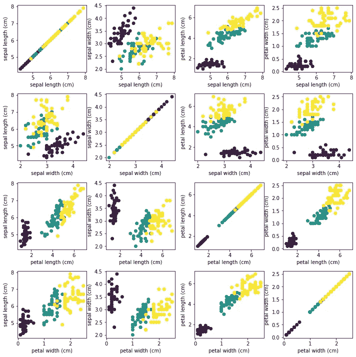
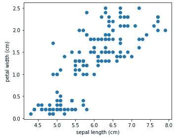
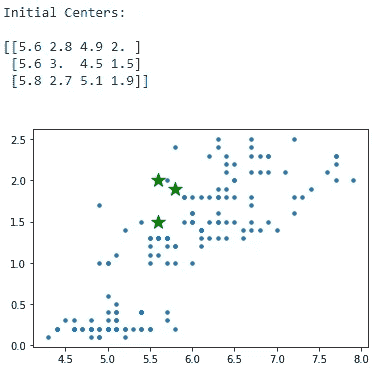
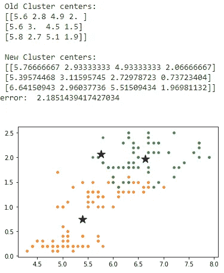
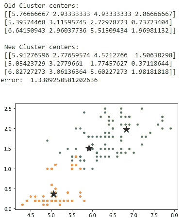
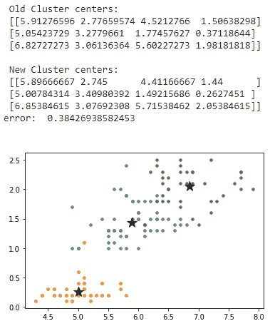
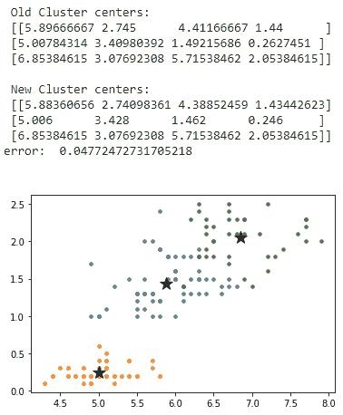
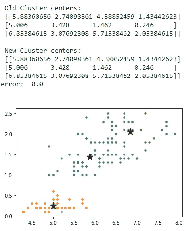

# 聚集虹膜…..

> 原文：<https://medium.com/nerd-for-tech/cluster-the-iris-a7cb11bbbd1b?source=collection_archive---------18----------------------->

兰迪·库珀在 [Unsplash](https://unsplash.com?utm_source=medium&utm_medium=referral) 上的照片

Namaste…在本帖中，我们将讨论使用 K-Means 算法对鸢尾花进行聚类。这篇文章需要关于集群和 Python 的基础知识。如果你不熟悉，请随意离开。

我们有著名的鸢尾花实验数据集。Iris 数据集由三种类型的花(属于 iris 家族)的 150 个实例组成: **Setosa、Versicolour 和 Virginica** 。它有四个特征:**萼片长度、萼片宽度、花瓣长度、花瓣宽度。**这是一个用于分类任务的数据集，但我们也可以将其用于聚类(仅考虑输入要素)。我们将应用 K-means 聚类并分析每个时期的聚类变化。对于这项任务，我们可以使用所有四个特性。为了保持简单和视觉兼容，我们将只选择两个特征进行可视化。特征选择或简化技术可用于选择最重要的两个特征。这里，我们绘制了特征之间的散布矩阵，以识别重要的特征。我们选择了**萼片长度和**花瓣宽度进行实验。您可以根据图 01 所示的散点图选择任意组合。这三种不同的颜色代表花的种类或类型。聚类时我们不会使用类别信息。

图 01-虹膜数据集特征的散点图。

图 02

选择这两个特性后，我们的初始数据如图 2 所示。我们无法判断哪个数据点属于哪个聚类。我们将对这些二维数据进行聚类，并尝试找到最佳聚类。

对于 K-means 聚类，必须在聚类开始前定义 ***K*** 。我们知道数据集只包含三种类型的花；因此， ***K*** 将被设置为 **3** 进行实验。首先，我们从数据点中随机选择三个聚类中心。接下来，K-means 算法开始聚类。每个数据点被分配到最近的聚类中心。接下来，通过取所有聚类数据点的平均值来计算新的聚类中心。这个过程一直持续到我们得到零误差。这里，误差项是旧的聚类中心和新的聚类中心之间的差异。当聚类中心在两个连续的时期内没有变化时，误差项将为零。在接下来的几幅图中，我们试图用聚类中心值和误差项直观地向您展示聚类过程。请仔细检查数字(不要跳过任何一项)。

图 03 具有初始聚类中心的数据

第一个纪元后:

图 04 具有更新中心的聚类数据

第二个纪元后:

图 05 具有更新中心的聚类数据

第三个纪元后:

图 06 具有更新中心的聚类数据

第四纪元后:

图 07 具有更新中心的聚类数据

第五纪元后:

图 08 具有聚类中心的最终聚类数据

在第五纪元，我们的聚类中心没有得到更新。因此，聚类过程停止，我们有我们的最终集群在图 08。

我们还没有评估集群任务。在这篇文章中，我们的主要目标是展示聚类过程。我们已经在以下链接提供了源代码: [GitHub 链接](https://github.com/sawan16/K_means_Iris)。你可以尝试一下，试试你的想法。感谢你阅读这篇文章。