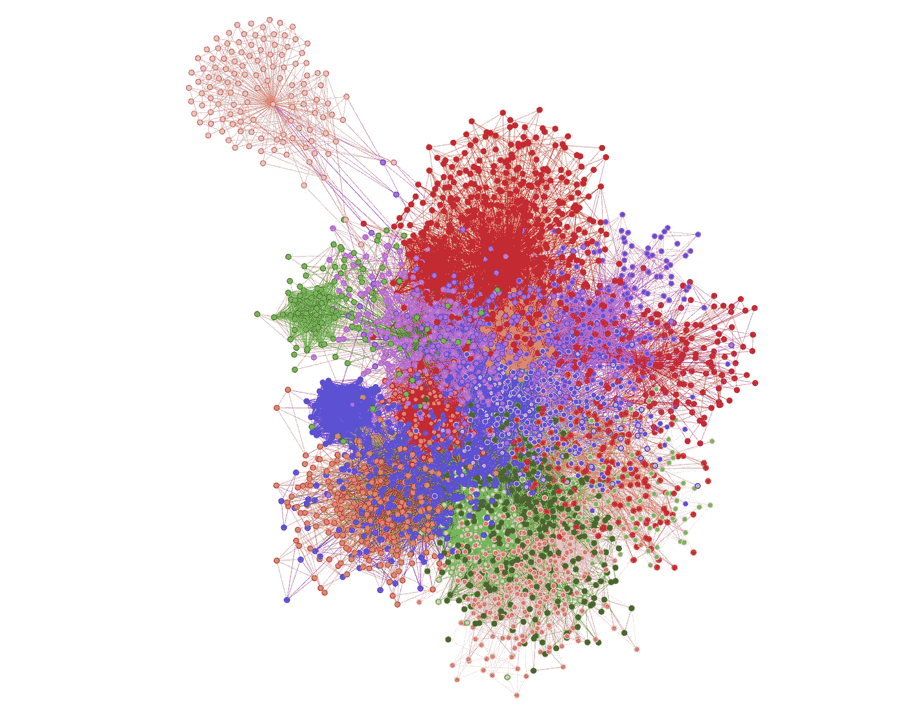
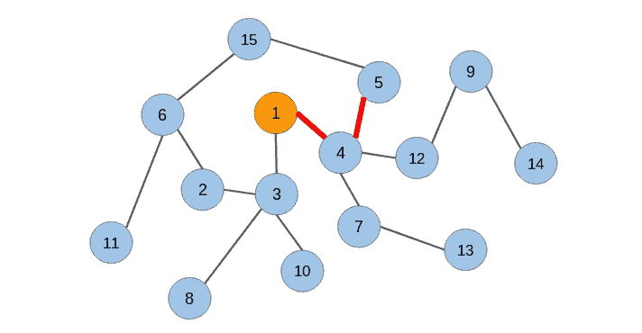
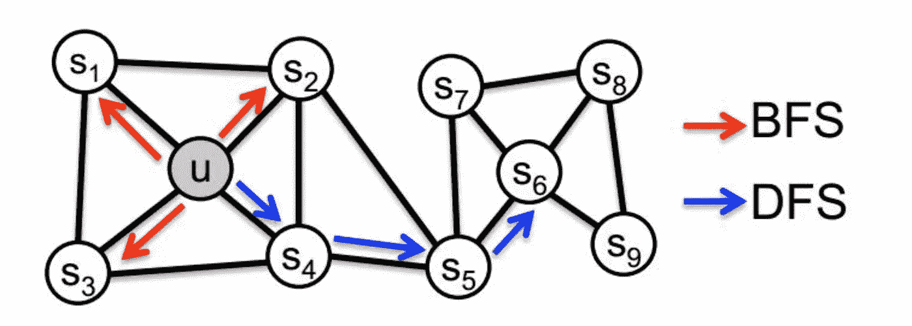

# 使用 DeepWalk 进行合著网络分析

> 原文：<https://medium.com/nerd-for-tech/co-author-network-analysis-using-deepwalk-ac7fd63c82aa?source=collection_archive---------9----------------------->

作者图片

所有的知识都是相互联系的。作为一名数据分析师，我很早就意识到，当新的概念被映射到你已经熟悉的概念时，学习起来会更容易。因此，当我开始学习图中的机器学习时，很自然地使用 DeepWalk 将单词嵌入的概念与 T2 节点嵌入联系起来。我最近也在探索 [**arXiv 数据**](https://www.kaggle.com/Cornell-University/arxiv) 以及有什么比实现它更好的学习新事物的方法。

# 图和图嵌入简介

你有没有想过 Instagram 如何推荐关注谁，或者脸书如何推荐朋友，或者 Pinterest 如何推荐新的 pin？如何识别新药？所有这些问题的答案都是“**图**”。图表让我们能够模拟现实世界的关系。甚至，在正在进行的对抗新冠肺炎疫情的战斗中， [Graph 神经网络(GNN)在确定重新调整哪种药物的用途以对抗疫情方面发挥了关键作用](https://www.ncbi.nlm.nih.gov/pmc/articles/PMC7743080/)。新型冠状病毒知识图是基于病毒诱饵、宿主基因、途径、药物和表型之间的相互作用构建的，并基于这些生物相互作用导出候选药物的表示。

图嵌入允许我们学习图的特征，而不是手工的特征工程。同样，像文本嵌入一样，图形嵌入是独立于任务的。学习到的嵌入可以用于各种应用，如链路预测、聚类、节点分类、异常检测等。

# 关于数据

arXiv 提供对学术文章的开放访问，从物理学的巨大分支到计算机科学的许多子学科，包括数学、统计学、电气工程、定量生物学和经济学。该数据是一个包含 170 万篇文章的存储库，具有相关的功能，如文章标题、作者、类别、摘要、全文 pdf 等。

对于我们的分析，我们只看 2015 年以后发表的 AI、ML 类别的论文。这包括 67，500 篇论文和 104，427 位作者。为了提取数据，我们将使用 [Dask](https://www.kaggle.com/aiswaryaramachandran/exploring-arxiv-using-dask) 。这使我们能够提取数据，而不必将完整的数据加载到内存中。

 [## 使用 Dask 探索 ArXiv

### 使用 Kaggle 笔记本探索和运行机器学习代码|使用来自 arXiv 数据集的数据

www.kaggle.com](https://www.kaggle.com/aiswaryaramachandran/exploring-arxiv-using-dask) 

2015 年以来为 AI 和 ML 提取 arXiv 论文

整个分析的代码可以在[这里](https://www.kaggle.com/aiswaryaramachandran/coauthor-network-analysis-using-graph-embeddings?scriptVersionId=65394438)找到。

# 建立合著网络

合著网络是一个图，其中节点是作者，如果两个作者(节点)一起发表了一篇论文，则他们之间有一条边。

为了建立一个合著者网络，我考虑自 2015 年以来发表过至少 3 篇论文的作者(2.4 是平均值，第 75 百分位是 2)。这导致了 21976 个唯一作者(节点)和 120108 条边。

# 实现 DeepWalk

DeepWalk 是一种用于将图的节点表示到 n 维向量空间中的方法，使得它们捕捉图中的社会关系。DeepWalk 使用网络的本地信息，通过使用随机行走的概念来遍历图形。在随机漫步中，你从一个特定的节点(u)开始，然后随机选择该节点的一个邻居，并将其添加到路径中。从访问过的节点中，您再次选择它的一个邻居并将其添加到路径中。这种情况一直持续到完成了所需的步骤数。我们用一个例子来理解这个。

来源:[分析 Vidhya](https://www.google.com/url?sa=i&url=https%3A%2F%2Fwww.analyticsvidhya.com%2Fblog%2F2019%2F11%2Fgraph-feature-extraction-deepwalk%2F&psig=AOvVaw0rPDjL2KmqjwQfap7wO5y8&ust=1623474745688000&source=images&cd=vfe&ved=0CAIQjRxqFwoTCNj38O7ojvECFQAAAAAdAAAAABAD)

考虑上面的图表。假设我们从节点 1 开始随机行走，行走的长度是 3。从节点 1，我们可以访问节点 3 或节点 4。比方说，我们选择了节点 4。路径现在变成了[1，4]。从节点 4，我们可以选择去节点 5 或节点 7，甚至回到节点 1。比方说，我们选择去节点 5。现在，我们有一个长度为 3 的随机漫步[1，4，5]。**正如我们所见，每个随机游走都是一组节点，与文本相比，每个随机游走就像一个句子，每个节点就像句子中的一个单词**

在 DeepWalk 中，从每个节点，我们生成固定次数的长度为*【l】*(*m*)的随机行走。*这将生成长度为“l”的节点数*m 个序列。然后，我们可以使用跳格法来训练 Word2Vec 模型。*

用于生成随机行走和创建深度行走模型的代码

# 深走模式学到了什么？

DeepWalk 模型对每个节点进行简单的深度优先搜索。所以理想情况下，相互联系越紧密的节点越相似。为此，我们使用 DeepWalk 生成的嵌入之间的余弦距离对顶级作者的合著者网络进行聚类。

获取一组给定作者的合著者网络的代码

使用 KMeans 基于嵌入之间的余弦距离聚类合著节点

当我们查看聚类时，我们可以看到每个作者都有一个密集的网络。仔细观察可视化显示，虽然每个作者都有一个集群，但对于刘洋来说，有两个集群——下图中高密度的蓝色集群和粉红色集群。他就像两个集群之间的桥梁。

作者网络，作者包括杉山正史、舍尔科夫·伯恩哈德、刘洋、卡林·劳伦斯、韦林·马克斯、曼诺尔·阏氏(图片由作者提供)

# 结论

当 DeepWalk 考虑深度优先随机行走时，它不考虑宽度优先邻居结构的影响。考虑广度优先邻居结构可以使我们能够编码节点之间的结构相似性。在下图中，简单地使用 DeepWalk 不会认为节点“u”和“s6”相似。为了避免这种情况，我们可以使用 **node2vec** ，它是 DeepWalk 中使用的随机行走的一种修改。

来源:[https://www . programmer seek . com/images/490/2d8b 97 D8 c 0252 bc9 f 41275d 8 b 9 b 69 b 72 . png](https://www.programmersought.com/images/490/2d8b97d8c0252bc9f41275d8b9b69b72.png)

在我们的共同作者网络中，这意味着我们将能够根据内容相似性(相邻作者之间的相似性)对作者进行聚类，但我们将无法考虑结构相似性(结构相似的作者但不一定相邻)。这意味着，Yoshua Bengio 和 LeCun Yann 都在人工智能方面做了非凡的工作，但他们在使用 DeepWalk 时会不太相似(相似性得分=0.33920118)，因为他们没有一起工作过，但在结构上他们会非常相似。

 [## 使用图嵌入的合著网络分析

### 使用 Kaggle 笔记本探索和运行机器学习代码|使用来自 arXiv 数据集的数据

www.kaggle.com](https://www.kaggle.com/aiswaryaramachandran/coauthor-network-analysis-using-graph-embeddings)  [## 使用 Arxiv 探索人工智能的发展

### 使用 Kaggle 笔记本探索和运行机器学习代码|使用来自多个数据源的数据

www.kaggle.com](https://www.kaggle.com/aiswaryaramachandran/exploring-the-growth-in-ai-using-arxiv) 

***希望这篇文章对你有用。一如既往，非常感谢您的任何反馈。请在下面分享你的评论。***