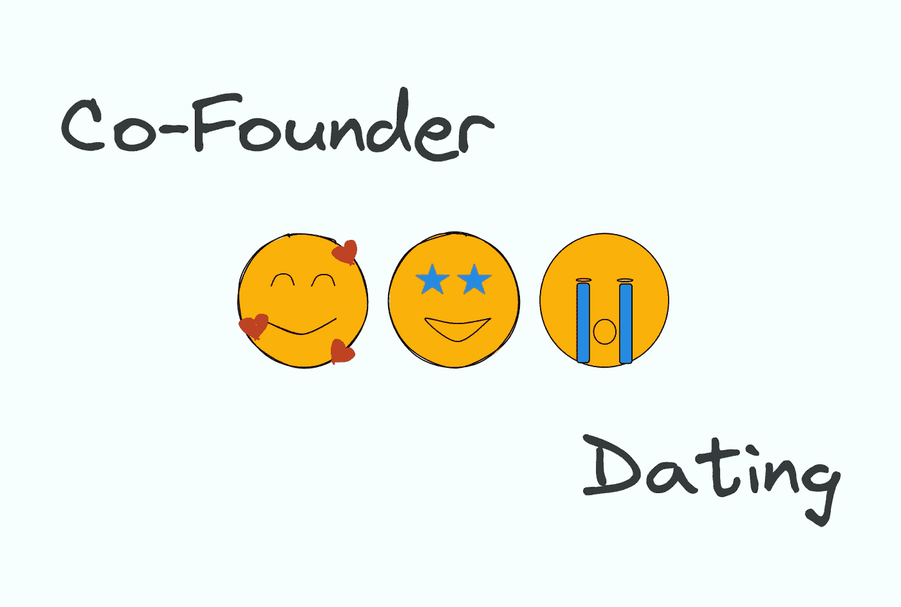
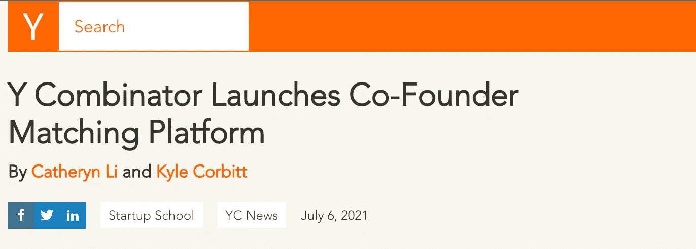
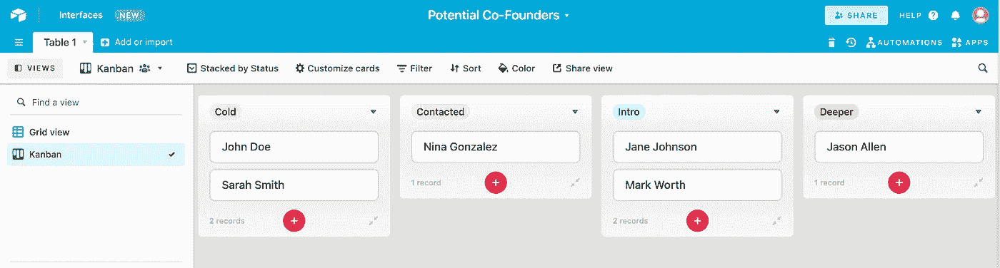
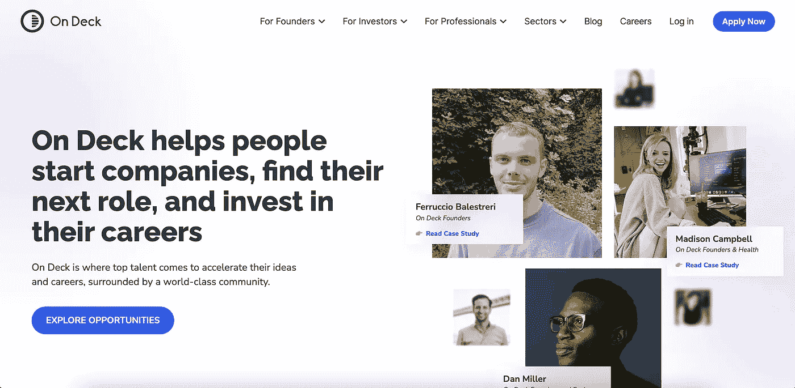
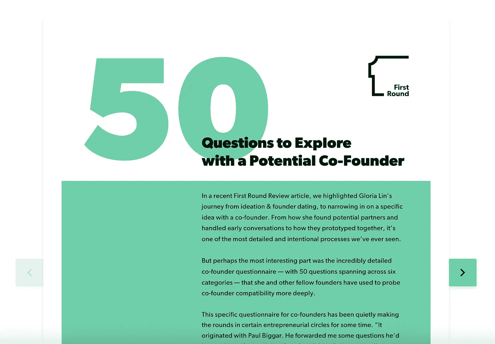

# 联合创始人约会技巧

> 原文：<https://medium.com/nerd-for-tech/co-founder-dating-tips-288d57b6e77?source=collection_archive---------6----------------------->

## 在风险投资中做出最重要决定的 7 个技巧

联合创始人约会变得越来越流行。不到五年前，保罗·格拉厄姆在推特上说“共同创始人约会是个坏主意”如今，YC 运营着自己的联合创始人交友平台，已经撮合了 10，000 对男女，而且还在继续。

[https://blog.ycombinator.com/co-founder-matching/](https://blog.ycombinator.com/co-founder-matching/)

由于创业生态系统的变化，世界对联合创始人约会的想法越来越感兴趣。从文化角度来看，越来越多的人认为创办自己的公司是一条可行的职业道路。早期阶段的风险投资有了巨大的增长。也许最重要的是，这个世界已经变得遥远，这使得与你身边的人合作成为可能。

作为一个经历过联合创始人约会过程的人(并且得到了一个 f[Anta stic partner](https://www.whalesync.com/team/curtis-fonger)r)，我想我应该分享一些技巧。像“真实的”约会世界一样，联合创始人约会既令人兴奋又令人疲惫。然而，当它起作用时，它可以产生有意义的关系和成功创业的基础。‍

# 7 个联合创始人约会技巧

## 1.组织你的过程

在寻找联合创始人的过程中，你会遇到几十个新朋友，可能会有数百次对话。如果没有一个有组织的流程来管理这些会议，运营可能会很快失控。

Gloria Lin 用[创始人约会手册](https://review.firstround.com/the-founder-dating-playbook-heres-the-process-i-used-to-find-my-co-founder)为组织联合创始人约会过程树立了黄金标准。在剧本中，她概述了启动和测试联合创始人关系的详细方法。如果你不能精确地复制这个过程，那就有必要融入一些概念。

至少，你应该把你的联合创始人搜索当作一个销售漏斗。选择你的生产力工具，并开始收集潜在合作伙伴的名单。随着对话的进行或结束，沿着漏斗移动这些线索。这里有一个例子:

潜在客户>联系>介绍会议>深入会议>试用期>合作伙伴

## 2.做好准备

在许多方面，早期联合创始人约会类似于面试。虽然比一般的求职面试更随意，但联合创始人的咖啡聊天通常会涉及一系列类似的问题:

*   “说说你自己吧！”
*   “你对什么行业感兴趣？”
*   “你有想法吗？”
*   “你对联合创始人有什么要求？”

知道你将会得到这些问题，准备好你的想法是有帮助的。不需要很长时间就可以草草记下一些基本的答案，作为一个额外的收获，它可以理清你的思路。

## 3.利用方正网络

许多因素决定了当前时机是否适合创办一家公司。一个人可能有经济刺激、健康问题、家庭问题等等。一旦你迈出了这一步，联合创始人约会最困难的部分之一就是找到其他准备好现在就开始的人。

> **一旦你迈出了这一步，与共同创始人约会最困难的部分之一就是找到那些准备好马上开始的人。**

幸运的是，一些社区已经出现，将大致处于同一条船上的人们联系起来。一些比较受欢迎的包括:

*   [在甲板上](https://beondeck.com/)
*   [推进](https://www.propel.run/)
*   [南方公园公地](https://www.southparkcommons.com/)
*   [第一天](https://joindayone.com/)

[https://beondeck.com/](https://beondeck.com/)‍

如果可以的话，利用这些专业的人脉。他们明确的目标是吸引高质量的人，培养他们的关系。这是一个很好的解决时间问题的作弊代码。

别忘了还有 YC 的联合创始人 Match ！比创始人社区更进一步的是，YC 联合创始人配对就像是联合创始人约会的引爆器。该平台吸引了一批令人印象深刻的人，并使其易于联系。

## 4.开始建造某物(任何东西)

在这个过程中，你会遇到处于创业旅程不同阶段的人——有些人有全职工作，梦想成为创始人，有些人则已经创业一整年了。当你遇到所有这些人时，很难辨别谁是认真的，谁只是在开玩笑。

将自己与“想要的企业家”区分开来的一个方法是建立一些东西。思考想法很容易，但要付诸行动却很难。打造一个 MVP 表明你是认真的，你有一些技能，你知道如何把事情做好。不管你是否找到了联合创始人，你都会朝着创建成功公司的目标前进。

> 将自己与“想要创业的人”区分开来的一个方法是建立一些东西。

如果你不是软件工程师，使用无代码工具创建一个 MVP。如果这个想法太复杂而无法构建，可以在 Figma 中创建一个模型。如果你还没有一个具体的想法，进行用户访谈，并在概念文档中收集信息。快走吧。

你造什么并不重要，只要你造了什么。在这个早期阶段，我创建了一个“Airbnb 办公空间”MVP。当然，办公室与我最终创办的 Whalesync 公司没有任何关系，但它是我喝咖啡聊天的起点，并帮助我保持敏锐的 Webflow 技能。

## 5.深入了解主要线索

就像浪漫的关系一样，大多数第一次约会都没什么意义。从设计上来说，你很快就淘汰了不太适合的人。最终，一些线索会发展到更高级的对话。这就是有意识地进行讨论有所帮助的地方。

Gloria Lin 的流程在她的 50 个创始人问题中再次派上了用场。这些问题旨在促进深入对话并发现潜在的不一致领域。不管是这些问题还是你自己的问题，花点时间和你潜在的共同创始人探讨一下细节。现在比在一段长期关系中更容易发现问题。

Gloria Lin 的 50 个创始人问题

## 6.做一个试用期

在你们真正一起工作之前，很难知道你将如何与某人一起工作。咖啡聊天和创始人问题是很棒的屏幕，但它们只能到此为止。经过多次交谈，如果你们都对潜在的合作关系感到兴奋，我强烈建议开始一段试用期。

联合创始人试用期给你一个预览，如果你决定一起创建一家公司，你的生活会是什么样子。你们两个将在一个房间里交谈、工作，并就想法进行合作。和创始人约会的问题一样，现在发现你不喜欢一起工作比你们正式确定关系后更容易。

在开始试用期之前，最好提前确定安排。理想情况下，你们两个都应该能够回答以下问题:

*   试用期有多长？
*   试用期的目标是什么？
*   我们要做什么？
*   我们将如何交流？
*   如果不合伙，我们创造的 IP 会怎么样？

在我们的案例中，我们做了为期六周的试用期，明确的目标是确定我们是否想在最后一起创办一家公司。我们挑选有目的协作的项目，并建立松弛、串联和概念来沟通。我们还签署了一份法律协议，在试用期结束的情况下，将知识产权转让给我们中的一个人。

## 7.处理小事

吼吼！你做到了。你找到了一起接管世界的完美人选。现在别忘了处理一些小事。

就像你对新员工一样，花时间进行背景调查。当然，也可以让你的伴侣和能为你担保的人谈谈。这是一段可能长达 10 年以上的商业关系的开始——你希望他们尽可能多地了解你。

一旦你准备好正式成立公司，确保你正确地建立了公司。别忘了包括诸如授予你的创始人股份之类的东西。像 [Stripe Atlas](https://stripe.com/atlas) 或 [AngelList Stack](https://www.angellist.com/stack) 这样的工具使这变得容易。

—

如果你刚刚开始你的联合创始人约会之旅，祝你好运！虽然压力很大，但当它起作用时，它是令人兴奋和令人难以置信的回报。