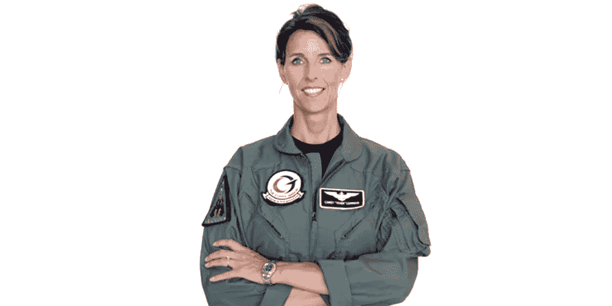
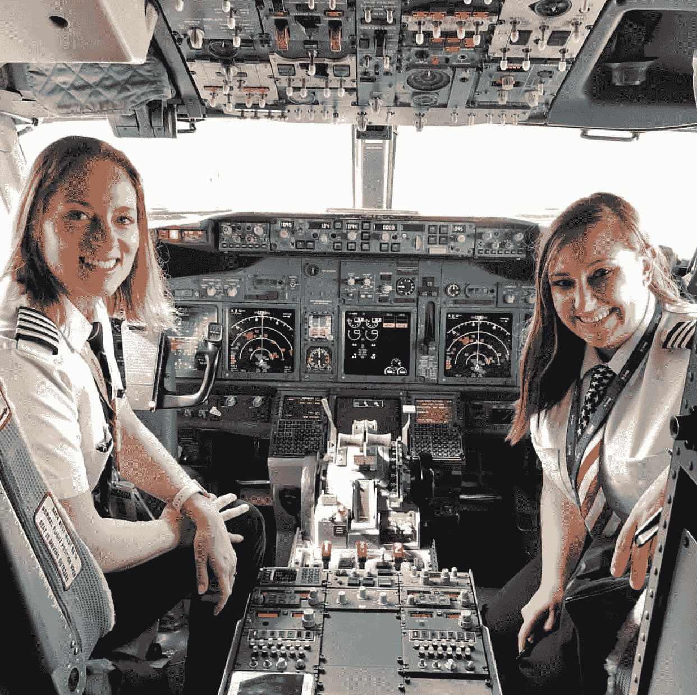
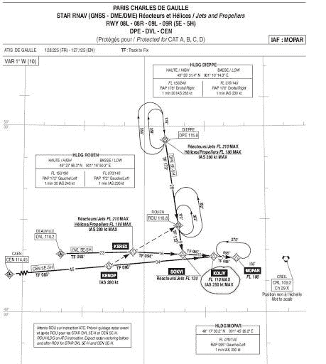
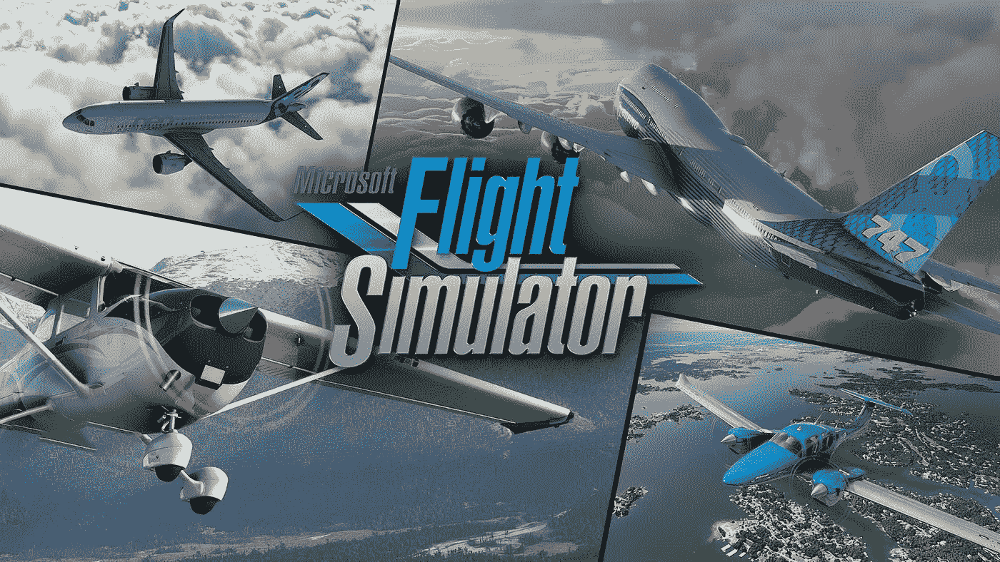

# 驾驶舱作为办公室

> 原文：<https://medium.com/nerd-for-tech/cockpit-as-office-9689c5f7a47d?source=collection_archive---------24----------------------->

## 有很多女人带着我们安全地从一个地方旅行到另一个地方

凯里·罗兰兹[这里](https://careylohrenz.com/)

监控这种影响，因为监控是飞行员现在每天应该掌握的最重要的技能。时刻关注每个目测表，倾听所有可能的声音，这些声音可能是系统的警报，无论是液压、气动还是电气系统。电脑和操作者已经承担了处理高难度操作的工作，并使驾驶舱越来越像一个高级办公室

有很多女人带着我们安全地从一个地方旅行到另一个地方

对于技术娴熟、充满激情和奉献精神的飞行员，他们承诺使用他们学到的技能安全地将他人从 A 点运送到 B 点，并为了被运送人员的安全而不断改进和更新。受约束的激情不同于自由的爱好。330 飞行员不能像他一样在运送乘客时绕圈飞行，当飞机上没有乘客时也是如此，因为 330 不是像[阿尔法喷气机](https://en.wikipedia.org/wiki/Dassault/Dornier_Alpha_Jet)那样为这种飞行而设计的。使用定义了系统的设计，就像成本和费用一样，甚至是认知强化，就像[飞机手柄](https://mkrdiop.medium.com/aircraft-handles-and-design-thinking-effdef7ec052)和操纵杆差异教给我们的一样，我猜汽车手柄也是如此。当我们建议某人保留我们认为对她或他来说很重要的东西时，我们再次说用双手保留它。飞机在交通拥挤的机场附近有等待点，因为交通管制可以发出等待命令。

杰佩森海图 CDG

这种水平循环是有意义的，因为飞机应该总是在机场附近，就像飞行员应该总是处于他或她的最高技能。

在疫情时期，飞行员会在地面上停留一段时间，所以像我一样，他们都需要兼职模拟时间。但是他们有很多飞行员，没有足够的模拟中心。

但是，如果模拟环境和真实环境之间的距离太大，它会对要完成的真实工作产生负面影响，因此模拟环境应该与真实环境相同，或者为了学习目的和研究系统以及飞行员的反应和认知而引入的差异。

PS:女性[试点部落](https://www.pinterest.com/pin/337699672059535780/)和网络效应