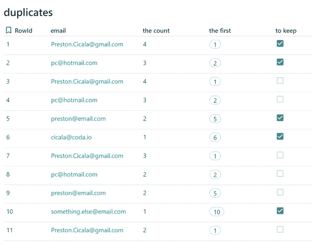
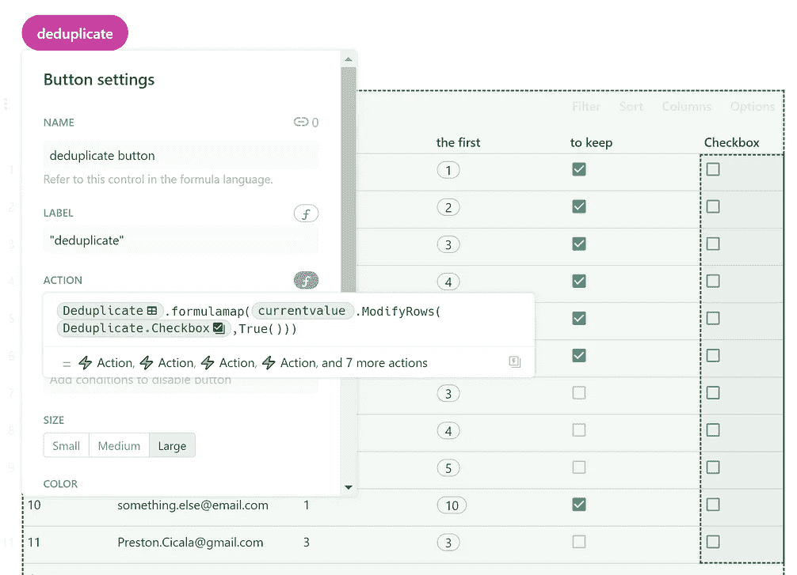
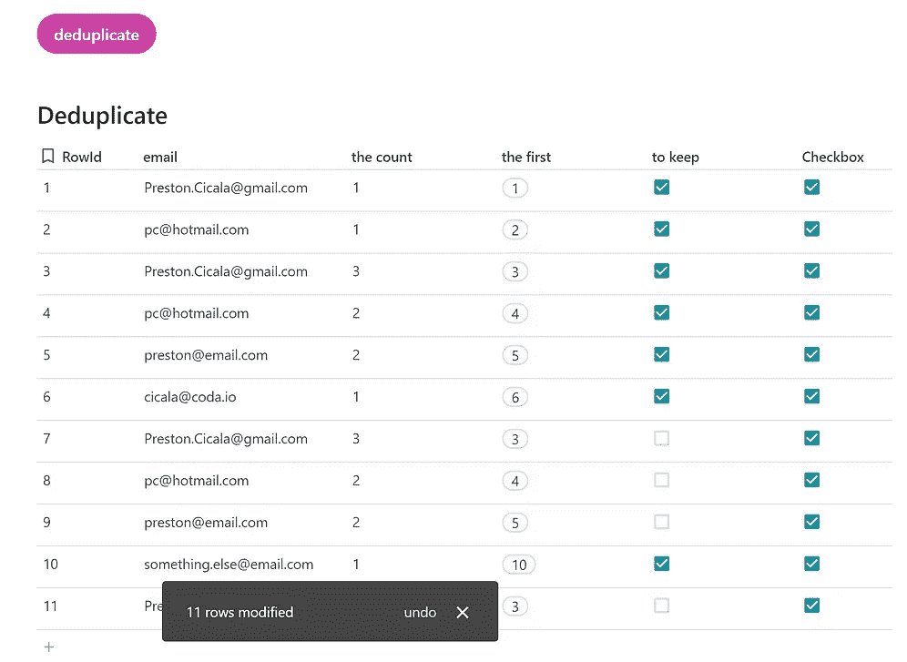
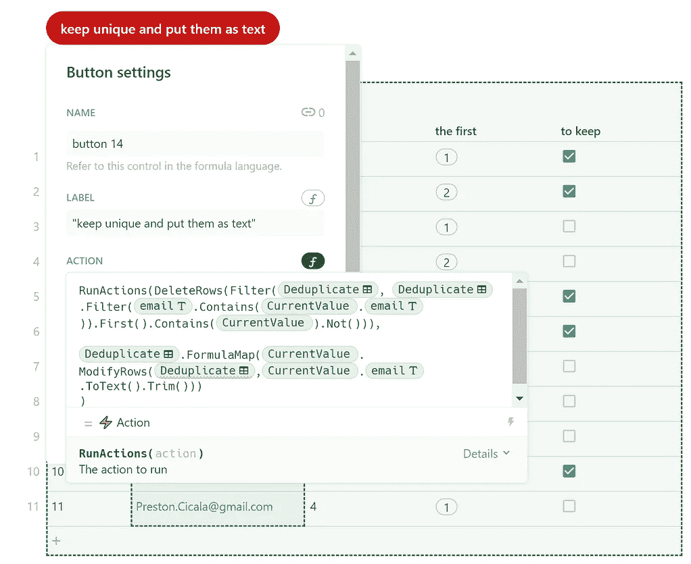
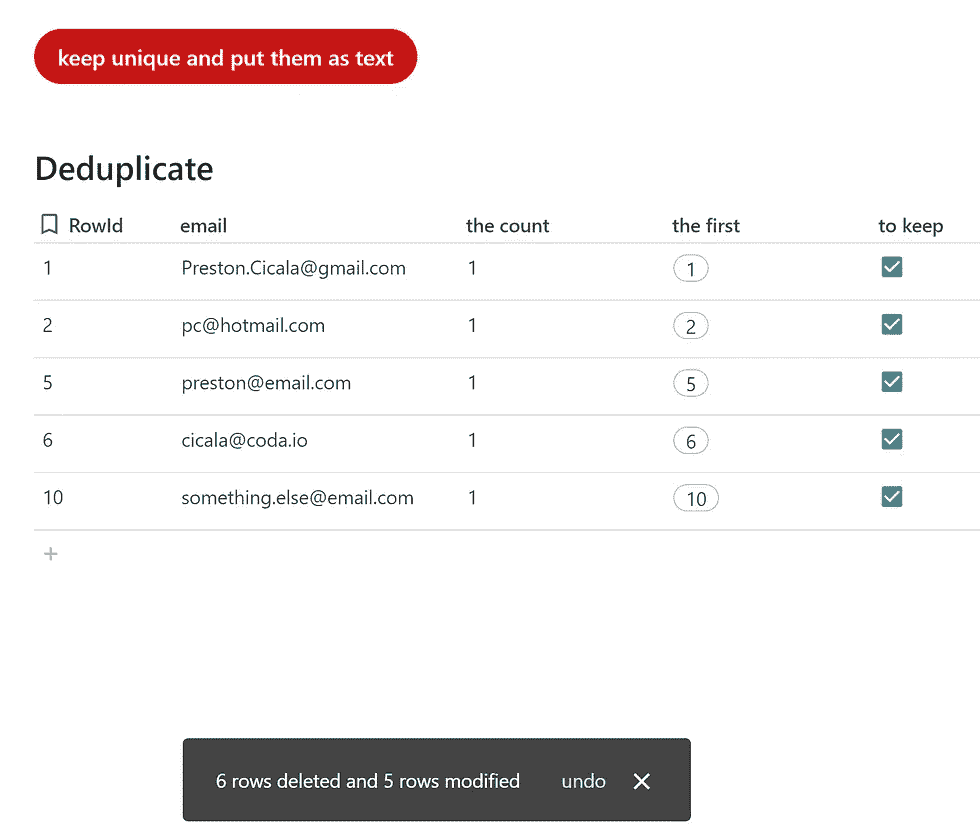

# Coda 和 undouble 你的(电子邮件)名单

> 原文：<https://medium.com/nerd-for-tech/coda-and-undouble-your-email-list-84a38e9145bd?source=collection_archive---------13----------------------->


Coda.io 中的不确定性

保持数据一致是一项挑战。部分原因是数据发生了变化(人们搬家、更换电话号码、使用不同的电子邮件地址等等)，部分原因是数据存在于整个组织的不同系统中。这篇博客是关于如何将数据整合在一起，并使用表外的按钮进行重复数据删除。

# 创建主表

我经常被叫去做一项本应在昨天就准备好的工作，这项工作与数据收集有关。为了快速前进，我在一个文档中创建了一个新表，并将其链接到我放在网上的表单以获取数据。当项目完成时，我有自己的终端用户数据表，而其他数据存在于组织中其他地方的不同系统中。它尚未对齐。这些数据如果交付给我，大多是电子表格格式(主要是 Excel)。为了保持跟踪，我将数据导入不同的表中(每个页面都有自己的表)。

## AddRow

第一步是将所有数据放入一个表中。我使用按钮中的函数`AddRow()`来完成主表。之后，我隐藏了带有源表的页面。在这个主表中，我有名字、姓氏、生日、性别、称呼等信息。通常，最终用户不止出现一次。

## 在主表格中过滤双精度

说到地址(物理的和数字的),最有可能的是仍在使用的最新版本。然而，我们经常被蒙在鼓里，没有任何与约会相关的信息。我们能做的已经是**过滤掉双精度。下面的例子是基于我在 [Coda 社区](https://community.coda.io/t/removing-duplicates-by-email-using-a-button/21966/2?u=christiaan_huizer)的一个回答**

```
**The count:** thisTable.Filter(email.Contains(thisRow.email)).Count()**The first:** thisTable.Filter(email.Contains(thisRow.email)).First()
```

我展示了**计数**以便对问题有一个直观的了解。如果一个值与其他值相比确实出现了很多，它可能会教你一些东西。正常数据集“表现”正常是一个经验法则，如果我们注意到差异非常大的行，我们可能需要查看这些值。如果 10 个不同的人都使用同一个通用电子邮件地址会怎样？

我使用带有`First()`的公式来显示哪个值首先出现在表中(所以 RowId 最小)。只有当数据的顺序与日期相关信息相关时，这才是相关的。人们也可以检查一下`Last()`。但是，如果您的源表没有相关的日期参考，它就没有太大的价值，`Last()`或`First()`都可以。



最后一步是在我们想要保留的行上设置一个复选框。我们用`First()`详细说明公式，然后加上`Contains(thisRow)`。我曾经分享过，你必须从右向左读函数。在这种情况下，我们读取这一行，我们采取任何电子邮件的第一个结果，我们可能会在这一行找到。正如我在关于 [Coda 和 lists 的博客中所写的，](https://huizer.medium.com/in-coda-everything-is-a-list-f13ecf8950d)默认情况下，过滤器所做的是评估列表中的所有项目。下面的公式规定，当您获取所有电子邮件地址的列表时，您将检查这一行中的电子邮件地址(因此检查每一行，因为该公式会一行接一行地遍历每一行)，然后您将过滤掉第一封电子邮件，以防您发现已经遇到的电子邮件(如果计数大于 1)。

```
thisTable.Filter(email.Contains(thisRow.email)).First().Contains(thisRow)
```

对于重复数据消除这种相当简单的任务来说，这是一个复杂的公式。随着时间的推移，Coda 可能会想出一个公式，用函数`DeDupelicate()`来执行这个公式。到目前为止，我们都在使用这个函数。

Coda 用户后来请求更多的支持。不仅是如何删除 doubles(通过按钮和动作`DeleteRows()`删除选中的行),也是如何去掉当你输入一个电子邮件地址时有时会出现的超链接。在我们继续之前，按钮中简单的删除功能是针对表副本的。我们过滤未选中的框(“假”)。

```
DeleteRows(Filter(Duplicates, [to keep]="false"))
```

# 如何用一个按钮修改所有行？

表外按钮的棘手之处在于，由于显而易见的原因，我们不能再使用`thisRow()`。我们上面开发的检查重复项的公式，因此我们可以不在画布上的按钮中编写。但是我们仍然可以访问每一行，这次不是作为`ThisRow()`，而是作为`**currentValue**` **。**下面我们将展示这是如何实现的。我借鉴了 Joostmineur 的见解，他向我展示了如何以最简单的方式让 T7 发挥作用。我最初的工作解决方案有点复杂。我通过`Sequence()`使用了一个虚拟的 rowindex，但是我们将在下面看到这是不需要的。我将两个重要的概念性步骤用粗体表示。

```
Duplicates.FormulaMap(**CurrentValue.**ModifyRows(email,**CurrentValue.email**.ToText().Trim()))
```

第一个观察是我们以一种特定的方式使用`CurrentValue`,这是对我们通过`FormulaMap()`评估的列表中的每一项的引用，然而这个列表指的是完整的表。令我们高兴的是，每个表都有一个显示列，这就是我们在对整个表应用`CurrentValue`时讨论的列表。与所有其他列相比,“显示”列具有“状态分离”。在我们的例子中，当您引用重复的表时，它会出现在其他表中。如表的图像所示，显示列是 RowIndex。这样我们就有了一个包含 RowIndex 列的所有条目的列表，`CurrentValue`引用了列表中的任何位置，而`FormulaMap()`确保我们遍历所有条目，第一行、第二行、第三行等等，直到公式应用到所有行。

第二个观察结果是，我们要修改的值是 **CurrentValue.email.** 这是 email 列中每一行的值，一项接一项地受到我们通过 FormulaMap 定义的操作(变成文本和修剪)。这种方法使您能够逐行修改，而不用在每一行中填写所有(更改的)列表值。

## 总而言之

ModifyRows 之前的 CurrentValue 引用显示列中的任何项目，FormulaMap 作为每行的结果(作为列表中的一个项目)工作，我们通过编写 CurrentValue.email 来改变列表 email 中每个项目的值。

我认为这是一个优雅的解决方案，我想知道如果我们可以通过一个按钮应用相同的逻辑，为什么我们需要一个像' to keep '这样的列？

# 删除替身，保留第一个替身

keep 公式是这样的:

```
thisTable.Filter(email.Contains(thisRow.email)).First().Contains(thisRow)
```

我们的第一步是用按钮中的公式获得与“保留”公式相同的结果。考虑到以上情况，我们分两步在按钮中重写这个函数。第一步，我们通过按钮激活所有复选框:



通过按钮修改 11 行

该公式是前一个公式的变体，内容如下:

```
Deduplicate.FormulaMap(currentvalue.ModifyRows(Deduplicate.Checkbox,True()))
```

实际上，要获得这个结果(检查所有行)，您不需要这种复杂性。我们需要这个逻辑作为一个更大概念的一部分，在这个概念中，我们必须用一个`True()`替换 always `True()`，以防该电子邮件是所有电子邮件地址列表中的第一个。我们对上面的公式做了一点修改，结果是:

```
Deduplicate.FormulaMap(currentvalue.ModifyRows(Deduplicate.Checkbox,Deduplicate.Filter(email.Contains(CurrentValue.email)).First().Contains(CurrentValue)))
```

以上检查复选框的方式与通过“保留”列后面的公式相同。然而，我们的重点是删除重复项，而不仅仅是修改行。

## 删除功能

到现在为止，我们明白了如何恰当地构建论点。我们调用删除函数并添加先前开发的过滤器。让公式保持原样意味着保留未检查的行，但是我们需要相反的结果。这就是为什么我们把`Not()`放在函数的末尾。因为这种独特的电子邮件仍然存在。

```
DeleteRows(Filter(Deduplicate, Deduplicate.Filter(email.Contains(CurrentValue.email)).First().Contains(CurrentValue).**Not())**)
```

## Runactions()

剩下要做的就是将`ModifyRow()` 函数和`DeleteRows().`结合起来，通过`RunActions()`将两个动作放在一起，结果如下所示:



这是为我们工作的功能:

```
**RunActions**(**DeleteRows**(Filter(Deduplicate, Deduplicate.Filter(email.Contains(CurrentValue.email)).First().Contains(CurrentValue).Not())),Deduplicate.FormulaMap(CurrentValue.**ModifyRows**(email,CurrentValue.email.ToText().Trim()))
)
```

它首先过滤双精度值，并保留最先出现的唯一值。其次，它把剩余的电子邮件作为文本字段，并修剪(如果必要)空白。

我们完了。画布上的一个按钮就完成了任务！

## 为什么这个**复杂**？

有些读者可能想知道为什么要在表外创建复杂的公式来指导表中的数据，而在表中使用额外的列和按钮可以很容易地做到这一点。答案是双重的。首先，它展示了公式逻辑是如何工作的。我们如何在不使用`thisRow`逻辑的情况下计算列表中的每一项，这种逻辑对于许多公式来说是非常典型的，因为这些公式计算列表的值。第二点也是非常重要的一点，当您处理较大的数据集时，例如包含 10，000 行或更多的表，您不希望在这些表中使用按钮，因为它们会降低应用程序的速度，但是您仍然需要它们的功能来修改和删除行。有了以上这些，你就拥有了两个世界的精华:工作的执行和速度。

我希望你喜欢这篇文章。如果你不明白，请随时联系我们。虽然这篇文章是免费的，但我的工作(包括建议)不是免费的。

我的名字是 Christiaan Huizer，我是 [Huizer Automation](https://huizer.be/) 的所有者。一家专门为 SME 收集数据并保持一致的公司。我主要依靠 AirTable、 [Coda](https://coda.io/?r=O8dJLrFiTDS_2ttrz-1brA) 、Mailjet、Zapier&paper form 来完成工作。我住在根特，为比荷卢市场服务。


Huizer Automation 演示了如何通过画布上的按钮查看修改行