# 尾款和利息计算

> 原文：<https://medium.com/nerd-for-tech/coda-interest-calculations-79ae1c0aaa41?source=collection_archive---------7----------------------->


基于利率变化的情景

在我的[博客](https://huizer.medium.com/coda-io-and-previous-rows-a32011f562ed)上的*前一行*中，我在最后提到，对于利息计算，我们不需要*前一行*逻辑，而是应用`Power()`。

各种贷款都与变量有关，如有无分期付款、金额、残值(如果有)、利息百分比、期限(大多以年为单位，但通常以月为单位)以及可能的提前还款。

在这篇博客中，我只关注贷款和利率。剩下的像预付款或中间付款可以简单地添加，一旦你看到逻辑展开。

# 我的电子表格偏见

当我开始写公式时，我首先创建了一个看起来像电子表格计算的最终结果的页面，如下所示。

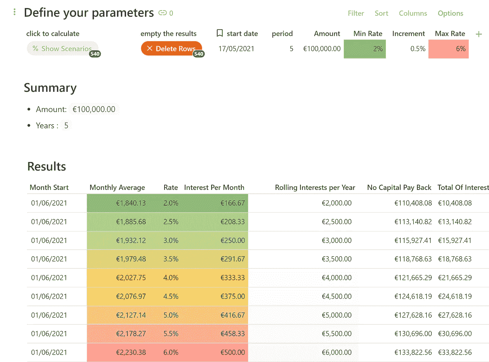

我创造的效果很好。它输出了几个月甚至几年的长期数据。它是聪明的，它是完整的**但是它是不可理解的。**

我演示计算时注意到的最后一部分。嘴唇给出了赞美，但眼睛告诉我，出了问题。因此，我开始重写我的解决方案。

类似电子表格的方法感觉如何，可以通过查看下面的模板来了解。我还解释了将纵向逻辑和横向逻辑混合在一起是如何使事情复杂化的。

[](https://coda.io/@huizer/coda-expert-and-interest-rates) [## CoEx -利率

### 用一些简单的技巧填写表格

coda.io](https://coda.io/@huizer/coda-expert-and-interest-rates) 

# 尾波计算

Coda 中利息的计算本身并不难。功能`Power()`连同`Sequence()`、`WithName()`、`FormulaMap()`和其他[要素](https://huizer.medium.com/in-coda-everything-is-a-list-f13ecf8950d)是主要的构建模块。因为在 Coda 中添加一行比添加一列更容易，所以我们采用水平而不是垂直(电子表格)的方法。

## 社区中的榜样

我在 2021 年 7 月 14 日回复了这个[问题](https://community.coda.io/t/referencing-the-cell-above/7358/31?u=christiaan_huizer):

> 我试图计算前一年的利息变化，因此当前行的总利息—前一行的总利息。公式应该是什么？

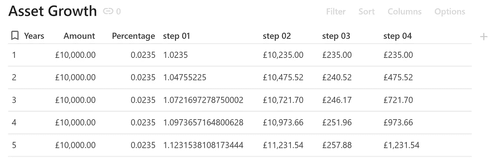

结果呢

正如您在[社区](https://community.coda.io/t/referencing-the-cell-above/7358/32?u=christiaan_huizer)中看到的，我添加了几个步骤来简化这种方法，首先将百分比加 1，得到 1.0235，而不是 0.0235。没有“1 ”,您的结果会下降。基于这个结果，我在步骤 02 中显示了每年的到期金额

```
**step 01**
sum(1,thisRow.Percentage).Power(thisRow.Years)**step 02**
thisRow.Amount * Sum(1,thisRow.Percentage).Power(thisRow.Years)**step 03**
thisRow.Amount * Sum(1,thisRow.Percentage).Power(thisRow.Years) **-** thisRow.Amount * Sum(1,thisRow.Percentage).Power(thisRow.Years **-1**)**step 04**
thisTable.[step 03].Slice(1,thisRow.Years).Sum()
```

一旦我们有了每年的金额，我们就可以在步骤 03 中简单地用今年和上一年(-1)减去它们。为了在步骤 04 中得到总数，我们在步骤 03 中通过添加`thisTable`对列表中的所有值应用基于年份的`Slice()`。

您还可以合并这些步骤，使用一个公式，应用一个与虚拟索引相结合的`FormulaMap()`逻辑，该虚拟索引类似于年份(1–5)，显示为`CurrentValue`。

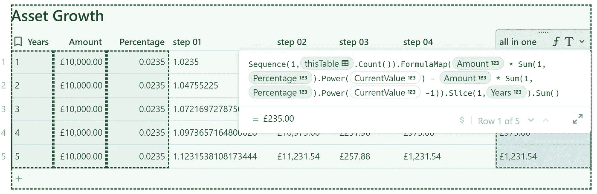

所有都在一个公式中

```
Sequence(1,thisTable.Count()).FormulaMap(thisRow.Amount * Sum(1,thisRow.Percentage).Power(*CurrentValue*) - thisRow.Amount * Sum(1,thisRow.Percentage).Power(*CurrentValue* **-1**).Slice (1,thisRow.Years).Sum()
```

这一切都需要很好地理解如何 Coda，正如本博客中所解释的[；列表逻辑起着至关重要的作用。然而，这并不是全部。有时候，一切都很简单，见下文。我们只需要一个推论。顺便说一句，我没有直接看到这个简单的解决方案，只有在我写这篇博文的时候。你注意到了吗，我试图用垂直的方式解决一个水平的难题，却被一个视错觉困住了(应用了前一行逻辑？).恐怕这不会是最后一次发生在我身上。](/geekculture/how-to-coda-3913cf5daf9d)

```
thisRow.Amount * Sum(1,thisRow.Percentage).Power(thisRow.Years) **-** thisRow.Amount
```

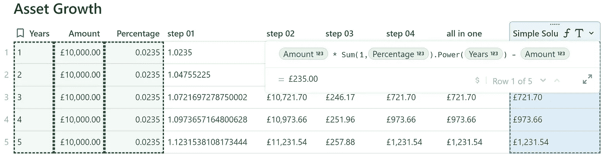

兴趣积云的一种简单解法

这使我想到了我要重复的观点——我们应该努力使我们的解决方案尽可能简单。在我们的上下文中，这意味着我们要问如何对利息计算进行编码。我们可以采用哪些构建模块来以可理解的方式创造价值？

在[这个模板](https://coda.io/@huizer/coda-expert-and-interest-rates)中，我使用了表外的控制器和按钮来模拟电子表格方法。按钮很适合一键添加行，而控制器有助于快速更改值。缺点是，你很容易将智能文档转换成类似电子表格的大表格，并且你必须手动查找你需要的特定信息。通常为`First()`、`Last()`和`Average()`值。

我展示的另一种方法允许用户在每行添加细节，作为回报，结果显示在同一行上。

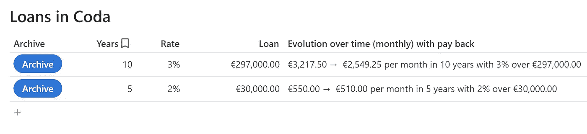

*随时间演变*列提供了摘要。它包含了大多数人在进行利益驱动计算时寻找的信息。

计算不是 Coda 的问题。尽管它的财务函数不像大多数电子表格那样复杂，但标准的 P&L 函数很容易生成。利息计算相当简单，不需要“数学好”。

Coda 的强大之处在于，您可以将计算与上下文(文本、图像、图表)相结合，并且可以汇总数据而不隐藏信息。

隐藏列和行是保持电子表格可读性的常用技巧。在 Coda 中，公式包含所有的值，您只需要特定的*‘当前值’*。

由于我对不同类型的贷款有模糊的记忆，我决定查看一些网站，了解如何计算贷款利息。看起来你基本上有三种变化:

1.  仅利益
2.  固定金额
3.  可变金额

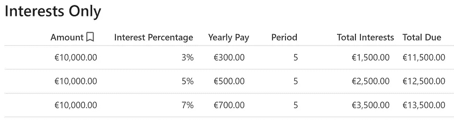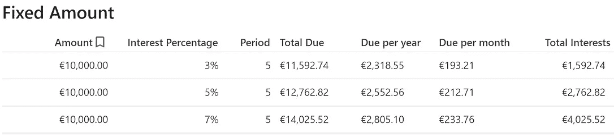

前两个需要一点高中数学知识。在这种情况下，建立表格可能比计算更困难。

下面的屏幕截图显示了一个计算的结果，需要一些注意力来理解它。在我比较了不同的结果后，我的第一个观察是，这个是最便宜的，即使是在第一年。因为我不相信这个结果，所以我检查了这个公式，这是我把这个部分添加到这个博客的一个触发点。

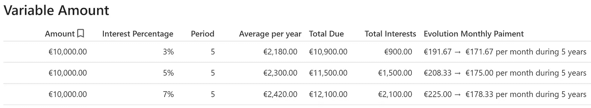

当计算每年的利息时，我们假设每年的部分随着时间的推移保持相等，并且利息不变。

在这种情况下，它是 10.000 除以 5，因此每年 2000，我们将其命名为 *YearlyPart* 。在第一年，百分比是根据全额 10.000 计算的，第二年超过 8000，第三年超过 6000，依此类推。下面你可以看到当应用 3%的利率时这是如何进行的。我们通过让`FormulaMap()`工作来生成一个值列表。

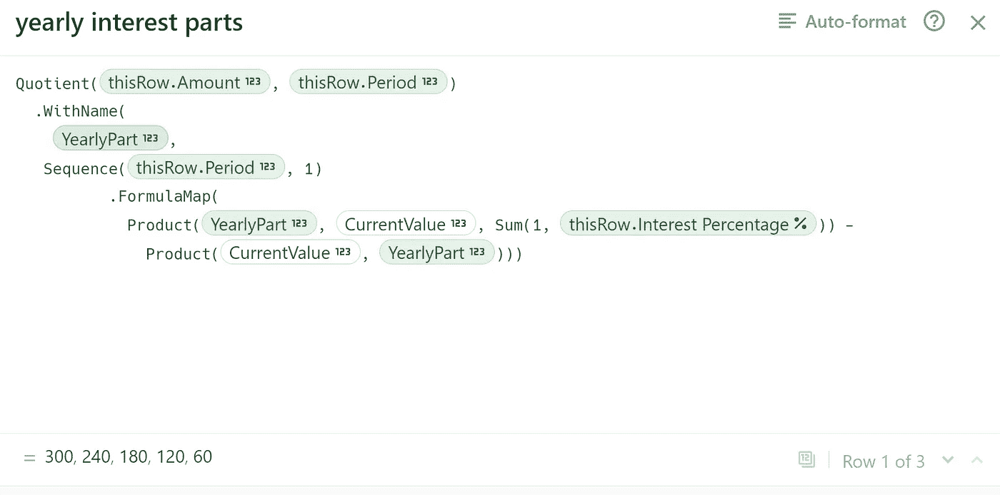

当仔细观察时，我们注意到, *YearlyPart* 返回几次，并且序列从年份开始，一直到 1。我们通常使用 1，2，3，4，5 的虚拟索引，但这里我们使用 5，4，3，2，1。我们需要这个相反的顺序来计算年度部分，并得到 10.0000-8000-6000 等范围。在上面的截图中，你可以看到下面的结果。一旦你看到这个，你也会看到每年你可以加上 *YearlyPart* 得到每年的到期金额。

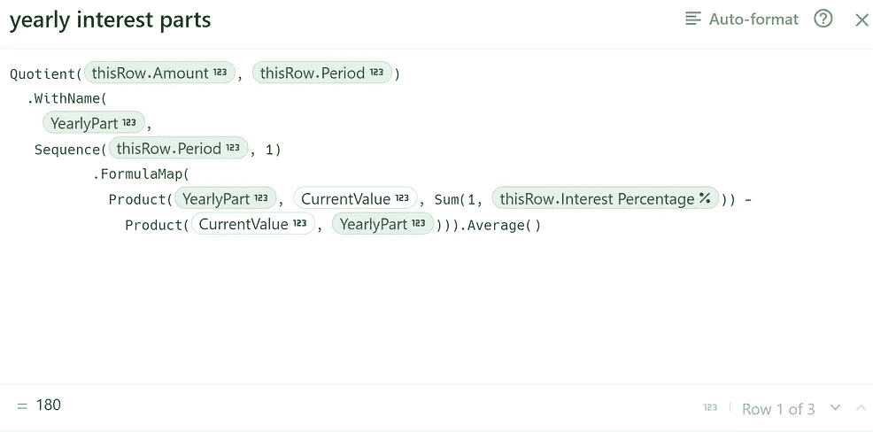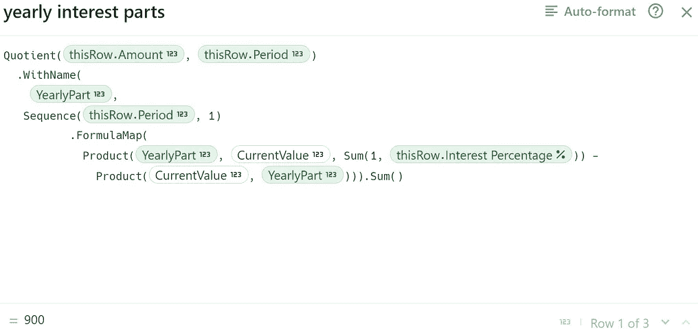

一段时间内的平均和总利息

这个数字范围的`Average()`是一段时间内你每年支付的平均利息。最后加上`Sum()` 就有了利息总额。两者都是以前开发的代码部分的简单变体。

show solution 包含了您需要的所有元素，可以让您在电子表格中以不同的方式进行计算，我认为它不够优雅。

这让我想到了这篇博客的结尾部分，这个专栏展示了从每月最高还款额到最低还款额和最新还款额的演变。

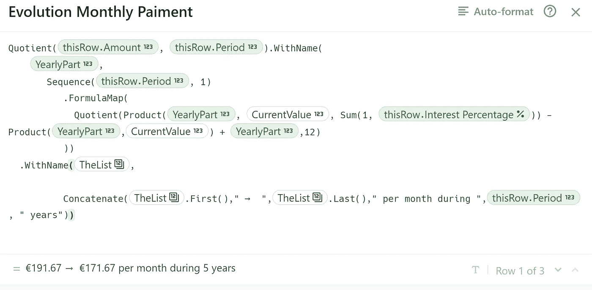

为人类创造洞察力的代码部分

这段代码以一个基于'*List* 的连接结束，list 是一个名为的[，它输出每月到期金额的列表。我们取第一个和最后一个，我们有一个可理解的描述来帮助我们决定。](https://huizer.medium.com/how-to-use-withname-in-coda-cb4876d45552)

我希望你喜欢这篇文章。如果您有任何问题，请随时联系我们。虽然这篇文章是免费的，但我的工作(包括建议)不会是免费的，但总有聊天的空间，看看可以做些什么。此外，你可以在 [Coda 社区](https://community.coda.io/)和 [Twitter](https://twitter.com/CodaExpert) 上找到我的(免费)贡献

我叫 Christiaan Huizer，是 [Huizer Automation](https://huizer.be/) 的所有者。一家专门为 SME 收集数据并保持数据一致的公司。我主要依靠 [Coda](https://coda.io/?r=O8dJLrFiTDS_2ttrz-1brA) ，Mailjet，Zapier&paper form[来完成工作。](https://paperform.co/invite/bmv2e3)


Huizer 在 Coda.io 中自动计算利息