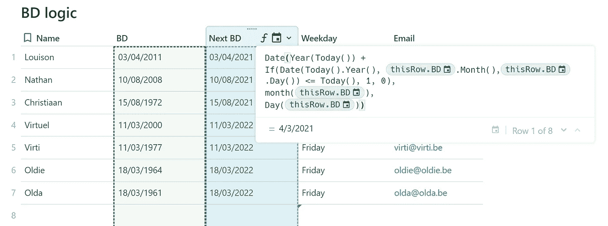
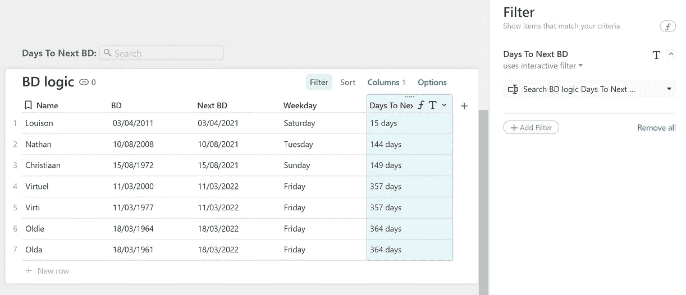
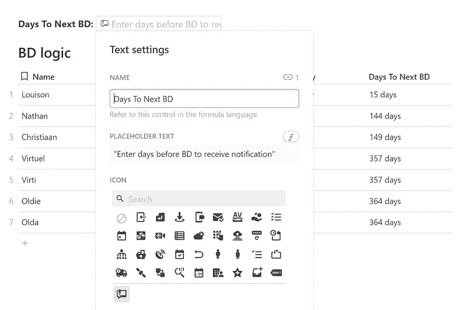
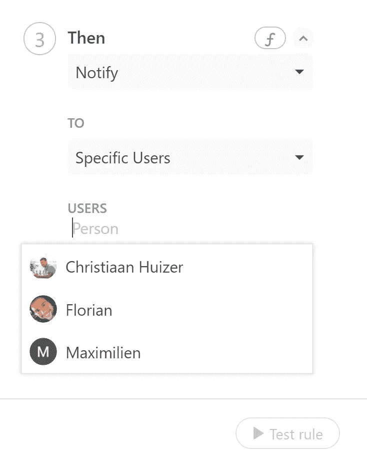
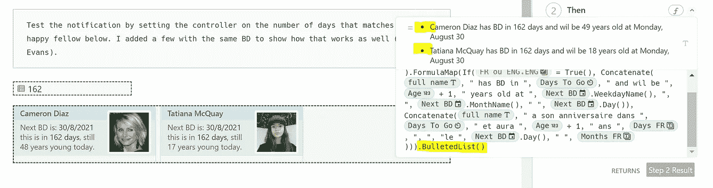
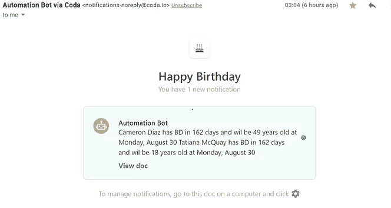
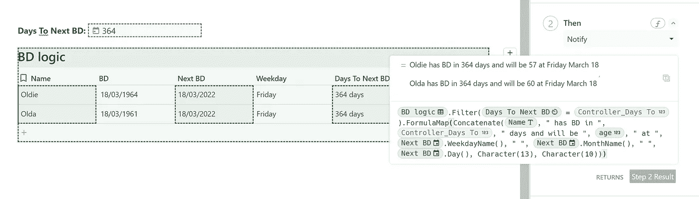
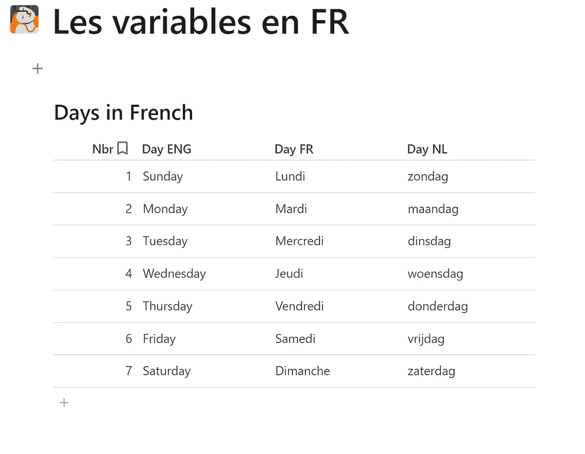
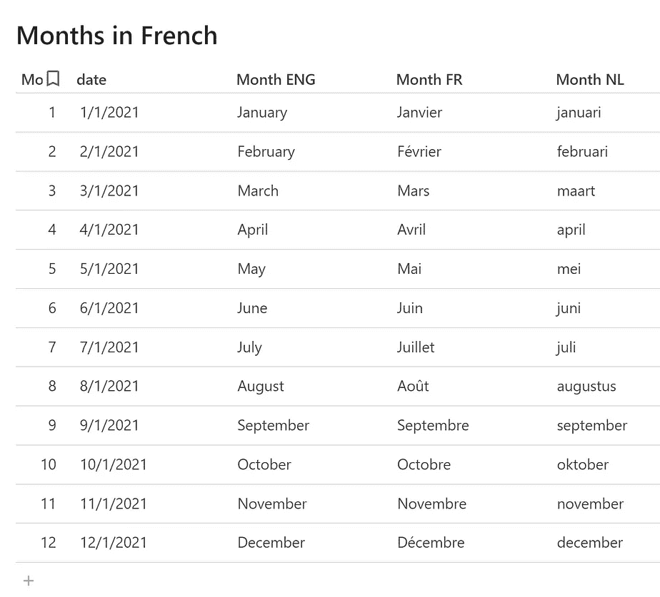

# Coda.io &生日快乐

> 原文：<https://medium.com/nerd-for-tech/coda-io-happy-birthday-c023dd82f25?source=collection_archive---------6----------------------->


Coda.io 中的生日快乐通知

对许多人来说，拥有一个能及时通知你某人在接下来的日子里过生日的机制是件好事。至少有人可以及时订购巧克力和鲜花！

这篇博客展示了如何在 BD 前几天使用 Coda 中的自动功能来通知你。这个博客不是关于 GDPR 和隐私规则的问题，比如你是否有与同事分享 BD 日期的自由。在关于 BD 的 [Coda 博客](https://coda.io/@joe/the-birthday-bot)中，GDPR 相似规则似乎并不适用。我们需要的只是生日和一些相关信息，比如名字。

在 Coda 中，大多数数据存储在表格中。我们为这个例子创建了一个特定的 BD 表。最有可能的是，查找其他人力资源表将为您提供现实世界中所需的基本信息。

> [在我的图库中，你可以找到一个 Coda 文档，你可以免费复制并使用它。](https://coda.io/@huizer/happy-birthday)

## 下一个生日

生日相关问题经常出现在 [Coda 社区](https://community.coda.io/t/formula-help-chronological-age-by-month/14179/7?u=christiaan_huizer)。我用下面的公式提供了某人的年龄:

```
Today().Year() - thisRow.birthday.Year() - If(Date(Today().Year(), thisRow.birthday.Month(), thisRow.birthday.Day()) > Today(), 1, 0)
```

下一个 BD 是上一个的变体。在与 Joostmineur 分享我遇到的一些问题时，他在许多方面帮助了我。首先，他为下一个 BD 编写了上述内容的变体，其次，他向我展示了他正确处理通知逻辑的方法。尽管我创造了我自己的变体并稍微改变了这个概念，但本文中的大部分功劳归于 [Joostmineur](https://medium.com/u/8332ecfdb393?source=post_page-----c023dd82f25--------------------------------)

首先，我们需要为我们提供下一个 BD 的公式。日和月总是保持不变。今年是变化的一年，所以我们关注关系`Today()`和`Year()`。我们需要一个 If 语句来请求额外的一年，以防 BD 是今天或今天之前的今年。如果不是这样，我们就拿今年来说。一旦你看到模式，所有这些都不会太难。

```
Date(Year(**Today()) +**
If(Date(Today().Year(), thisRow.BD.Month(),thisRow.BD.Day()) **<= Today(), 1, 0),**
Month(thisRow.BD),
Day(thisRow.BD))
```



请注意，在欧盟的生日格式中，我们有 03/04，我们指的是 4 月 3 日。当我们建立公式时，它给出了 4/3，在我们写公式的部分，这是相同的，但对我来说是 3 月 4 日。这种标准美国符号可能会令人困惑，至少对我来说是这样。正如我们将在后面看到的，我们无法在想要发出的通知中直接获得欧盟符号，我们需要一个变通办法。这个问题不是一个 bug，而是 Coda 团队的一个改进点，他们很清楚这一点。目前我们不得不面对现实。

一旦我们有了下一个 BD，是时候决定我们想要提前多少天得到通知了。这需要**两个**小的额外步骤。我们**首先**通过`thisRow.[Next BD]-Today()`和**第二**定义天数，我们在表格上方创建一个**控制器**，在那里我们提前填写我们希望看到通知的天数。如果你去度假几个星期，你可能想把它放在 15 天，而不是进入公式，而通常是 7 天左右。这个控制器中的数字(它是画布上的一个过滤器)将成为触发器。我们通过控制器的名称链接到这个控制器。您可以在画布上命名所有函数，并在整个文档中引用该名称。我们将这个控制器重命名为: **Controler_Days To Next BD** 。您还可以定义要在搜索栏中显示的文本，并添加图标。



向 BD 表中添加控件

# 自动化

我们激活一个基于时间的自动化规则，每天检查当天是否符合标准。为此，我们在菜单中选择日期。该功能每天都在运行。我们把时间定在早上 8 点，这里任何时间都可以。

我们不需要任何附加条件，因为检查通知内容的公式也会检查条件。



下一步是在文档中选择应该接收通知的用户。

一个，几个，还是全部，由你决定。

像“某人 7 天后过生日”这样的短信是不够好的。

我们想提到这个人，也许还有其他一些事情。让我们来看看如何完成这项工作

你可以在公式上方的文字中看到已经提到的结果。在这个例子中，两个人有相同的 BD。为了有一个易于阅读的通知，我们添加了`Character(13)`和`Charachter(10)`这种组合产生了一个所谓的 CRLF，它代表*回车换行*，因此行与行之间有一些空白。这是我申请以来首先忽略的一个重要部分。 **BulletedList()** 。这应该会生成一个——如您所料——带项目符号的列表，并自动在行间添加空格，这使得公式更短，从而更容易阅读和适应。

下面是我的想法。然而，当通知在凌晨 3 点左右运行时，我注意到它变成了一行。因此，看似有效的方法并没有奏效。正是因为这种意想不到的行为，我应用了`Character(13)`和`Charachter(10).`



```
[BD Table].Filter([Days To Go] = Controller_Days_To_BD).FormulaMap(Concatenate([full name], " has BD in ", [Days To Go], " and wil be ", Age, " years old at ", [Next BD].WeekdayName(), ", ", [Next BD].MonthName(), " ", [Next BD].Day())).**BulletedList() // fails - > instead use** Character(13), Character(10)
```



触发通知的公式

公式下面。这一个你可以复制粘贴在你的文件开始。最重要的是，您会注意到连接到控制器的过滤器。我了解到，当你引用与我们过滤的日期相对应的名称时，`CurrentValue`是由 Coda 假定的。一旦你看到了过滤逻辑和公式映射的结合，剩下的就是次要的了。旁注:在你的`Concetenate()`开头加上`Character(13), Character(10)`。

```
[BD logic].Filter([Days To Next BD] = **[Controller_Days To Next BD]**).FormulaMap(Concatenate(Character(13), Character(10), Name, " has BD in ", [Controller_Days To Next BD], " days and will be ", age, " at ", [Next BD].WeekdayName(), " ", [Next BD].MonthName(), " ", [Next BD].Day(), ))
```

## 通知中的日期

在上面的例子中，你可能注意到我没有使用下一个 BD 的日期值。因为如果我引用该表，格式化后的输出将是美国日期格式。这是令人困惑的，因为 03/04 和 04/03 对我来说是不一样的。通常我使用`FormatDateTime()` 来获取符合欧盟标准的日期。我在通知里试过这个，但是失败了。Joostmineur 非常友好地指出 [Coda 还不支持这个](https://community.coda.io/t/formatdatetime-does-not-work-in-automations/22243?u=christiaan_huizer)。向通知添加图像是不可能的，只接受纯文本。

当我使用日期和日期名称时，另一种选择是类似上面的。我为说法语的客户做的是创建一个表，将工作日和月份的名称与法语版本关联起来，并在这样的消息中使用这些法语名称，因为大多数说法语的人在阅读英语时很容易混淆。



用客户的语言交流的表格

我在之前提到的 Coda 文档也有法语版本，如果你想知道如何使用一个按钮来允许用户选择语言，你可以看看那个。

> 更高级的选择是将语言选择与通知的用户相关联。

长话短说。通知是与团队沟通的一种有效方式。它也减轻了“总是要求”的人的压力，你可以让机器人做你的中立信使。

## BD 逻辑和会议

这种 BD 逻辑也可以用于会议。一旦你在日历中有了会议时刻，也就是日期，你就可以让机器人提前几天通知每个参与者。不要再为忘记找借口。只是一条信息，要求做一些与会议相关的准备。更进一步的是，机器人还检查议程和行动要点，并将它们作为要点集成到通知中。您甚至可以使用公式来告诉哪个用户要通知。我们可以检查用户是否链接到议程，从而成为一个积极的参与者，而不是手动放置它们。也许你有你自己想要解决的情况！

与日期相关的自动化提供了广泛的机会。无论你计划做什么，总是要检查你得到的日期的格式。其他任何事情都只是循环的问题(公式映射)。正如你在上面看到的，一旦你看到[在 Coda 中一切都是一个列表，这并不太难。](https://huizer.medium.com/in-coda-everything-is-a-list-f13ecf8950d)

我希望你喜欢这篇文章。如果您有任何问题，请随时联系我们。虽然这篇文章是免费的，我的工作(包括建议)不会，但总有聊天的空间。

我叫克里斯蒂安·惠泽，是[惠泽自动化](https://huizer.be/)的所有者。一家专门为 SME 收集数据并保持一致的公司。我主要依靠 [Coda](https://coda.io/?r=O8dJLrFiTDS_2ttrz-1brA) ，Mailjet，Zapier&paper form 来完成工作。我住在根特，为比荷卢市场服务。


Huizer Automation 讲解如何在 Coda.io 中自动化生日提醒