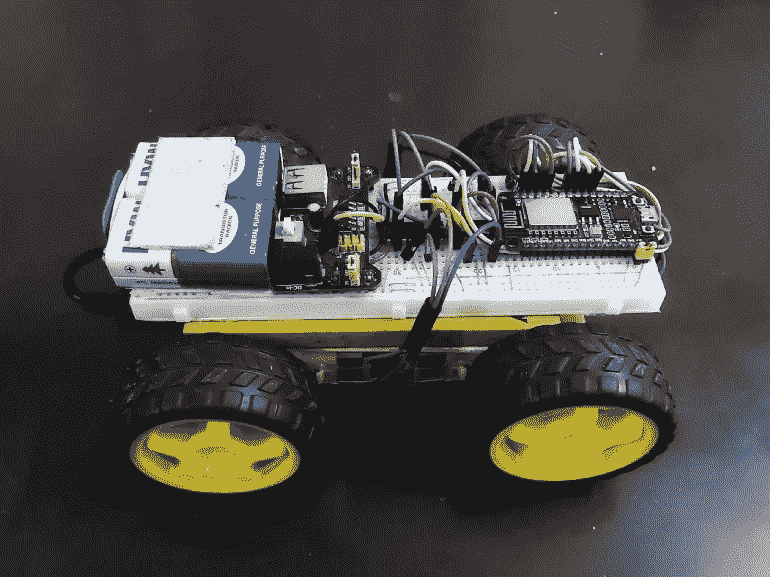
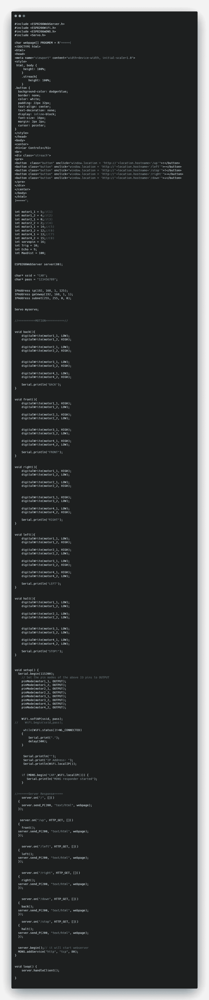
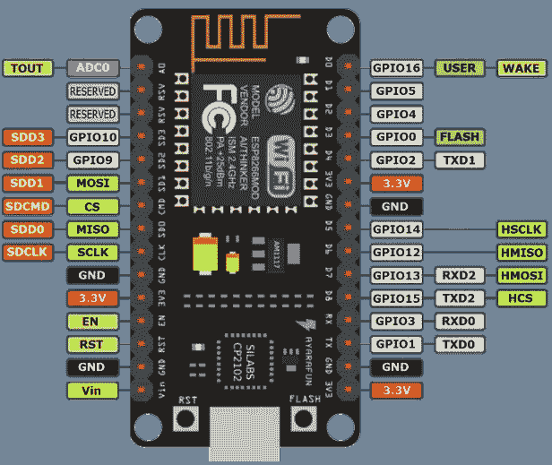
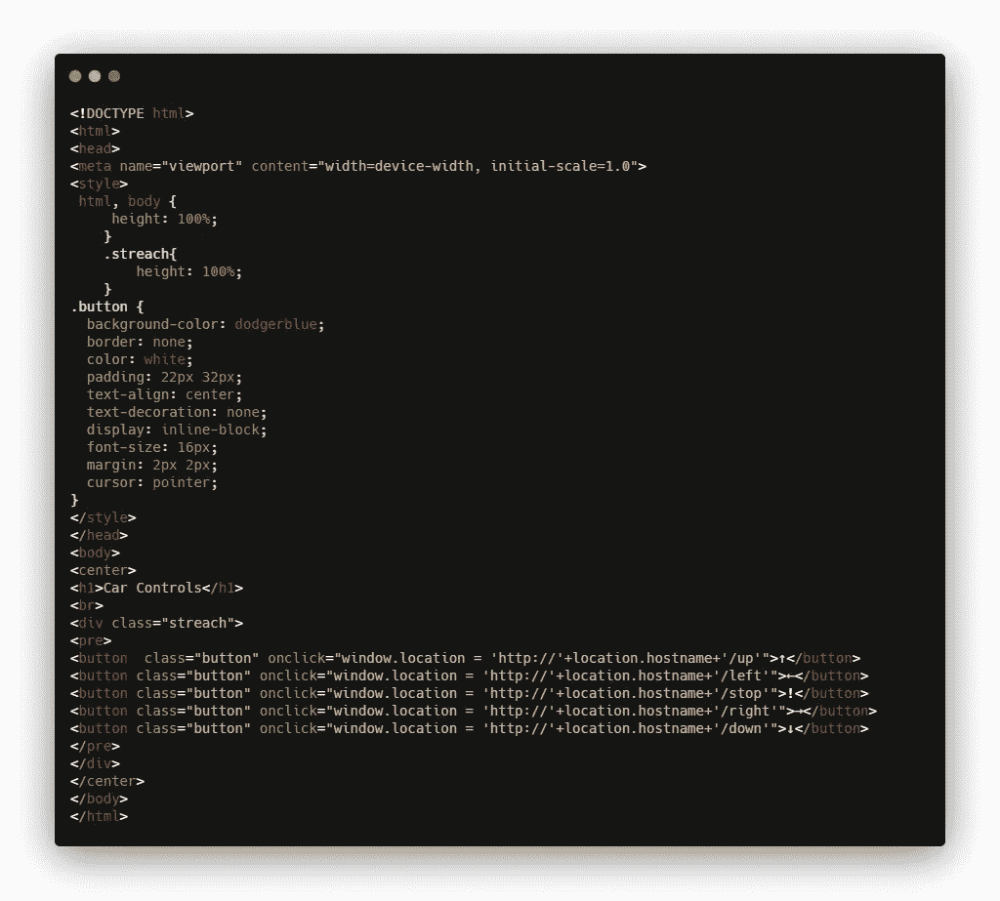

# 代码解释(新手到专业人士):电话控制的机器人汽车。

> 原文：<https://medium.com/nerd-for-tech/code-explanation-for-noobs-to-pros-phone-controlled-robot-car-4a3d3588f544?source=collection_archive---------1----------------------->



# 嘿，我带着另一篇文章回来了…

这一次我想尝试一些新的东西，我想让人们在阅读时从基础开始学习。这篇文章不会让你成为*物联网*的专家，但它会确保如果你正试图了解*物联网*或想自己做这个项目，那么你不必为了让几行代码正常工作而浏览大量文章。

> 虽然我不能保证什么，但也许你在读完这篇文章后会想了解更多，然后你最终会浏览大量的文章，所以…😅

***不过，我希望你觉得这很容易理解……***

# 所以，让我们开始吧:

***在我们开始学习代码本身之前，我想请你熟悉一下如何使用 Arduino IDE 在微控制器上上传代码。我在之前的文章里已经解释过了，你可以看看这里的***[](/@singhgunpreet0802/i-made-a-phone-controlled-robot-car-without-the-need-to-install-the-application-7405c103c731)****。****

*所以做好准备，巨大的(实际上不是这样)代码在这里:*

**

# *Woah Woah Woah…*

****别急*** ，没有看起来那么难。上面的代码有两部分，一部分是用户应用程序(*网页*)，另一部分是实际的 Arduino 代码本身。*

****让我们把事情分成小片段:****

```
***#include <ESP8266WebServer.h>  //Library for WebServer
#include <ESP8266WiFi.h>  //Library for WiFi Connection of the Board
#include <ESP8266mDNS.h>  // Library for mDNS (Explained Later)
#include <Servo.h>  // Library for Servo Motor (for Another Project)*** 
```

*S 从一开始，熟悉 **C 编程**的人就已经知道这些了。这些是库文件，需要包含在一开始。*

> ****注意:*** *这里有几个东西不是这个项目所需要的，但却是这个项目的升级(也即将推出)，比如这个伺服库。**

**这些包括:**

*   **esp8266 web server . h***:**这个库是在板上启动 web 服务器所必需的，它将帮助我们在没有任何预先存在的 WiFi 连接的情况下连接到它。换句话说，它将帮助我们创建一个接入点(WiFi 热点)。*
*   **esp8266 WiFi . h***:**这个库需要连接到预先存在的 WiFi 接入点(通常是路由器或移动热点)。*
*   **ESP8266mDNS.h* **:** 这是一个相当有趣的库，记得在视频中我通过在浏览器中输入地址连接到汽车机器人。我输入的是“car.local”而不是任何 IP 地址。正是因为有了这个库，才在 NodeMCU 上启用了一个[组播 DNS (mDNS)](https://en.wikipedia.org/wiki/Multicast_DNS#:~:text=In%20computer%20networking%2C%20the%20multicast,include%20a%20local%20name%20server.) 。要连接到它，需要一个侦听器或 DNS 服务发现(DNS-SD)。*

> **对于那些不熟悉此类项目的人来说，当我们制作一个本地网页或 web 项目，并将其托管在任何一台本地服务器(如笔记本电脑，或本例中的 MCU)上时，我们通常需要键入 IP 地址，而不是像“www.linkedin.com”或“www.medium.com”这样的域名。这些都是域名，为此需要有一个* [*【域名系统】*](https://en.wikipedia.org/wiki/Domain_Name_System) *将域名解析回 IP，这样我们就不必记住我们访问的每个网页的 8-12 位数。(点击链接了解更多)。**

***不幸的是，** Android 手机不支持这个，windows 也不支持(至少不是原生的)，但是 iOS 和 macOS 支持原生的。*

**它的意思是*我们无法通过在 android 手机或 Windows 上输入“car.local”来连接它，但我们可以使用 iPhone 或 Mac 轻松地做到这一点(因此，视频中的 iPhone)。虽然在 Windows 上有一个解决方法，但是它需要安装 iTunes(或者至少是它的 Bonjour 服务)。完成后，它也可以使用“car.local”在 Windows 上工作。*

> *但是对于我们的 Android 朋友，我们必须回到老学校，手动输入 IP 地址(使用 Arduino IDE 的串行监视器或使用 WiFi 路由器的管理面板，如果你熟悉它，可以很容易地找到它。*
> 
> ***附言**如果您在接入点(热点)模式下使用汽车，后者将不起作用。*

# *进一步发展:*

```
***char webpage[] PROGMEM = R"=====(

//Your HTML Code Goes here 

)=====";***
```

*这是在微控制器中声明字符数组的另一种方式。这种方式确保我们在 MCU 的闪存而不是 ram 中编程，这样我们可以减少 RAM 的消耗，因为 Char 数组只会在需要时被调用。为此，我们使用 ***PROGMEM*** 确保它存储在**内部闪存**中，而不是 **RAM** 中。我稍后会解释 HTML 代码。*

> **对于那些搞不清楚* ***闪存*** *和* ***RAM*** *的人来说，就把它当成平常电脑/笔记本电脑中的* ***硬盘*** *和****RAM****。**

```
***int motor1_1 = 5;//(D1)
int motor1_2 = 4;//(D2)

int motor2_1 = 0;//(D3)
int motor2_2 = 2;//(D4)

int motor3_1 = 14;//(D5)
int motor3_2 = 12;//(D6)

int motor4_1 = 13;//(D7)
int motor4_2 = 15;//(D8)

int servopin = 16;
int Trig = 10;
int Echo = 9;
int MaxDist = 100;***
```

*以上是定义和绑定管脚的声明，实际硬件，即传感器或执行器(在这种情况下是电机)连接在这些管脚上。*

**

> *这里需要注意的重要一点是，板上显示的管脚并不是实际的 [GPIO](https://en.wikipedia.org/wiki/General-purpose_input/output) 管脚号，实际的 GPIO 管脚号请参考下图。*

*在这里，我们创建整数类型的变量(仅用于存储整数值)，并将它们分配给电机连接的管脚号。我们已经将电机的两个引脚连接到两个不同的引脚，以实现**双运动控制**(即后面解释的正向和反向)。*

# *同样，您可以在这里看到一些用于未来升级的其他引脚分配，因此我将在另一篇文章中对此进行解释。*

```
***ESP8266WebServer server(80);

char* ssid = "CAR";
char* pass = "123456789";

IPAddress ip(192, 168, 1, 125);
IPAddress gateway(192, 168, 1, 1);
IPAddress subnet(255, 255, 0, 0);

Servo myservo;***
```

*在上面的代码片段中，我们创建了一个名为 *ESP8266WebServer* 类的服务器的对象，它监听端口号 80。如果我得到细节，它将需要另外几篇文章。*

*接下来的两行定义了连接到接入点的 SSID(热点名称)和 pass(密码)。如果您想使用现有的 wifi 网络，请确保您的 SSID 是您的 WiFi 名称，pass 是您的 WiFi 密码。接下来的三行对 Android 用户很有帮助，因为它们让我们为连接设置固定/静态 IP 地址。*另外，如果您正在连接到预先存在的 WiFi 网络，这可能会起作用，也可能不起作用，因为 IP 可能已被另一个设备占用。因此，您必须使用串行监视器或路由器的管理面板来检查它。**

****现在函数都设置好了，只是调用方式不正确的问题，按照用户调用。****

> *再次伺服和我的伺服是未来的项目。*

***程序通常由四部分组成:***

```
***void back(){
    digitalWrite(motor1_1, LOW);
    digitalWrite(motor1_2, HIGH);

    digitalWrite(motor2_1, LOW);
    digitalWrite(motor2_2, HIGH);

    digitalWrite(motor3_1, LOW);
    digitalWrite(motor3_2, HIGH);

    digitalWrite(motor4_1, LOW);
    digitalWrite(motor4_2, HIGH);

    Serial.println("BACK");
}

void front(){
    digitalWrite(motor1_1, HIGH);
    digitalWrite(motor1_2, LOW);

    digitalWrite(motor2_1, HIGH);
    digitalWrite(motor2_2, LOW);

    digitalWrite(motor3_1, HIGH);
    digitalWrite(motor3_2, LOW);

    digitalWrite(motor4_1, HIGH);
    digitalWrite(motor4_2, LOW);

    Serial.println("FRONT");
}

void right(){
    digitalWrite(motor1_1, HIGH);
    digitalWrite(motor1_2, LOW);

    digitalWrite(motor2_1, LOW);
    digitalWrite(motor2_2, HIGH);

    digitalWrite(motor3_1, HIGH);
    digitalWrite(motor3_2, LOW);

    digitalWrite(motor4_1, LOW);
    digitalWrite(motor4_2, HIGH);

    Serial.println("RIGHT");
}

void left(){
    digitalWrite(motor1_1, LOW);
    digitalWrite(motor1_2, HIGH);

    digitalWrite(motor2_1, HIGH);
    digitalWrite(motor2_2, LOW);

    digitalWrite(motor3_1, LOW);
    digitalWrite(motor3_2, HIGH);

    digitalWrite(motor4_1, HIGH);
    digitalWrite(motor4_2, LOW);

    Serial.println("LEFT");
}

void halt(){
    digitalWrite(motor1_1, LOW);
    digitalWrite(motor1_2, LOW);

    digitalWrite(motor2_1, LOW);
    digitalWrite(motor2_2, LOW);

    digitalWrite(motor3_1, LOW);
    digitalWrite(motor3_2, LOW);

    digitalWrite(motor4_1, LOW);
    digitalWrite(motor4_2, LOW);

    Serial.println("STOP!");
}***
```

*在上面的代码块中，有五个函数分别是 **front()、back()、left()、right()和 halt()** 。顾名思义，它们执行这些功能。解释如下。*

*   ***Front()** :在此功能中，通过使电机的第一个引脚为高电平，电机的第二个引脚为低电平，电机被设置为向前移动，这意味着电流将从电机的第一个引脚流出，第二个引脚将接地。这确保了所有四个电机都在同一个方向上运动，即向前运动。*
*   ***Back()** :在此功能中，通过使电机的第二个引脚为高电平，电机的第一个引脚为低电平，电机被设置为反向移动，这意味着电流将从电机的第二个引脚流出，第一个引脚将接地。这确保了所有四个电机都向同一方向移动，即反向移动。*
*   ***Left()** :在此功能中，通过保持第一针低电平和第二针高电平，电机 1 和 3 被设置为反向移动，通过保持第二针低电平和第一针高电平，电机 2 和 4 被设置为正向移动。确保轿厢向左移动。*
*   ***Right()** :类似地，在该功能中，通过保持第一引脚为低电平和第二引脚为高电平，电机 2 和 4 被设置为反向移动，通过保持第二引脚为低电平和第一引脚为高电平，电机 1 和 3 被设置为正向移动。确保轿厢向右移动。*
*   *Halt() :这个函数是最简单但最重要的一个，(我最初忘记写这个函数了…😅).无论如何，这个函数的作用是将每个引脚变为低电平，并停止所有电机。*

# *B 在我们继续深入之前，对于不熟悉 Arduino 编程的人来说，有必要了解一下程序的流程。*

1.  ****包括库* :** 这是我们已经完成的第一步，这确保了如果需要从库中调用任何函数或类，那么它们可以在代码中的任何地方被调用。*
2.  ****声明变量*** **:** 在开头声明变量也保证了当我们在代码内部需要它们的时候，它们可以被调用。*在开始声明的变量称为* ***全局变量*** *，可以在代码的任何地方使用，而在函数内部声明的变量称为* ***局部变量*** *，只能在函数内部使用。**
3.  ****“设置”功能* :** 设置功能是两个主要功能之一。当 MCU 板通电或复位时，它会自动执行。因此，我们需要声明只需要执行一次的东西，但是我们也可以再次访问它们。我们不需要在某个时间间隔后连续执行的东西都在这个函数中。*
4.  ****【循环】功能*** **:** 这是 Arduino 的第二个主要功能范围。该函数会自动连续调用，直到 MCU 停止。这个函数在设置函数之后被调用，因此需要在循环函数中调用的东西应该在设置函数之前或者在设置函数中被声明和实例化。任何预配置都应在设置功能中完成。实际的工作将在循环函数中完成。*

# *以下代码用于设置功能:*

```
***void setup() {
  Serial.begin(115200);
    // Set the pin modes of the above IO pins to OUTPUT
    pinMode(motor1_1, OUTPUT);
    pinMode(motor1_2, OUTPUT);
    pinMode(motor2_1, OUTPUT);
    pinMode(motor2_2, OUTPUT);
    pinMode(motor3_1, OUTPUT);
    pinMode(motor3_2, OUTPUT);
    pinMode(motor4_1, OUTPUT);
    pinMode(motor4_2, OUTPUT);***
```

*我们已经启动了设置功能，这段代码将只执行一次。*

*第一行以 115200 的波特率启动串行监视器，串行监视器只不过是 Arduino IDE 的内置接口，当它直接连接到系统(PC/Laptop)时显示来自 MCU 的信息。这是我之前说过要检查你的 ip 地址的地方。波特率是通信的速度，通常的(最常用的)有 115200 和 9600。确保在串行监视器中选择正确的波特率。*

*之后，我们将所有电机引脚声明为输出引脚，这里是 **pinMode(pin，io mode)；**函数用于声明我们是否将从指定的引脚获得一个**输入**或者我们必须给相同的引脚一个**输出**。此处 **pin** 参数(括号内的一个)用于定义 pin， **IOmode** 参数用于定义是**输入**还是**输出**(如本例)。*

```
***WiFi.softAP(ssid, pass); //Access Point

//    WiFi.begin(ssid,pass); // uncomment the following code for Wifi mode. 

//   while(WiFi.status()!=WL_CONNECTED)
//  {
//      Serial.print(".");
//      delay(500);
//  }

     Serial.println("");
     Serial.print("IP Address: ");
     Serial.println(WiFi.localIP());***
```

*下一行以之前给出的 ssid 和密码开始访问点(热点)。此外，如果您想使用 WiFi 模式，只需取消以下 6 行的注释，并注释前面的行。确保如果您使用的是 WiFi 模式，ssid 应该是您的 WiFi 名称，pass 应该是您的 WiFi 密码。*

> **你可能会看到“//”前的一些代码，这是注释。任何注释都不会被视为实际代码，MCU 会跳过它。**

*接下来的 3 行打印出 IP 地址，Android 用户可以用它来连接网页。*

*我们在这里做的是当用户点击一个按钮时，一个打开新页面的请求从那个页面发出。现在，该服务器正在处理该请求，并调用与该页面请求相关的函数，然后用户被重定向到同一页面。因此，运动是由点击按钮触发的。*

```
***//======Server Response=====
    server.on("/", []()
  {  
    server.send_P(200, "text/html", webpage);
  });

   server.on("/up", HTTP_GET, []()
  { 
    front();
  server.send_P(200, "text/html", webpage);
  });

    server.on("/left", HTTP_GET, []()
  { 
    left();
  server.send_P(200, "text/html", webpage);
  });

    server.on("/right", HTTP_GET, []()
  { 
    right();
  server.send_P(200, "text/html", webpage);
  });

    server.on("/down", HTTP_GET, []()
  { 
    back();
  server.send_P(200, "text/html", webpage);
  });

    server.on("/stop", HTTP_GET, []()
  { 
    halt();
  server.send_P(200, "text/html", webpage);
  });****server.begin();// it will start webserver

  MDNS.addService("http", "tcp", 80);

}***
```

*上面的代码实际上会捕捉来自网页的输入，并执行指定的动作。现在我们所要做的就是听取用户的正确输入，并从上面定义的函数中调用相应的函数。*

*这里的 **server.on()** 是我们用来监听网页变化的函数。*

**最后两行负责启动服务器和 mDNS 服务。**

## *这是设置功能的结束。*

# *循环功能:*

```
***void loop() {
    server.handleClient();****}***
```

*循环内部函数**server . handle client()；**调用函数，监听网页中的路径变化。换句话说，当点击按钮后，它监视网页发送的新请求，然后将请求传递给前面描述的 **server.on()** 函数。*

# *Arduino 代码已经完成，现在让我们来看看 HTML 代码:*

**

*到老实说，这里只有一个部分需要解释，那就是按钮，其余的只是普通的 Html 和 CSS。如果你愿意，你可以通过添加不同的 CSS 并替换它来制作你自己更好看的控件应用程序。所以我将在这里解释这些按钮。*

```
***<pre>

<button  class="button" onclick="window.location = 'http://'+location.hostname+'/up'">↑</button>****<button class="button" onclick="window.location = 'http://'+location.hostname+'/left'">←</button>   <button class="button" onclick="window.location = 'http://'+location.hostname+'/stop'">!</button>   <button class="button" onclick="window.location = 'http://'+location.hostname+'/right'">→</button>

<pre>***
```

> *这里我使用了 **< pre >** 标签来确保按钮的显示顺序与它们被写入的顺序相同，你可以使用 CSS grid 属性来代替，这是正确的方法。无论如何，这也是可行的。*

```
***<button  class="button" onclick="window.location = 'http://'+location.hostname+'/up'">↑</button>***
```

***我们只拿一个按钮来说明:***

*   *这里它被赋予了一个类来应用 CSS 样式。*
*   *设置 **onclick** 事件监听器，将 **window.location** 更改为当前页面的 **IP** 。*
*   *这是一个简单的 **Javascript** 代码，它将用户导航到服务器上的 **"/up"** 页面。*
*   *然后由 **server.on ()** 函数进行处理。*
*   *在它的内部(如我们之前所见)调用一个函数(在本例中为 **Front ()** )。*
*   *然后用户被重定向到同一个页面。*

*类似地，其他按钮触发相应的功能，汽车开始运动。*

> *这就是“**电话控制的机器人小车**”的完整功能。*

> *如果你还在这里，**感谢你**阅读这篇文章，祝贺你成功地学会了如何自己制作一个类似的项目。我希望你能从我这里得到一些新的东西。*

****如有任何疑问，随时联系我*😊*。****

# *现在继续做类似的项目。用我们自己的方式定制它，把它贴在某个地方，如果你做了一个(或者没有，你的愿望)，别忘了给我贴上标签。*

## ***作者:** [**冈普雷特·辛格**](http://www.linkedin.com/in/singhgunpreet82)*