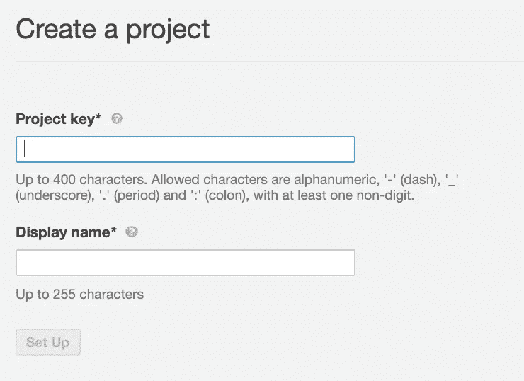
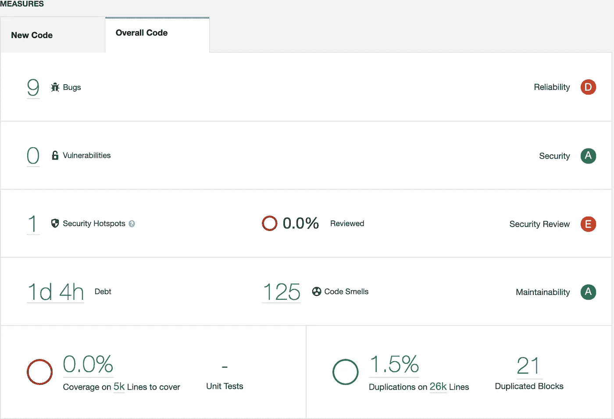

# SonarQube 和 React Native 的代码质量

> 原文：<https://medium.com/nerd-for-tech/code-quality-with-sonarqube-and-react-native-78fdb8d281ad?source=collection_archive---------1----------------------->

了解如何将 SonarQube 集成到 React 本地项目中。

SonarQube 是一个静态分析工具，它为我们提供了五个主要报告:

*   可靠性
*   安全和安全审查
*   可维护性
*   测试覆盖率
*   重复

换句话说，它分析我们的代码，给出任何错误或未来可能出错的报告。最近，我找不到任何关于**sonar cube**和 **React Native** 的好文档，所以我记录了我集成这两个的步骤。

# 先决条件:

*   安装在您机器上的 Docker
*   安装了自制软件

# 说明

1.  brew 安装声纳扫描仪(仅第一次)
2.  下载 Docker 并通过运行命令启动它:**Docker run-d—name sonar cube-p 9000:9000 sonar cube**
3.  打开 [http://localhost:9000/](http://localhost:9000/) 输入凭证:用户名:admin，密码:admin
4.  点击 **+** 创建一个新项目，并输入您的`Project Key`和`Display Name`

5.在项目根中创建`sonar-project.properties`，添加之前创建的`sonar.projectName`和上一步生成的`sonar.projectKey`

6.在终端运行**声纳扫描仪**

打开 [http://localhost:9000/](http://localhost:9000/) 瞧；分析结果在这里。

