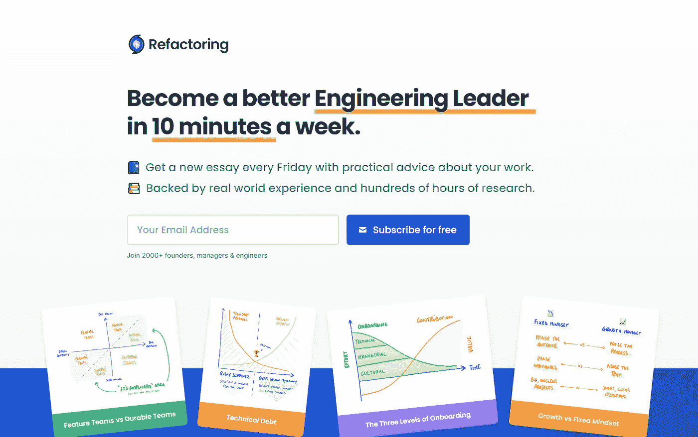

# 代码重构仍然很重要

> 原文：<https://medium.com/nerd-for-tech/code-refactoring-is-still-important-a9acf0fc5a6f?source=collection_archive---------26----------------------->

重构俱乐部的登陆页面

重构代码和架构现在很重要，因为技术生态系统的面貌已经发生了变化，各种规模的成功和创新的初创公司构建的如此多的美丽技术已经实现了如此多的可能性。为了性能优化，成本优化，更为了用户体验的丰富。你有没有一个系统，可以预测你的用户群的行为，并更新你的现金托管在这些良好的内容交付网络之一，如

StackPath、Sucuri、Cloudflare、KeyCDN、Rackspace、Google Cloud CDN、CacheFly 或 Amazon CloudFront。

如果你有两个像我一样的用户，拥有这样的系统当然没有关系，但如果你处理数百万用户，你必须这样做，因为你的用户从更快的体验中受益，你甚至可以通过这样的缓存刷新系统节省成本。

为什么不在你的前端和后端之间建立一个体验层，作为设计、构建和部署不同用户体验的灵活工具，因为一个前端工程师可能非常有资格构建一个漂亮的 UI，但 UX 是完全不同的，是一个不断发展的东西，我们会调整它，直到用户和平台所有者都满意为止。

您的前端工程师非常有资格操作位，甚至可以为自动部署和源代码控制构建技术基础设施，但是他们是否足够关心用户体验，以至于知道您需要像 Plugpush 这样的用户体验层。

一个 UX 工程师应该首先是一个熟练的前端和后端工程师，因为这让她或他在设计用户体验之前了解技术和设计的可能性，因为他或她也可以提出团队体验。

团队体验层是我们从这次疫情会议中获得的新工具，当我们得到证明，我们应该改变我们的工作和沟通方式来完成工作。

是的，代码重构对于一个好的用户体验层和好的团队体验层都很重要。

PS:这篇文章是在我读完下面这条让我想起[这篇文章](https://mkrdiop.medium.com/the-web-code-refactoring-era-89b01e34eed3)的推文后写的