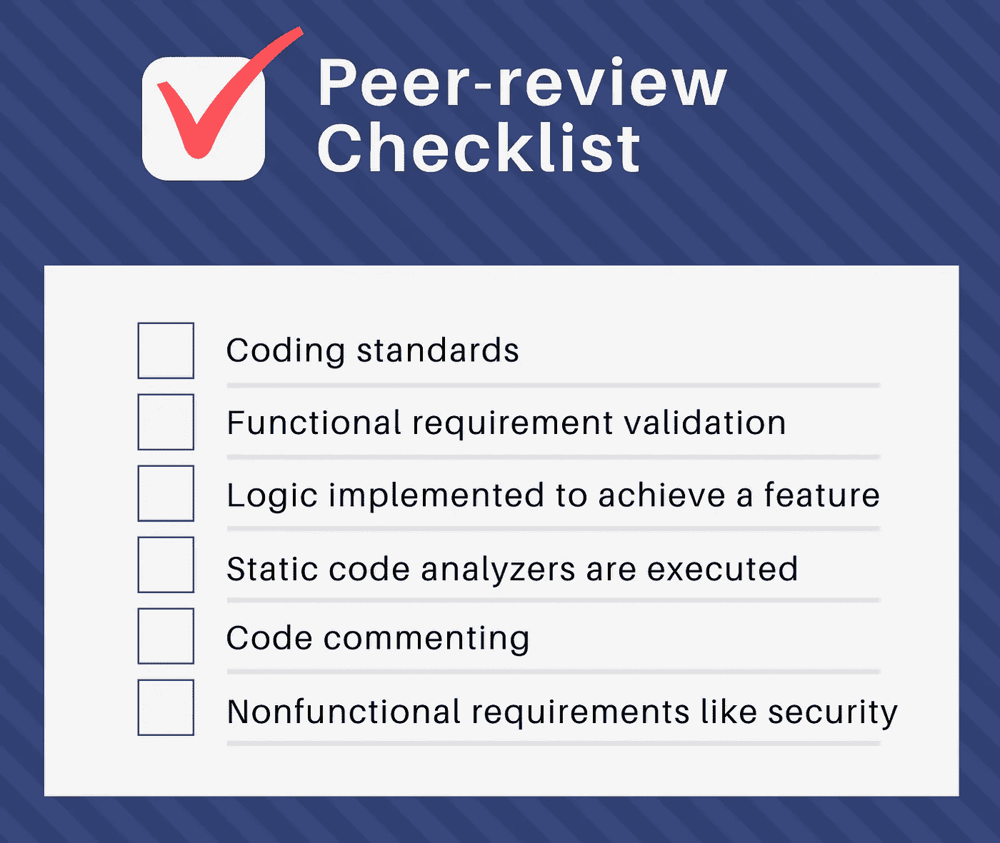

# 代码审查|确保软件质量万无一失

> 原文：<https://medium.com/nerd-for-tech/code-review-foolproof-your-software-quality-606e5937da93?source=collection_archive---------22----------------------->

代码审查可能是乏味的，如果代码是别人的，那么一些沮丧是合理的。然而，代码审查确实节省了大量时间，并且不断地检查错误。

根据项目的规模，你可以选择同行评审或者小组评审。当你对你的代码有信心并且时间紧迫的时候，你可以选择让你的同事检查你的代码。通过这种方式，您可以获得一个无错误的代码，并将其投入生产。另一方面，如果项目规模和团队规模较大，可以选择小组评审。让我们探索这两种选择-

# 什么是同行代码评审？

简单地说，当你让你的一个队友看看你的代码中是否有错误或者需要改进的地方。

# 该过程

通常，当代码完成并准备好接受审查时，开发人员会创建一个请求来进行审查，并在批准后将其提交发布。然后，指定的评审者根据代码的质量批准或拒绝拉请求。如果被批准，这意味着代码可以被合并到发布分支中。只是为了多一层保证

为了确保最高的代码质量并保持对代码变动的检查，像开发领导和工程领导这样的实践领导也被添加为默认的评审者。他们通过电子邮件被告知请求以及正在进行评审的开发人员。这些审查是动态的，在创建拉取请求时进行。

# 审查期间要寻找什么

即使有多双眼睛参与进来，如果不认真对待，同行评审仍然会出很多问题。一揽子批准只会让你进一步退步。不同的团队成员可能有不同的代码质量标准，在这种情况下，清单可以帮助人们协调一致。

**同行评审清单**

这个清单可以帮助评审人员在代码投入生产之前，优先考虑什么是重要的，并找出缺陷。

# 什么是团队代码评审？

这就像同行评审，但是更多的人参与进来，作为一个团队来评审代码。这里的动机是让具有不同专业知识的不同组的人来测试代码的整体可行性。想想开发人员、测试人员、架构师和管理人员每周聚在一起进行代码评审。

# 该过程

由于很多人参与到小组评审中，这就需要一种与同行评审略有不同的方法。

*   开发人员向整个团队展示用户故事。
*   根据用户情景实施审查设计。
*   然后由评审组讨论和评审代码。
*   测试用例与用户故事中实现的业务规则进行比较。
*   代码演练的目的是将逻辑传达给每个人，在这个过程中净化代码
*   SQE 集团展示了基于用户故事的测试案例。
*   数据库依赖关系，如表模式、初始数据脚本、数据升级脚本，然后由数据库团队进行审查。
*   然后，发布工程团队将参与讨论并审查部署脚本的依赖性。
*   然后，性能团队获得输入，并对用户故事的性能进行基准测试。

# 谁在这些评审中寻找什么？

开发人员会以其他故事为基础，从编码的角度进行比较，看是否存在依赖关系。

测试人员将寻找作为测试用例一部分的业务规则，并试图圈出那些没有实现的业务规则。

架构师确保一切都按照最初的蓝图按计划进行。如果所有的设计原则和最佳实践都被用来确保软件质量。

像数据库、发布工程和性能工程这样的团队会在他们的专业领域中寻找依赖。

# 为什么团队代码评审

*   它有助于打破阻碍团队间互动的孤立工作的惯例和心态。
*   用多只眼睛观察你的代码更容易发现错误
*   测试人员帮助识别功能差距，以免为时过晚
*   建筑师将检查捷径
*   共享服务团队将获得在其专业领域执行相应步骤的输入。

代码审查看起来像是过程中的一个边缘变化，但是结果是非常重要的。这些组代码评审最受关注的好处之一是将团队聚集在一起。当他们作为一个整体工作而不是各自为政时，伟大的产品就会出现。对很多人来说，这也是一个学习的机会。来自不同领域和初级资源的人才刚刚起步。

当然，这种双向学习过程将有助于保持您的代码跨系统对称，同时保持它的可维护性、可伸缩性、可读性和最佳质量。

**关于银河网络链接**

我们专注于交付端到端的软件设计和开发服务，并在大、中、初创企业开发需求方面拥有实践经验。我们的工程师还帮助提高安全性、可靠性和功能，以确保您的业务应用程序能够扩展并保持安全。

*原载于 2021 年 3 月 1 日*[*【https://blog.galaxyweblinks.com】*](https://blog.galaxyweblinks.com/code-review-foolproof-your-software-quality/)*。*