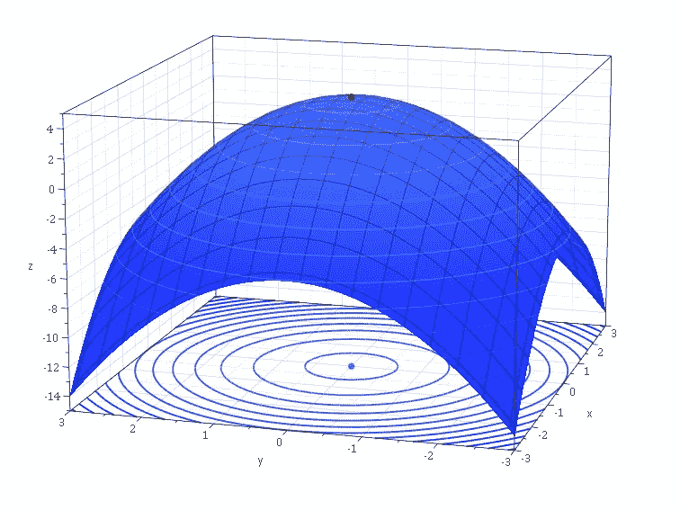
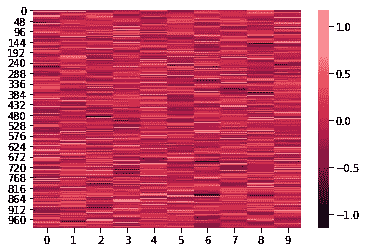

# TFCO 代码示例—张量流约束优化

> 原文：<https://medium.com/nerd-for-tech/code-samples-from-tfco-tensorflow-constrained-optimization-17acdf4913e?source=collection_archive---------0----------------------->



*包括来自 TFCO 的代码样本—张量流约束优化*

[](https://www.analyticsvidhya.com/blog/2020/10/boxing-and-unboxing-of-statistical-models-with-gaussian-learning/) [## 高斯学习统计模型的装箱和解箱

### 这篇文章作为数据科学博客的一部分发表。“价值观在混乱中提供焦点”

www.analyticsvidhya.com](https://www.analyticsvidhya.com/blog/2020/10/boxing-and-unboxing-of-statistical-models-with-gaussian-learning/) 

上面的文章对业务功能建模，相当于对系统的概念结构建模。对业务流程(BPMN)建模总是好的，因为这是对系统建模的标准化方式。业务功能对系统例程的操作类别进行建模。

为了与深度学习库合作，我创建了一篇文章，展示了关于张量流约束优化(TFCO)的内容，它的工作方式类似于上文文章中解释的[装箱和取消装箱](https://www.analyticsvidhya.com/blog/2020/10/boxing-and-unboxing-of-statistical-models-with-gaussian-learning/)技术。

在这个例子中，我提供了一个类，它将责任分配给例子中定义的张量流操作。这里的例子使用了基于铰链损耗召回数据对象的召回约束。召回率是一个相当于 TPR(真实阳性率)的指标。召回数据对象意味着评估对象存在的正确性度量。使用面向对象的编程方式在类中定义约束优化问题。该类的每个约束在一种方法中被定义为一个张量，完全依赖于类似语法的对象约束语言(OCL)。这意味着，每种方法都返回单个约束的单位变量张量。TFCO 过程采用一个输入数据点，类似于 DEA 模型采用的两个数据点结构。数据管理单元(DMU)类似于该模型中 TFCO 接受的权重，但是存在如下所述的特征损失函数。

Google Research 的 tensor flow Constrained Optimization 是一个 Python 库，用于执行基于机器学习的优化。在本文中，我从 Recall constraint 中选取了一个例子，它描述了数据中的特征，并最小化了数据中表示的对象的拒绝。

# 铰链损耗

铰链损失被表示为[0，1-y(x)]，这意味着在熵计算中，它不考虑那些为真预测的标签，而那些被分类为假的对象被认为是假的。执行最小化算法来减少假阳性。

该问题是速率最小化问题，其中定义了约束和铰链损耗。

# 定义目标

```
# we use hinge loss because we need to capture those that are not classified correctly and minimize that loss
def **objective**(self):
    predictions = self._predictions
    if callable(predictions):
        predictions = predictions()
    return **tf.compat.v1.losses.hinge_loss**(labels=self._labels,
        logits=predictions)
```

这里的目标是用标签代表真正的阳性和*假阳性的铰链损失。*

# 定义约束

定义约束，使得召回值至少是问题中提到的下限。在凸优化情况下，约束表示为≥ 0。

```
def **constraints**(self):
        # In eager mode, the predictions must be a nullary function  returning a
        # Tensor. In graph mode, they could be either such a function, or a Tensor
        # itself.
        predictions = self._predictions
        if callable(predictions):
            predictions = predictions()
        # Recall that the labels are binary (0 or 1).
        **true_positives** = self._labels * tf.cast(predictions > 0, dtype=tf.float32)
        **true_positive_count** = tf.reduce_sum(true_positives)
        **recall** = true_positive_count / self._positive_count
        # The constraint is (recall >= self._recall_lower_bound), which we convert
        # to (self._recall_lower_bound - recall <= 0) because
        # ConstrainedMinimizationProblems must always provide their constraints in
        # the form (tensor <= 0).
        #
        # The result of this function should be a tensor, with each element being
        # a quantity that is constrained to be non-positive. We only have one
        # constraint, so we return a one-element tensor.
        return **self._recall_lower_bound - recall**

    def **proxy_constraints**(self):
        # In eager mode, the predictions must be a nullary function returning a
        # Tensor. In graph mode, they could be either such a function, or a Tensor
        # itself.
        predictions = self._predictions
        if callable(predictions):
            predictions = predictions()
        # Use 1 - hinge since we're SUBTRACTING recall in the constraint function,
        # and we want the proxy constraint function to be convex. Recall that the
        # labels are binary (0 or 1).
        true_positives = self._labels * tf.minimum(1.0, predictions)
        true_positive_count = tf.reduce_sum(true_positives)
        recall = true_positive_count / self._positive_count
        # Please see the corresponding comment in the constraints property.
        return self._recall_lower_bound - recall
```

# 召回限制的完整示例问题

```
class *ExampleProblem*(**tfco.ConstrainedMinimizationProblem**):

    def __init__(self, **labels**, **predictions**, **recall_lower_bound**):
        self.**_labels** = labels
        self.**_predictions** = predictions
        self.**_recall_lower_bound** = recall_lower_bound
        # The number of positively-labeled examples.
        self.**_positive_count** = tf.reduce_sum(self._labels)**@property**
    def **num_constraints**(self):
        return 1

    **# we use hinge loss because we need to capture those that are not classified correctly and minimize that loss**
    def **objective**(self):
        pass

    def **constraints**(self):
        pass

    def **proxy_constraints**(self):
        pass**problem** = ExampleProblem(
    labels=constant_labels,
    predictions=predictions,
    recall_lower_bound=recall_lower_bound,
)
```

## 计算召回率的常量输入数据的可视化

**请注意:在这种情况下，问题源于数据*



**根据提供的输入数据分布使用铰链损耗计算召回**

```
Constrained average hinge loss = 1.185147
Constrained recall = 0.845000
```

*在上面的文章中，我们没有不断变化的数据，我们使用现有数据计算输入数据权重，以预测那些产生最低召回率的样本。来自一个约束优化模型的预测被发送到在不同损失下运行的下一个模型。这样我们就可以模拟这两个对象如何相互通信。*

***我会让你们来决定 Azure ML Studio 或 AWS Deep Racer 是否可以用来利用这些想法建立机器学习模型。***

***参考文献***

[](https://github.com/aswinvk28/boxing-unboxing-statistical/blob/master/tensor-contrained-optimization.ipynb) [## aswinvk 28/装箱-拆箱-统计

### 使用高斯学习对统计模型进行装箱和取消装箱-aswinvk 28/装箱-取消装箱-统计

github.com](https://github.com/aswinvk28/boxing-unboxing-statistical/blob/master/tensor-contrained-optimization.ipynb) [](https://github.com/google-research/tensorflow_constrained_optimization) [## 谷歌研究/张量流约束优化

### TFCO 是一个用于在 TensorFlow 1.14 和更高版本(包括 TensorFlow 2)中优化不等式约束问题的库…

github.com](https://github.com/google-research/tensorflow_constrained_optimization)