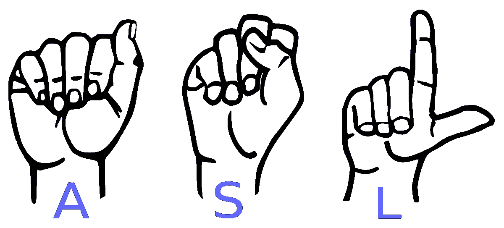
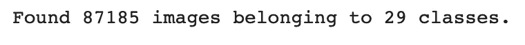
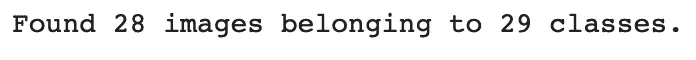
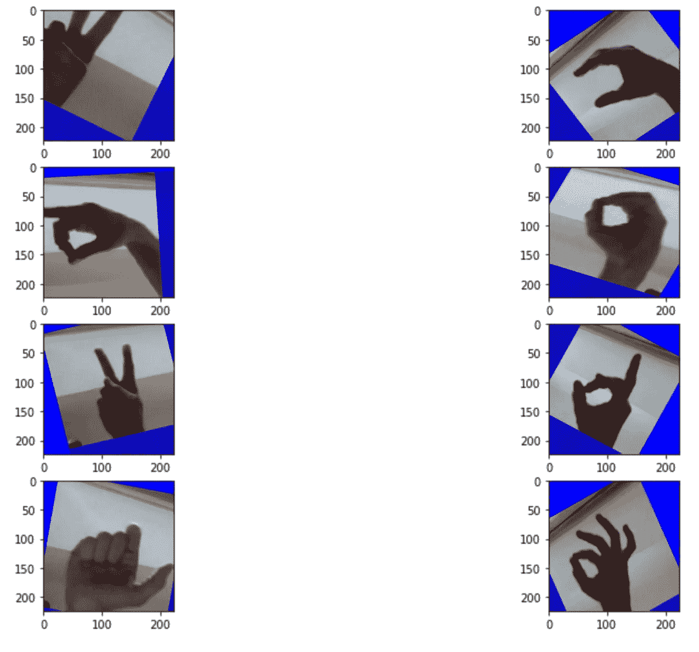
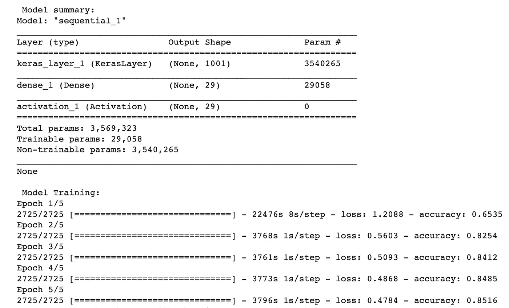
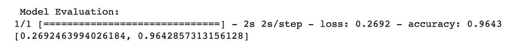

# 用 Tensorflow 和 Keras 编程人工智能识别手语

> 原文：<https://medium.com/nerd-for-tech/coding-an-ai-to-recognize-sign-language-with-tensorflow-and-keras-6cf8180c5f45?source=collection_archive---------8----------------------->



# 语境

为了好玩，我决定编写一个深度学习模型来识别美国手语(ASL)的字母。你可以从 Kaggle 的这里找到数据集[。让我们进入代码！](https://www.kaggle.com/grassknoted/asl-alphabet)

# 密码

注意，我在这个项目中使用了 Google Colab，所以我必须在前几行代码中从我的 Google Drive 导入数据集。如果您没有使用 Google Colab，请忽略前两行代码。

记得修改你的 *train_path* 和 *test_path* 变量，因为它们在我将要向你展示的代码中是我的计算机特有的。

```
from google.colab import drive
drive.mount('/content/drive')# imports
import tensorflow as tf
from tensorflow.keras.models import Sequential
from tensorflow.keras.layers import Dense, Flatten, Conv2D, MaxPooling2D, Activation, Dropout
from tensorflow.keras.losses import sparse_categorical_crossentropy
from tensorflow.keras.optimizers import Adam
from tensorflow.keras.preprocessing.image import ImageDataGenerator
import tensorflow_hub as hub
import numpy as np
import matplotlib.pyplot as plt# setting variables and directories for training and testing paths
img_size = 224
batch_size = 32
epochs = 5
train_path = '/content/drive/My Drive/ASL-recognition/asl_alphabet_train/asl_alphabet_train'
test_path = '/content/drive/My Drive/ASL-recognition/asl_alphabet_test/asl_alphabet_test'# define image data generators for data augmentation and rescaling
augment_train_data = ImageDataGenerator(horizontal_flip=True,
                                        rotation_range=50,
                                        zoom_range=0.2,
                                        width_shift_range=0.2,
                                        height_shift_range=0.2,
                                        rescale=1./255)augment_test_data = ImageDataGenerator(rescale=1./255)# run image data generators on training and testing dataset
train_dataset = augment_train_data.flow_from_directory(train_path,
     shuffle=True,
     classes=['A', 'B', 'C', 'D', 'E', 'F', 'G', 'H', 'I', 'J', 'K',
     'L', 'M', 'N', 'O', 'P', 'Q', 'R', 'S', 'T', 'U', 'V', 'W', 'X', 'Y', 'Z', 'space', 'del', 'nothing'],
     target_size=(img_size, img_size),
     batch_size=batch_size)test_dataset = augment_train_data.flow_from_directory(test_path,
     classes=['A', 'B', 'C', 'D', 'E', 'F', 'G', 'H', 'I', 'J', 'K',
     'L', 'M', 'N', 'O', 'P', 'Q', 'R', 'S', 'T', 'U', 'V', 'W', 'X', 'Y', 'Z', 'space', 'del', 'nothing'],
     target_size=(img_size, img_size),
     batch_size=batch_size)# showing 8 images from training dataset
fig = plt.figure(figsize=(15, 10))
for i in range(1,9):
    plt.subplot(4,2,i)
    plt.imshow(train_dataset[0][0][i-1])
plt.show()# getting pretrained model for transfer learning and defining model
url = "https://tfhub.dev/google/tf2-preview/mobilenet_v2  /classification/4"
download_model = hub.KerasLayer(url,input_shape=(img_size,img_size,3))
model = Sequential([
     download_model,
     Dense(29),
     Activation("softmax")
])# compiling model
model.compile(optimizer=Adam(1e-3),
loss="categorical_crossentropy",
metrics=['accuracy'])#training model
print("\n Model summary: ")
print(model.summary())
print("\n Model Training: ")
model.fit(train_dataset,
batch_size=batch_size,
epochs=epochs)# evaluating model
print("\n Model Evaluation: ")
model.evaluate(test_dataset)# saving model
model.save("/content/drive/My Drive/ASL-recognition/h5/asl_model.h5")# loading saved model
load_model = tf.keras.models.load_model("/content/drive/My Drive/ASL-recognition/h5/asl_model.h5",custom_objects={"KerasLayer":hub.KerasLayer})
print(load_model.summary())
```

## 这个代码是什么意思？我来解释一下:

```
from google.colab import drive
drive.mount('/content/drive')# imports
import tensorflow as tf
from tensorflow.keras.models import Sequential
from tensorflow.keras.layers import Dense, Flatten, Conv2D, MaxPooling2D, Activation, Dropout
from tensorflow.keras.losses import sparse_categorical_crossentropy
from tensorflow.keras.optimizers import Adam
from tensorflow.keras.preprocessing.image import ImageDataGenerator
import tensorflow_hub as hub
import numpy as np
import matplotlib.pyplot as plt
```

在这里，我们从 Tensorflow、Keras、Numpy 和 Matplotlib 中导入所有必要的库和模块，我们将在程序的其余部分需要它们。

```
# setting variables and directories for training and testing paths
img_size = 224
batch_size = 32
epochs = 10
train_path = '/content/drive/My Drive/ASL-recognition/asl_alphabet_train/asl_alphabet_train'
test_path = '/content/drive/My Drive/ASL-recognition/asl_alphabet_test/asl_alphabet_test'
```

我们设置训练和测试深度学习模型所需的变量，例如训练模型时所需的图像大小、批量大小和时期数。批量大小是在更新我们的模型的权重之前将通过网络传播的图像的数量。

```
# define image data generators for data augmentation and rescaling
augment_train_data = ImageDataGenerator(horizontal_flip=True,
                                        rotation_range=50,
                                        zoom_range=0.2,
                                        width_shift_range=0.2,
                                        height_shift_range=0.2,
                                        rescale=1./255)augment_test_data = ImageDataGenerator(rescale=1./255)# run image data generators on training and testing dataset
train_dataset = augment_train_data.flow_from_directory(train_path,
     shuffle=True,
     classes=['A', 'B', 'C', 'D', 'E', 'F', 'G', 'H', 'I', 'J', 'K',
     'L', 'M', 'N', 'O', 'P', 'Q', 'R', 'S', 'T', 'U', 'V', 'W', 'X', 'Y', 'Z', 'space', 'del', 'nothing'],
     target_size=(img_size, img_size),
     batch_size=batch_size)test_dataset = augment_train_data.flow_from_directory(test_path,
     classes=['A', 'B', 'C', 'D', 'E', 'F', 'G', 'H', 'I', 'J', 'K',
     'L', 'M', 'N', 'O', 'P', 'Q', 'R', 'S', 'T', 'U', 'V', 'W', 'X', 'Y', 'Z', 'space', 'del', 'nothing'],
     target_size=(img_size, img_size),
     batch_size=batch_size)
```

我们定义了 2 个图像数据生成器(1 个用于训练，1 个用于测试)来对我们的图像进行数据扩充，然后将这些数据馈送到我们的深度学习模型中。我们将通过水平翻转、旋转、垂直/水平移动来处理我们的图像，并重新缩放我们的图像，使每个像素的值在 0 和 1 之间。如果它正常工作，您应该会分别在训练和测试图像数据生成器中看到以下内容:



```
# showing 8 images from training dataset
fig = plt.figure(figsize=(15, 10))
for i in range(1,9):
    plt.subplot(4,2,i)
    plt.imshow(train_dataset[0][0][i-1])
plt.show()
```

使用 matplotlib 简单地设置一个图形并显示我们训练数据集中的前 8 幅图像。如果一切正常，您应该会看到类似这样的内容，尽管各个图像会有所不同。



```
# getting pretrained model for transfer learning and defining model
url = "https://tfhub.dev/google/tf2-preview/mobilenet_v2  /classification/4"
download_model = hub.KerasLayer(url,input_shape=(img_size,img_size,3))
model = Sequential([
     download_model,
     Dense(29),
     Activation("softmax")
])
```

我们使用 ImageNet 分类 CNN 模型(由 Google 发布)进行迁移学习，并重新定义最后一个密集层，以输出我们定义的 29 个类别中每个类别的概率。你可以在这里了解更多关于迁移学习[的知识。](https://machinelearningmastery.com/transfer-learning-for-deep-learning/)

```
# compiling model
model.compile(optimizer=Adam(1e-3),
loss="categorical_crossentropy",
metrics=['accuracy'])
```

我们编译我们的模型，并决定如何计算它的损失(分类交叉熵)，我们用来更新权重的优化器(Adam)，以及我们如何衡量模型的成功(准确性)。

```
#training model
print("\n Model summary: ")
print(model.summary())
print("\n Model Training: ")
model.fit(train_dataset,
batch_size=batch_size,
epochs=epochs)
```

最后，我们开始训练我们的模型。首先，我们查看模型的摘要，然后我们使用指定的批量大小和时期数在训练数据集上训练模型(model.fit())。如果您的所有代码都是正确的，它应该看起来像这样(除了将有 10 个纪元，而不是 5 个):



```
# evaluating model
print("\n Model Evaluation: ")
model.evaluate(test_dataset)
```

一旦我们的模型被训练到令人满意的精度，我们就可以在测试数据集上对其进行评估，以确定我们的模型是否过度拟合。您应该会看到类似这样的内容:



```
# saving model
model.save("/content/drive/My Drive/ASL-recognition/h5/asl_model.h5")
```

如果我们对模型满意，我们可以将它保存到指定的目录中以备后用。我决定用 h5 格式保存它，因为它很小，不需要很大的存储空间。

```
# loading saved model
load_model = tf.keras.models.load_model("/content/drive/My Drive/ASL-recognition/h5/asl_model.h5",custom_objects={"KerasLayer":hub.KerasLayer})
print(load_model.summary())
```

如果我们想在以后访问我们的模型，我们将能够从上面指定的目录中加载它，并做一个正常模型能够做的所有事情(例如，训练、预测、显示摘要、评估等)。).

# 结论

如果你想看完整的代码，你可以在我的 Github 库[这里](https://github.com/AlexanderChow9333/ASL-Recognition)查看。

话虽如此，我希望你喜欢我的文章！请随意查看我的其他文章，更多文章即将发布！

如果你有任何问题或想联系，随时给我发电子邮件:alexander.chow911@gmail.com

了解我更多: [LinkedIn](https://www.linkedin.com/in/alexander-chow-6539771b3/)