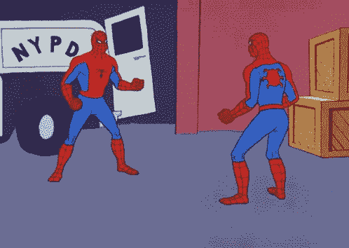

# Scrubs 编码:使用多个指针寻找平均对(JS)

> 原文：<https://medium.com/nerd-for-tech/coding-for-scrubs-using-multiple-pointers-to-find-the-average-pair-31cd9896faea?source=collection_archive---------26----------------------->



# 多个指针:

欢迎回到另一系列的手术编码！今天我们将讨论求解算法。这是一件非常重要的事情，尤其是在准备技术面试的时候。我们将学习**多指针**。这意味着我们将创建与索引或位置相对应的**指针**或值，并根据特定条件向开始、结束或中间移动。

# 平均配对:

给定一个排序的整数数组和一个目标平均值，确定数组中是否有一对值，其中该对值的平均值等于目标平均值。匹配平均目标的可能不止一对，但我们只想要第一对。

**例子:**如果给定的数组是[1，2，3]，目标平均值是 2，那么我们希望算法返回 true。这是因为 1 和 2 的平均数是 2。但是，如果数组中没有一个数字可以创建目标平均值 2，则返回 false。

# 伪代码:

是时候先用简单的英语解决问题了！

```
1\. Declare two variables/pointers (left and right), one starting in the beginning of the array and one starting at the end 
2\. Iterate through the array with a while loop
3\. Compare index of the left and right and get the average
4\. Create a conditional for if the average is equal to the target average, return true
5\. Else return false at the end of the loop
```

你可能想知道为什么我们使用 while 循环。我们不希望我们的指针互相传递。我们知道我们的左指针总是比右指针低，所以我们希望条件继续发生，只要那个声明为真。我们确实希望指针越来越靠近中间，直到它们匹配。

# 编写函数:

首先，创建名为`averagePair` 的函数，并传入两个参数`array` 和`target`。

```
*function* averagePair(array, target) {
}console.log(averagePair([1,2,3], 2))
```

现在，让我们定义我们的指针。`Left`将从数组的开头开始，`right`将从数组的结尾开始。然后，我们会将它们移向相反的一端，直到找到满足目标平均值的一对。

```
*function* averagePair(array, target) {
   let left = 0
   let right = array.length - 1
}console.log(averagePair([1,2,3], 2))
```

如果对你来说比较容易，你也可以把你的指针命名为`start`和`end`。只要有助于你理解发生了什么。记住我们的伪代码，我们将使用一个`while`循环。只要我们的第一个指针`left`小于第二个指针`right`，我们就希望继续遍历数组。

```
*function* averagePair(array, target) {
   let left = 0
   let right = array.length - 1
   while (left < right) {
   }
}console.log(averagePair([1,2,3], 2))
```

从这里开始，我们要设置一个变量来跟踪当前两个数字在每次迭代中的平均值。为了得到平均值，它将等于两个指针相加，然后除以 2。

```
*function* averagePair(array, target) {
   let left = 0
   let right = array.length - 1
   while (left < right) {
   let average = (array[left] + array[right]) / 2
   }
}console.log(averagePair([1,2,3], 2))
```

我们已经定义了`average`，现在我们将创建条件语句来比较我们的`average`和`target`。如果`average`等于`target`，我们将返回 true，否则，我们将继续我们的`while`循环。如果值`average`大于我们正在寻找的数字，那么我们知道我们应该移动我们的第二个指针`right`，更靠近数组的开始。但是如果`average`小于我们要找的数字，我们应该向前移动我们的第一个指针`left`。

```
*function* averagePair(array, target) {
   let left = 0
   let right = array.length - 1
   while (left < right) {
      let average = (array[left] + array[right]) / 2
      if (average === target) {
         return true
      } else if (average > target) {
         right--
      } else {
         left++
      }
   }
}console.log(averagePair([1,2,3], 2))
```

最后，如果我们遍历整个数组，并且找不到任何两个数字的平均值等于`target`平均值，我们可以返回 false。

```
*function* averagePair(array, target) {
   let left = 0
   let right = array.length - 1
   while (left < right) {
      let average = (array[left] + array[right]) / 2
      if (average === target) {
         return true
      } else if (average > target) {
         right--
      } else {
         left++
      }
   }
   return false
};console.log(averagePair([1,2,3], 2))
```

# 结论:

再次感谢你们收看另一个系列。我希望这篇博文能帮助你们了解多指针并明白它们的用途！

