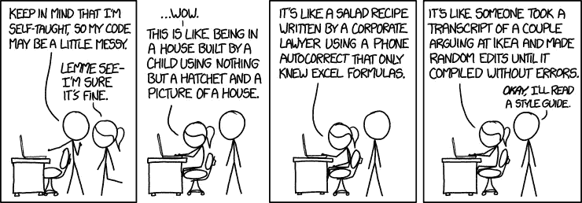
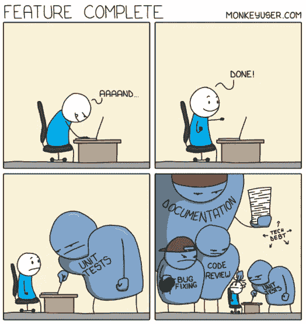

# 编码实践和代码审查指南——Android

> 原文：<https://medium.com/nerd-for-tech/coding-practices-and-code-review-guidelines-android-f0b0e0710d00?source=collection_archive---------2----------------------->


照片由[赛拉](https://unsplash.com/@sairaa?utm_source=unsplash&utm_medium=referral&utm_content=creditCopyText)在 [Unsplash](https://unsplash.com/t/nature?utm_source=unsplash&utm_medium=referral&utm_content=creditCopyText) 拍摄

先说一个问题，你知道怎么读代码吗？哦，我不是问你自己的代码，而是别人的代码。或者你能在几个月后阅读你自己的代码吗？如果你能，那很好，如果事情仍然很复杂，这个博客是给你的。以及更多的事情。



> **减少布局的嵌套**

每次我们在创建一个布局 XML 文件的时候，我们都应该尽可能的减少嵌套。如果你想了解如何以及为什么在这里查看我的文章:

[](https://karishma-agr1996.medium.com/linear-layout-v-s-constraint-layout-6b64e7a08ed7) [## 线性布局 V/S 约束布局

### 在本文中，我们将讨论线性布局和约束布局的基本可行性，线性布局和约束布局的优点

karishma-agr1996.medium.com](https://karishma-agr1996.medium.com/linear-layout-v-s-constraint-layout-6b64e7a08ed7) 

> 对于简单的图标最好使用 SVG 图像，如果它是一个有很多阴影和边缘的复杂图像，那么你可以 png 图像，但总是使用图像优化工具来减少文件大小。

> **永远不要在 XML 文件中使用 alpha 属性**

透明像素在屏幕上的渲染称为 alpha 渲染，是过度绘制的一个重要因素。与标准的 overdraw 不同，在标准 overdraw 中，系统通过在现有绘制的像素上绘制不透明的像素来完全隐藏现有的绘制像素，透明对象需要先绘制现有的像素，这样才能出现正确的混合公式。像透明动画、淡出和投影这样的视觉效果都涉及到某种透明度，因此会对过度绘制产生很大影响。在这些情况下，可以通过减少渲染的透明对象的数量来改善过度绘制。例如，您可以通过在`TextView`中绘制设置了半透明 alpha 值的黑色文本来获得灰色文本。但是您可以通过简单地用灰色绘制文本来获得同样的效果和更好的性能。

> **编写测试用例**

测试你的应用是应用开发过程中不可或缺的一部分。通过对你的应用程序进行一致的测试，你可以在公开发布之前验证你的应用程序的正确性、功能行为和可用性。这对您的产品质量至关重要，因此千万不要忽视它。



[monkeyuser.com](https://www.monkeyuser.com/2020/feature-complete/)

> **检查启用了持续活动的应用程序。**

**如何启用？—开发者选项—>不保留活动
它做什么？—** 启用此选项后，Android 操作系统会在活动停止后立即将其销毁。它旨在帮助开发者调试他们的应用程序。比如可以模拟 Android 由于内存压力会在后台杀死一个活动的情况。
要理解最好阅读下面的文章:

[](/mindorks/hey-android-please-keep-my-activities-7bf96ccc0a38) [## 嘿安卓，请保持我的活动！

### 这篇文章是关于我在试图调试由于后台活动破坏而导致的崩溃时获得的见解…

medium.com](/mindorks/hey-android-please-keep-my-activities-7bf96ccc0a38) 

> **检查皮棉警告**

除了通过构建测试来确保您的应用程序满足其功能需求之外，通过 lint 运行代码来确保您的代码没有结构问题也很重要。lint 工具有助于发现结构不良的代码，这些代码会影响 Android 应用程序的可靠性和效率，并使您的代码更难维护。

> **格式化**

代码格式对于 ***的可读性非常重要。***


> **使所有 util 方法参数不可为空，方法返回类型也不应为空**

有些方法可以在多个地方使用，我们可能会忘记处理 null，尽管现在 kotlin 为我们提供了这种便利。但是，即使在方法内部传递一个空值，并在方法内部进行检查，然后返回结果，这也是一种不好的做法。尽早退出总是更好。一个方法应该只做它想做的事情，而不是空检查。因此，在调用实用程序方法之前进行空检查。

> **数据库查询应该在后台进行，即使执行时间很短。**


当数据很大时，有时从数据库获取结果会花费很长时间，同时我们不希望我们的 UI 被卡住。就目前而言，可能当您正在处理的数据不是很大，并且它是在几毫秒内加载的，所以您会考虑在主线程上执行，但是随着应用程序的增长，数据可能会增长，所以为未来做好准备并在后台执行所有数据库查询总是更好。

> **在使用每个数据结构以获得更好的性能之前，先了解它的用法。关于 Hashmap，链接 hash map，map，Set，HashSet，Array，ArrayList 等的 Lil 位描述。**

例如，当我们在一个列表中一个接一个地添加数据，并且不想保存重复的条目时，我们就不需要检查它是否已经可用了，HashSet 已经做了，这样我们就不用计算了。同样，无论何时我们使用任何数据结构，我们都应该知道哪一个最适合我们的用例。欲了解更多详情，请登录此博客:

[](https://www.careerdrill.com/blog/coding-interview/choosing-the-right-data-structure-to-solve-problems/) [## 选择正确的数据结构来解决问题

### 基于需求，总是为工作选择正确的工具。- DrewMarsh 数据结构是一种特殊的…

www.careerdrill.com](https://www.careerdrill.com/blog/coding-interview/choosing-the-right-data-structure-to-solve-problems/) 

> 如果可能的话，使用注释。例如(工作线程、非空、可空等)。

> **适当的异常处理。**


一段关键的代码应该被 try catch 块包围起来
应该通知用户是否因为异常而没有发生什么。例如，您尝试进行一些日期转换，并基于该日期查询一些数据，因为它给出了解析异常。我们进入 catch 块，如果 catch 块中没有任何操作，用户将等待响应。他看不到屏幕上的任何东西。所以也要考虑假的情况。

> **方法、变量名应该是不言自明的**

不要使用像 I，j 这样的单字符名称，它们只能用于循环。
不要用 variableX，variableY 之类的变量名。太傻了。你的变量名应该总是显示它做什么。

> **文档**

记录你的代码是优秀程序员的标志。总是让你的代码更可读，做一个好的祖先。这并不意味着你写令人困惑的代码，然后只是记录它。一定要写出好的代码并记录下来。#预编程

> **使用 styles.xml 和 themes.xml 使用适当的样式和主题。不要在布局文件中硬编码颜色、文本/显示字符串** **和属性。需要在活动主题中设置合适的颜色&属性。**

> **不要直接重用其他模块资源。如果您确实需要重用，请将该资源移动到基本模块并重用。**

> **嵌套 If 的**

我讨厌这样，我真的很讨厌，你的语句需要多次检查，就像下面的代码，它会变得很深很深💁实际上，编码是不好的😜。

```
if (vehicle != null) {
       if (vehicle.getCar() != null) {
           if (vehicle.getCar().getModel() != null) {
               int price = vehicle.getCar().getModel().getPrice();
           } }
   }
```

问题是，这是可以避免的，你完全可以，就像这样。正如你在下面看到的，一个更具可读性，更容易理解。

```
**if** (vehicle == **null** || vehicle.getCar() == **null** || vehicle.getCar().getModel() == **null**) **return**;**int** price = vehicle.getCar().getModel().getPrice();
```


> **不要在代码中硬编码 api 密钥或秘密，应该使用 BuildConfig。**

> **字符串格式化程序、日期格式化程序或任何格式化程序只能用于在屏幕上显示文本。它不应用于数据库查询、条件检查或任何功能，因为格式化程序值会根据电话中使用的区域设置而变化。**

> **当你在不同的模块上工作时，你需要在 XML 中为字符串、drawables、dimens 等创建/给出唯一的资源名称。否则，一个人的价值会被其他人覆盖，就会产生冲突。**

> **不应创建/覆盖组件/框架(活动、片段、服务等)的构造函数。**

> **如果变量可以为空，则要求处处进行空检查(Java & Kotlin)**

> 总是用你的特征做猴子测试。因为有时它会崩溃，而优秀开发人员会破坏自己的特性，使其牢不可破。💪🏻💪🏻

> **使用抽象或助手类**

[](/healthify-tech/your-way-to-better-abstraction-53b165a8c54f) [## 你实现更好抽象的方法

### 如果处理得当，抽象是强大的。虽然它们很难，很棘手，需要维护，但它们有助于重复使用…

medium.com](/healthify-tech/your-way-to-better-abstraction-53b165a8c54f) 

> **不要在 onBindViewHolder** 中做任何布局更改

**有时候我们想调整 itemView 的宽度和高度。** view holder . item view . layout params . width =
((context . resources . display metrics . width pixels/1.2)。toInt())
这里我们想。在可视屏幕上显示 1.2 部分项目视图。如果我们在 onBindViewHolder 中这样做，每次用户滚动它都会再次设置宽度，这会造成混乱。所以一定要在 OnCreateViewHolder 上做。因为布局应该预先定义。
现在假设你得到一个场景，当你想在 Notify()上改变布局宽度，因为 android 在 notify 调用上没有调用 onCreateViewHolder()。在这种情况下，我们可以定义多个视图类型。并且 bang 它也会执行 onCreateViewHolder()。

> **为可重用的 UI 元素创建单独的布局。**

> **在 intent/bundle 中传递数据时，使用 parcelable 类而不是 Serializable。**

实现 Parcelable 接口的对象的序列化比使用 Java 的默认序列化要快得多。
实现 serializable 接口的类被标记为 Serializable，Java 使用反射来序列化它(这使得它很慢)。
使用 Parcelable 接口时，整个对象不会自动序列化。相反，我们可以有选择地将数据从对象添加到一个包中，稍后使用该包对对象进行反序列化。

> 你的 IDE 可以为你做很多事情。所以，经常阅读那些可以帮助你提高整体效率和质量的小技巧和小工具


**这里有一些阅读的链接:**

*   [*https://www . raywenderlich . com/2807578-Android-studio-tips-and-tricks # TOC-anchor-021*](https://www.raywenderlich.com/2807578-android-studio-tips-and-tricks#toc-anchor-021)
*   [*Philippe Breault 的 Android 工作室每日提示*](https://plus.google.com/collection/wtO0PB)
*   [*键盘快捷键参考*](https://developer.android.com/studio/intro/keyboard-shortcuts.html)
*   [*【大概】10 件你(大概)不知道可以在安卓*](/google-developers/about-10-things-you-probably-didn-t-know-you-could-do-in-android-studio-de231071b375) 做的事情
*   [*工作室*](/google-developers/about-10-things-you-probably-didn-t-know-you-could-do-in-android-studio-de231071b375) *作者烈斗·梅尔*
*   [*无鼠标驱动发展*](https://vimeo.com/98922030) *由* [*哈迪哈里里*](https://medium.com/u/7bef290f1d79?source=post_page-----af86e7cf56d2--------------------------------)
*   [*Philippe Breault《像老板一样的安卓工作室》*](https://realm.io/news/360andev-philippe-breault-android-studio-ide-like-boss-structural-search-refactoring-java/)
*   [*安卓专家工作室(2015 安卓开发者峰会)*](https://www.youtube.com/watch?v=Y2GC6P5hPeA)
*   [*迈克尔·埃文斯的 Android Studio 提示和技巧*](http://michaelevans.org/blog/2016/01/06/android-studio-tips-and-tricks/)
*   [*遇见安卓工作室*](https://developer.android.com/studio/intro/index.html)
*   [*Android Studio —技巧与窍门*](http://www.donnfelker.com/android-studio-tips-and-tricks-part-1/)*by*[*Donn Felker*](https://medium.com/u/e75f3da9f41a?source=post_page-----af86e7cf56d2--------------------------------)
*   [*用 Android Studio 调试你的 App*](https://developer.android.com/studio/debug/index.html)
*   [*你的必备插件有哪些——Reddit 讨论*](https://www.reddit.com/r/androiddev/comments/3ktqyb/what_are_some_of_your_musthave_plugins_for/)

> **循环中的字符串串联**

```
**Nope**
**for**(String name : names) {
    name += name;
}**Yup** StringBuilder nameBuilder = **new** StringBuilder();
**for**(String name : names) {
    nameBuilder.append(name);
```

在这里，我提供了一些对你有帮助的文章链接。

[](/mindorks/how-to-become-more-productive-in-android-with-android-studio-plugins-3beb3861fa7) [## 如何使用 android studio 插件在 android 中变得更高效

### Android studio 是一个非常强大的工具。它有最简单也是最灵活的界面来为所有人设计 UI…

medium.com](/mindorks/how-to-become-more-productive-in-android-with-android-studio-plugins-3beb3861fa7)  [## 重定向你-媒体

### 编辑描述

medium.com](https://medium.com/r?url=https%3A%2F%2Fblog.stylingandroid.com%2Fasynclayoutinflater%2F%3Fs%3D09) 

以后我会继续编辑这个博客，因为会有新的有趣的东西出现。小事情造成大差异，你写的每一行都有成本，所以要小心你写的东西。

没关系，伙计们，我知道你们很感激😎🤭。

非常感谢你的鼓掌帮助其他人找到这篇文章😃让他们也心存感激。

