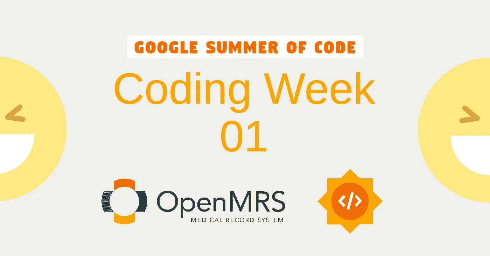
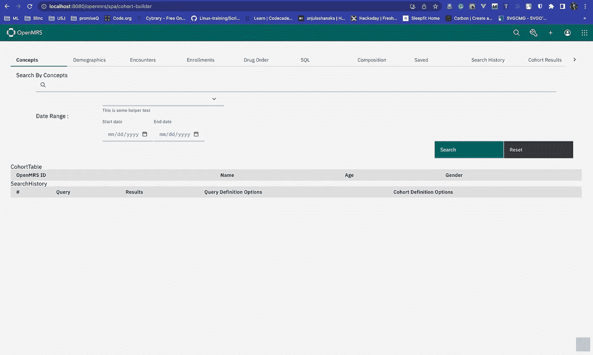
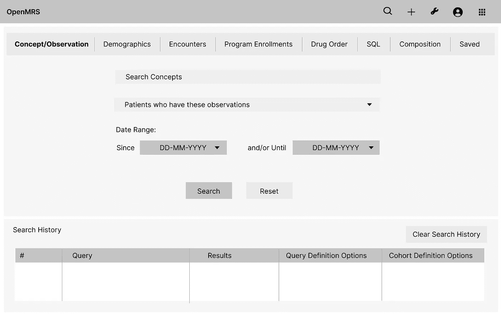
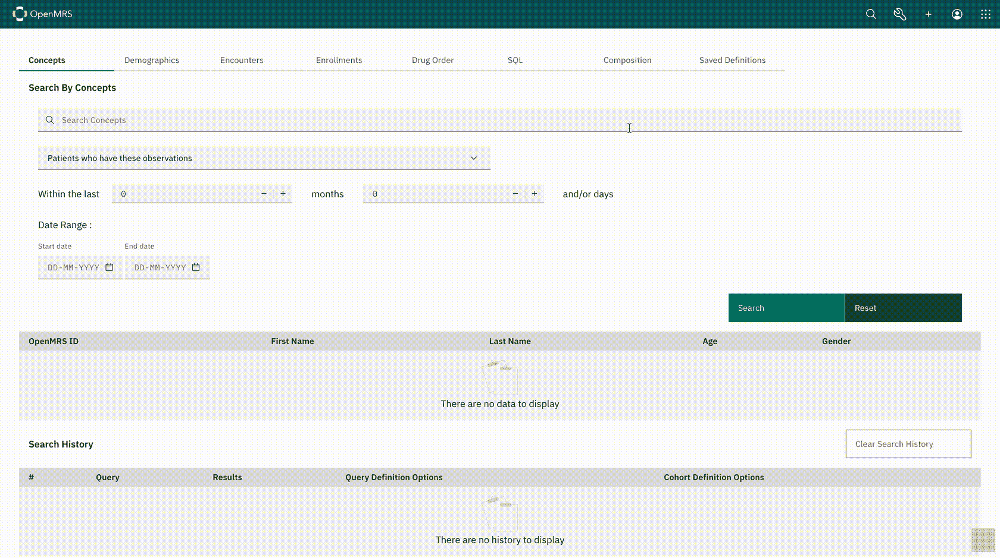

# 编码周 01:带 OpenMRS 的 GSoC 2022

> 原文：<https://medium.com/nerd-for-tech/coding-week-01-gsoc-2022-with-openmrs-ba85dc087f6c?source=collection_archive---------2----------------------->

Google Summer of Code 2022 的编码期于 2022 年 6 月 12 日正式开始。一个中型项目有 12 周的编码时间。在这篇博文中，我将谈论编码的第一周是如何进行的。你可以在这里阅读我的[社区联系经验博文。](/p/8c8cd17353af)

## 我的第一个拉动请求

正如我之前在博客中提到的。我从 [esm 模板](https://github.com/openmrs/openmrs-esm-template-app)中移除了样板代码，并对群组生成器进行了必要的修改。我的导师为我的项目创建了一个全新的[库](https://github.com/openmrs/openmrs-esm-cohortbuilder)，因为它是一个新的微前端模块。之后就可以发第一次 PR 了。

初始 PR 时用户界面的状态

 [## O3-1311:anju la-sack 拉动请求#1 的项目初始设置…

### 将此建议添加到可以作为单次提交应用的批处理中。此建议无效，因为没有更改…

github.com](https://github.com/openmrs/openmrs-esm-cohortbuilder/pull/1) 

## 面临设置后端的问题

当您使用 OpenMRS ESM 模块时，它会为安装了一些虚拟数据和模块的演示服务器创建代理。通常，几乎每个 ESM 模块都有两个后端模块。哪个是

1.  [Webservices REST](https://github.com/openmrs/openmrs-module-webservices.rest) —为 OpenMRS 提供 RESTful web 服务
2.  [FHIR](https://github.com/openmrs/openmrs-module-fhir2) —这是一个为 OpenMRS 实现 FHIR 接口的模块

对于群组生成器，它还需要两个模块，称为[报告](https://github.com/openmrs/openmrs-module-reporting)、[报告记录](https://github.com/openmrs/openmrs-module-reportingrest)。但是问题是没有一个演示服务器有最新的报告 rest 模块，所以我得到了一个 500 错误。解决方案是设置参考应用程序。

OpenMRS 为您提供了[设置参考应用](https://wiki.openmrs.org/pages/viewpage.action?pageId=224527013)的不同方式，包括 [openMRS SDK](https://wiki.openmrs.org/display/docs/OpenMRS+SDK) 、Docker 映像和使用 tomcat 的手动部署。我使用手动方法，因为我有一些其他方法的麻烦。

经过几天的努力，我能够用所需的模块设置后端。

## 通过概念和观察进行搜索

我的第一个里程碑是实现了概念搜索功能。该功能使用户能够根据概念和观察结果搜索患者。

三维线框模型

## 我的第二个拉动请求

我能够发送第二个公关也在本周，其中包括搜索的概念功能。这里有一个小演示和公关。

演示

 [## O3-1300:通过 anjula-sack 拉取请求#2 实施概念组件搜索…

### 目的本 PR 的目的是确定#O3-1300 目标，使用户能够使用概念搜索患者…

github.com](https://github.com/openmrs/openmrs-esm-cohortbuilder/pull/2) 

更多更新，可以关注我的 OpenMRS [talk 线程](https://talk.openmrs.org/t/gsoc-2022-redo-legacy-ui-cohort-builder-project-updates/36847)。

至此，第一周的编码结束了。我期待开始下一个里程碑的工作。请继续关注第二周的更新。别忘了看看我的其他文章。下次再见了。在那之前保持安全！✌️

**想联网吗？**
领英:[https://www.linkedin.com/in/anjula-sack/](https://www.linkedin.com/in/anjula-sack/)
脸书:[https://www.facebook.com/anjula.shanaka/](https://www.facebook.com/anjula.shanaka/)
Github:[https://github.com/anjula-sack](https://github.com/anjula-sack)[/](https://www.facebook.com/anjula.shanaka/)