# 咖啡书籍调查称…

> 原文：<https://medium.com/nerd-for-tech/coffee-book-survey-says-853ad77d8a2?source=collection_archive---------0----------------------->

## 咖啡数据科学

## 咖啡书籍 Kickstarter 调查的细分

我在 Kickstarter 上发布了一本关于 espresso 的[书](https://www.indiegogo.com/projects/engineering-better-espresso-data-driven-coffee)，我问了一些调查问题，以便更好地了解支持我项目的人。我想和其他人分享这些信息，因为我喜欢好的数据故事。

首先，自我规定的经验水平分布良好。

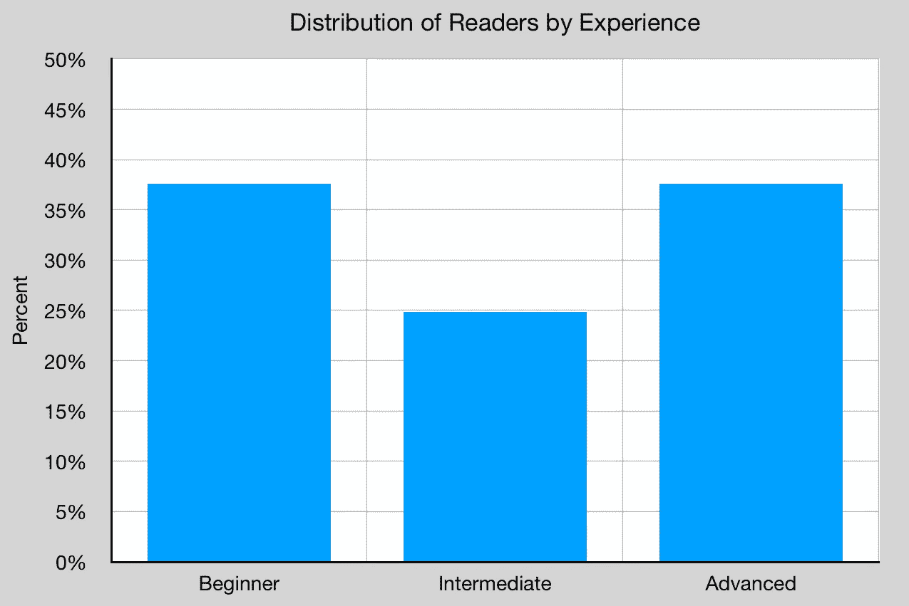

我问了未来感兴趣的话题，有很多种。我认为浓缩咖啡和咖啡自然有很多有趣的领域。

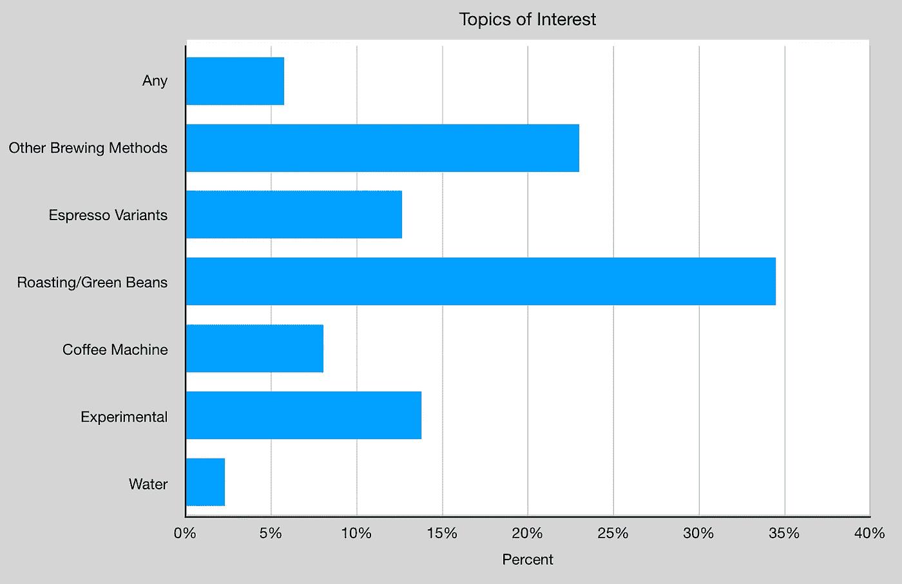

我想知道关于烘焙的知识，因为烘焙你自己的咖啡可以让你对你正在喝的东西有更多的了解。

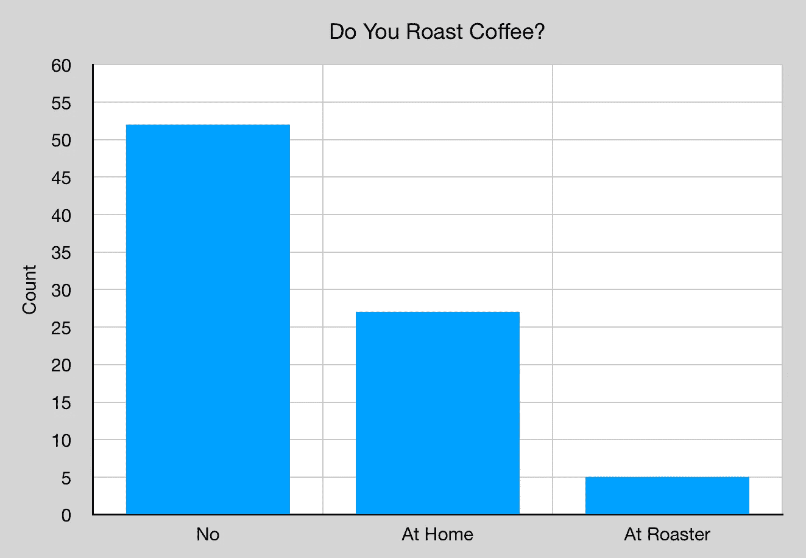

# 装备

浓缩咖啡和咖啡似乎总是人们不断寻找下一次升级的领域。在这种情况下，25%的人对他们的设置感到满意，但许多人希望升级他们的磨床。这个问题允许多重回答。

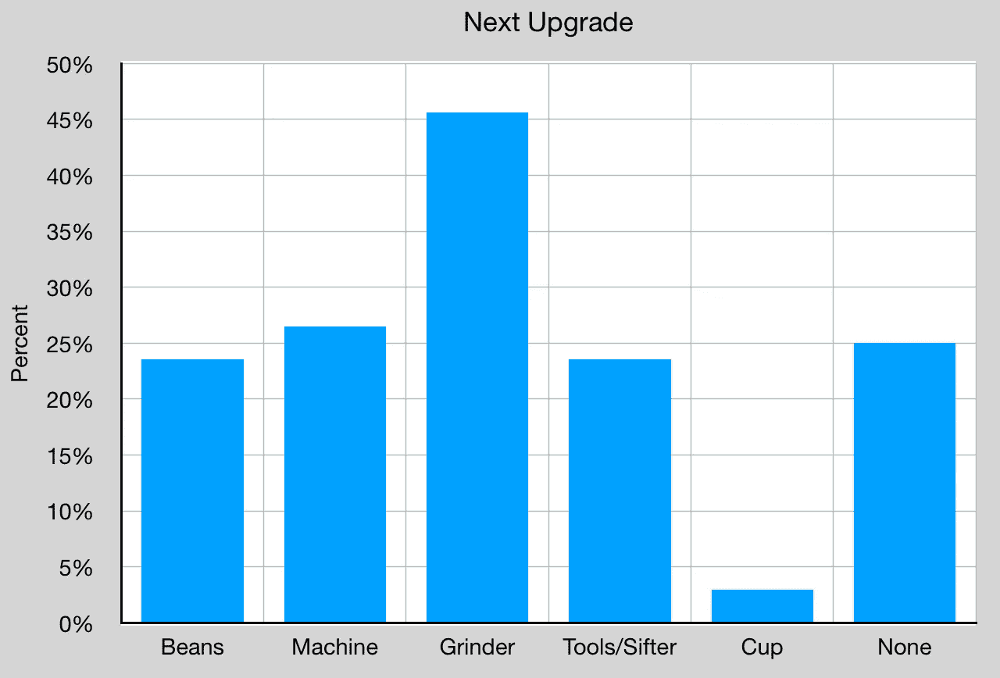

就咖啡机而言，许多人拥有高端咖啡机和研磨机。这可能表明，我考虑的初学者较少，或者更多有经验的人更快地支持该活动，因为其中一些问题只针对早期支持者。

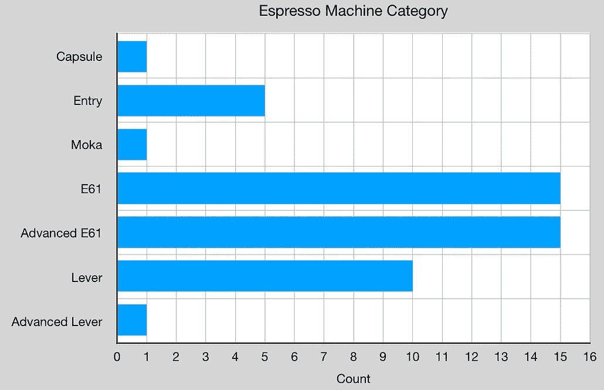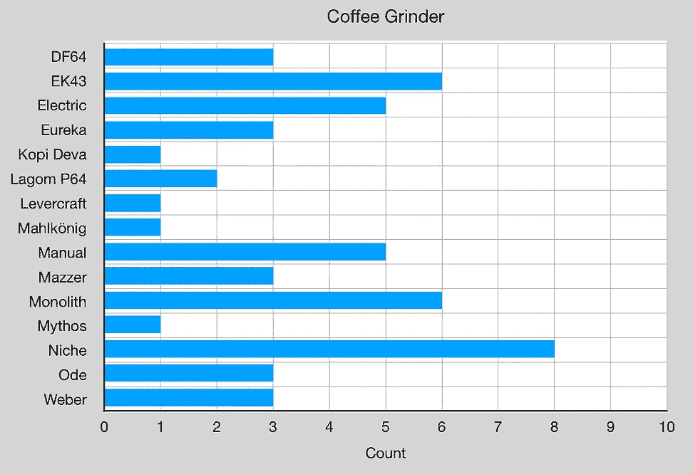

至于成本，大多数人在研磨机上投入了大量资金，少数人拥有不止一台研磨机。

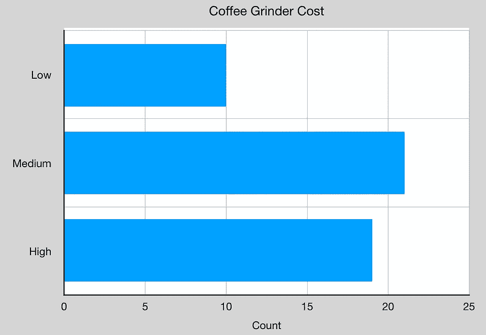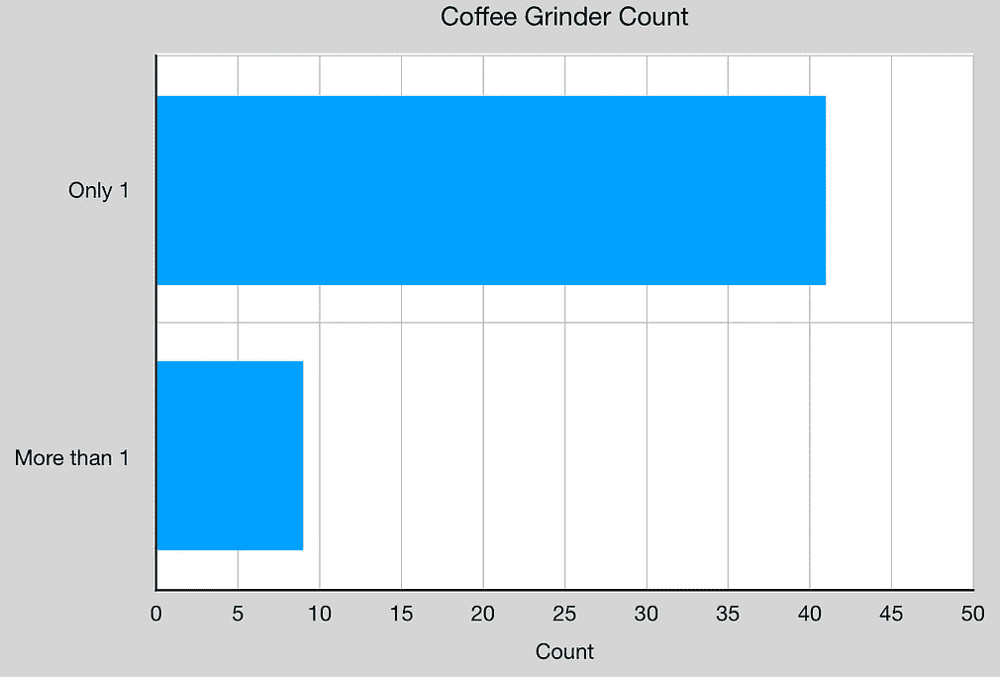

尽管如此，人们还是梦想得到最好的升级。许多人说他们已经得到了他们想要的东西，而且在人们想要的机器之间有一种传播。

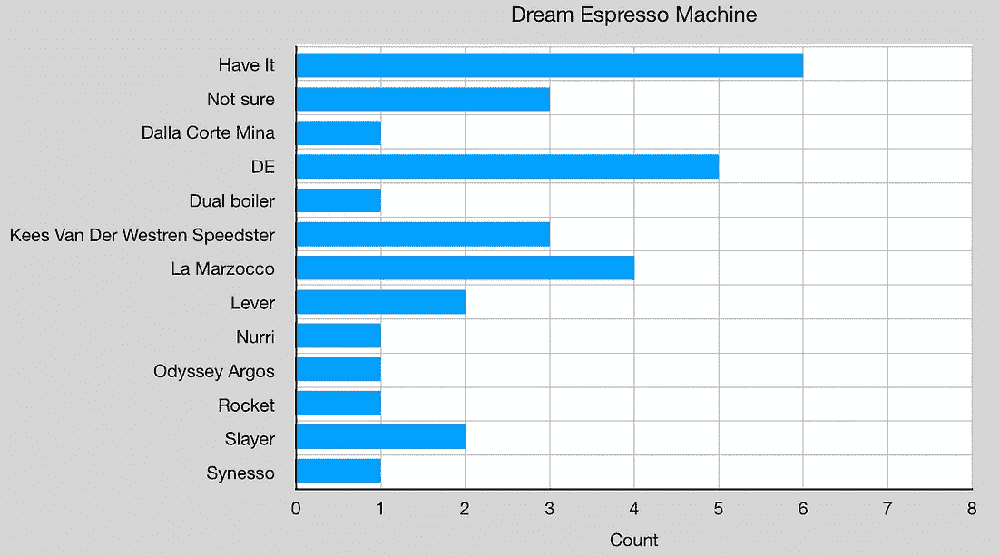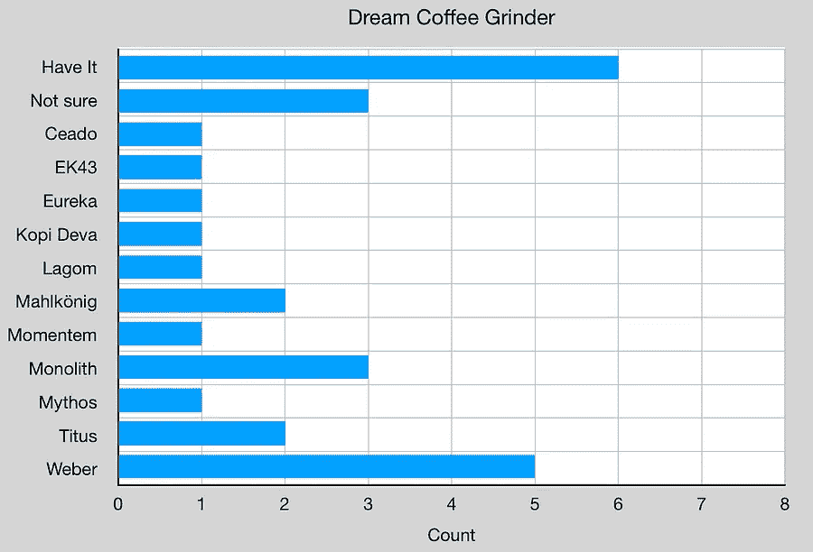

# 另一本书？

最后，我想知道人们会如何看待另一本书，看起来很多人都会，所以我继续写文章并开始整理另一本书是件好事。

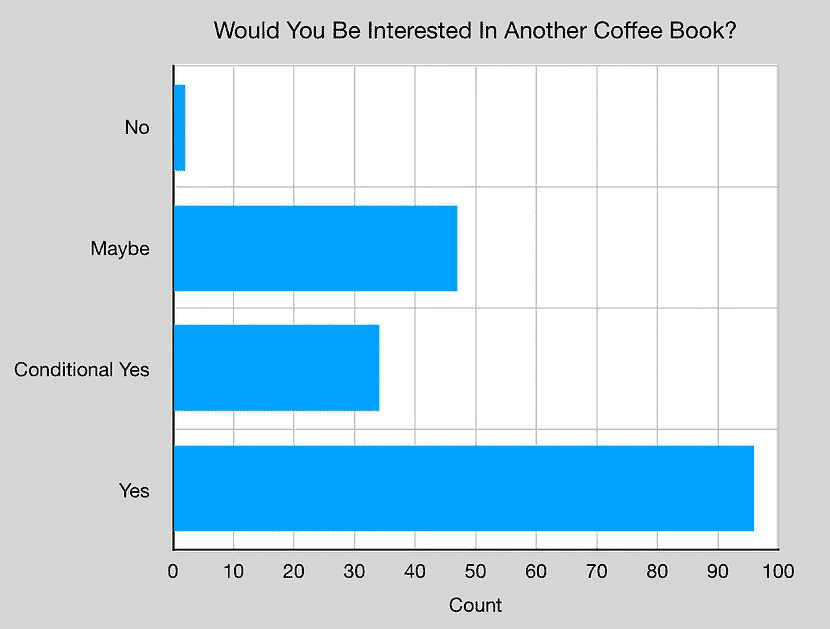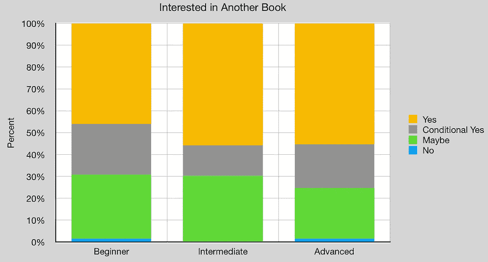

我真的很享受出书的过程，尽管有很多挑战。大多数都是做下一个作品，把焦虑放在一边。我很高兴人们对调查的反应很好，这让我有了一些深刻的见解，所以感谢所有参与调查的人。

如果你愿意，可以在推特、 [YouTube](https://m.youtube.com/channel/UClgcmAtBMTmVVGANjtntXTw?source=post_page---------------------------) 和 [Instagram](https://www.instagram.com/espressofun/) 上关注我，我会在那里发布不同机器上的浓缩咖啡照片和浓缩咖啡相关的视频。你也可以在 [LinkedIn](https://www.linkedin.com/in/dr-robert-mckeon-aloe-01581595) 上找到我。也可以关注我在[中](https://towardsdatascience.com/@rmckeon/follow)和[订阅](https://rmckeon.medium.com/subscribe)。

# [我的进一步阅读](https://rmckeon.medium.com/story-collection-splash-page-e15025710347):

[我的书](https://www.kickstarter.com/projects/espressofun/engineering-better-espresso-data-driven-coffee)

[我的链接](https://rmckeon.medium.com/my-links-5de9eb69c26b?source=your_stories_page----------------------------------------)

[浓缩咖啡系列文章](https://rmckeon.medium.com/a-collection-of-espresso-articles-de8a3abf9917?postPublishedType=repub)

工作和学校故事集