# 曼哈顿的咖啡店分析-分割和聚类社区

> 原文：<https://medium.com/nerd-for-tech/coffee-shops-analysis-in-manhattan-segmenting-and-clustering-neighborhoods-dba71fee3429?source=collection_archive---------11----------------------->

*k-means 聚类，Foursquare API &叶图*

这个项目的主要目标是定义一个商业问题，在网上寻找数据，并使用 Foursquare 位置数据来比较一个城市的不同社区，以确定哪个社区适合开始新的业务。在这个项目中，我将以循序渐进的方式经历从问题设计、数据准备到最终分析的所有过程，最后将提供一个结论，业务利益相关者可以利用该结论做出决策。

图 1——谷歌图片

# 介绍

曼哈顿是最受欢迎的旅游目的地，也是纽约州最好的观光地之一。它也是纽约最好的城市之一，可以说是世界上最好的城市之一。从最稀有的古董袖扣到最美味的主菜，你可以找到任何你想要的东西。

一项既是游客也是居民的活动是喝咖啡。这项活动可以单独进行，也可以在朋友的陪同下，在这个城市的任何时候进行。美国人每年喝掉大约 1460 亿杯咖啡。2020 年，70 岁及以上的人每天喝的咖啡最多。那一年，这个特殊的年龄组平均每人每天喝将近 2.2 杯。18 岁和 19 岁的人喝得最少，人均每天大约 0.8 杯([美国人均咖啡消费总量](https://www.statista.com/statistics/456360/total-us-coffee-per-capita-consumption/))。

# 商业问题

在这个项目中，我们将通过一步一步的过程来找到一个咖啡店的最佳位置。这份报告将针对那些想要从头开始、购买现有业务的利益相关者，或者任何对纽约市曼哈顿的一杯好咖啡感兴趣的人。我们将尝试检测尚未挤满咖啡店的位置。我们还对附近没有咖啡店的地区特别感兴趣。假设前两个条件都满足，我们也希望地点尽可能靠近市中心。

# 资料组

为了分割和探索纽约的街区，我们需要一个包含 5 个区和每个区中的街区以及每个街区的经度和纬度坐标的数据集。我使用了来自 IBM cloud 服务器的预先准备好的 JSON 文件，并简单地运行一个`wget`命令来访问数据。

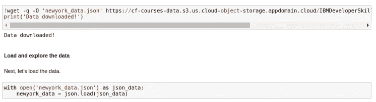

图 2—作者提供的图片

现在我们需要将嵌套 Python 字典的数据转换成一个数据框架。因此，我创建了一个空的数据帧，然后遍历数据，一次填充数据帧的一行。

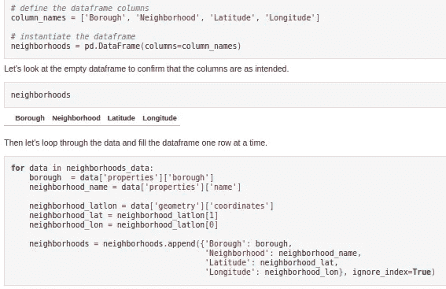

图 3—作者图片

之后，数据框总共有 306 个街区，5 个区，并且它的存储方式可以读取到熊猫数据框中，因此它是一种结构化格式。

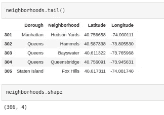

图 4—作者提供的图片

# **方法论**

这个项目的目标是找到曼哈顿咖啡店密度较低的区域。

*   首先，我们将检查候选邻域。它将为我们的候选邻域的质心创建纬度和经度坐标。我们将创建一个覆盖感兴趣区域的格网，该格网以上西区为中心。
*   第二，我们将得到位于中央公园半径 3.5 公里范围内的前 100 个场馆，并探索它们的邻近地区。

**叶库和传单地图**

可视化库****被用来创建纽约及其邻近地区的地图。****

****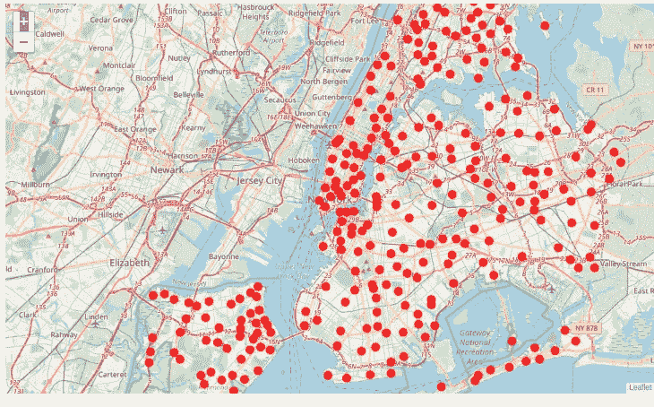****

****图 5—作者图片****

******探索曼哈顿的街区******

****然后，我对原始数据帧进行切片，并为曼哈顿数据创建一个新的数据帧。****

****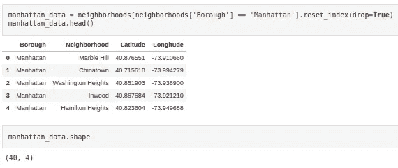****

****图 6 —作者图片****

****然后再次使用可视化库**来创建曼哈顿及其邻近地区的地图。******

******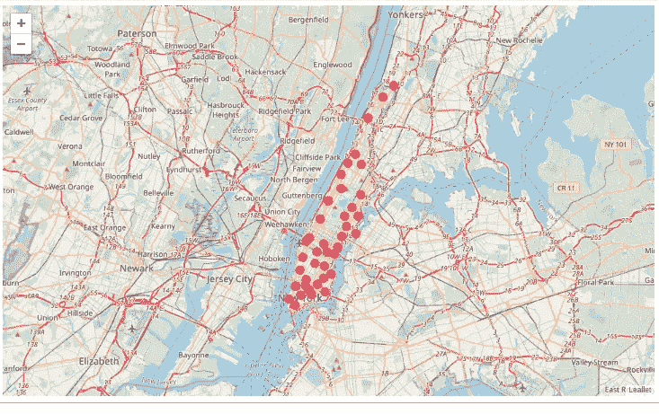******

******图 7—作者提供的图片******

********Foursquare API********

****为了探索曼哈顿的街区，使用了 Foursquare API。该接口用于获取每个街区中最常见的位置类别(咖啡馆、餐馆、冰淇淋店、美术馆等)，然后使用该功能对街区进行分组。必须在应用程序中创建一个帐户来获取您的客户端凭据。****

****API 用于获取 3.5 公里半径范围内的前 100 个场馆。****

****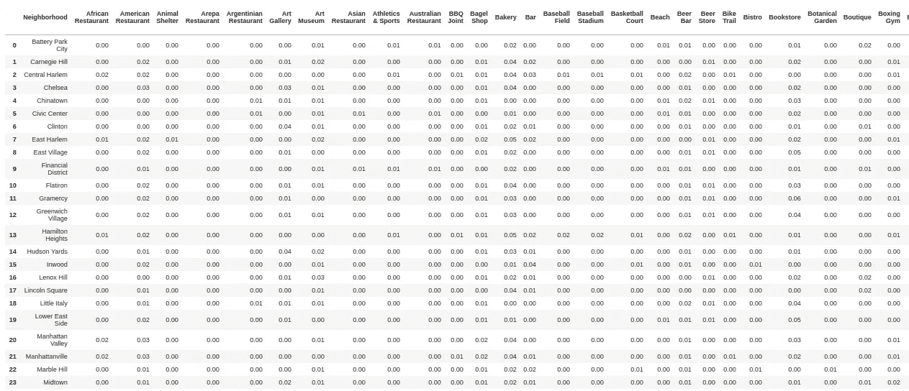****

****图 8—作者提供的图片****

****接下来，分析验证了曼哈顿地区 203 个类别的频率，并在过滤了咖啡店类别之后。****

****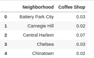****

****图 9—作者图片****

****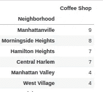****

****图 10—作者图片****

****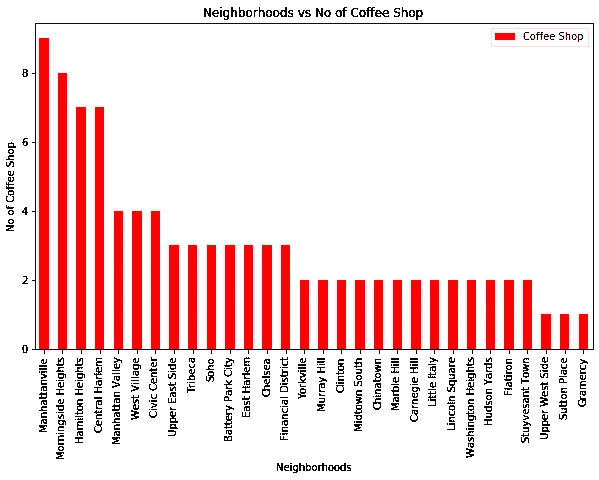****

****图 11—作者图片****

# ******k 均值聚类******

****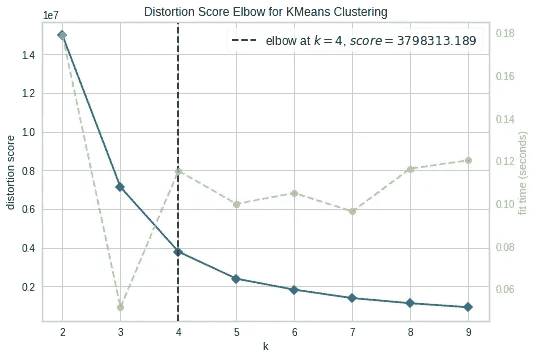****

****图 12—作者提供的图片****

****然后，执行 k-means 聚类算法将邻域聚类成 4 个簇。****

****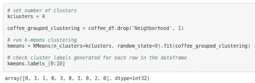****

****图 13—作者图片****

# ****聚类邻域****

****再次，叶图书馆被用来可视化城市的集群分布。根据咖啡店在每个区域的出现频率，并遵循此分析的要求(附近很少或没有咖啡店的区域)，对每个聚类进行检查和区分。****

****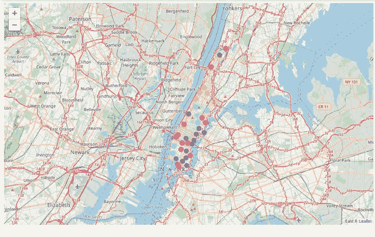****

****图 14—作者提供的图片****

****最后，计算咖啡店很少或没有咖啡店的社区到中心坐标(上西区)的距离，并将其添加到分析中。****

****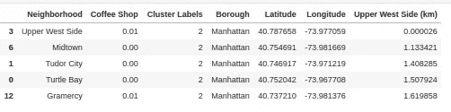****

****图 15—作者提供的图片****

# ****结果****

****这项工作分析了曼哈顿的 40 个街区，目的是发现不再充满咖啡店的地方。蒙特利尔自助餐厅密度最低的区域集中在分析区域的外围区域。这个区域与集群 3(地图上的红点)相关。在这个集群中，13 个社区的自助餐厅密度很低或没有。咖啡店高发的街区位于聚类 2 中，它们距离我们的中心坐标大约 2-4 公里。****

******中城**是距离上西区最近的街区，没有咖啡店。距离中心坐标 1.13 公里。都铎城和海龟湾也是附近的地方，距离 appx 1.4-1.5 公里，没有咖啡店。****

# ****结论****

****咖啡店高发的街区位于集群 2 中，其中许多距离中心坐标大约 2-4 公里。喝咖啡频率最高的街区是哈莱姆中心区、汉密尔顿高地、晨边高地和曼哈顿维尔。项目要求包括检测尚未挤满咖啡馆的地方，或者附近没有咖啡馆的区域，并且尽可能靠近市中心。建议以下三个方案满足项目要求:**中城**，距离中心坐标 1.13 公里最近且无咖啡店，都铎城，海龟湾(1.4-1.5 公里)。****

******使用的数据集******

****为了解决上述问题，我使用了:****

****[1]邻域和地理坐标:[https://cf-courses-data . S3 . us . cloud-object-storage . appdomain . cloud/IBMDeveloperSkillsNetwork-ds 0701 en-SkillsNetwork/labs/new York _ data . JSON](https://cf-courses-data.s3.us.cloud-object-storage.appdomain.cloud/IBMDeveloperSkillsNetwork-DS0701EN-SkillsNetwork/labs/newyork_data.json)****

****[2]four square API:[https://developer.foursquare.com/docs](https://developer.foursquare.com/docs))****

****热门地点的位置数据—由 Foursquare API 提供
four square API 提供与特定地点不同地点的出现频率相关的数据。我使用了位置数据来识别人流密集的场所(如市场)附近的集群。这些区域将被识别为热点区域。****

******讨论******

****[1]该分析仅考虑了街区中咖啡店的出现频率。****

****[2]其他因素对于最终决定自助餐厅的位置也很重要，例如附近的其他企业(这将是补充自助餐厅的其他相关类别)、附近的生活成本、安全区等等。****

****[3]此外，所有分析均使用免费 API 或其开放访问选项进行。可以使用付费资源进行分析，以便获得更多结果选项。****

****[4]一些缺点或改进的领域向我们表明，在更多数据和不同机器学习技术的帮助下，这种分析可以进一步改进。****

****[5]同样，我们可以用这个项目来分析任何场景，比如开一家餐馆或者开一家新的健身房等等。****

****[6]希望这个项目有助于作为使用数据科学应对更复杂的现实生活挑战的初始指导。****

****这个分析的笔记本可以在 [Github](https://github.com/lophy95/Coursera_Capstone/blob/main/Week4%265/Notebook/Neighborhoods-New-York-Manhattan.ipynb) 中看到。****