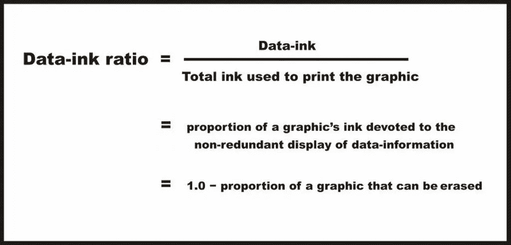
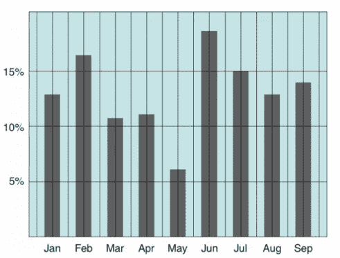
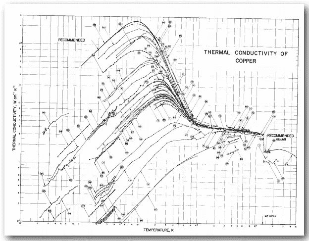
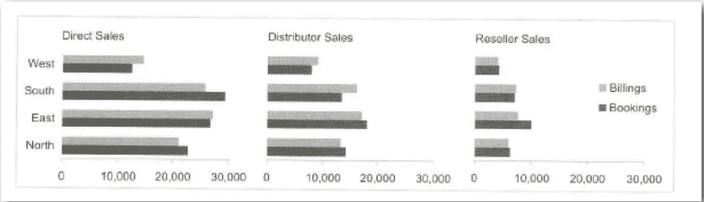

# 数据可视化的认知

> 原文：<https://medium.com/nerd-for-tech/cognizance-of-data-visualization-cc426ea893a3?source=collection_archive---------15----------------------->

## 为了在业务用例中获得更好的结果，遵循所有数据可视化原则的架构应该得到合理的认可。

[Firmbee.com](https://unsplash.com/@firmbee?utm_source=medium&utm_medium=referral)在 [Unsplash](https://unsplash.com?utm_source=medium&utm_medium=referral) 上拍照

在本文中，您将了解数据可视化的所有见解、为什么使用以及应该考虑的一些关键原则。

> "混乱和困惑是设计的失败，而不是信息的属性."
> ― **爱德华·塔夫特**

每天都会产生大约 2.5 万亿字节的原始数据，而且这一比例还在不断攀升。因此，企业使用各种大数据工具来理解这些海量数据。数据可视化是一种以更一致的方式分析复杂数据的极好方法。

## 什么是数据可视化？

业务用户/分析师对“可视化”的一般概念是，它指的是数据的图形表示，目的是为查看者提供对数据的定性理解。

将原始数据转换成图表和图像的方法被称为数据可视化，这些图表和图像可以解释统计数据，并使我们能够深入了解这些数据。它影响了我们利用知识来理解它、发现新模式和做出预测的方式。

照片由 [Balázs Kétyi](https://unsplash.com/@balazsketyi?utm_source=medium&utm_medium=referral) 在 [Unsplash](https://unsplash.com?utm_source=medium&utm_medium=referral) 上拍摄

## 为什么要数据可视化？

“计算机擅长处理数据。人类擅长视觉。”当我们看图像而不是数据表时，我们可以更容易地看到趋势、模式和例外。

由 [Markus Spiske](https://unsplash.com/@markusspiske?utm_source=medium&utm_medium=referral) 在 [Unsplash](https://unsplash.com?utm_source=medium&utm_medium=referral) 上拍摄的照片

## 让我们看看数据可视化的一些关键原则

> 原则对于最大化数据可视化和人工智能的影响至关重要。

**确定最佳视觉效果**

理解手头数据的大小是很重要的。我们可以决定我们想要形象化的特征和想要传达的信息。之后，我们可以为您的目标受众选择最合适、最简单的图形格式。

> 良好的数据可视化可以减轻大脑的负担，将精力放在眼睛上。— **斯蒂芬·诺什**

**主套规则**

1.  [**格式塔知觉原理**](https://www.interaction-design.org/literature/topics/gestalt-principles)

当我们看到一组物体时，我们在看到单个物体之前先看到它们的整体。我们认为整体不仅仅是各部分的总和，即使各部分是完全独立的实体，我们也会把它们组合成一个整体。

对于不经意的观察者来说，它看起来好像是一束光在天棚周围移动，从一个灯泡到另一个灯泡，而实际上它是一系列灯泡的打开和关闭，灯光并没有移动它。

视知觉和格式塔原理

这一观察导致了我们如何视觉感知物体的一套描述性规则的发展。作为设计师，我们几乎所做的一切都是基于这些想法。

**2。爱德华·塔夫特的原则**

“海图垃圾”这个术语是爱德华·塔夫特发明的。1983 年，他发布了他最著名的书《定量信息的可视化展示》

根据图瓦卢家庭健康协会，五个关键原则如下:

**a .图形完整性**——它代表了可视元素表示数据的准确程度。信息可能千差万别，即使是相关数据也是如此，因此人们希望并倾向于不成比例地扩展数据，以使其适合允许的空间。

**b .数据墨水比率-** Tufte 指的是数据墨水，即用于呈现数据的不可擦除墨水。如果从图像中删除数据墨迹，图形将丢失内容。我们的目标是设计一个具有尽可能高的数据-墨水比(也就是说，接近 1.0 的总数)的显示器，而不排除一些有效通信所必需的东西。

[数据-油墨比率—info vis:Wiki(infovis-wiki.net)](https://infovis-wiki.net/wiki/Data-Ink_Ratio)

**c .避免图表垃圾**——在图表中过度和不必要的使用图形效果被称为图表垃圾。根据 Tufte 的说法，所有的信息都应该尽可能简洁和有效，重点是建立上下文，去除文本标签和添加更多的视觉效果。

[Chartjunk —维基百科](https://en.wikipedia.org/wiki/Chartjunk)

**d** 。**数据密度** -图表的数据密度是其总大小中用于显示数据的比例。在合理范围内最大化数据密度和数据矩阵。实现这一点的专用方法之一是收缩原则，大多数图形可以缩小而不失去可读性。

[(ohio-state.edu)](http://web.cse.ohio-state.edu/~machiraju.1/teaching/CSE5544/ClassLectures/PDF/Lecture-1-2.pdf)

数据密度=数据数组中的条目数/数据图形的面积

****小倍数——**一系列相同的小图形在一个视觉中重复出现。小多次波是可视化大量数据和高维数据的一个很好的工具。**

****

****视觉感知的关键规则****

*   **我们的大脑无法处理所有进入我们眼睛的光线。**
*   **我们的注意力被吸引到一个熟悉的模式上。我们“看到的”正是我们期望看到的。**
*   **我们注意到它周围的某些方面。**

**如果我们违反规则，我们的数据将是欺骗性的或不可理解的。**

# **结论**

**数据可视化能够更有效地查看数据中的趋势和模式。有效数据可视化的一些关键方面包括确定最佳视觉效果、平衡设计、关注关键区域、保持视觉效果简单、使用模式、比较参数和创建交互性。如果遵循基本原则，每个人都可以很容易地理解主要目标。它改进了数据洞察力的表示。它允许决策者以可视化格式查看数据，以便他们可以理解复杂的概念或发现新的模式。**

## **参考**

1.  **[什么是格式塔原则？交互设计基金会(IxDF)(interaction-design.org)](https://www.interaction-design.org/literature/topics/gestalt-principles)**
2.  **[爱德华·塔夫特设计法则|数据可视化](https://hampdatavisualization.wordpress.com/2016/02/15/edward-tuftes-design-rules/)**
3.  **[什么是格式塔治疗技术| Betterhelp](https://www.betterhelp.com/advice/therapy/what-are-gestalt-therapy-techniques/)**
4.  **[设计原则:视知觉和格式塔原则——粉碎杂志](https://www.smashingmagazine.com/2014/03/design-principles-visual-perception-and-the-principles-of-gestalt/)**
5.  **[数据-油墨比率—info vis:Wiki(infovis-wiki.net)](https://infovis-wiki.net/wiki/Data-Ink_Ratio)**