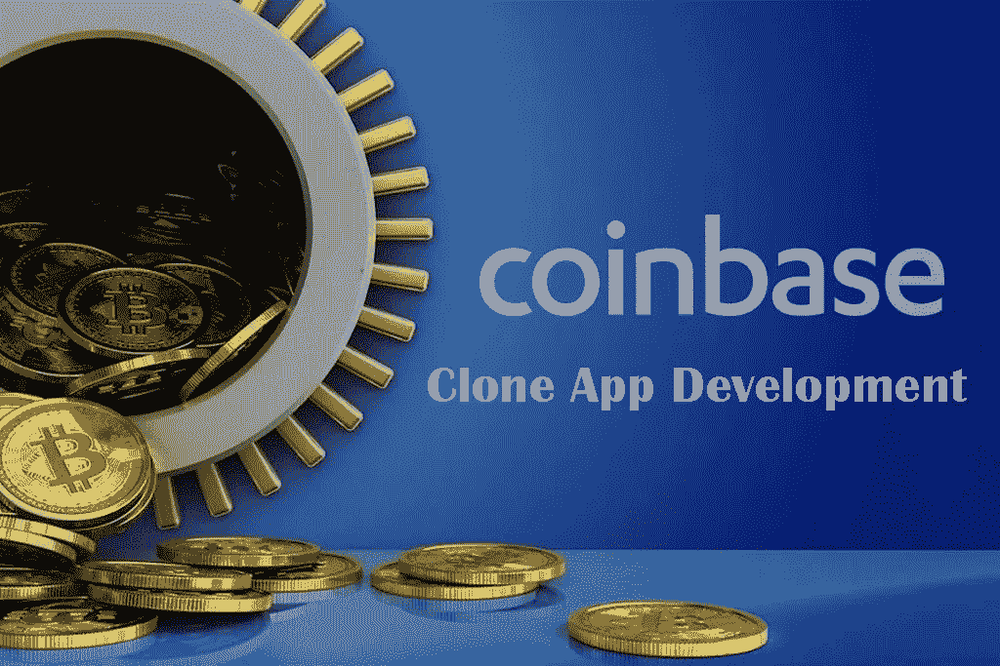
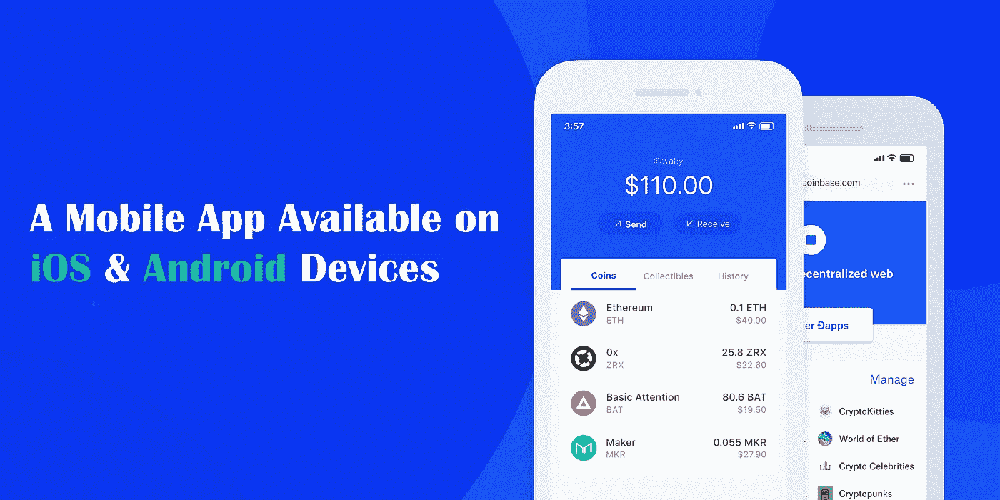
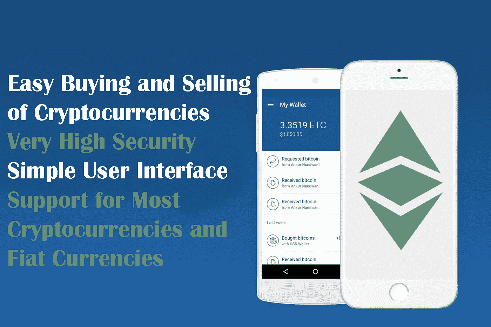
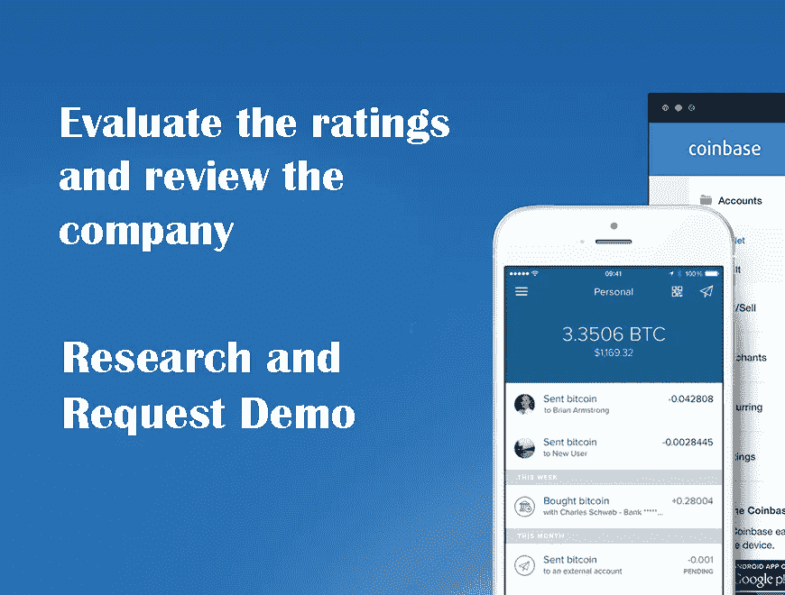

# CoinBase 克隆应用程序-如何开始构建像 CoinBase 这样的应用程序？

> 原文：<https://medium.com/nerd-for-tech/coinbase-clone-app-how-do-you-start-building-an-app-like-coinbase-a26744d6e406?source=collection_archive---------7----------------------->

近年来，加密货币增长了很多，这让很多人想到了买卖加密货币，并通过这种方式获利。像普通货币一样，加密货币必须在交易所买卖，这就是为什么各种交易所在网上被创建，其中最可靠的一个是比特币基地交易所。比特币基地在全球拥有数百万用户，交易额高达数十亿美元。这个交易所支持大多数加密货币，你可以将加密货币相互转换，或者使用法定货币买卖它们。

什么是 [***比特币基地克隆 App***](https://radindev.com/coinbase-clone-script/?utm_source=medium&utm_medium=referral&utm_campaign=medium&utm_content=coinbase_clone_app) ？比特币基地克隆 App 开发有什么特点和好处？如果你在问自己这些问题，那么这意味着你在某个地方听说过比特币基地，对于那些想要开始一个类似于比特币基地的加密交易所的人来说，这是有史以来最大的交易所之一。

# **关于比特币基地交易所**

现在，让我们只提到比特币基地是一个位于加利福尼亚州三藩市的加密货币交易所。通过它可以用比特币(₿)、以太坊、莱特币(莱特币)和世界各地的法定货币进行交易。

[比特币基地](https://coinmarketcap.com/rankings/exchanges/)是一家在 32 个国家运营的交易所，允许您管理加密货币的电子钱包(也称为钱包)。

## **关于比特币基地 App**

从各个市场的评论来看，这些应用似乎运行得非常好:

[Google Play](https://play.google.com/store/apps/details?id=com.coinbase.android&hl=en&gl=US) :比特币钱包——比特币基地:4 票，1 票

应用商店:比特币基地——比特币钱包:投票 4，5

使用比特币基地应用程序，可以从移动设备执行以下操作:

买卖比特币(也包括莱特币、Bch 和 Eth)

卖家和公司服务(比特币支付)

从智能手机访问钱包

让我们试着理解比特币基地应用克隆是如何工作的。

# **什么是比特币基地克隆 App？**

比特币基地克隆应用已经发布了一款可以在 iOS 和 Android 设备上使用的移动应用。对于那些希望能够随时随地进行交易的人，可以在移动应用程序上进行 24/7 的存款、取款和交易。比特币基地移动克隆应用程序允许用户轻松地与其他用户一起购买和出售加密货币&此外，该应用程序具有网络平台的所有功能和相同的功能。

我们作为一家加密交换软件开发公司，为您提供随时随地进行交易的特权，提供易于使用和智能的比特币基地克隆脚本开发。我们的专业开发人员提供直观的应用程序，帮助无缝通用交易，并吸引许多新的交易者。

如果你正计划启动一个应用加密货币交易所项目，并希望通过为客户提供高满意度来获得高投资回报，你可以用一个白色标签的比特币基地克隆应用来启动自己的加密交易所。

## **关于我们的 CoinBase 克隆应用功能**

比特币基地克隆应用程序向其用户提供了比特币基地网站上的所有功能，并提供了一个环境，让 Android 用户可以更方便快捷地进行交易，并买卖他们想要的加密货币。通过安装该程序，用户将被分配一个专用的钱包，用户可以将他的数字资产存储在其中。

这个程序最重要的应用和最有用的部分是它的通知。这个程序使用通知来通知你加密货币的最新变化，你甚至可以设置通知来通知你加密货币达到一定的价格，以便你可以尽可能快地和比别人更早地进行交易。

我们的比特币基地应用克隆提供了一个方便的移动比特币钱包，可在智能手机和平板电脑上使用。因此，你可以通过苹果 Android 或 iOS 应用程序访问你的钱包，在旅途中交易加密货币。另一个优势是比特币基地克隆提供了一个实时交换。

基本上，React-native 是一个为 iOS 和 Android 编写原生渲染应用的 JavaScript 框架。我们在比特币基地克隆应用程序开发中使用这种编程语言。

## **其他比特币基地克隆 App 功能**

支持大多数加密货币和法定货币

加密货币的简单买卖和相互交换

给用户分配一个免费的钱包

维护用户信息及其数字资产的安全性非常高

加密货币价格变化通知

提供最新的加密货币价格以及图表和分析工具

简单的用户界面

提供来自资本市场的新统计数据和新闻

## **使用比特币基地克隆 App 的好处**

使用比特币基地克隆应用程序意味着你不需要获得编码资源。无论是以内部软件开发团队的形式，还是以外包开发公司的形式，软件生产的成本都会迅速上升。白色标签几乎完全避免了这一过程。

比特币基地克隆应用程序节省您的开发时间和金钱。

比特币基地克隆应用程序提高了你的品牌知名度。

它允许你利用专家的工作。

也为你的品牌提供了一个精致的产品。

## **如何选择最好的比特币基地发展公司？**

具有完善商业战略的公司

评估评级并审查公司

公司是否提供高质量的支持和服务？

区块链技术接受度

更好的沟通

研究和请求演示

通常，应用程序是为两种平台设计的。(**安卓& iOS** )

**安卓手机应用开发**

使用您的应用接触全球最多的用户。我们为智能手机和平板电脑开发原生 Android 应用程序，帮助您的企业获得更多受众。

**iOS 移动应用开发**

我们的 iOS 应用程序开发服务为我们的客户提供了新的技术可能性和出色的用户体验，这有助于他们改善与客户的关系，并轻松进入新市场。我们为所有苹果设备开发 iOS 应用程序，因此您的客户可以在任何这些设备上使用您的产品。

## **结论**

开始…我们到了。

在这篇评论中，我们已经看到了使用**比特币基地克隆应用**来买卖加密货币是多么简单和直接。如果您没有经验，或者希望确保您使用的是受监管的平台，我们建议您使用此 exchange 克隆脚本。在比特币基地克隆的优势中，我们指出了开户的方便性，许多存款和取款选项，以及解释如何安全购买加密货币的免费资源。

使用 RadinDev technologies 立即启动您的比特币基地克隆应用程序交换平台。要开始，您可以从我们这里获得一个免费的演示。

此时，您可以阅读更多来自我们的文章！是的，他们是惊人的！我希望通过这篇介绍性的文章，我已经为那些和我一样对密码交易感兴趣的人提供了一个基本的想法。

你对这个主题的其他文章感兴趣吗？请在评论区给我你的反馈！

谢谢大家！