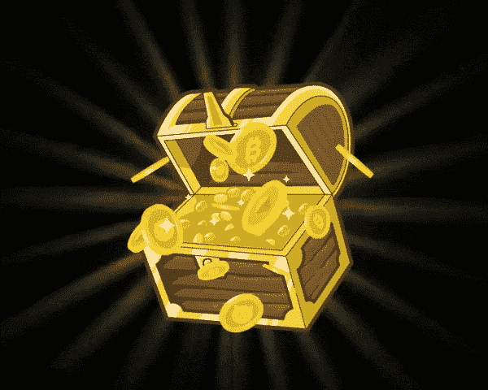

# 收集斯坦·李的查克拉-无敌的 NFTs。

> 原文：<https://medium.com/nerd-for-tech/collect-stan-lees-chakra-the-invincible-as-nfts-6c0b1734230b?source=collection_archive---------7----------------------->

查克拉——不可战胜的 NFT ，是超越生命的下一个大项目。俱乐部。查克拉被策划为独一无二的印度超级英雄 NFT 系列，具有巨大的需求和价值。作为独特的 NFT 收藏，七脉轮的力量为用户提供了独特的 3D 动画。 ***脉轮的 NFT 是 7 个脉轮激活的力量，使其不可战胜*** 。粉丝们&投资者非常期待《查克拉的力量》的推出，该片以不同的 3D 动画为特色，展示了 NFT 的超人能力。

新查克拉的 NFT 动画是基于查克拉的更新版本创建的，斯坦·李在他去世时为这个角色开发了真人版。每个人都可以参与拍卖，因为 NFT 是属于每个人的。每场拍卖的获胜者将获得一个限量版的“无敌查克拉”,上面有斯坦·李几年前的签名。对七脉轮力量的狂热正在 NFT 空间逐渐兴起，这是投资者见证增加投资组合需求的价值的合适时机。标志性的查克拉的 NFT 是镇上的新潮流。继续阅读，释放隐藏在背后的秘密。

## 什么是脉轮的 NFT？

自斯坦·李创作的印度宝莱坞超级英雄漫画《无敌查克拉》以来，《查克拉的 NFT》在全球范围内变得越来越受欢迎。Chakraverse NFT 系列将推出一个由 6865 个独特的 NFT 组成的独家**系列，由智能合约管理，以产生 Chakra Artpunks。斯坦·李的查克拉无敌官方 NFT 很快就可以作为 NFT 下降。投资者在盲目购买后将获得含有最新查克拉 NFT 的签名战利品盒。Chakraverse 系列将包括一个极其有限的基于漫画小说人物的 Chakra 艺术朋克系列。**

 [## 探索斯坦·李的查克拉 NFTs |查克拉无敌 NFTs |超越生命

### BeyondLife.club 推出斯坦·李的查克拉无敌官方 NFT 收藏，包括动画、漫画剧照…

查克拉.超越生命.俱乐部](https://chakra.beyondlife.club/?fsz=home) 

## 是什么让斯坦·李的查克拉无敌 NFTs 受投资者欢迎？

无敌查克拉是由超生推出的。俱乐部将让斯坦·李的生日在全球的球迷和投资者中变得难忘。斯坦·李为《查克拉漫画》联合创作的国际超级英雄形象将永远成为人们关注的焦点。查克拉的 NFT 收藏包括突出人物的超能力和起源的类别。查克拉的 NFT 系列发布会公开邀请每一位斯坦·李崇拜者继承他的遗产。查克拉艺术朋克战利品箱为投资者提供了一个独特的查克拉 NFT。这些 NFT 是独一无二的，包含了斯坦·李在 NFT 独家收藏中的原创角色。

斯坦·李的查克拉无敌漫画书提供了前所未见的原始 3D 封面。查克拉漫画提供了一系列具有签名属性的人物的独家剧照。一个完整的集动画生活漫画封面 NFTs 带来了查克拉复活。动画漫画的封面是基于斯坦·李对动画电影和漫画的各种化身的创作而设计的。它通过将脉轮的体验带到一个新的维度，保留了喜剧角色的本质。查克拉 NFT 的价值永远不会消失，值得投资者投资，共创美好未来。

## 在 NFT 七个脉轮的力量是什么？

斯坦·李创造的印度宝莱坞的查克拉角色在漫画中释放了各种查克拉的力量。这位传奇人物本人在亚洲漫画界第一次见证了查克拉漫画的创作。斯坦·李根据古代人本质上认可的生命能量来描述脉轮的力量。查克拉的权力被分为七类独特的 NFT 收藏，为投资者提供独特的三维动画。

*   **顶轮:**

皇冠脉轮是七个脉轮中最高的，为超级英雄提供鼓舞人心的能量。查克拉周围的力量允许印度超级英雄通过多维时间旅行穿越现在、过去和未来。

*   **心轮:**

心脏脉轮是关于同情的，它使西装持有者能够平衡复仇行为或任何其他情绪。对于超级英雄来说，这是最强大的能量，它赋予了根据周围发生的事件来控制情绪的智慧。

*   **视觉脉轮:**

视觉脉轮作为超级英雄的第三只眼能力来控制他的思想和有效地处理环境。这是通往精神收获、提高注意力、加强直觉和洞察力的大门。

*   **声音脉轮:**

声音脉轮使超级英雄能够以声音能量的形式实现他的内在本能，并相信这个过程可以处理这种情况。它帮助他远离谎言和欺骗。

*   **太阳脉轮:**

太阳脉轮让超级英雄在对现实中的敌人造成严重伤害时感到最强大和最有防御能力。这种能量的平衡引导他以正确的方式自我激励来控制消极的局面。

*   **罗刹脉轮:**

Raksha Chakra 有很大的潜力来启发超级英雄与敌人战斗的勇气和控制卷入深层思想。这种力量就像一面强大的盾牌，保护他免受迫在眉睫的危险。

*   **根脉轮:**

根脉轮是所有力量的基础，使印度超级英雄能够飞到任何地方。这个脉轮中的能量帮助他达到几个目的，如生存、安全和稳定，以平衡力量。

## 总结一下:

[***查克拉的 NFT 系列***](https://chakra.beyondlife.club/?fsz=home) 将以查克拉的《无敌起源》故事中的人物为基础，推出 7000 件独特的生殖艺术作品的独家收藏系列。它还提供了一系列原创的高端 3D 动画和参与拍卖的限量版**斯坦·李的查克拉的 NFT** 。NFT 艺术查克拉维什收藏将在全球范围内为 NFT 所有者创建一个新的社区。斯坦·李在 NFT 创造的七脉轮力量为投资者带来了前所未有的收益，让他们在竞争激烈的世界中更加光彩夺目。投资者可以与世界上最好的 Beyondlife.club 联系，以实惠的价格利用 3D 动画 NFT 收集的七轮力量，在其他人之上繁荣发展。