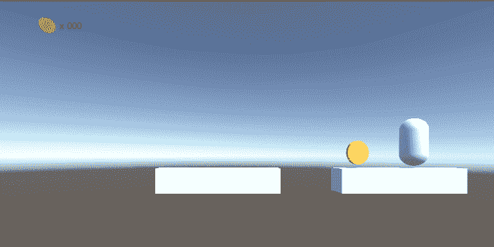
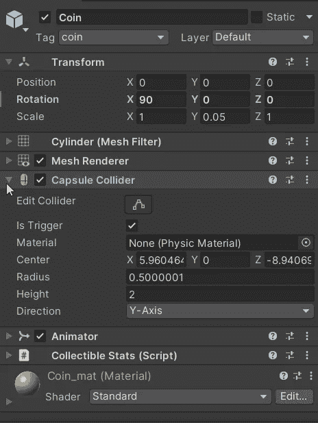

# 收集东西

> 原文：<https://medium.com/nerd-for-tech/collecting-stuff-fdc0d5563426?source=collection_archive---------5----------------------->

**目的**:使硬币具有收藏价值

为了有一个真正的平台游戏，我们必须**收集硬币**或其他什么。因为硬币和玩家都有一个**碰撞器**，这将非常简单。

让我们为玩家 *CollectionManager* 创建一个单独的脚本。

像往常一样，我们将**切换到**标签上。现在让我们关注硬币:当我们输入它的触发器时，我们调用**销毁**收藏品，然后**将**一个硬币值(存储在附加到硬币的*collective stats*脚本中)添加到 *PlayerStats* (另一个简单的脚本只保存值和改变它们的方法)。销毁必须在碰撞器对象上执行，但也必须在它的父对象上执行(如果存在，记住`null`父对象意味着没有父对象)，因为 coin true 对象存储在一个空的父对象中。

然后，`AddCoin`方法会通过调用一个单独的 *UIManager* 脚本来添加值并更新 UI。

在未来，我们只需要将相同的逻辑应用到每个收藏品上(生命，不同的硬币，启动…)。

