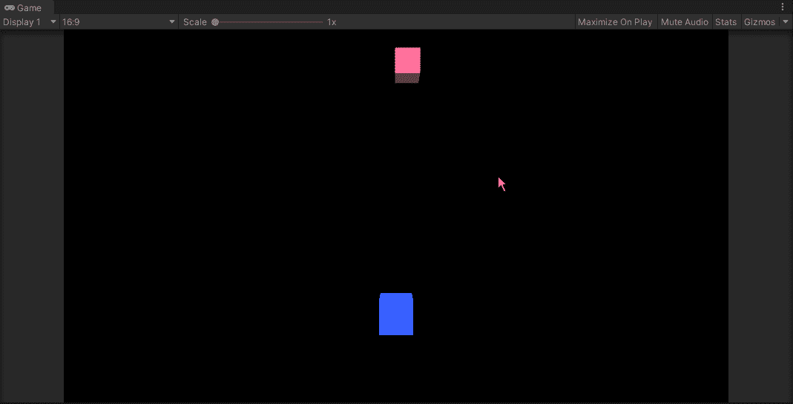
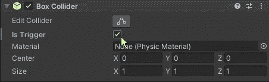
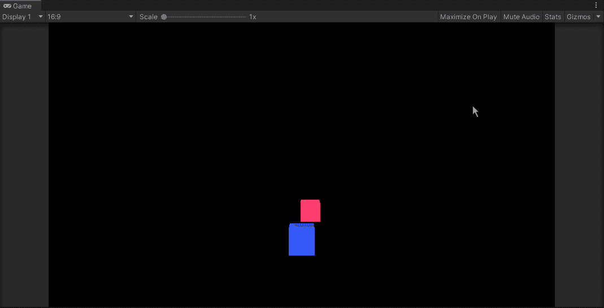
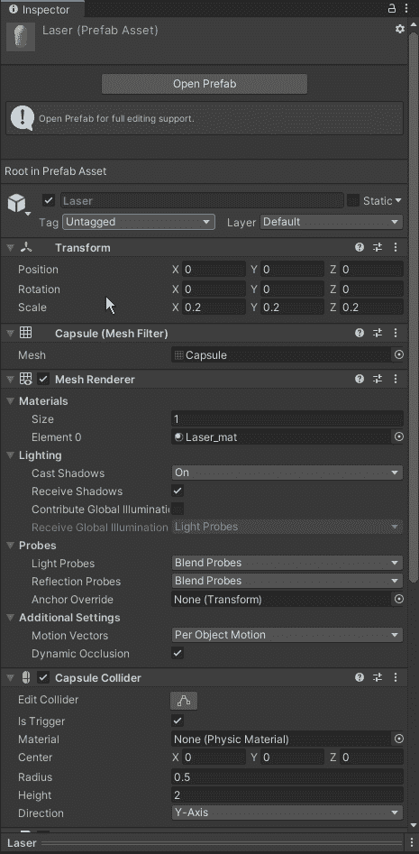
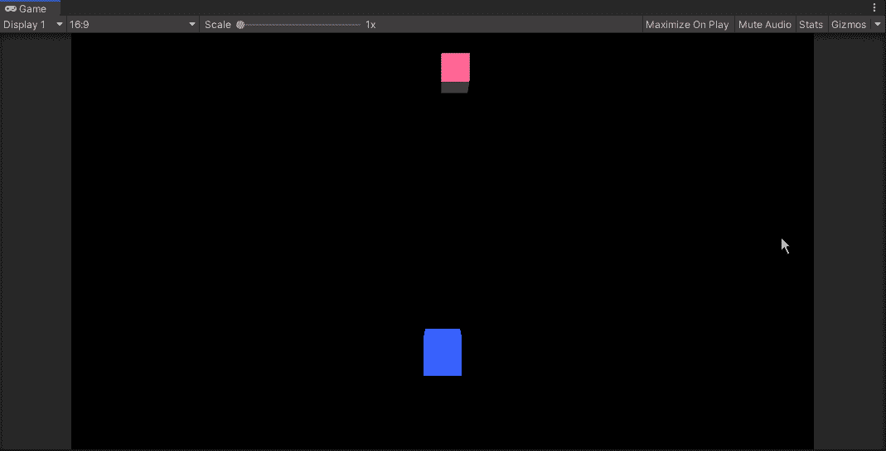

# 碰撞还是触发？-游戏开发系列 09

> 原文：<https://medium.com/nerd-for-tech/collision-or-trigger-game-dev-series-09-72a89e7b04d2?source=collection_archive---------15----------------------->

我应该做一个触发器吗？还是碰撞？这是一个大问题。

上一篇:[Unity 里的一点物理](https://sj-jason-liu.medium.com/a-little-physics-in-unity-game-dev-series-08-28c4d54b80b1)

我们创造了一个敌人并让它移动。然而，它停在我们的球员上方，这不是我们想要的结果。要处理这个，我们需要了解 2 个主要碰撞器的功能-
`OnCollisionEnter` & `OnTriggerEnter`。

在我们撞上之前，我们需要和我们的敌人做一些调整。首先，我们需要将下落速度从重力降低到一个可调变量。
让我们取消敌人的重力，然后我们创建一个名为`Enemy`的 C#脚本并附加到它上面。
在脚本中，我们需要创建一个下落运动，就像我们的激光运动方向相反。

创建一个速度变量，让我们的敌人像往常一样按照现实世界的时间移动。

```
[SerializeField]
private float _speed = 4f;void Update()
{
  transform.Translate(Vector3.down * _speed * Time.deltaTime);
}
```

用向下的运动是不够的，我们需要让它回到顶部，如果它到达底部。并且在 X 轴上随机移动，

```
[SerializeField]
private float _speed = 4f;void Update()
{
  transform.Translate(Vector3.down * _speed * Time.deltaTime); if(transform.position.y <= -5.5f)
  {
    float randomX = Random.Range(-9.5f, 9.5f);
    transform.position = new Vector3(randomX, 7.5f, 0);  }
}
```

我们为随机化 x 轴创建了一个浮动，如果敌人在 y 轴上低于-5.5，就把它设置为一个新的开始位置。

现在我们的敌人变得不可预测了。
我们来考察一下激光和播放器的碰撞。

我们所有的游戏对象都有碰撞器，因此碰撞应该是一个清晰的结果。



如你所见，一切都变得疯狂。那是因为我们在游戏中使用了错误的碰撞类型。
碰撞有两种类型:

*   物理碰撞
*   触发碰撞

物理碰撞，正如我们通常在脚本中使用的`OnCollisionEnter`，是上面显示的结果，一切都相互碰撞。另一方面，触发碰撞更像是概念碰撞。你实际上并没有碰到什么东西，而是碰到了一个开关或遥控器。

`OnCollisionEnter`多用于对真实物体如汽车相撞或肉搏出拳。我们通常在一些非现实的物体上使用触发碰撞作为脚本中的`OnTriggerEnter`，比如游戏中的通电球体或漂浮的灵魂碎片。我们将用同样的碰撞来伤害我们的武器。

要将我们的碰撞改为触发碰撞，只需检查碰撞器组件中的`Is Trigger`。



不要忘记检查玩家、激光和敌人的所有触发器。

然后我们可以再玩一次看看结果。



而那更像是激光在现实生活中的工作(？).下一步是让我们的激光消灭敌人。

如上所述，我们用`OnCollisionEnter` & `OnTriggerEnter`来处理碰撞。在我们的情况下，我们使用`OnTriggerEnter`。让我们将代码添加到我们的敌人脚本中。

在`Update()`下面，输入 OnTriggerEnter，它会帮助您创建一个方法，

```
private void OnTriggerEnter(Collision other)
{}
```

当我们调用这个方法时，它会自动创建一个变量来识别碰撞的目标，这个变量叫做“其他”，我们将使用它来识别目标是玩家还是激光。
为此，我们将使用 Unity 中另一个名为“tag”的功能。

“标签”是用来分隔 Unity 中游戏对象的类型。例如，如果你设置的脚本函数只能作用于带有标签“玩家”的游戏对象，它就不能作用于你给游戏对象赋予标签“环境”的环境。

我们可以为我们的激光预置创建一个名为“激光”的标签，为我们的玩家创建一个“玩家”的标签。



我们可以给`OnTriggerEnter`添加一个 if 语句，然后在碰撞发生后摧毁激光和敌人，

```
private void OnTriggerEnter(Collision other)
{
  if(other.transform.tag == "Player"
  {
    //damage the Player
    Destroy(this.gameObject);
  }
  else if(other.transform.tag == "Laser"
  {
    Destroy(other.gameObject); Deatroy(this.gameObject);  
  }}
```

到目前为止，我们还不能摧毁我们剧本中的玩家，但是当激光击中敌人时，我们仍然可以摧毁它。这是它看起来的样子，



接下来:[用 GetComponent](https://sj-jason-liu.medium.com/contact-to-other-scripts-with-getcomponent-game-dev-series-10-a5ca9c01ec8e) 联系其他脚本