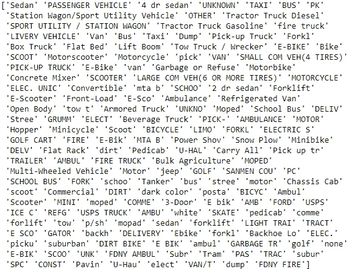
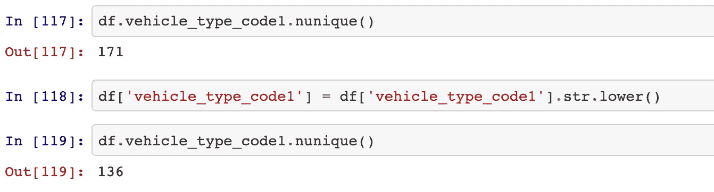
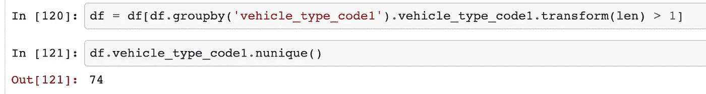
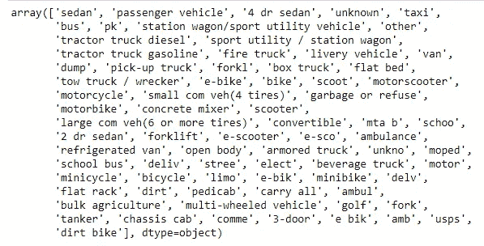
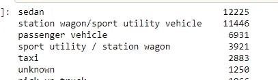
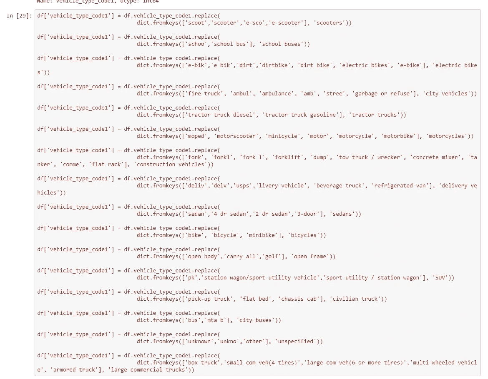
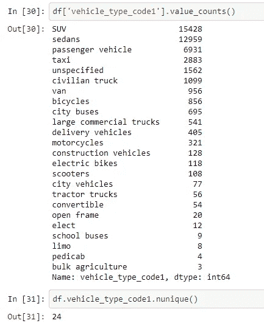

# 色谱柱清洁度

> 原文：<https://medium.com/nerd-for-tech/column-cleanliness-5e2157650bd3?source=collection_archive---------21----------------------->

## 如何清洁非常脏的色谱柱

我和我的同学最近决定处理一个非常脏的数据集。在一起上学时，我们一致认为我们处理的大多数数据都是安全的。很多时候，缺少的值很少。如果存在缺失值，通常会以某种方式删除或插入它们。虽然这是对学生友好的，但这是非常不现实的。

在我们寻找脏数据集的过程中，我们找到了一个。小心你的愿望。我们发现了一个最初由纽约市交通局制作并上传到 Data.gov 的数据集。作为一个公共数据集(相当大)，我们也能够在 Bigquery 数据仓库中找到这个数据。我们决定分析行人死亡和受伤情况，并根据我们的发现为行人提出更安全的条件。在执行 SQL 查询以仅检索涉及行人的行之后，我们看到了 90，000 个数据点，这是我所见过的最脏的数据。

# 问题是

在这篇文章中，我想特别介绍一个专栏。问题中的违规栏目标题为***vehicle _ type _ code 1***。这是一种抽象的说法，即车辆类型的描述对事故的发生负有最大责任。当我第一次看到这个专栏的独特值时，我能感觉到自己出了一身冷汗。我的衬衫领子感觉很紧，我的嘴微微张开，等待一只苍蝇嗡嗡作响。唯一值列表(有 171 个唯一值)如下所示。

vehicle_type_code1 列中所有唯一值的数组。

当你看上面的唯一值列表时，你会发现它完全是漫不经心的。我的猜测是，这是一个填写事故报告的人可以写任何他们喜欢的条目的类别。似乎没有标准的车辆分类方法。这是任何一个数据人都头疼的问题。扫描数据，您可以立即看到，有些条目非常相似，但却清楚地标识了相同的车辆类型。例如，“E bik”、“E-BIK”、“E-Bik”等都是车辆型电动自行车的化身。我们如何将这些按逻辑顺序组合在一起？

# **方法到疯狂**

我们采取的第一步是将列中的每个字符串都转换为小写，以消除来自小写和大写形式的同一个单词的冗余。正如您在下面看到的，这使得唯一条目的数量从 171 个减少到 136 个。从一开始就去掉 35 个多余的值已经使清理过程变得更容易了。插入强制如释重负的叹息。

接下来，看每种类型车辆的频率似乎是合乎逻辑的。我们的发现表明，只被报道过一次的车型通常甚至不是逻辑词或陈述。在清理过程的这一点上还剩下大约 70，000 个数据点，因此删除仅出现一次的 62 个数据点是可以接受的。特别是因为它们没有给这个类别增加任何表面上的价值。这使得我们的独特价值减少到 74。现在我们用油脂烹饪。

我们不要太激动。虽然这个数组比我们开始时友好得多，但冗余和笨拙输入的车辆类型仍然影响了这个数据。

看下面的剪辑，它有从最大到最小的每种类型的值计数，几个组件突出。首先是*旅行车/运动型多功能车*和*运动型多功能车/旅行车*被列为单独条目。虽然这些数据对冗余并不陌生，但这一个是至关重要的。如果我们让它保持原样，轿车似乎是事故中最常见的车辆。我们需要以消除条目冗余的方式组织数据。只有这样，我们才能确定造成事故的最常见的车辆。

在研究了几种实现组合条目冗余的方法后，我们最终选择了 ***。*替换()**。我确实知道有一种方法可以使用 regex 函数来搜索字符串模式，但是目前这项工作仍在进行中。为了简单起见，看看下面我们将条目分组的方式。即使使用 regex 函数，这也是一项需要大量手动输入和研究的任务。有些车型我们甚至不知道它们是什么。很多时间都花在了谷歌搜索和分类上。

最后，在运行上面的代码之后，我们为这个列找到了 24 个非常干净的唯一值。看一看！还要注意，我关于运动型多功能车或 SUV 的理论是正确的。一旦轿车和 SUV 的所有实例被合并到一个类别类型中，SUV 就是涉及行人的事故的最常见原因。这是一个清晰的列表，任何浏览数据的人都可以很容易地理解它。

** *请注意，我们确实在数据集中留下了未指定的车辆。这里的逻辑是，我们仍然试图尽可能多地保留数据点。虽然车辆的类型有助于预测，但这不是我们试图预测的。对此可能会有一些强烈的意见，但我很乐意接受任何有思想的批评。*

# 结论

这个项目仍在进行中。仍然有如此多的工作和增长要发生，以配合这个暴风雨般的数据。清理这么乱的柱子是一次很好的学习经历。当我们想象自己在工作时，有时我们会认为这是戴着眼镜从鼻梁上滑下来疯狂地打字。在这个过程的大部分时间里，情况并非如此。我在这方面的大部分工作是思考处理这种情况的最佳方式，同时理解类别本身的内容。希望这对你的数据冒险有所帮助，祝你数据清理愉快！