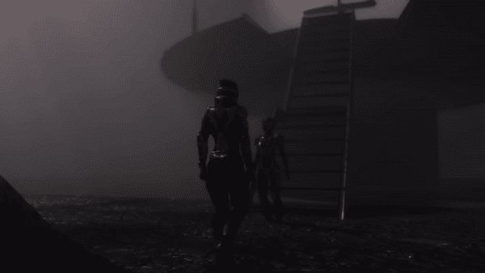

# 结合 Cinemachine 和 Timeline 实现终极控制

> 原文：<https://medium.com/nerd-for-tech/combining-cinemachine-and-timeline-for-ultimate-control-e54b16056a9?source=collection_archive---------0----------------------->

当我接近使用 *Cinemachine* 和 *Timeline* 的这个系列的结尾时，更容易看到这两个工具如何携手为游戏或电影制作出色的过场动画。让我们来看一个将它们放在一起的例子。许多细节已经在以前的文章中讨论过了，所以我将主要总结本文中发生的事情。