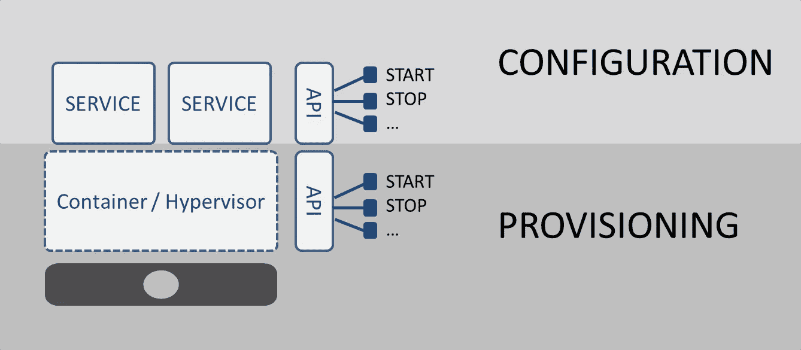
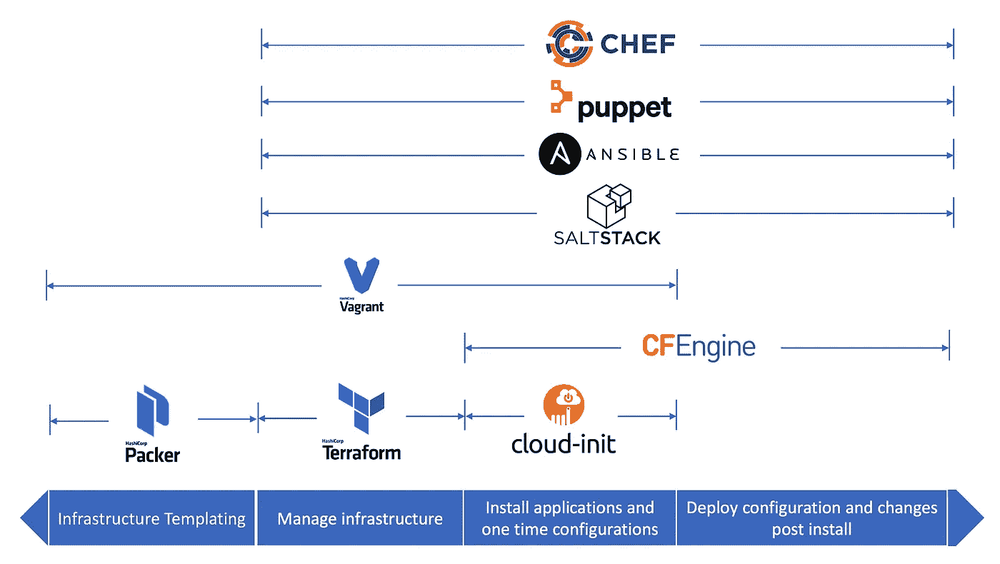

# 结合基础设施作为代码软件工具来创建和管理您的应用程序

> 原文：<https://medium.com/nerd-for-tech/combining-infrastructure-as-code-software-tools-to-manage-and-provision-your-application-652e75eba235?source=collection_archive---------3----------------------->

> 作为代码的基础设施通常是指在文本文件中定义的声明性模型中定义基础设施的实践。如果与 DevOps 文化相结合，这将对公司有很大的帮助，因为它使得以简单可靠的方式在整个基础架构中编辑和分发配置变得更加容易。我们提出了一种将多个基础设施组合成代码工具来管理和供应您的应用程序的方法。


信用: [bridgecrew](https://bridgecrew.io/infrastructure-as-code-security/)

基础设施即代码(IaC)是一种自动配置 IT 基础设施的方式。IaC 使用一种高级描述性编码语言，旨在自动提供应用程序基础设施。这消除了开发人员手动配置和管理服务器、存储和云服务的需要。

IaC 概念非常类似于编程脚本。两者都实现了流程的自动化，但它们在调配和部署流程的能力上有所不同，这些流程更加通用，更能适应不同类型的环境。可以创建一个或一组服务器，所有这些都基于符合业务现实的脚本和逻辑。如果与 [DevOps 文化](https://martinfowler.com/bliki/DevOpsCulture.html)相结合，这对公司会有很大的帮助。

作为代码的基础设施的目标是通过消除手动过程和过程中的松弛来使事情变得更快。基于代码的方法更容易做到事半功倍。我们可以突出一些优势:

*   **敏捷性:** IaC 加速了为开发、测试和生产应用程序提供基础设施的过程。允许配置只运行一个脚本的完整环境。
*   一致性:您的配置文件只有一个信息来源。这确保了能够一致地重复执行资源调配，并且不会出现信息差异。
*   **安全性:**这些工具使我们能够快速修复错误并自动排除故障，从而在整个企业范围内建立更安全、更易于管理的基础设施。

本文介绍了将基础设施作为代码软件工具来管理和供应应用程序的原因。

# 流程编排与配置管理

IaC 工具可以分为两类:*编排*和*配置管理*工具。当我们假设可以利用虚拟化和容器时，这是一个关键的区别。

第一个用于调配和管理环境的组件，比如云资源。AWS CloudFormation 和 [Terraform](https://www.terraform.io/) 是作为代码编排工具的基础设施的例子。另一个旨在安装和管理运行在服务器上的软件，如[木偶](https://puppet.com/)、[厨师](https://www.chef.io/products/chef-infra)和 [Ansible](https://www.ansible.com/) 。我们不能选择单一的工具。

认识到部署过程中这两个步骤之间的差异并考虑到配置后配置对该过程的影响非常重要。根据配置方法的不同，这一步会对整个部署过程的速度和效率产生严重影响。



信用:[devops.com](https://devops.com/provisioning-vs-configuration/)

# 结合基础设施作为代码软件工具

尽管虚拟化和容器使得提供服务实例变得相对容易，但是仍然必须手动配置这些服务。部署新服务时，现有设置将不会完全有效。如果只是为了确保服务与正确的应用程序交互，那么总会有一些定制需要进行。

流程编排满足了自动化环境生命周期的需求。这些工具确保环境持续处于其期望的状态。他关心基础设施的供应、规模和操作。例如，每当有任何系统故障时，Terraform 会在充电后自动恢复并计算系统中的整个过程。它最适合需要恒定不变状态的情况。这将有助于有效解决所有异常情况。

这意味着一旦服务供应完成，仍有工作要做。例如，你不能在没有指导它如何分配负载和哪组服务器的情况下就启动负载平衡服务。

配置管理(CM)工具在本地解决问题，而不是完全替换系统。它们自动配置应用程序或硬件。CM 工具有助于配置每一个动作和仪器，并确保顺利操作，没有任何损坏或错误。因此，它倾向于针对特定的应用程序或领域进行高度专门化。

编排者将把配置经理委派给部署的元素。这种委托可以由 Orchestrator 触发，也可以完全委托给运营部门，具体取决于 CM 工具。从减少错误和缩短上市时间的角度来看，最终带来好处的是配置流程的优化，而不是资源调配。



信用:[高图书馆](https://www.golibrary.co/infrastructure-as-code-orchestration-provisioning-configuration-management-ansible-terraform/)

# 用例-设置 WordPress 服务

我们想给你提供一个现成的 WordPress 页面的路径。在这个旅程中，我们让您自由地加深对所用工具和资源的了解。首先，我们需要使用 Terraform 在云提供商上构建资源。对于这个例子，让我们使用谷歌云平台(GCP)。

```
provider "google" {
 project     = “google-demo”
 region      = "europe-west1"
}
```

为了在我们的项目中使用虚拟机或者在 web 浏览器中显示我们的页面，我们需要一个虚拟网络，在其中可以添加其他 GCP 资源，比如节点、地址、防火墙规则。

```
resource "google_compute_network" "this" {
  auto_create_subnetworks = false
  name                    = "example"
  routing_mode            = "REGIONAL"
}

resource "google_compute_subnetwork" "this" {
  name          = "example"
  ip_cidr_range = 192.168.24.0/24
  region        = "europe-west1"
  network       = google_compute_network.this.id
}resource "google_compute_global_address" "this" {
  provider = google-beta

  name          = "private-ip-db-address"
  purpose       = "VPC_PEERING"
  address_type  = "INTERNAL"
  prefix_length = 16
  network       = google_compute_network.this.id
}

resource "google_service_networking_connection" "this" {
  provider = google-beta

  network                 = google_compute_network.this.id
  service                 = "servicenetworking.googleapis.com"
  reserved_peering_ranges =[google_compute_global_address.this.name]
}
```

为了正确启动一个功能性的 WordPress 实例，我们需要一个数据库。我们可以为数据库创建一个虚拟机，安装并配置它。我们还可以通过云利用托管服务，无需担心从头开始创建整个基础架构。只需几行代码，我们就可以部署一个新的、闪亮的 MySQL 实例。

```
resource "google_sql_database_instance" "this" {
  database_version = "MYSQL_5_7"
  name             = example-wordpress
  region           = "europe-west1"

  depends_on = [
  google_service_networking_connection.this]

  settings {
    availability_type = "REGIONAL"
    disk_autoresize   = false
    disk_size         = 50
    disk_type         = "PD_HDD"
    tier              = "db-g1-small"

    backup_configuration {
      enabled            = true
      start_time         = "04:00"
      binary_log_enabled = true
    }

    ip_configuration {
      ipv4_enabled    = false
      private_network = google_compute_network.this.id
    }

    location_preference {
      zone = "europe-west1-a"
    }

    database_flags {
      name  = "max_connections"
      value = 500
    }
  }
}

resource "google_sql_database" "this" {
  name      = "wordpress"
  instance  = google_sql_database_instance.this.name
  charset   = "utf8"
  collation = "utf8_general_ci"
}
```

最后，我们需要为我们的 WordPress 应用程序创建一个虚拟机。为此，我们需要一些关于以下方面的详细信息:

*   我们选择了哪种类型的机器，
*   我们选择了什么形象，
*   我们选择了多大的磁盘。

我们可以在 [GCP 文档](https://cloud.google.com/compute/docs/machine-types)中查看。出于教程的目的，我们不需要一台拥有大量 vCPUs 和 RAM 的大机器，所以我们选择了一台小机器。

```
resource "google_compute_instance" "this" {
 name                    = "example-wordpress"
 machine_type            = "e2-standard-2"
 zone                    = "europe-west1-b"
  metadata_startup_script = templatefile("${path.module}/init.sh", {
    DB_USERNAME = random_string.this.result
    DB_PASSWORD = random_password.this.result
    DB_HOST     = google_sql_database_instance.this.private_ip_address
  })

 boot_disk {
   initialize_params {
     image = “debian-cloud/debian-10”
     size  = 50
   }
 }

 network_interface {
   subnetwork = google_compute_subnetwork.this.id

   access_config {
     nat_ip = google_compute_address.this.address
   }
 }

 service_account {
   scopes = ["userinfo-email", "compute-ro", "storage-ro"]
 }
}
```

之后，我们会调配整个环境。但是我们只有一般的功能。我们需要把这个基础设施变成一个 WordPress 应用程序。所以我们需要用 WordPress 来设置这个环境。为此，我们将使用 Ansible。

```
---
- name: Download WordPress
  get_url: url=http://wordpress.org/wordpress-{{ wp_version }}.tar.gz dest=/srv/wordpress-{{ wp_version }}.tar.gz
           sha256sum="{{ wp_sha256sum }}"

- name: Extract archive
  unarchive:
    creates: /srv/wordpress
    src: /srv/wordpress-{{ wp_version }}.tar.gz
    dest: /srv/wordpress

- name: Add group "wordpress"
  group: name=wordpress

- name: Add user "wordpress"
  user: name=wordpress group=wordpress home=/srv/wordpress/

- name: Fetch random salts for WordPress config
  get_url:
    url: https://api.wordpress.org/secret-key/1.1/salt/
  register: "wp_salt"
  become: no
  become_method: sudo
  changed_when: true
  delegate_to: localhost

- name: Create WordPress database
  mysql_db: name={{ wp_db_name }} state=present

- name: Create WordPress database user
  mysql_user: name={{ wp_db_user }} password={{ wp_db_password }} priv={{ wp_db_name }}.*:ALL host='localhost' state=present

- name: Copy WordPress config file
  template: src=wp-config.php dest=/srv/wordpress/

- name: Change ownership of WordPress installation
  file: path=/srv/wordpress/ owner=wordpress group=wordpress state=directory recurse=yes setype=httpd_sys_content_t

- name: Start php-fpm Service
  service: name=php-fpm state=started enabled=yes
```

这个可行的剧本部署了一个简单的 WordPress 平台配置。使用时，将`hosts.example`文件复制到`hosts`并编辑`hosts`库存文件以包含必要的变量。然后，您只需运行行动手册，就像这样:

```
ansible-playbook -i hosts wordpress.yml
```

之后，你将拥有一个 WordPress 服务，所有的基础设施都是通过代码配置的。

# 结论

基础设施即代码包括使用高级描述性编码语言，旨在自动化应用程序基础设施的供应。IaC 的目标是通过消除手动过程和过程中的松弛来使事情变得更快。基于代码的方法更容易做到事半功倍。将基础设施组合成代码软件工具可以帮助您实现环境的一致性、敏捷性和安全性。我们展示了一个用例，其中使用了*编排*和*配置管理*工具来创建一个现成的 WordPress 页面。