# Unity 中的命令设计模式

> 原文：<https://medium.com/nerd-for-tech/command-design-pattern-in-unity-17979cce686f?source=collection_archive---------3----------------------->

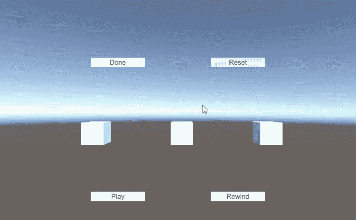

命令模式是一种行为模式，允许您记录应用程序的动作或事件。一个很好的例子是在战术游戏中，玩家可以为多个角色设计多个动作，然后播放出来，如果是坏的动作就倒带。

为了建立一个命令模式的例子，我建立了一个简单的场景，有三个立方体和一些按钮。

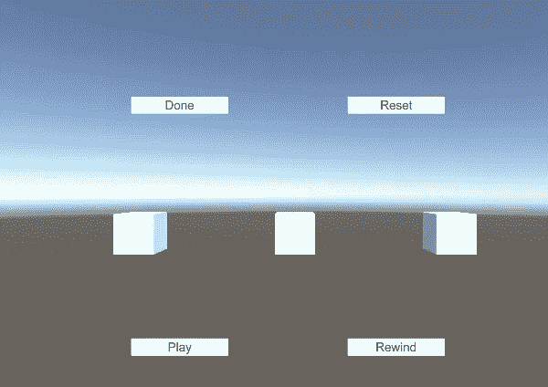

首先要做的是创建一个具有 execute 和 undue 方法的接口。

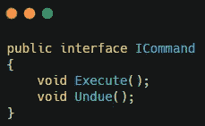

接下来，创建一个简单的用户输入脚本，允许玩家点击。这将在玩家点击时创建一个光线投射。如果检测到立方体，将创建一个新的 ICommand。然后它将调用 execute 方法。最后，它将使用一个简单的命令管理器脚本中的方法将新的 ICommand 添加到列表中。

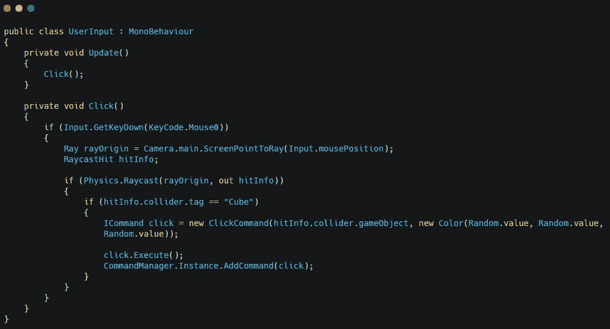

注意:稍后将显示命令管理器。

为将继承 ICommand 的 click 命令创建脚本。这个脚本将引用一个立方体游戏对象、一种颜色和一个先前的颜色。

execute 方法会将以前的颜色设置为当前颜色，然后更改立方体的颜色。

undue 方法会将立方体的颜色设置为以前的颜色。

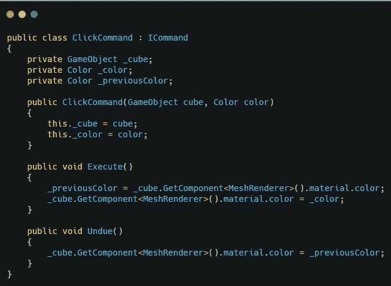

现在是时候讨论命令管理器脚本了。

首先，使这个脚本成为单例脚本。

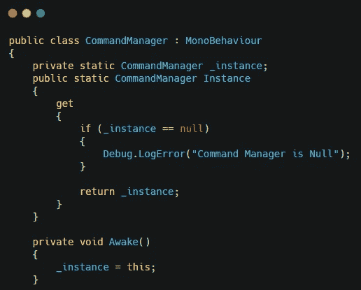

创建一个包含 ICommands 的列表。

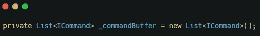

您将创建一个向列表添加命令的方法。

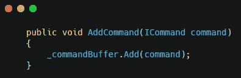

play 方法将调用协程，协程将在每个命令上调用 execute 方法。

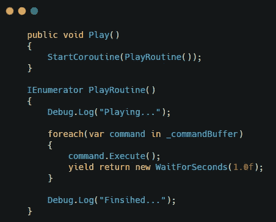

一个 rewind 方法，它将做 play 方法所做的事情，但是它将向后遍历列表并调用 undue 方法。

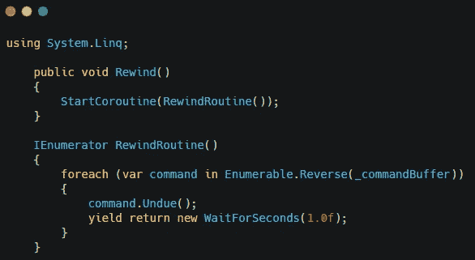

一个将所有立方体变成白色的方法。

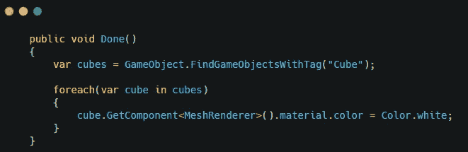

和一个清除列表的重置方法。

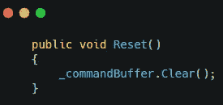

现在进入 unity，设置按钮为被点击的按钮调用正确的方法，你将能够记录一系列点击，并向前或向后播放。

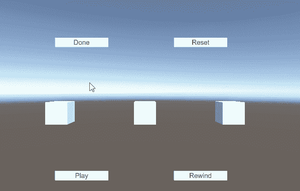