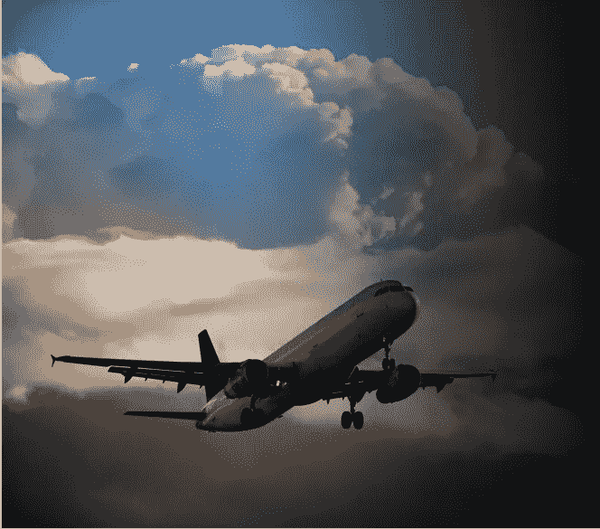
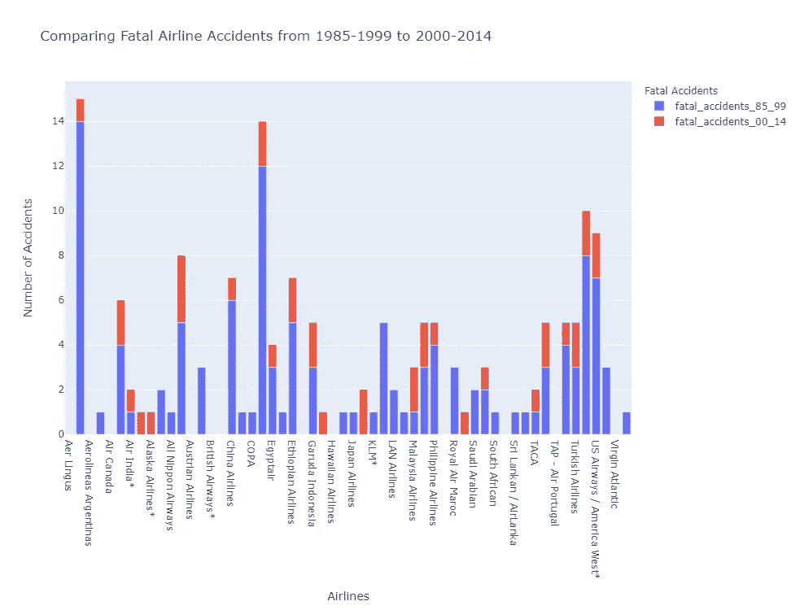
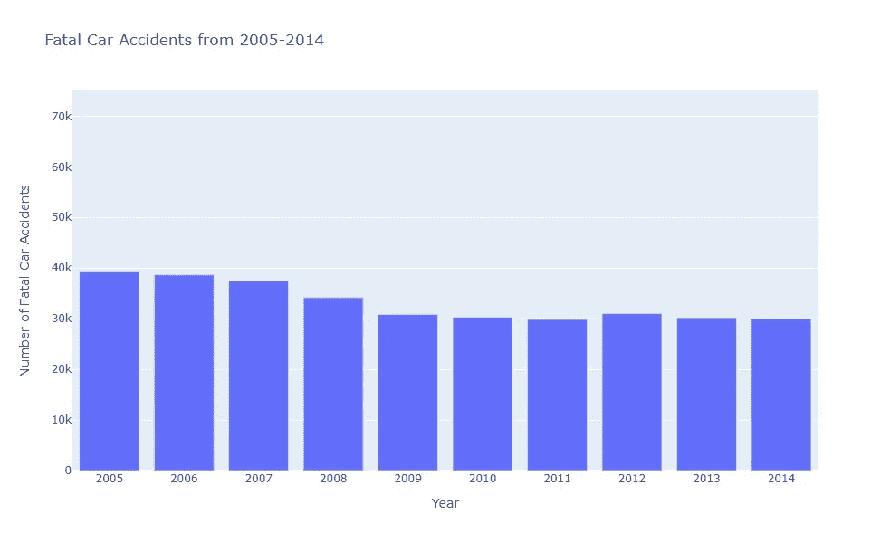
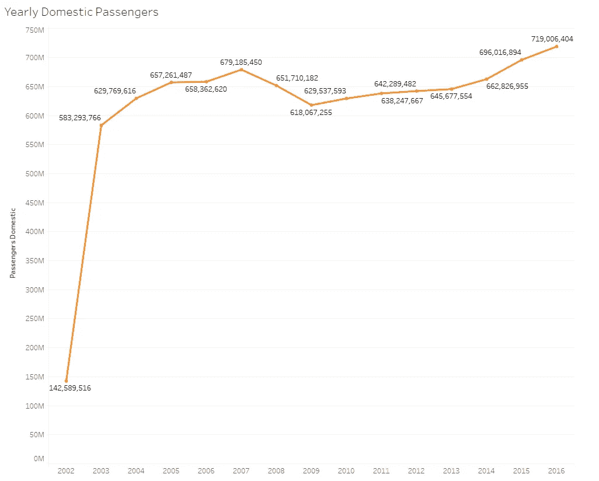
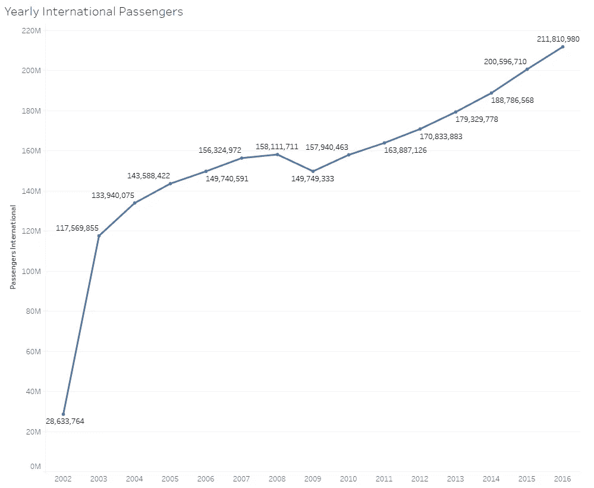
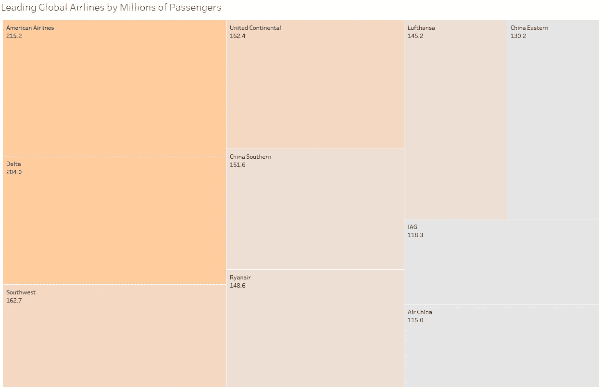

# 商业航空安全

> 原文：<https://medium.com/nerd-for-tech/commercial-aviation-safety-7e0212c5afc2?source=collection_archive---------23----------------------->

航空运输是安全的，媒体报道是不准确的。

DSC-640 博客文章

来自 PowerPoint 的图像

由于事故罕见，媒体对航空公司的报道非常多。航空旅行被认为是最安全的交通方式之一。为了展示飞行的现状，我们展示了航空业的数据以及对乘客的影响。

我们首先关注的图表之一是 28 年间的航空安全。航空公司事故分类的一个常见错误是记录不正确。例如，如果一名乘客在飞行中死亡，这将被算作死亡事故。然而，致命性并不反映飞机的性能。在这个博客中，我们将讨论真实的飞机事故。

## **航空安全**

在下图中，我们比较了 1985 年至 1999 年和 2000 年至 2014 年的致命事故。很快，我们注意到致命事故大幅减少。仔细看一下具体的航空公司，事故发生率最高的航空公司是爱尔兰航空公司，在 1985-1999 年间发生了 14 起事故。然而，这一数字在 2000 年至 2014 年间下降到两起事故。从 1985 年到 1999 年的事故总数是 122 起，从 1900 年到 1914 年有 37 起。航空事故减少了 30%,表明飞机是一种安全的交通方式，并且每年都变得越来越安全。

## **车祸**

虽然这些航空事故似乎仍然很高，但让我们看看另一种流行的交通工具。在美国，2014 年致命车祸的数量约为 3 万起。车祸一直在减少，但速度没有飞机快。

与飞机不同，车祸不会受到媒体太多的关注，总体来说，对车祸的恐惧更少。

## 乘客

即使有媒体的高度关注，乘客们还是觉得登机很安全。年复一年，乘坐飞机的乘客数量在增加。在下面的图表中，我们看到了经济和社会事故后航空旅行的最低年份。

2002 年至 2016 年的国内乘客

国内乘客一直稳步保持飞行。从 2003 年的 5.83 亿到 2016 年达到超过 7 亿人次的新高度。在国内，有其他的旅行选择，随着每年乘客的增加，国内航空仍然是首选的方法。

2002 年至 2016 年的国际乘客

国际旅客也在逐年增加。2016 年有超过 2 亿乘客，其增长速度超过国内旅行。国际旅行需要更多的飞行时间，有时需要多次航班变更。乘客们觉得乘飞机旅行更远的距离是安全的，这导致了更多的国际航班。

## 美国航空业的领导者

对美国航空业来说，另一个积极的方面是它对全球的影响。在一项基于特定航空公司乘客数量的研究中，美国航空公司占据了前 4 名。美国航空公司以 2.15 亿乘客领先，其次是达美航空公司的 2.04 亿乘客，西南航空公司的 1.627 亿乘客和联合大陆航空公司的 1.624 亿乘客。

## 结论

尽管有媒体的报道，航空公司的安全性正在提高，乘客们感到登上飞机和旅行更远的距离是安全的。虽然我们得出结论，额外的关注被歪曲了，但我们也了解到航空业每年都在增长。

*数据集来源*:

**航空安全 1985–1999 和 2000–2014**:[https://github . com/fivethirtyeight/data/tree/master/Airline-Safety](https://github.com/fivethirtyeight/data/tree/master/airline-safety)

**车祸报道:**[https://cdan.dot.gov/SASStoredProcess/guest](https://cdan.dot.gov/SASStoredProcess/guest)

**乘客**:[https://www . ka ggle . com/shell shock 1911/us-commercial-aviation-industry-metrics？select = all _ airlines _ all _ airports . CSV](https://www.kaggle.com/shellshock1911/us-commercial-aviation-industry-metrics?select=all_airlines_all_airports.csv)

**航空领域的领导者:**[https://www . statista . com/statistics/269617/top-10-按乘客人数计算的全球航空公司/](https://www.statista.com/statistics/269617/top-10-airlines-worldwide-by-number-of-passengers/)