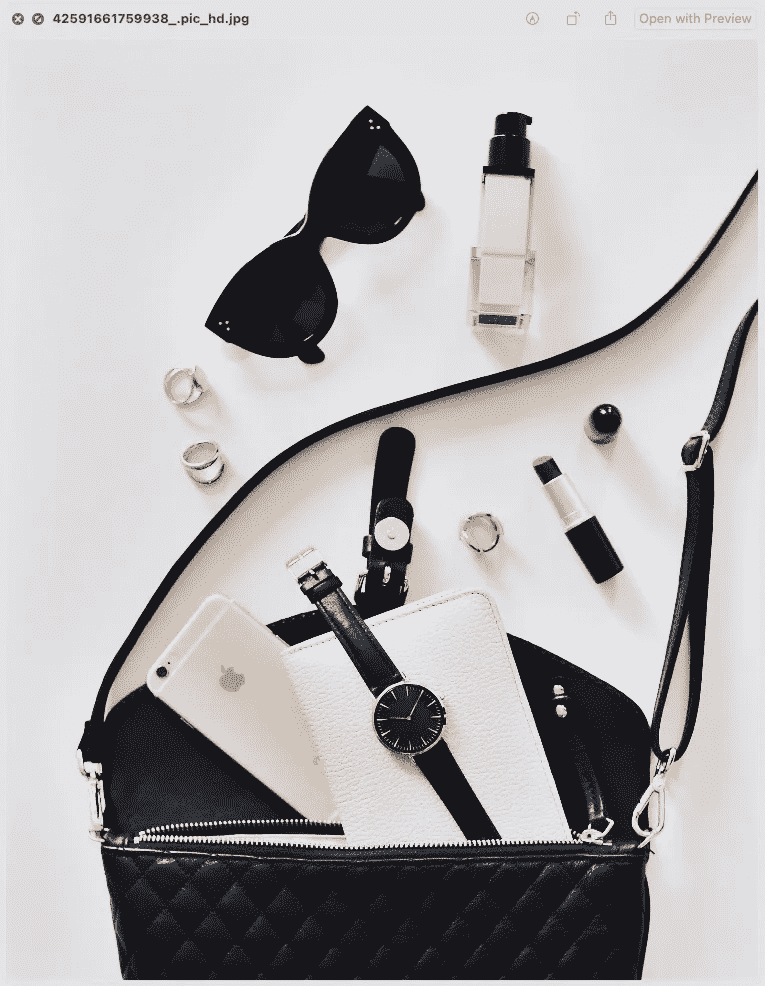
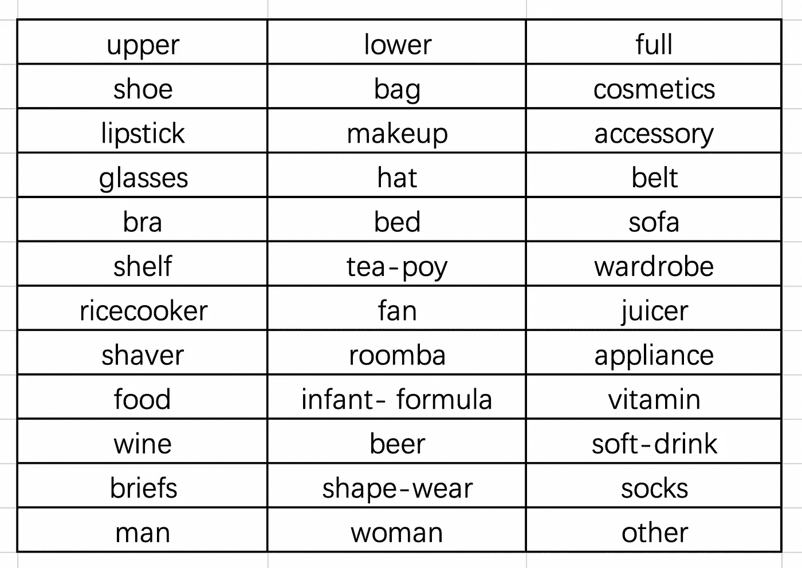
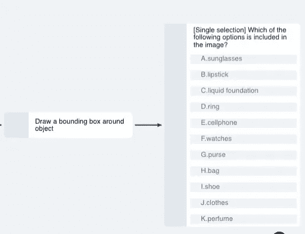
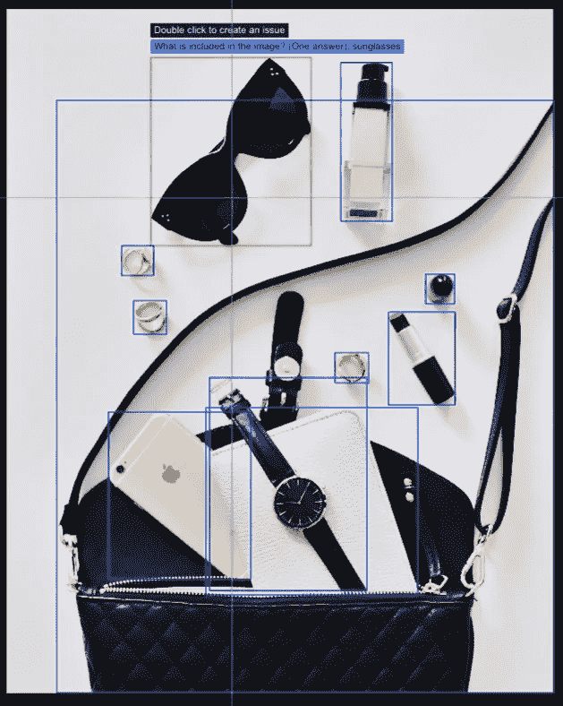
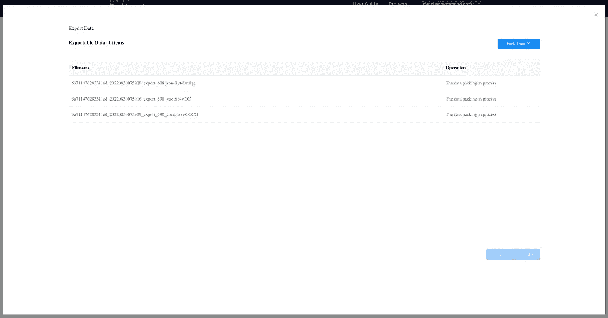
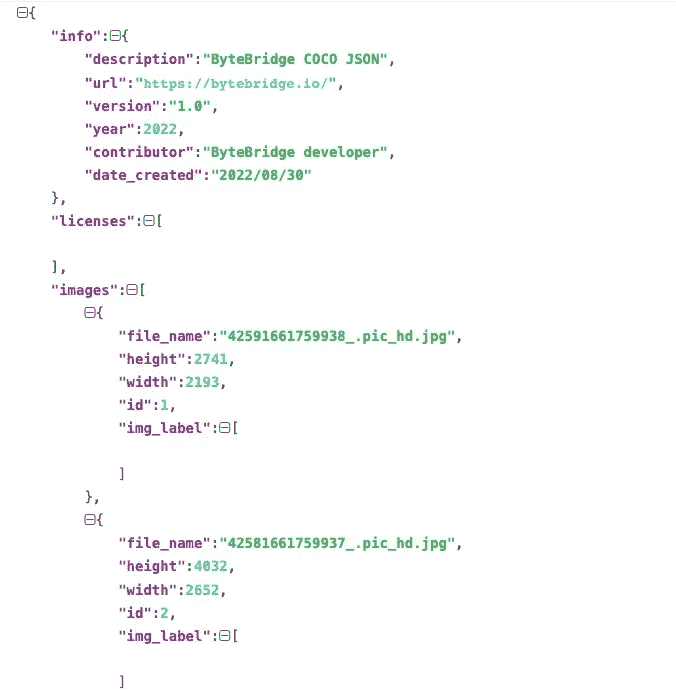

# 电子商务行业中的 2D 博兴标注和图像分类

> 原文：<https://medium.com/nerd-for-tech/common-2d-boxes-and-image-classification-and-annotation-projects-in-the-e-commerce-industry-9287290c8517?source=collection_archive---------2----------------------->

图像分类和标注项目在电商行业很常见。

网上购物的主要缺点是消费者不能直接“感受”产品，而图像是产品感知的主要来源，尤其是关于服装组合和配饰。我们对大量图像进行分类和标记，以便为消费者提供准确的结果，并使搜索更加高效。

我们想分享一个电子商务行业的 2D 图像分类和注释项目。

## **标签要求**

1 图像中出现的所有对象都应该用方框标记。

2 每个盒子只包含一个对象，并与主题的轮廓相匹配

## **注释类别**

注意:

*   这里的化妆主要是指脸部的化妆用品。
*   化妆品是指沐浴露、洗发水、牙膏和洗涤用品等产品，不包括口红和其他美容化妆品。
*   这里的配饰主要指人们穿戴的东西，但不包括眼镜、帽子和腰带。
*   眼镜包括普通眼镜和太阳镜
*   这里的 Appliance(电器)主要指手机、电视、空调，不包括电饭煲、电风扇、榨汁机、剃须刀、Roomba。
*   这里的食物主要指牛排、香肠等。，不包括婴儿配方奶粉/维生素。
*   这里的酒主要指葡萄酒、白酒等。，不包括啤酒酒精饮料。
*   软饮料主要指不含酒精的饮料，如矿泉水、果汁等。
*   对于性别，在清楚地识别图像中的人的性别和看到图像中的人的脸部和身体之后进行标记是必不可少的。
*   其他是指未列入 35 个类别的目标。

## 它如何在字节桥仪表板上工作

您配置，我们手动注释。

**输出**

## 数据导出-自助服务

字节桥数据导出

**JSON 输出**

Coco 输出

**标签注释**

1 对于密度大的物体，要一一标注，比如一打口红。
2 模特佩戴的首饰要贴上标签，比如项链、戒指、手镯。请放大图像并给它们贴上标签。
3 如果图像中有两只鞋，就要用两个盒子标注。
4 如果有遮挡，只标注可见部分。
上衣应包含 5 个袖子。鞋子和上衣应该排除在底部之外。
6 盒子需要盖住整只鞋，包括鞋头和鞋跟。

## 结束

把你的数据标注任务外包给 [ByteBridge](https://tinyurl.com/6nrmebzb) ，你可以更便宜更快的获得高质量的 ML 训练数据集！

*   无需信用卡的免费试用:您可以快速获得样品结果，检查输出，并直接向我们的项目经理反馈。
*   100%人工验证
*   透明和标准定价:[有明确的定价](https://www.bytebridge.io/#/?module=price)(包括人工成本)

## 为什么不试一试？