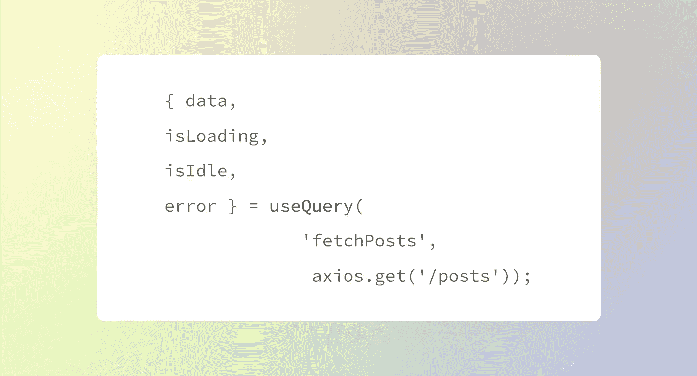

# react-query 真实应用程序的通用数据获取模式

> 原文：<https://medium.com/nerd-for-tech/common-data-fetching-patterns-for-real-apps-with-react-query-4b83188a95c1?source=collection_archive---------1----------------------->



[React-query](https://react-query.tanstack.com/) 是一个华丽的数据抓取库，获得了当之无愧的赞誉。本文将详细介绍 CRUD 应用程序的模式，以及一些额外的模式。

react-query 的文档非常好，但是我发现自己在学习它的时候希望有更多的实际例子。这些例子将假设**对 react-query 有一些熟悉，比如对`useQuery`钩子的熟悉，但不会超出基础。这个示例应用程序将是一个像 **Evernote、**一样的笔记工具，我将只概述数据获取案例。**

**获取数据:**

1.  *获取数据并处理结果* : `useQueries`。
2.  *使用查询字符串或查询参数获取数据子集:* `useQuery`带参数。
3.  *有条件取数据:* `useQuery`带`enabled`。
4.  *查询结束后动作:* `useQuery`带`onSuccess`、`onError`或`onSettled`。
5.  *分页取数据:* `useInfiniteQuery`。

> 开始前阅读:

我使用库`axios`进行所有 API 调用，这里也会用到，但是**不是必须**。Axios 和 react-query 都返回封装在一个名为`data`的信封中的响应，所以这将导致需要钻取像`data.data`这样的对象来获得结果。这是一种丑陋的语法。为了可读性，我把所有的 API 调用写成独立的函数，并在`useQuery`钩子中调用它们。还是那句话，这只是个人对清晰的偏好，没有必要。

对于一个更大的应用程序，我会推荐**将所有 API 调用存储在自定义钩子**中，在这个例子中概述的模式来自文档[这里的](https://react-query.tanstack.com/examples/custom-hooks)和这个媒介[文章](https://betterprogramming.pub/7-tips-for-using-react-query-in-large-projects-22ccc49d61c2)。

本文将描述如何使用从经过身份验证的用户获取数据的 API。构建这个 API 的细节超出了本文的范围。

1.  ***取数据并处理结果* :** `useQueries`

我们想获取我们所有的笔记，以查看一个广泛的概述，但我们也将在不同的文件夹中存储笔记，并只显示特定文件夹中的笔记。对于主屏幕，我们想获取**所有文章和所有文件夹。**所有的帖子都将显示在主屏幕上，所有的文件夹都将显示为侧边导航菜单。

我们将使用两个查询:一个获取文章，一个获取文件夹。

这里，`all`是存储查询结果`fetchFolders`和`fetchPosts`的数组。

```
const fetchFolders = async () => {const res = await axios.get('/folders')return res.data}const fetchPosts = async () => {const res = await axios.get('/posts')return res.data}const all = useQueries([{ queryKey: 'fetchFolders', queryFn: () => fetchFolders() },{ queryKey: 'fetchPosts', queryFn: () => fetchPosts() },]);if(all.some(e => e.isLoading)) return <Loading/>if(all.some(e => e.error)) return <Error/>return ( <Home data={all}/>)
```

对`useQueries`使用`some`方法是我个人的偏好，当你想返回一个组件时，我发现这很有用，除非*所有的*查询都从`useQueries`调用中返回。

`some`是一个普通的 JS 运算符，如果数组中的任何元素满足某个条件，它将返回一个布尔值。 [MDN 文档。](https://developer.mozilla.org/en-US/docs/Web/JavaScript/Reference/Global_Objects/Array/some)

## ***2a。用查询参数取数据子集:*** `useQuery`

所有的帖子都存储在`/posts`端点，但是有时候我们不想返回每一个帖子。如果用户导航到一个文件夹，我们只想返回存储在该文件夹中的文章。请注意，所有帖子都必须保存在文件夹中，以便按文件夹准确搜索帖子。

假设文件夹“Book notes”有一个 slug `book-notes`，当我们点击文件夹名称时会被带到这个文件夹。

这是一个展示带有附加参数的两个不同查询的机会。首先，我们通过 slug `book-notes`查找文件夹，并获得它的 id。

为了通过 slug 查找文件夹，我们正在识别一个资源，因此我们使用了一个查询参数来构建一个端点，该端点通过 slug 查找文件夹(注意，文件夹 slug 必须是唯一的，这样才能正确工作)。

```
const slug = props.match.params.folder;const fetchFolder = async (slug) => { 
const res = await axios.get(`/groups/${slug}`)
return res.data
}const { data, isLoading, error } = useQuery(
  **  ['fetchFolder', slug]**, 
    () => fetchFolder()
);
```

从[反应过来——查询单据](https://react-query.tanstack.com/guides/query-keys):

> 当一个查询需要更多信息来唯一地描述它的数据时，您可以使用一个带有字符串和任意数量的可序列化对象的数组来描述它。这有助于:
> 
> -分层或嵌套资源—通常传递 ID、索引或其他原语来唯一标识项目
> 
> -带有附加参数的查询-传递附加选项的对象是很常见的

所谓“更多信息来唯一地描述其数据”，是指指定特定资源或条件以从数据集合返回文档的查询参数或字符串。因此，这个查询的查询关键字是`[fetchFolder, slug]`，其中`slug`是一个变量，对应于 URL 参数中的 slug 值。因此，如果我们的完整 URL 是`[www.notesapp.com/book-notes](http://www.notesapp.com/book-notes,)` [，](http://www.notesapp.com/book-notes,)查询关键字是`[fetchFolder, book-notes]`。这单独为这个房间创建了一个唯一的查询。如果不同的查询使用相同的键，查询行为可能是不可预测的。

通过在`data`对象中返回文件夹，我们可以从`data._id`属性中获得文件夹 id。然后，我们查找文件夹值为该 id 的所有帖子。

## 2b。获取带有查询字符串的数据子集:`useQuery`。

这是展示带有查询字符串的`useQuery`的好机会。它非常类似于查询参数。

```
const fetchFolderPosts = async (id) => { 
const res = await axios.get(`/posts?folder=${id}`)
return res.data
}const { data, isLoading, error } = useQuery(
  ** ['fetchFolderPosts', {folder: id}]**, 
   () => fetchFolderPosts()
});
```

正如我们在文档中读到的，在查询键数组中以字符串的形式传递唯一标识符，以及传递附加选项的对象是很常见的。通常，查询参数，如唯一 id 和 slugs，将作为字符串在查询键中传递，而查询字符串的一部分，如过滤选项，将作为键传递给对象。如果我们有很多选择，它们会像，`{folder: id, sort: date, tag: category }`等一样被通过。

请注意，只要查询有唯一的键，将值作为对象而不是字符串传递应该不会影响功能。这只是一个惯例。

## 3.有条件地获取数据:

`useQuery`同`enabled`。

这个查询实际上依赖于前一个查询，在它可以执行之前完成。如果没有传递文件夹 id，它就不应该运行。因此，这个查询应该是空闲的，除非获取文件夹的前一个查询成功返回了一个 id。这是使用作为 useQuery 钩子一部分的`enabled`布尔值来完成的。

```
const fetchFolderPosts = async (id) => { 
const res = await axios.get(`/posts?folder=${id}`)
return res.data
}const { data, isLoading, **isIdle**, error } = useQuery(
  ** ['fetchFolderPosts', {folder: id}]**, 
   () => fetchFolderPosts(), 
  {
   enabled: !!id
  }
});
```

> 注意:使用`!!`将非布尔值转换为布尔值。更多[见此](https://www.samanthaming.com/tidbits/19-2-ways-to-convert-to-boolean/)。

这个查询现在将处于空闲状态，除非我们传递给它的`id`值存在，也就是说它不是`null`、`undefined`、“”等等。

因为我们向这个查询引入了一个新的可能状态，即**空闲**状态，所以我们需要将它与`isLoading`和`isError`状态一起处理。空闲状态是指查询尚未开始提取。

```
const fetchFolderPosts = async (id) => { 
const res = await axios.get(`/posts?folder=${id}`)
return res.data
}const { data, isLoading, isIdle, error } = useQuery(
   ['fetchFolderPosts', {folder: id}], 
   () => fetchFolderPosts(), 
  {
   enabled: !!id
  }
});if**(isLoading || isIdle)** return <Loading/>if(error) return <Error/> 
```

如果这里没有处理`isIdle`状态，这个函数将会在获取数据和出错之前尝试渲染组件。

## *4。查询结束后动作:* `useQuery`带`onSuccess`、`onError`或`onSettled`

react-query 提供了`onSuccess`、`onError`和`onSettled`函数，在查询完成后执行。这些函数中的每一个都有不同的内置参数:

`onSuccess (data, payload)`

`onError(error, payload)`

`onSettled(data, error, payload)`

您可以访问`payload`，或者传入查询函数的数据，作为每个函数的最终参数。我在 react-query 文档中找不到这个，但是它可以工作，它的 PR 在 GH [这里](https://github.com/tannerlinsley/react-query/issues/268)。

我们将使用`onSuccess`从我们的搜索中获取返回到全局状态的文件夹，这样我们就可以用它来做其他事情，比如创建一个“最近访问过的”文件夹列表，用户可以使用它作为快捷方式。

在父组件中，存储最近访问的文件夹名称的状态列表。使用道具或状态库将`setRecents`方法传给孩子们。

```
const [recents, setRecents] = useState([]);return (
/// return children 
)
```

在原始文件夹组件中:

```
const fetchFolderPosts = async (id) => { 
const res = await axios.get(`/posts?folder=${id}`)
return res.data
}const { data, isLoading, error } = useQuery(
  ** ['fetchFolderPosts', {folder: id}]**, 
   () => fetchFolderPosts(), {
       **onSuccess:** (res) => {
             const newList = recents.concat(res.data);
             setRecents(newList); }
}
});
```

## *5。分页提取数据:* `useInfiniteQuery`

对数据进行分页是一种巨大的痛苦，这是生活中的事实。react-query 的`useInfiniteQuery`钩子使事情变得简单多了，但是我发现分页确实有点麻烦。

我用 mongose 的[mongose 分页库](https://www.npmjs.com/package/mongoose-paginate-v2)来帮助后端分页。

让我们重构查询，按文件夹获取文章，以包含分页。假设我们只希望 20 篇文章出现在一个文件夹的单个视图中。

```
const fetchPosts = async (pg, id, limit) => {
   const offset = (pg - 1) * limit;
   const res = await axios.get
       (`/posts?folder=${id}&offset=${offset}&limit=${limit}`)
    return res.data
}const {
fetchNextPage,
hasNextPage,
isLoading,
isError,
data }  = useInfiniteQuery(
   ['fetchPosts', { folder: id }],
   ({ pageParam = 1}) => fetchPosts(pageParam, id, 20),
   {
    getNextPageParam: (lastGroup, allGroups) => { 
return lastGroup?.nextPage || null; }
}
);
```

先说`fetchPosts`函数。这是获取分页数据的标准调用，这些分页数据在的查询字符串中包含变量:1。文件夹`id`(同上)，2。`limit`(要获取的帖子数量)，以及 3。`offset`(抓取前忽略的帖子数量)。

[关于`useInfiniteQuery`钩子的文档](https://react-query.tanstack.com/reference/useInfiniteQuery#_top)对此有详细的解释，也有专门的[分页指南](https://react-query.tanstack.com/guides/infinite-queries)。

挂钩有`getNextPageParam`和`getPreviousPageParam`功能，用于向前翻页+1 和向后翻页-1。我这里只使用`getNextPageParam`函数。

`data`从钩子返回的现在包含分页数据。默认情况下，数据*会逐步累积。*

如果我们 console.log 从 useInfiniteQuery 钩子返回的`data`,我们会看到一个具有两个属性的对象:

```
{
  pageParams
  pages
}
```

`data.pages`包含提取的页面+关联的元数据

*   Pages 是从 fetchPages API 调用返回的每个数据的数组
*   为了显示文章，我们需要遍历数组并获取嵌套属性`docs`，它实际上包含了文章(示例如下)。

`data.pageParams`是用于获取页面的页面参数

*   其值仅随来自`getNextPageParam`的计算返回。[react-query GH 上关于此](https://www.notion.so/react-query-d6f772c31bd64cd8939aababa950b25f#d51a222702a044729080445da910d49d)的讨论。
*   `pageParams`跟踪当前页面。它是 render 上的`undefined`，所以默认设置当前页面为 1 是个好主意，正如我们通过传递参数`({ pageParam = 1 })`调用函数时所做的那样。

实际的对象返回如下所示(对于第 1 页):

```
pageParams: [undefined] 
pages:[{ 
  docs: (20) [{...} {...} {...}]    
  hasNextPage: true    
  hasPrevPage: false    
  limit: 20   
  nextPage: 2    
  offset: 0    
  page: 1    
  pagingCounter: 1    
  prevPage: null    
  totalDocs: 26    
  totalPages: 2 
}
]
```

对于第 2 页:

```
pageParams: [undefined, 2] 
pages:[{ 
  docs: (20) [{...} {...} {...}]    
  hasNextPage: true    
  hasPrevPage: false    
  limit: 20   
  nextPage: 2    
  offset: 0    
  page: 1    
  pagingCounter: 1    
  prevPage: null    
  totalDocs: 26    
  totalPages: 2 
},
{ 
  docs: (6) [{...} {...} {...}]    
  hasNextPage: false    
  hasPrevPage: false    
  limit: 20   
  nextPage: 2    
  offset: 0    
  page: 2   
  pagingCounter: 2   
  prevPage: 1    
  totalDocs: 26    
  totalPages: 2 
}
]
```

显示分页数据的完整组件可能如下所示:

```
const fetchPosts = async (pg, id, limit) => {
   const offset = (pg - 1) * limit;
   const res = await axios.get
       (`/posts?folder=${id}&offset=${offset}&limit=${limit}`)
    return res.data
}const {
fetchNextPage,
hasNextPage,
isLoading,
isError,
data }  = useInfiniteQuery(
   ['fetchPosts', { folder: id }],
   ({ pageParam = 1}) => fetchPosts(pageParam, id, 20),
   {
    getNextPageParam: (lastGroup, allGroups) => { 
return lastGroup?.nextPage || null; }
}
);if(isLoading) return <Loading/>if(error) return <Error/>return (
<div>{data.pages.map((el, i) => { return el?.docs.map((post, i) => { return (<Post key={post._id} post={post}/>)})})}{hasNextPage && <InlineButton label="more" handleClick={fetchNextPage}/> }</div>
)
```

这就是本教程使用 react-query 获取数据的全部五个部分。我喜欢这个图书馆。如果有兴趣，我可以为这个图坦卡门创建一个回购和/或为突变数据做另一个指南。本指南没有深入 react-query 的所有更高级的用例(我也还在学习)，但是我希望它比早期初学者的信息更进一步。

**参考文献:**

[反应-查询单据](https://react-query.tanstack.com/)

bits | [开始使用 react-query](https://www.notion.so/react-query-d6f772c31bd64cd8939aababa950b25f#54a29bd61f7e42a786b6cb84a16a2aad)

dev.to | [react-query:实际例子](https://dev.to/otamnitram/react-query-a-practical-example-167j)

YouTube | [useInfiniteQuery 教程](https://www.youtube.com/watch?v=4jMAnIIEI3M)

YouTube | [Tanner 对 react-query 的介绍](https://www.notion.so/react-query-d6f772c31bd64cd8939aababa950b25f#d1282981e66d4f389fb15f98a65fedb7)

YouTube |[react-查询 CRUD (1 小时)](https://www.youtube.com/watch?v=4UCwA2n4gsA&list=PLIvCYh5AD3HxH9574Xco1sr_o8TO5VWIJ)