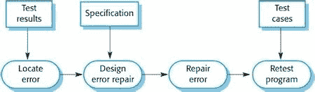

# 要避免的常见调试错误

> 原文：<https://medium.com/nerd-for-tech/common-debugging-mistakes-to-avoid-a4a71c4d66b5?source=collection_archive---------7----------------------->

在 [Unsplash](https://unsplash.com/s/photos/mistakes?utm_source=unsplash&utm_medium=referral&utm_content=creditCopyText) 上由 [Nandhu Kumar](https://unsplash.com/@nandhukumarndd?utm_source=unsplash&utm_medium=referral&utm_content=creditCopyText) 拍摄的照片

开发一个软件应用程序比管理一个要容易得多。我创建了许多软件应用程序，并参与了许多软件维护项目。当开发一个应用程序时，唯一要小心的事情是确保您有适当的业务需求文档(brd)。它们允许您使用任何编程语言创建应用程序。然而，从事维护项目总是很乏味的。

与开发新功能相比，发现问题并解决它要花费更多的时间。

在软件维护的所有任务中，调试是最重要的。调试是每个开发人员的必备技能。随着分布式系统的兴起，远程调试是另一个逐渐变得重要的概念。调试运行在不同于本地计算机的地方或环境中的应用程序被称为[远程调试](https://lightrun.com/debugging/remote-debugging/)。

在本文中，您将了解什么是调试，以及在调试软件应用程序时要避免的常见调试错误。

在调试代码的时候犯错误会导致你浪费大量的时间，并带来一些麻烦。如果你看看常见的论坛，像 **GitHub，Stack Overflow** 等。，您会发现许多帖子提到开发人员花费几天、几周甚至几个月来解决不同的问题。因此，调试代码时，时间非常重要。调试方法中的一个简单错误会导致大量的时间浪费。关键的问题会导致你无法在截止日期前完成。

# 什么是调试？

[*来源*](https://ifs.host.cs.st-andrews.ac.uk/Books/SE9/Web/Testing/Debugging.html)

调试是检测任何软件应用程序中的错误并解决它们的过程。bug 是应用程序中的问题或错误。查找 bug 涉及多个阶段。解决[bug](https://en.wikipedia.org/wiki/Software_bug)需要你先了解问题。因此，在解决 bug 之前，从客户/测试团队那里获得关于 bug 的适当信息是很重要的。

# 如何调试您的代码

在这里，我列出了一些调试代码的方法。

1.使用 print 语句来了解您是否在每个阶段都获得了正确的值。

2.如果你得到一个错误信息，谷歌一下。您可以获得许多错误解决方案的链接。

3.使用各种调试工具来发现问题。

4.写几个[测试用例](https://en.wikipedia.org/wiki/Unit_testing)并测试结果，看看你是否得到了预期的输出。

5.向你的队友或其他开发人员寻求未知问题的帮助。这是一个很好的选择，如果他们知道如何解决问题，这将减少您的调试时间。

这里，我只列出了几种调试方法。您可以通过在各种软件应用程序上练习来提高您的调试技能。接下来，我们将讨论我们在调试时常见的错误。下面列出了一些要避免的常见调试错误。

# 只关注产出

你需要专注于输出。然而，过分关注输出会分散你解决 bug 的注意力。首先，理解问题陈述。然后，检查源代码是否被更改。

最终输出取决于前一级的输出。因此，检查逐阶段的输出，看看您是否在每个阶段都获得了预期的结果。然后，找到问题的根源，解决问题。如果您的输出依赖于各种来源，请检查您是否从这些来源获得了预期的输出。如果有任何事情不按预期工作，那么首先解决它。这将帮助您获得想要的输出。

# 不理解/修改就复制粘贴解决方案

假设您在某个网站或文档中发现了一个 bug 以及该 bug 的解决方案。太棒了！但是，不要将解决方案直接复制粘贴到您的应用程序中。

首先，了解解决方案是如何工作的，并根据您的需要修改解决方案。对于您当前的问题，解决方案中的所有代码可能都不是必需的。这是开发人员通常会陷入困境的地方。他们认为像 GitHub 和 Stack Overflow 这样的论坛提供的代码也可以解决他们的问题。其实不会。因此，理解解决方案是如何工作的，并根据您的需要修改代码。

# 选择错误的调试工具

选择正确的调试工具可以提高您的工作效率。不要使用花哨复杂的工具。根据您当前的需求选择合适的工具。此外，不要在所有情况下使用相同的工具。花更多时间选择合适的工具。在选择正确的工具上花更多的时间可以提高您的生产力，减少您的调试时间。

# 不维护文档

如果遇到问题，必须记录问题陈述和问题的解决方案。当使用复杂的软件应用程序时，您可能会在应用程序的不同模块中反复遇到相同的问题。如果你把所有的事情都记录下来，当问题在其他地方再次出现时，你可以使用同样的解决方案。当你不在的时候，记录也可以帮助你的队友。不幸的是，许多开发人员没有记录解决方案，这增加了他们的调试时间。

# 在这个问题上花费更少的时间

耐心很重要。当我开始我的软件开发职业生涯时，我花在解决问题上的时间比理解问题的时间还多。我曾经在谷歌上搜索错误信息，在网上找到解决方案，然后照原样复制粘贴解决方案。我总是急于解决这个问题。因此，这个问题永远不会完全解决。

从我的经历中，我学会了不要急于寻找解决方案。多花点时间了解问题，多看看博客和论坛。从你的理解中创造一个更好的解决方案。

# 摘要

调试有助于发现软件应用程序中的问题并解决它们。调试是所有开发人员都需要的特殊技能。要调试应用程序，您有各种方法和工具。选择正确的工具和正确的方法将有助于您更早地解决 bug。然而，错误的工具和错误的方法会消耗你的时间，阻止你在截止日期前完成任务。

在调试过程中出错会影响您的组织，并让您的客户不高兴。所以，多花点时间在学习上。学习会减少你的错误，提高你的生产力。