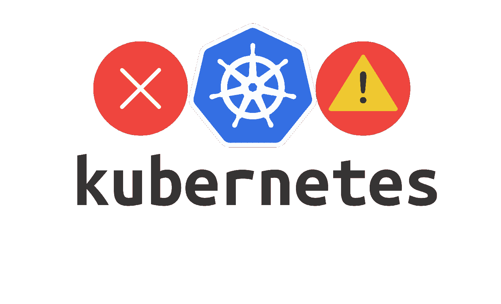
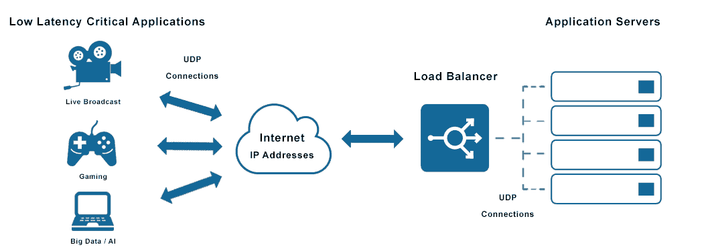

# 初学者常犯的 Kubernetes 错误[2023]

> 原文：<https://medium.com/nerd-for-tech/common-kubernetes-errors-made-by-beginners-274b50e18a01?source=collection_archive---------1----------------------->

Kubernetes 采用的大多数问题最终源于技术本身的复杂性。实施和操作中存在不明显的困难和细微差别，并且存在未充分利用的优势。此外，随着你使用 Kubernetes 越来越频繁，你可能会成为[疲劳](https://komodor.com/blog/alert-fatigue-a-practical-guide-to-managing-alerts/)的受害者。结果是，你赔钱。

经过几年的 Kubernetes 经验和对各种客户的几次咨询，我注意到了一些常见的 Kubernetes 错误。因此，我想选择并讨论这 6 个常见的问题。

1.  **服务上标签的选择器与 pod 不匹配**

为了正确发挥网络平衡器的功能，服务通常会指定选择器，这些选择器允许您找到属于平衡池的 pod。如果不匹配，则服务没有转发流量的端点，并且会发生错误。请记住，对 pod 的负载平衡是随机类型的。

**2。映射到服务的错误容器端口**

每个服务都有两个基本参数，“T6”target port 和“ *port* ”，这两个参数经常被混淆和误用。这种混淆会导致错误消息，声称连接被拒绝或者请求没有响应。

为了避免这种错误，请记住" *targetPort* "是 pod 中的目的端口，服务会将流量转发到该端口。另一方面，“ *port* ”参数指的是服务向客户端公开的端口。

它们可以是相同的，所以了解它们的含义是必不可少的！

**3。CrashLoopBackOff**

另一个常见的 Kubernetes 错误是 *crashloopbackoff* 错误。当一个 pod 正在运行，但是它的一个容器由于终止(通常是错误的方式)而重新启动时，就会发生这种情况。换句话说，集装箱陷入了启动-崩溃-启动-崩溃的循环中。

*crashloopback 错误日志*

CrashLoopBackOff 错误可能是由各种原因造成的 Kubernetes 的错误部署、活动探测器的错误配置以及 init-container 的错误配置。解决这个错误的一个简单方法是正确配置和部署 Kubernetes。但是，您也可以通过在 blocking 命令的帮助下创建单独的部署来绕过该错误。

**4。活性和准备就绪探测**

关于探针有几个错误。第一个是不为应用程序定义任何健康检查，应用程序在出现问题时永远不会重新启动，并且将始终保持在服务的负载平衡池中。

例如，第二种错误涉及通过联系同一个 HTTP 端点来定义相同的活跃度和就绪性探测。这可能是由于对这些类型的测试的误解。活性探测与健康应用程序的概念相关联，因此如果它失败了，pod 将被重新启动。

就绪探测与在 pod 的整个生命周期中是否将 pod 插入负载平衡池有关。将它们定义为相等可能会有风险，例如，重新启动一个由于流量过大而暂时变慢的应用程序。

另一个关键的方面是，如果服务的一个依赖项关闭，不要让探测失败。这只会使问题复杂化，必须在适当的服务中发现这一问题。

**5。资源—请求和限制**

一般新手都会忘记设置对 CPU 和内存的请求和限制。该错误导致在一些工作节点上安排了太多的应用程序，导致它们“过载”。最终结果是一个低性能的应用程序。

另一方面，如果限制设置得太低，CPU 的性能会很差。如果你以前见过 [OOMkill](https://www.netice9.com/blog/guide-to-oomkill-alerting-in-kubernetes-clusters/) 错误信息，这就是问题所在。理想的策略是分配适量的 CPU 和内存，可能将请求设置为与关键应用程序的限制(有保证的 QoS)相等。

了解必要的资源基本上就是用普罗米修斯这样的工具进行测试和监控。

**6。太多负载平衡器类型的服务**

[来源](https://avinetworks.com/glossary/udp-load-balancer/)

初学者经常会使用负载平衡器类型向外部公开太多的服务。在这种情况下，由云提供商提供的特定控制器在集群外的 [VPC](https://www.ibm.com/cloud/learn/vpc) 内创建一个负载平衡器。这些资源会变得非常昂贵，主要是如果它们与静态 IP 地址相关联的话。

最佳解决方案是使用单个负载均衡器来公开集群，该负载均衡器将流量转发到集群节点，集群节点通常具有使用入口资源进行路由的入口控制器。

# 最后的话

不要期望所有的事情都能神奇地解决:Kubernetes 不是万能的。一个糟糕的应用程序甚至在 Kubernetes 中也会如此(甚至可能变得更糟)。如果您不小心，控制层将变得越来越复杂、缓慢和艰巨。此外，没有灾难恢复策略可能会使您易受攻击。Kubernetes 平台不能自动确保隔离和冗余。花些时间让您的应用程序真正成为云原生的。