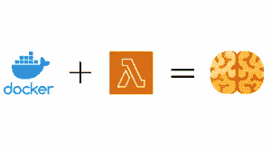
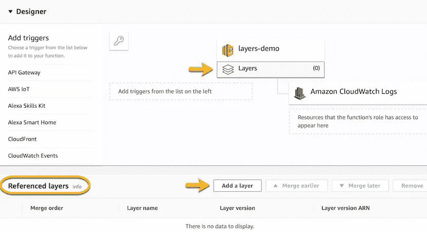

# 不同数据管道中的通用包

> 原文：<https://medium.com/nerd-for-tech/common-packages-in-different-data-pipelines-296677742909?source=collection_archive---------23----------------------->

> **AWSλ层**

在构建不同的数据管道时，我使用函数从 AWS secret manager 获取秘密，查询 AWS Redshift，将数据放入 AWS Firehose 或 SQS 等。我在不同的 AWS lambda 函数中使用了相同的代码。事实上，对于 pycryptodome、pg8000、requests 等 python 包，我必须把它们安装在 lambda 文件夹的 zip 中，然后上传到 S3。

当我完成大约 6 个大数据管道时，我可以从我以前的工作中复制粘贴方法和模板，一个全新的管道已经准备好了。
我开始担心，不是因为我没有学到任何新东西，而是因为到处都是重复的代码。


我不会重复我的话😝

主要问题是，每个管道都有自己的代码版本来完成相同的任务，而且如果我团队中的其他人必须构建一个新的管道，他们只会从现有的管道中复制粘贴代码，并为他们的用例更新一些代码，再次为相同的任务创建新版本的代码。

然后我发现了 Lambda 层。



所以基本上，使用 lambda 层，我们可以在不同的 lambda 函数中使用相同的代码。我们可以将所有需要的 python 包和我们的自定义包压缩并上传到 lambda 层，只需一次，从这一层，所有的包都可以使用，而无需每次我们编写新的 lambda 函数时都上传它们。

让我们举一个简单的 hello world 例子，😛假设我们必须编写一个返回“Hello World！”并且必须在 10 个不同的 lambda 函数中使用它。

```
def get_hello_world():
    return "Hello World!"
```

通常的方法是在所有 10 个 lambda 函数中编写这个函数，这将很容易复制和粘贴我在管道中所做的😟。但是如果你想把它换成回归，比如说——“**拜拜世界**！”(Y *你自作自受；这不能怪任何人😂)，你得换 10 个不同的地方。所以解决方案是，你可以上传这个代码作为一个 lambda 层，从 10 个不同的 lambda 函数中，你可以导入文件并调用这个函数。所以现在你只有一个地方的代码是 lambda 层，如果你在一个地方改变它，所有的 lambda 函数都会反映这个变化。*

这非常简单，你只需要压缩你的 python 代码并上传到 S3，然后从控制台创建一个 lambda 层。



但是还有另一种方法。是的，你猜对了！！独一无二的云层模板。🎉 🎉

你必须安装软件包的 python 路径—

```
python/lib/python3.8/site-packages/
```

您可以简单地在本地创建这个文件夹结构，并使用命令-

```
python3 -m pip install requests -t python/lib/python3.8/site-packages
```

您可以将您的定制包保存在这个路径中。common_packages — say_hello.py 因此路径将是—python/lib/python 3.8/site-packages/common _ packages/say _ hello . py

然后压缩这个包——python . zip
,并将输出压缩文件上传到 S3。
λ层的 CFN 模板—

```
Type: AWS::Lambda::LayerVersion
Properties:
  Content: 
      S3Bucket: String
      S3Key: String
  Description: String
  LayerName: String
```

请随意查看 [AWS 文档](https://docs.aws.amazon.com/AWSCloudFormation/latest/UserGuide/aws-resource-lambda-layerversion.html)了解更多选项。

我使用 GoCD 管道自动压缩我用自定义和 python 包创建的 Python 文件夹，并上传到 S3。然后，在创建 Lambda 层时，使用 S3 路径。

如果您了解 bash，您可以使用这个脚本来压缩和上传(如果您的文件夹结构是这样的 my_modules/python/lib/python 3.8/site-packages，那么将这个 bash 脚本放在 my _ modules 文件夹中)。

```
echo "zipping and uploading the packages to S3"# zip the folder
zip -r python.zip .# upload to s3
aws cp python.zip s3://<bucket>/path/python.zip --profile <your-aws-profile>
```

然后在 Lambda 层 CFN 模板中使用此 S3 路径，当您创建任何新的 Lambda 函数时，您可以在 aws:Lambda:Function 的 CFN 模板中使用 Layer 属性，并在函数中直接使用这些 Lambda 层包。

现在，要从任何文件夹直接导入脚本中的自定义包，您可以使用以下命令将自定义包文件夹放入系统的 Python 站点包文件夹中—

```
cp -r my_modules/python/lib/python3.8/site-packages/common_packages/ /usr/local/lib/python3.8/site-packages/
```

现在你可以用这个—

```
from common_packages import say_hello as s
msg = s.get_hello_world()
print(msg)
--> OUTPUT ---> Hello World!
```

这是我对 Lambda 层的学习。当你在不同的 lambda 函数中有相同类型的代码，并且你正在用每一个压缩 python 包时，这肯定是有帮助的。

继续读。欢迎反馈。谢谢！