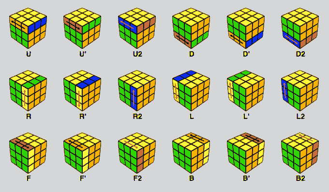
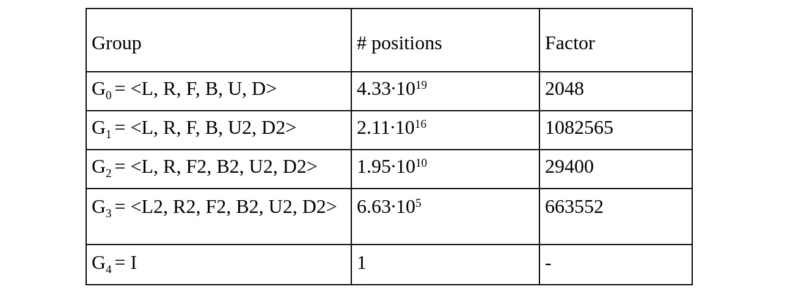
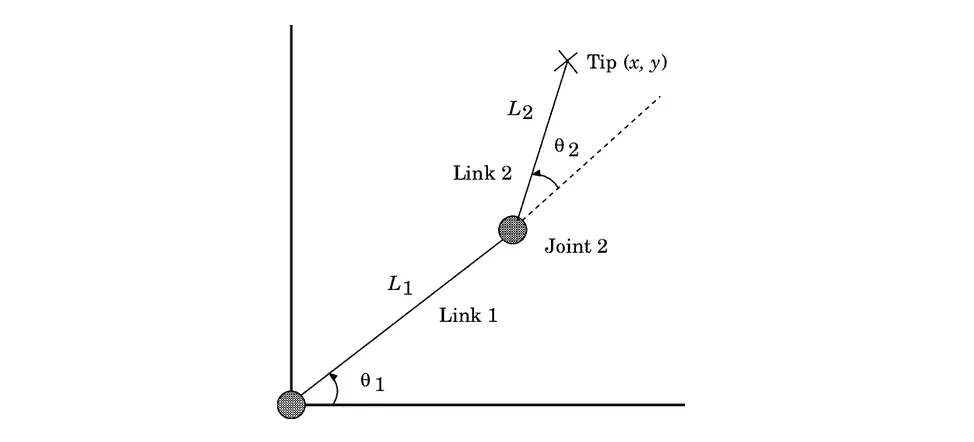

# 机器的魔方算法——探索理解魔方的第 1 部分，共 2 部分

> 原文：<https://medium.com/nerd-for-tech/common-rubiks-cube-algorithms-for-machines-part-1-of-2-in-a-quest-to-understand-the-rubik-s-cube-3cb9b53f94b5?source=collection_archive---------6----------------------->

理解 IDA* Search 和 Thistlethwaite 的算法来解决立方体问题。

**简介**

我本人热衷于快速魔方(尽可能快地解决各种扭曲的难题)，我一直对 3x3x3 魔方以及如何将它从 43 万亿次排列中的任何一次简化为单一的已解状态着迷。而人类已经开发了各种用于快速求解目的的直观算法，一些例子是 CFOP 和 Roux。然而，这些人类可解的方法通常产生远离最优的解，因此已经开发了各种机器可解的算法，其目标是产生最优或接近最优的解。在这个小系列的第 1 部分，我将分享两个机器可解的算法以及它们是如何工作的，并讨论这些看似合适的算法在控制机械臂方面的可能改进和实际应用。在第 2 部分中，我将介绍用 Raspberry Pi 计算机和 LEGO Mindstorms NXT 构建一个解魔方机器人的过程。

**一个 3x3x3 魔方的最优解到底意味着什么？**

如果我们认为一步棋是魔方任意一面的任意一转，那么解决魔方任意排列所需的最小步数将总是小于或等于 20。这已经通过使用[大量的计算能力](http://www.cube20.org/)得到了证明，20 现在被称为“上帝的数字”。出于本文的目的，一个解决方案的优化程度将通过它的长度和上帝的数字之间的差异来衡量。

**魔方符号**

为了详细讨论这些算法，我们必须首先定义一个 3x3x3 魔方的标准符号，从这个符号中我们可以定义组。在速度求解中，最常用的符号使用字母 R、L、U、D、F、B 来描述立方体的右、左、上、下、正面和背面。字母本身描述的是顺时针旋转，而字母后面的撇号(我们称之为 prime)描述的是逆时针旋转。握住立方体，绿色面朝解算器，黄色面朝上，旋转描述如下:

魔方上的不同移动

**常用算法——迭代深化 A*搜索**

魔方可以被建模为一个图问题，其中节点是所有可能配置的集合，边在彼此相距一圈的配置之间。然后，我们可以使用图遍历和路径搜索算法来找到从表示立方体当前状态的节点(源节点)到表示其已解决状态的节点(目标节点)的最短路径。但是应该用什么图遍历算法呢？

对于魔方，你可能会首先考虑[广度优先搜索](https://web.archive.org/web/20141029100806/http://opendatastructures.org/versions/edition-0.1e/ods-java/12_3_Graph_Traversal.html#SECTION001531000000000000000) (BFS)，因为它可以用来找到从源节点到目标节点的最短路径，因为我们可以用最少的边数从源节点到达目标节点。然而，如果考虑到图中节点的数量(接近 43 万亿分之一)和 BFS 需要的内存量，使用 BFS 就不太可行了。

[迭代深化 A*](https://cse.sc.edu/~mgv/csce580f09/gradPres/korf_IDAStar_1985.pdf) (IDA*)优于 BFS，因为它是深度优先搜索算法，因此使用更少的内存，同时仍然保持最优。IDA*还使用了一个信息更丰富的成本函数，该函数使用了一个针对特定问题的启发式成本估算方法来估算从源头到目标的成本。对于该问题，基于大的基于存储器的查找表使用下限启发式函数，存储解决该问题的各种子目标所需的精确移动次数，在这种情况下是立方体配置的子集。

**常用算法——西斯尔思韦特算法**

西斯尔思韦特算法是由打结理论家、数学教授莫文·西斯尔思韦特先生设计的。处于无序状态的立方体可以表示为一个群中的一个元素，该群包含所有可以通过 L，R，F，B，U，D 移动来求解的立方体状态。我们称这个组为 0，或 G0。我们希望继续将立方体状态减少到可由可用的可能移动的更小子集解决的更简单的组，直到可能移动的子集减少到空集，这意味着立方体被解决。从第 0 组开始，我们使用移动< L，R，F，B，U2，D2 >，G1 把立方体变成可解的位置。然后，该组被两次缩减为适当的子组，直到它可以仅通过半轮求解，G3。从这个位置求解是琐碎的。

为了将立方体状态归入不同的组，在每个阶段使用查找表，每个查找表显示商陪集空间中每个元素的解。下表显示了每组中可能位置的数量以及每个陪集空间的顺序。

然而，这种算法不是最佳的，因为不能保证一个元素从一个组到其适当的子组采取最短的路线。因此，Thistlethwaite 的算法得出的平均解长度为 52。

**建议改进**

考虑一下西斯尔思韦特算法中的组数。我们可以通过从 G0 到 G2，然后从 G2 到 G4，跳过对 G1 和 G3 组的减少，来减少组的数量。这可以使用前面提到的 IDA*搜索算法来实现，其中我们可以将 G0 到 G2 和 G2 到 G4 的归约建模为具有它们自己的试探法集的图问题。这既减少了 Thistlethwaite 算法中考虑的组的数量，又降低了完整 IDA*搜索算法中启发式算法和成本函数的复杂性，实现了更有效的 Thistlethwaite 算法版本，同时仍然比完整 IDA*搜索更容易实现。

但是这种改进有一个警告:这样的算法只能产生局部最优解。换句话说，算法只是在不同组之间最优，从 G0 到 G4 不一定完全最优。尽管如此，只有两个解决方案集需要考虑最短路径，所以总体解决方案在概率上是接近最优的。

**真实世界的应用——机械臂**

我建议的改进使用了图论和群论来建模一个可以在这两个领域中描述的问题，并且这样的问题不仅限于扭曲的谜题。我在这里举例说明的一个真实世界的例子是控制一个机器人手臂。为了形象化更高维的问题，我们可以首先考虑具有两个自由度(DOF)的手臂。

两自由度手臂

我们可以构建一个二维占据网格，表示尖端可达到的状态，其中第一维度为θ1，第二维度为θ2，两者都离散为 1 度的步长。观察手臂，我们可以看到θ2**≦**180，因此θ1 的所有值θ2 ≥ 180 无法实现，并在网格上表示为阴影区域，或障碍物。当末端执行器从一种状态移动到另一种状态时，我们可以将其描述为一个问题，其中末端需要找到从其当前状态到目标的最优路径。使用占位网格，我们可以指定每个关节的起始和目标角度，并找到两点之间的最佳路径，然后描述末端执行器应该采取的最佳路径。

这可以被建模为群论中的一个问题，其中 G0 可以被定义为通过可解的所有状态，并且我们可以将其两次化简为适当的子群 G1 = 和空群 G2。我们还可以使用图论来建模这个问题，因为网格可以被视为一个由边连接的相邻单元组成的图。使用改进算法中应用的见解，我们可以通过使用深度优先搜索算法(如 IDA* Search)来解决这个问题，以迭代地将当前状态的组减少到下一个适当的子组中，而不是进行完整的搜索，这降低了启发式复杂性，同时仍然找到接近最优的解决方案。

这可以推广到更高维度的问题，因为大多数机械臂有 6 个自由度。在更高的维度中，我们只需考虑解决方案中涉及的组约简数量的增加，因为深度优先搜索算法在每一步只将远离解决方案的维度数量减少 1。这导致试探法远没有为 6 维搜索算法构建的试探法复杂，使其更容易在大规模工业应用中实现。

如果你对我做过的其他项目感兴趣，或者想联系我，这里有我的 [Github](https://github.com/Iscaraca) 和 [LinkedIn](http://linkedin.com/in/isaac-chen-jing-de) 账户。